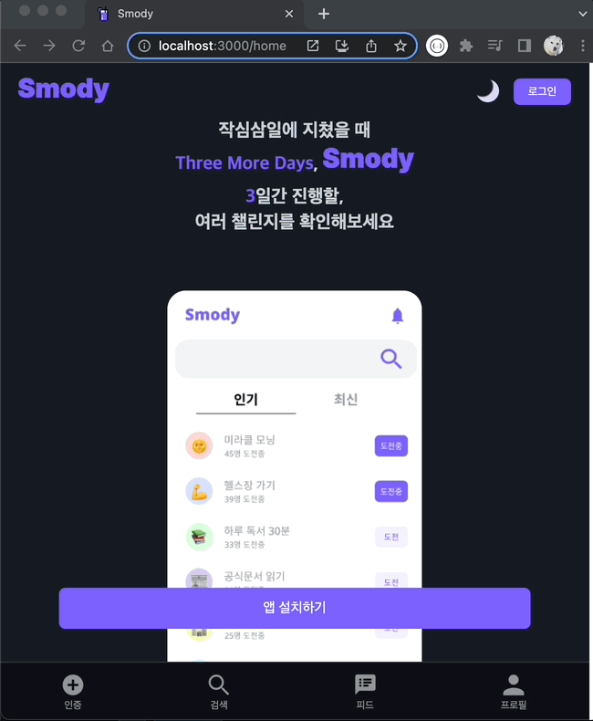
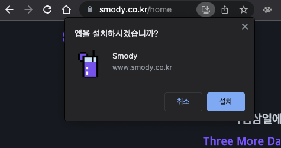
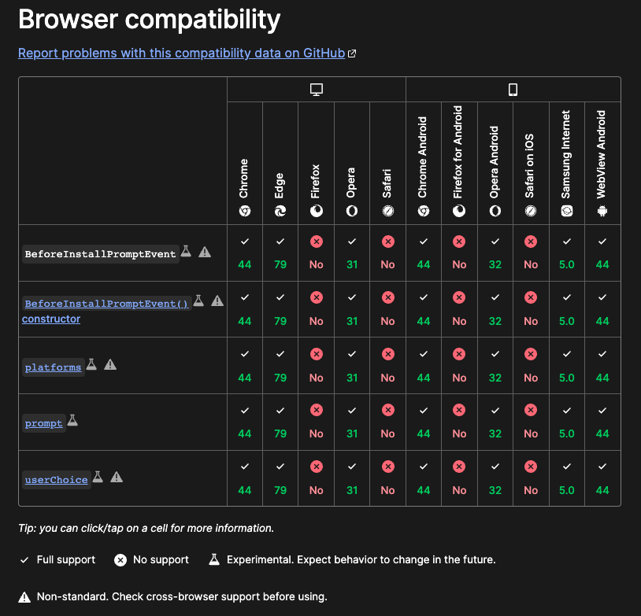

## 1. 앱 설치 시 사용자 경험 고려

- 설치 가능한 PWA라면, 브라우저에서 제공하는 설치 환경이 자동으로 주어진다.
- 그러나 브라우저마다 설치 환경이 다르기 때문에, 사용자에게 일관된 앱 설치 경험을 주기 위해서는 웹 앱 내에 설치 기능이 있는 버튼을 직접 만들 필요가 있었다. 운영체제 및 브라우저 별로 경험한 설치 환경 소감은 아래와 같다.

  - PC 크롬에서는 주소창 내 우측에 설치 아이콘이 존재하는데, 사실 모르는 사람은 알기 쉽지 않다. InApp 설치 버튼을 만들어야겠다고 생각하게 된 가장 큰 이유다.

            

  - android에서는 설치 prompt창이 떠서 설치 유도에는 좋을 것 같다.
  - iOS에서는 다른 운영체제와 달리 `앱 설치` 가 아니라 오직 `safari` 브라우저의 `책갈피 추가` 방식을 통해서만 설치할 수 있다(불편하다). 어쨌든 `책갈피 추가` 를 하게 되면, 앱이 홈 화면에 추가되고 앱을 실행하면 주소창 등이 사라져 네이티브 앱 같은 경험이 가능하다.
    - 이와 같이 iOS에서는 앱 설치 기능이 지원되지 않고 있어서, InApp 설치 버튼을 만들어도 iOS에서는 해당 설치 버튼 사용이 불가하다는 점은 일단 염두하자.

## 2. **BeforeInstallPromptEvent**

- [https://developer.mozilla.org/en-US/docs/Web/API/BeforeInstallPromptEvent](https://developer.mozilla.org/en-US/docs/Web/API/BeforeInstallPromptEvent)
- beforeinstallprompt는 말 그대로 설치 prompt가 뜨기 전 이벤트이다. 해당 이벤트가 감지되면 install prompt 작동되지 않도록 preventDefault()를 하고 이벤트를 변수(deferredPrompt)에 저장하는 로직을 이벤트 리스너에 추가한다.

    ```jsx
    let deferredPrompt

    window.addEventListener('beforeinstallprompt', event => {
        event.preventDefault()
        deferredPrompt = event
    })
    ```

- 그리고 지연된 설치 prompt 이벤트가 담긴 변수에 `BeforeInstallPromptEvent.prompt()` 메서드를 사용하여 개발자가 원하는 시간에 설치 프롬프트를 표시하게 한다.

    ```jsx
    const installApp = () => {
        if (!deferredPrompt) {
            alert('이미 앱이 설치되어 있거나 앱을 설치할 수 없는 환경입니다')
            return
        }

        deferredPrompt.prompt()
    }
    ```

## 3. 코드

```jsx
let deferredPrompt

window.addEventListener('beforeinstallprompt', event => {
    event.preventDefault()
    deferredPrompt = event
})

const installApp = () => {
    if (!deferredPrompt) {
        alert('이미 앱이 설치되어 있거나 앱을 설치할 수 없는 환경입니다')
        return
    }

    deferredPrompt.prompt()
}
```

```jsx
<button onClick={installApp}>앱 설치하기</button>
```

## 4. 브라우저 호환성

- **BeforeInstallPromptEvent는 실험 단계 기술이라서 아직 브라우저 호환성이 부족하다는 점을 참고할 필요가 있다.**


