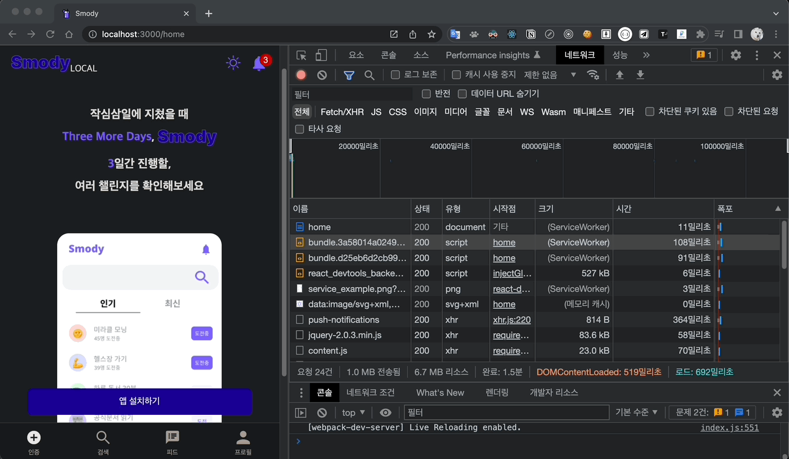
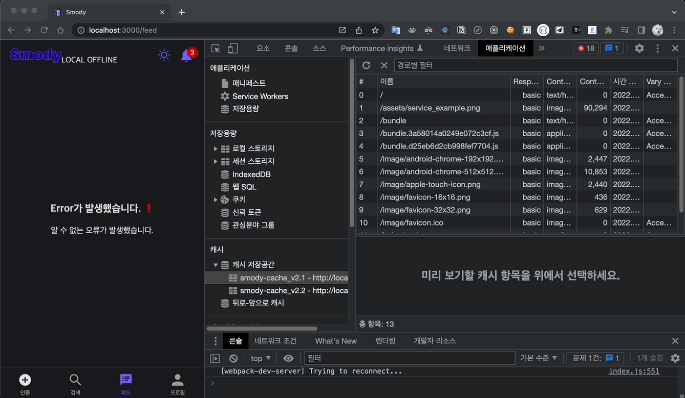

## 캐시 스토리지

- `캐시 스토리지`는 `브라우저`에 리소스를 직접 저장하고 관리할 수 있는 공간이다. 도메인은 여러 개의 이름이 지정된 `Cache` 객체를 가질 수 있으며 그 객체들은 `ServiceWorker` 가 완전히 제어한다.
- 사용자가 PWA 웹 페이지 처음 접속 시, 서비스 워커가 등록되고 설치(install)되는데, 이 때 웹 페이지 구성에 필요한 리소스를 모두 캐시 스토리지에 미리 캐싱한다. 캐시 스토리지에 캐싱된 리소스는 필요할 때 언제든(오프라인 상태일지라도) 불러올 수 있다.
- 리소스 목록
  - 웹 페이지를 구성하기 위한 가장 기본적이며 정적인 구성 요소인 App Shell을 캐싱해야 한다.
- 캐싱 시점
  - 서비스 워커의 install 이벤트는 리소스를 캐싱하거나 기타 초기 작업을 수행하는데 사용된다.
- 접근

  - 캐시 스토리지는 window와 서비스 워커를 포함한 웹 워커에서 모두 접근할 수 있다.

    ```jsx
    // 캐시 스토리지 접근 방법
    self.caches
    ```

### 리소스 캐싱하기

- `caches.open()`
  - [https://developer.mozilla.org/en-US/docs/Web/API/CacheStorage/open](https://developer.mozilla.org/en-US/docs/Web/API/CacheStorage/open)
  - 첫 번째 인자로 문자열로 된 캐시 이름을 전달하여 해당되는 캐시를 열거나 존재하지 않는 경우 새로운 캐시를 생성한다.
  - 캐시 객체를 resolve하는 프로미스를 반환한다.
  - 용도에 따라 다양한 이름의 캐시 저장 공간을 생성하여 관리할 수 있다.
- `Cache.addAll()`
  - [https://developer.mozilla.org/en-US/docs/Web/API/Cache/addAll](https://developer.mozilla.org/en-US/docs/Web/API/Cache/addAll)
  - 리소스 요청 URK 문자열 값으로 구성된 배열을 인자로 받아 모든 리소스를 캐시 스토리지에 캐싱한다.
  - 캐싱 도중 하나라도 문제가 발생하여 캐싱하지 못한 경우 프로미스가 reject되어 모든 작업이 취소되는 점을 주의한다.
- `event.waitUntil()`
  - [https://developer.mozilla.org/en-US/docs/Web/API/ExtendableEvent/waitUntil](https://developer.mozilla.org/en-US/docs/Web/API/ExtendableEvent/waitUntil)
  - waitUntil()은 생명주기 이벤트를 연장하기 위한 메소드이며, 비동기 작업을 수행하는 프로미스를 받아 해당 프로미스가 완료될 때까지 이벤트를 연장한다. 즉, 비동기 작업을 수행해야 하는 경우 waitUntil()을 통해 이벤트 수명을 연장할 수 있다.

```jsx
// pwaServiceWorker.js

const APPSHELL = ['/', '/index.html', '/style.css', '/app.js']

self.addEventListener('install', event => {
  // 리소스 캐싱하기
  event.waitUntil(
    caches.open('cache_v1').then(cache => {
      return cache.addAll(APPSHELL)
    })
  )
})
```

- 개발자 도구에서 캐시된 리소스를 아래와 같이 확인할 수 있다.


### 캐시에서 응답하기

- `**cahces.match()**`
  - [https://developer.mozilla.org/en-US/docs/Web/API/CacheStorage/match](https://developer.mozilla.org/en-US/docs/Web/API/CacheStorage/match)
  - match()는 캐시된 리소스를 찾기 위한 메소드이며 프로미스를 반환한다.
- `event.respondWith()`
  - [https://developer.mozilla.org/en-US/docs/Web/API/FetchEvent/respondWith](https://developer.mozilla.org/en-US/docs/Web/API/FetchEvent/respondWith)
  - 브라우저의 기본 요청을 막고 서비스 워커에서 리소스를 대신 응답하기 위해 사용하는 메서드이다.

```jsx
// pwaServiceWorker.js

self.addEventListener('fetch', event => {
  const url = new URL(event.request.url)

  if (APPSHELL.includes(url.pathname)) {
    // 먼저 캐시에서 응답하고 없으면 네트워크 요청하여 응답
    event.respondWith(
      caches.match(url.pathname).then(response => {
        return response || fetch(event.request)
      })
    )
  }
})
```

- 이후 오프라인이어도 아래 캡처처럼 캐시된 리소스를 응답할 수 있다.



### 캐시 관리

- 사용하지 않는 불필요한 캐시도 제거해야 한다.
- 캐시 삭제 시점 - activate

  - 이전의 서비스 워커의 제어가 중단되고 새로운 서비스 워커가 활성화되었을 때인 `activate` 이벤트 발생 시점에, 불필요한 캐시 삭제 로직을 구현한다.

- `caches.keys()`
  - [https://developer.mozilla.org/en-US/docs/Web/API/CacheStorage/keys](https://developer.mozilla.org/en-US/docs/Web/API/CacheStorage/keys)
  - 캐시 스토리지의 모든 캐시 목록 배열을 resolve하는 프로미스를 반환한다.
- `caches.delete()`
  - [https://developer.mozilla.org/en-US/docs/Web/API/CacheStorage/delete](https://developer.mozilla.org/en-US/docs/Web/API/CacheStorage/delete)
  - 메소드의 첫 인자로 캐시 이름을 전달하여 지정한 캐시를 제거할 수 있으며, 이 또한 프로미스를 반환한다.
- 캐시 이름이 CACHE_NAME과 일치하지 않으면 해당 캐시를 제거하는 프로미스 배열을 매핑하고 Promise.all()을 통해 일괄 처리한다.

```jsx
// pwaServiceWorker.js

self.addEventListener('activate', event => {
  event.waitUntil(
    caches.keys().then(keyList => {
      return Promise.all(
        keyList.map(key => {
          if (key !== CACHE_NAME) {
            return caches.delete(key)
          }
        })
      )
    })
  )
})
```

- 상기 코드 적용하면, 새로고침할 때마다 현재 사용하는 캐시 외에 불필요한 캐시들을 아래 캡처처럼 모두 삭제된다.



## IndexedDB

- 컨텐츠 데이터를 저장 및 관리하기 위한 저장소로서, IndexedDB를 활용할 수 있다.
- IndexedDB는 브라우저에서 `객체`를 저장하고 `트랜잭션 기반`으로 데이터를 처리하는 데이터베이스이다.

### IndexedDB 특징

- IndexedDB는 `데이터베이스`, `객체 저장소` , `데이터` 라는 구성요소로 이루어져 있다. 웹 페이지 도메인별로 여러 개의 `데이터베이스`를 생성할 수 있고, 하나의 `데이터베이스`에는 여러 개의 `객체 저장소` 를 생성하여 `데이터`를 저장할 수 있다.
- 자바스크립트로 처리할 수 있는 `대부분의 데이터 형식`을 저장할 수 있다. 원시값, 객체 외에도 이미지, 동영상, 사운드 등의 데이터가 될 수 있는 Blob(Binary Large Object) 형식도 저장할 수 있다.
- `색인` 을 지원하며, `빠른 검색`이 가능하다.
- `트랜잭션` 기반으로 데이터를 처리한다. 트랜잭션이란 데이터 상태 변경을 수행하기 위한 일련의 과정이다. IndexedDB는 모든 데이터 조작을 트랜잭션 단위로 수행하며 작업 도중 문제가 발생하면 변경 사항을 원상태로 되돌리고, 모든 과정이 정상적으로 처리되어야만 변경된 데이터가 데이터베이스에 반영된다.
- 비교적 `많은 저장 공간`이 제공된다. 보통 50MB 또는 브라우저의 버전과 종류마다 다르게 기기 여유 공간의 특정비율까지 할당량이 제공된다.
- `웹 워커의 컨텍스트`에서도 사용할 수 있다.
  - (반면, 로컬 스토리지는 웹 워커의 실행 컨텍스트에서 사용할 수 없다.)
  - 오프라인 상태에서 데이터 관리를 하려면 서비스 워커에서 사용할 수 있는 IndexedDB가 필요하다.
- 다만, 초기 구현이 로컬스토리지 등과 비교하여 까다롭다.

### 데이터베이스 생성

- **`IDBFactory.open()`**
  - [https://developer.mozilla.org/en-US/docs/Web/API/IDBFactory/open](https://developer.mozilla.org/en-US/docs/Web/API/IDBFactory/open)

```jsx
let db = null
const DBOpenRequest = window.indexedDB.open(db이름, db버전)

// 요청 객체 에러 이벤트 핸들러
DBOpenRequest.onerror = event => {
  console.error(event)
}

// 요청 객체 성공 이벤트 핸들러
DBOpenRequest.onsuccess = event => {
  // 반환된 데이터베이스 연결 객체를 저장한다
  db = DBOpenRequest.result
}
```

- `IDBDatabase`
  - 데이터베이스 연결 객체
  - [https://developer.mozilla.org/en-US/docs/Web/API/IDBDatabase](https://developer.mozilla.org/en-US/docs/Web/API/IDBDatabase)

### 객체 저장소(IDBObjectStore)

```jsx
request.onupgradeneeded = event => {
  const db = event.target.result

  db.createObjectStore('post', { keyPath: 'id' })
}
```

- `DBOpenRequest.onupgradeneeded` 이벤트
  - [https://developer.mozilla.org/en-US/docs/Web/API/IDBOpenDBRequest/upgradeneeded_event](https://developer.mozilla.org/en-US/docs/Web/API/IDBOpenDBRequest/upgradeneeded_event)
  - 데이터베이스의 버전이 변경(향상)되어 업데이트가 필요한 경우 발생하는 이벤트이다.
  - 이러하나 이벤트 발생 시, 새로 필요한 객체 저장소를 생성하거나 색인 추가 또는 삭제 등의 작업을 한다.
- `IDBDatabase.createObjectStore(객체저장소 이름, 기본키 옵션)`

  - [https://developer.mozilla.org/en-US/docs/Web/API/IDBDatabase/createObjectStore](https://developer.mozilla.org/en-US/docs/Web/API/IDBDatabase/createObjectStore)
  - 객체 저장소는 데이터베이스연결객체의 `createObjectStore` 메소드를 통해 새로 생성한다.
  - 두 번째 인자 자리에는 `기본키` 옵션으로서, `keyPath` 와 `authIncrement` 라는 2가지가 존재한다.

    - 내부키

      - `keyPath` 옵션을 통해 사용되는 기본키는 내부키(in-line-key)라고 불린다.
      - 실제 저장되는 데이터 내부의 특정 값을 기본으로 사용한다.

            ```jsx
            db.createObjectStore(객체저장소 이름, {keyPath : 'id'});
            // 데이터 내부의 프로퍼티 중 key가 'id'인 값을 기본키로 사용한다.
            ```

    - 외부키

      - `autoIncrement` 옵션을 통해 데이터와 상관없이 자동 증가되는 기본키 값은 외부키(out-of-line key)라고 불린다.
      - 데이터와 관계없는 별도의 키를 새로 생성한다.

            ```jsx
            db.createObjectStore(객체저장소 이름, {autoIncrement: true});
            ```

### 색인 추가하기

- 기본키 이외의 값을 검색하는 기능이 필요하면 별도의 색인을 추가하여 특정 값을 검색할 수 있다.
- `IDBObjectStore.createIndex(indexName, keyPath, objectParameters)`

  - [https://developer.mozilla.org/en-US/docs/Web/API/IDBObjectStore/createIndex](https://developer.mozilla.org/en-US/docs/Web/API/IDBObjectStore/createIndex)
  - 첫 번째 인자는 색인의 이름이다. 두 번째 인자는 색인으로 사용할 keyPath이다. 세 번째 인자는 색인의 옵션이며, 필수는 아니고, 고유한 색인 값을 갖도록 하는 unique 옵션을 지정할 수 있다.

    ```jsx
    createIndex(indexName, keyPath, objectParameters)
    ```

    ```jsx
    DBOpenRequest.onupgradeneeded = event => {
      const db = event.target.result

      const objectStore = db.createObjectStore('toDoList', {
        keyPath: 'taskTitle',
      })

      objectStore.createIndex('toDoList-task', 'task', { unique: true })
      objectStore.createIndex('toDoList-status', 'status', { unique: false })
    }
    ```

  - 위 코드에서 toDoList-task, toDoList-status 색인이 생성됐다. 이는 toDoList 객체 저장소에 존재하는 데이터의 task와 status 값을 검색할 수 있음을 의미한다.

### 트랜잭션

- 트랜잭션 모드
  - `versionChange`
    - 버전 변경(객체 저장소 생성, 삭제, 색인 추가 등), onungraedneeded 이벤트 발생 전 자동 생성되는 트랜잭션이므로, 직접 생성할 수는 없다.
  - `readonly`
    - 읽기 전용(데이터 조회)
  - `readwrite`
    - 읽기 및 쓰기(데이터 조회, 추가, 삭제 수정)
- **`IDBDatabase.transaction()`**

  - [https://developer.mozilla.org/en-US/docs/Web/API/IDBDatabase/transaction](https://developer.mozilla.org/en-US/docs/Web/API/IDBDatabase/transaction)
  - transaction() 메서드는 첫 번째 인자 자리에 사용하고자 하는 객체 저장소의 범위를 받고, 두 번째 인자로 모드를 받아서, 새 트랜잭션을 생성한다.

    ```jsx
    // 트랜잭션 생성
    const transaction = db.transaction(
      ['toDoList-task', 'toDoList-status'],
      'readwrite'
    )

    // 객체 저장소 가져오기
    // 트랜잭션 생성 후 사용할 객체 저장소를 가져와야 데이터를 조작할 수 있다.
    const objectStore = transaction.objectStore('toDoList')
    ```

- 트랜잭션의 이벤트
  - `complete` : 성공
  - `abort` : 중단
  - `error` : 에러

### 데이터 접근/조작

- **`IDBObjectStore.add()` - 데이터 추가**
  - [https://developer.mozilla.org/en-US/docs/Web/API/IDBObjectStore/add](https://developer.mozilla.org/en-US/docs/Web/API/IDBObjectStore/add)
- **`IDBObjectStore.get()` - 조건에 일치하는 하나의 레코드 조회**
  - [https://developer.mozilla.org/en-US/docs/Web/API/IDBObjectStore/get](https://developer.mozilla.org/en-US/docs/Web/API/IDBObjectStore/get)
  - 첫 번째 인자로 전달된 기본키를 가진 데이터를 찾거나 특정 범위 조건을 전달하여 이에 해당하는 결과 데이터를 제공한다.
- **`IDBObjectStore.openCursor()` - 여러 데이터를 한꺼번에 접근**

  - [https://developer.mozilla.org/en-US/docs/Web/API/IDBObjectStore/openCursor](https://developer.mozilla.org/en-US/docs/Web/API/IDBObjectStore/openCursor)
  - 커서는 순회하며 결과 데이터를 가리킬 수 있는 요소이다. 커서를 통해 여러 데이터에 쉽게 접근할 수 있다. 조회뿐만 아니라 수정, 삭제 등의 작업도 바로 처리할 수 있다.
  - 커서는 openCursor() 메서드로 열 수 있다. 커서가 성공적으로 열리면, 커서 객체에 접근할 수 있고 curosr.value 속성을 통해 커서가 가리키는 데이터를 참조할 수 있다.
    - 첫 번째 인자는 조회할 데이터의 조건을 받는다.
      - lowerBound(값) : 지정된 값 이상의 값을 검색
      - upperBound(값) : 지정된 값 이하의 값을 검색
      - bound(값1, 값2) : 값1과 값2 사이의 범위에 해당하는 값만 검색
      - only(값): 값과 정확히 일치하는 값만 검색
    - 두 번재 인자는 커서의 이동방향을 받는다.
      - next: 앞에서 뒤로 이동
      - prev: 뒤에서 앞으로 이동
      - nextunique: 앞에서 뒤로 이동하되 동일한 값은 한 번만
      - prevunique: 뒤에서 앞으로 이동하되 동일한 값은 한 번만ㅎ
  - 다음 데이터를 참조하려면 커서의 continue() 메서드를 사용한다. 이동에 성공하면 요청 객체의 성공 이벤트가 다시 발생한다. 커서가 마지막에 도달하면 커서의 값이 null이 된다.
  - 데이터 수정 시, 커서의 undate() 메서드를 사용한다. (커서를 통한 데이터 수정은 객체 저장소가 내부키를 사용하는 경우에만 가능하다)
  - 데이터 삭제 시, 커서의 delete() 메서드를 사용한다.

    ```jsx
    const posts = []
    const cursorRequest = db
      .transaction('post')
      .objectStore('post')
      .openCursor(null, 'prev')

    cursorRequest.onsuccess = event => {
      const cursor = event.target.result
      if (cursor) {
        posts.push(cursor.value)
        cursor.continue()
      } else {
        resolve(posts)
      }
    }
    ```

- **`IDBObjectStore.put()` - 조건에 일치하는 하나의 레코드 수정**
  - [https://developer.mozilla.org/en-US/docs/Web/API/IDBObjectStore/put](https://developer.mozilla.org/en-US/docs/Web/API/IDBObjectStore/put)
  - 첫 번째 인자로 수정할 데이터를 전달한다.
  - 두 번째 인자로 수정할 레코드의 기본키 값을 지정할 수 있고, 생략 시 내부키가 지정된다.
- **`IDBObjectStore.delete()` - 조건에 일치하는 하나의 레코드 삭제**
  - [https://developer.mozilla.org/en-US/docs/Web/API/IDBObjectStore/delete](https://developer.mozilla.org/en-US/docs/Web/API/IDBObjectStore/delete)
- **`IDBObjectStore.clear()` - 모든 레코드 삭제**
  - [https://developer.mozilla.org/en-US/docs/Web/API/IDBObjectStore/clear](https://developer.mozilla.org/en-US/docs/Web/API/IDBObjectStore/clear)
