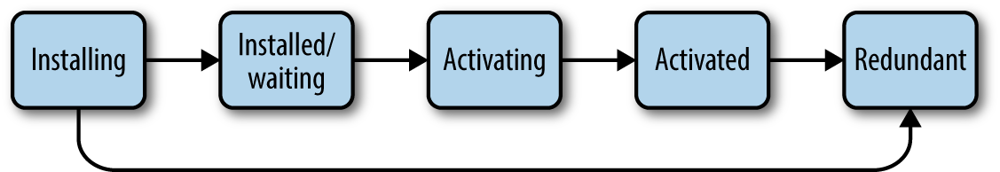

## 서비스 워커의 특징

([서비스 워커](https://developer.mozilla.org/en-US/docs/Web/API/Service_Worker_API)는 [웹 워커](https://developer.mozilla.org/ko/docs/Web/API/Web_Workers_API/Using_web_workers)의 일종이다. 서비스 워커만의 특징과 서비스 워커도 갖고 있는 웹 워커의 공통적인 특징 등을 구분하여 정리했다.)

- **별도의 워커 스레드에서 동작(웹 워커)**
  - 자바스크립트는 싱글 스레드(메인 스레드) 기반으로 동작하기 때문에 오랜 시간이 소요되는 복잡한 작업을 메인 스레드에서 수행할 경우 웹 페이지가 멈추거나 버벅이는 문제가 발생할 수 있다. 따라서 이러한 복잡한 작업들은 웹 워커를 통해 메인 스레드가 아닌 별도의 워커 스레드에서 연산하도록 구현하여 메인 스레드의 부담을 줄이고 성능 하락을 방지한다.
- **직접적인 DOM 접근/조작 불가(웹 워커)**
  - 웹 워커는 별도의 실행 컨텍스트를 가진 워커 스레드에서 동작하므로 DOM에 직접 접근할 수 없다.
- **백그라운드 환경에서 동작(서비스 워커)**
  - 서비스 워커는 브라우저가 닫혀 있더라도 백그라운드에서 작동할 수 있다.
- **웹 브라우저의 네트워크 요청을 가로채어 조작 가능(서비스 워커)**
  - PWA의 서비스 워커는 브라우저와 서버 사이에 위치하기 때문에 이들 사이에서 네트워크 요청을 가로채거나 다양한 제어를 수행할 수 있다.
  - 따라서 서비스 워커는 보안 상의 이유로 HTTPS에서만 동작한다. 네트워크 요청을 수정할 수 있다는 점에서 중간자 공격에 굉장히 취약하기 때문이다.

## 서비스 워커 등록

### 서비스워커 파일 생성

- `pwaServiceWorker.js`

  - serviceWorker.js 파일을 만들고 앞으로 여기에 서비스 워커의 기능을 작성한다. 아래 예제 코드를 통해 설치 및 활성화 단계 이벤트 제어를 할 수 있다.

    ```jsx
    const VERSION = 'version 1.0'

    // 서비스 워커 설치할 때
    self.addEventListener('install', event => {
      console.log('service worker - install', VERSION)

      // 제어중인 서비스 워커가 존재해도 대기 상태를 건너뛴다.
      self.skipWaiting()
    })

    // 서비스 워커 설치 중일 때
    self.addEventListener('activate', event => {
      console.log('service worker - activate', VERSION)

      // 활성화 즉시 클라이언트를 제어한다.(새로고침 불필요)
      self.clients.claim()
    })
    ```

  - `self` 는 서비스 워커의 전역 실행 컨텍스트인 [`ServiceWorkerGlobalSpace`](https://developer.mozilla.org/ko/docs/Web/API/ServiceWorkerGlobalScope)를 뜻한다.

### index에서 서비스워커 등록

- `src/index.tsx` 파일 내에 서비스 워커를 추가하는 아래 코드 추가

  ```jsx
  // 사용하는 PWA 관련 API에 따라 조건이 더 추가될 수 있다
  const isPwaServiceWorkerSupported =
    'serviceWorker' in navigator &&
    'Notification' in window &&
    'PushManager' in window

  const registerPwaServiceWorker = async () => {
    if (!isPwaServiceWorkerSupported) {
      return
    }

    // 클라이언트에 등록되어 있는 ServiceWorkerRegistration을 가져온다.
    let registration = await navigator.serviceWorker.getRegistration()

    // 클라이언트에 등록된 ServiceWorkerRegistration이 없으면 새로 등록한다.
    if (!registration) {
      registration = await navigator.serviceWorker.register(
        'pwaServiceWorker.js'
      )
    }

    // Push 알림 기능을 위해 ServiceWorkerRegistration으로부터 관련 상태를 업데이트한다.
    await updatePushStatus(registration)
  }
  // 위 코드는 파일 분리를 추천한다

  registerPwaServiceWorker() // 서비스 워커 등록
  ```

  - 만약 개발모드에서 msw를 사용한다면 서비스워커가 중복되므로 등록하는 서비스워커를 환경에 따라 분기하는 것이 좋다. 서비스워커는 동시에 하나 밖에 등록되지 않는다. 예를 들어 아래와 같이 분기할 수 있다.

        ```jsx
        if (isProd || isLocal) {
          registerPwaServiceWorker();
        }

        if (isDev) {
          const { mockServiceWorker } = require('./mocks/browser');
          mockServiceWorker.start();
        }
        ```

## 서비스 워커를 통해 처리할 수 있는 이벤트

- 다음 이벤트들이 서비스 워커 전역 객체 내 이벤트이다.
  - [`activate`](https://developer.mozilla.org/en-US/docs/Web/API/ServiceWorkerGlobalScope/activate_event), `fetch`, [`install`](https://developer.mozilla.org/en-US/docs/Web/API/ServiceWorkerGlobalScope/install_event), [`message`](https://developer.mozilla.org/en-US/docs/Web/API/ServiceWorkerGlobalScope/message_event), [`notificationclick`](https://developer.mozilla.org/en-US/docs/Web/API/ServiceWorkerGlobalScope/notificationclick_event), `notificationclose`, [`push`](https://developer.mozilla.org/en-US/docs/Web/API/ServiceWorkerGlobalScope/push_event), [`pushsubscriptionchange`](https://developer.mozilla.org/en-US/docs/Web/API/ServiceWorkerGlobalScope/pushsubscriptionchange_event), `sync`

### 서비스 워커 설치 관련 이벤트

설치 및 활성화 시 최초 1회만 발생하므로, 주로 웹 페이지 구성에 필요한 리소스를 미리 준비하거나 이전의 서비스 워커가 구성해둔 데이터를 지우는 등의 작업을 수행한다.

- `install` : 서비스워커의 생명주기가 installing 시 발생
  - 다운로드한 파일이 더 새로운 버전인 경우 서비스 워커의 설치를 시도한다. 버전 비교는 기존 서비스 워커 파일과의 바이트 단위 비교 결과를 사용한다. 이 페이지/사이트에서 서비스 워커를 처음 발견한 경우에도 "새로운 버전"으로 취급한다.
  - install 시점에 등록할 캐시를 추가하여 캐시를 초기화할 수 있다.
- `activate` : 서비스워커의 생명주기가 activating, activated 시 발생
  - activate 시점에서는 과거의 캐시를 지우고, 구버전 서비스 워커에 관련된 항목을 청소하는 등 여러가지를 정리하기에 좋다.

### 백그라운드 동기화 관련 이벤트

- `sync` : 네트워크가 오프라인에서 온라인이 될 경우나 이미 온라인인 경우 발생
  - [`sync 이벤트`](https://developer.mozilla.org/en-US/docs/Web/API/SyncEvent) 를 통해 백그라운드 동기화 작업을 할 수 있다.
  - sync 이벤트는 네트워크 환경이 `오프라인` 에서 `온라인` 으로 변경되었을 때 발생한다.

### 브라우저 요청 관련 이벤트

- `fetch` : [`fetch()`](https://developer.mozilla.org/en-US/docs/Web/API/fetch) 메서드가 호출될 경우 발생
  - [`fetch 이벤트`](https://developer.mozilla.org/en-US/docs/Web/API/FetchEvent)는 웹 페이지에서 네트워크 요청을 수행할 때 발생한다. 해당 이벤트를 통해 웹 페이지와 서버 사이에서의 요청을 제어할 수 있다.  [`FetchEvent.respondWith()`](https://developer.mozilla.org/ko/docs/Web/API/FetchEvent/respondWith) 메서드를 사용해 요청에 대한 응답을 원하는 방식으로 자유롭게 바꿀 수 있다.
  - 이러한 fetch 이벤트를 활용하여 오프라인 환경에서 미리 저장해둔 리소스를 대신 응답함으로써 오프라인 지원 웹 사이트를 구현할 수 있다.

### 푸시 알림 관련 이벤트

- `push` : 서버로부터 push notification을 수신할 경우 발생
  - [`push 이벤트`](https://developer.mozilla.org/en-US/docs/Web/API/ServiceWorkerGlobalScope/push_event) 는 서버로부터 푸시 메시지를 수신할 때 발생한다.
  - 서비스 워커는 사용자가 웹 페이지를 닫아도, 백그라운드에서 계속 작동하기 때문에 푸시 이벤트를 수신할 수 있다.
- `pushsubscriptionchange` : push subscription이 브라우저에 의해 새로 고침된 경우나, 폐기된 경우에 발생
- `notificationclick` : 사용자가 알림을 클릭할 경우 발생
- `notificationclose` : 사용자가 알림을 닫을 경우 발생

### 클라이언트와 통신 관련 이벤트

- `message` : 클라인언트로부터 메시지가 수신될 경우 발생

## 서비스 워커의 생명주기


이미지 출처 : [oreilly](https://www.oreilly.com/library/view/building-progressive-web/9781491961643/ch04.html)

- 서비스 워커는 register를 통해 등록되면, install부터 activate 및 redundant 상태까지 생명주기를 거친다.
- 생명주기
  - `installing`
  - `installed(waiting)`
  - `activating`
  - `activated`
    - activated 이후부터 fetch, sync, push 등 기능 이벤트 제어할 수 있다.
  - `redundant`
    - redundant 상태는 설치와 활성화 작업 도중 문제가 발생하거나 새로운 서비스 워커로 대체되었을 때의 상태를 의미하며 곧 소멸될 서비스 워커의 상태를 나타낸다.

### 수정된 서비스워커 활성화하기(installed/waiting → activating)

- 서비스워커를 수정하고 새로고침을 해도, 이미 활성화되어 있는 서비스 워커가 존재하면 기존의 서비스 워커가 제어하고 있는 클라이언트가 존재하지 않을 때까지 대기 상태를 유지한다.
  - 새로운 서비스 워커를 활성화하려면, 개발자 도구에서 skipWating을 직접 누르거나, 기존 서비스 워커가 제어하는 클라이언트(웹 페이지)를 모두 닫는 방법이 있다.
  - 또는 아래 코드처럼 [`ServiceWorkerGlobalScope.skipWaiting()`](https://developer.mozilla.org/ko/docs/Web/API/ServiceWorkerGlobalScope/skipWaiting)를 사용해 대기 상태를 건너뛰고 즉시 활성화할 수 있다.

```jsx
// 서비스 워커 설치할 때
self.addEventListener('install', event => {
  // 제어중인 서비스 워커가 존재해도 대기 상태를 건너뛴다.
  self.skipWaiting()
})
```

### 서비스 워커 활성화 시 클라이언트 제어권 즉시 부여(activating → activated)

- 서비스 워커가 없던 상태에서 로드된 클라이언트는 새로 설치된 서비스 워커에서 즉시 제어할 수 없다.
- 제어하기 위해서는 페이지를 새로고침하거나, 아래 코드처럼 [`Clients.claim()`](https://developer.mozilla.org/ko/docs/Web/API/Clients/claim) 를 사용해 제어권을 즉시 가져와야 한다.

```jsx
// 서비스 워커 설치 중일 때
self.addEventListener('activate', event => {
  // 활성화 즉시 클라이언트를 제어한다.(새로고침 불필요)
  self.clients.claim()
})
```

> **참고자료**
>
> - MDN
> - SNS 앱 예제로 배우는 프로그레시브 웹 앱
