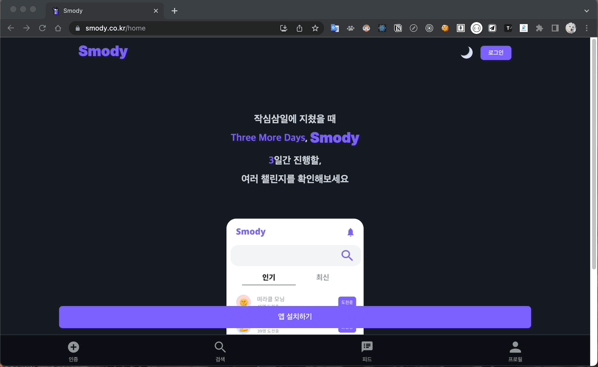
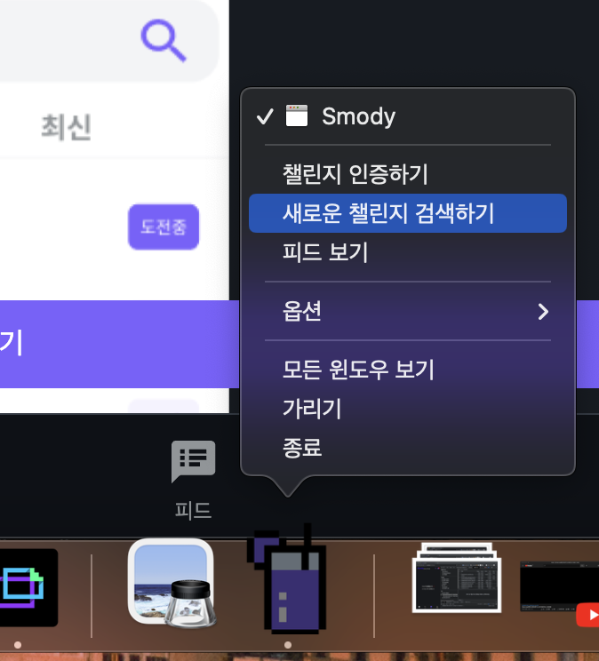
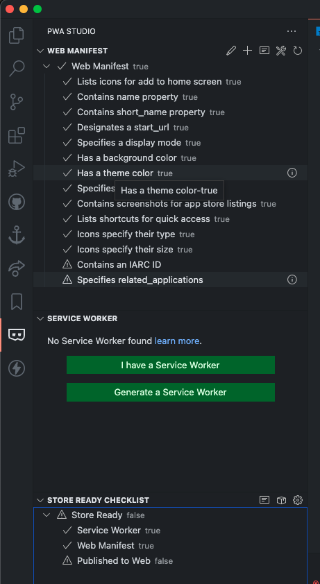

## 1. Web App Manifest란?

- `Web App Manifest` 는 프로그레시브 웹 앱에 대해 브라우저에게 알려주며 사용자의 데스크톱이나 모바일 기기에 `설치`할 때 어떻게 작동해야 하는지 알려주는 JSON 형식의 파일이다.
  - 참고로 여기서 `설치` 란, 앱 스토어를 거치지 않고 기기의 홈 화면에 설치하는 것을 의미한다. 그렇지만, 일반 웹 앱처럼 단순히 홈 화면에 링크/북마크를 하는 것은 아니며, PWA는 사전 다운로드를 통해 오프라인에서도 동작할 수 있다.
  - PWA 매니페스트는 name, background_color, display 등 여러 구성 요소를 포함할 수 있다.
- 다음과 같이 웹 앱을 설치할 수 있다. PC뿐만 아니라 안드로이드와 iOS에서도 설치 가능하다.

  

## 2. Manifest 파일 만들기

- 이번에 팀 프로젝트 시 작성한 매니페스트는 다음과 같다. 속성 이름과 값을 통해 해당 속성이 어떤 역할을 하는지 대략 유추될 것이다. 이 중에서 헷갈릴 수 있는 몇 가지를 살펴보자.
- `orientation`
  - 설치된 웹 앱이 실행되었을 때 표시되는 화면 방향을 설정한다.
  - 옵션
    - `any` : 모든 방향(자동 회전)
    - `landscape` : 가로 방향 고정
    - `portrait` : 세로 방향 고정
- `display`
  - 설치된 웹 앱의 화면 모드를 설정한다.
  - 옵션
    - `browser` : 기본적인 브라우저 화면(상단바O, 하단바O)
    - `fullscreen` : 전체 화면(상단바X, 하단바X)
    - `standalone` : 브라우저의 기본 요소를 숨긴 화면(상단바X, 하단바O)
- `start_url`
  - 설치된 웹 앱 실행 시 어떤 페이지를 열지 설정한다.
- `shortcuts`

  - 모바일에서 웹 앱 아이콘을 꾹 누르거나, PC에서 웹 앱 아이콘을 우클릭 했을 때, 표시되는 앱 내 기능 바로가기를 설정한다.

    

  - `categories` , `screenshots`
    - 카테고리나 스크린샷은 스토어(chrome_web_store, play, itunes, microsoft-inbox and microsoft-store)에서 사용될 수 있다.
  - 모바일 스플래시 화면
    - 크롬은 매니페스트 속성의 `name` , `background_color` , `icons` 을 조합하여 스플래시 화면을 자동으로 생성한다.

```jsx
{
  "name": "Smody",
  "short_name": "Smody",
  "description": "작심삼일에 지쳤을 때, Three more days. 스모디",
  "start_url": "/home",
  "scope": "/",
  "background_color": "#f5f3ff",
  "theme_color": "#7c61ff",
  "dir": "ltr",
  "display": "standalone",
  "orientation": "any",
  "categories": ["self-improvement", "sns", "routine"],
  "screenshots": [],
  "icons": [
    {
      "src": "image/favicon.ico",
      "type": "image/x-icon"
    },
    {
      "src": "image/android-chrome-192x192.png",
      "type": "image/png",
      "sizes": "192x192",
      "purpose": "any maskable"
    },
    {
      "src": "image/android-chrome-512x512.png",
      "type": "image/png",
      "sizes": "512x512",
      "purpose": "any"
    },
    {
      "src": "image/favicon-16x16.png",
      "type": "image/png",
      "sizes": "16x16",
      "purpose": "any"
    },
    {
      "src": "image/favicon-32x32.png",
      "type": "image/png",
      "sizes": "32x32",
      "purpose": "any"
    }
  ],
  "shortcuts": [
    {
      "name": "챌린지 인증하기",
      "short_name": "인증",
      "description": "진행 중인 챌린지를 인증할 수 있다",
      "url": "/cert",
      "icons": [{ "src": "image/android-chrome-192x192.png", "sizes": "192x192" }]
    },
    {
      "name": "새로운 챌린지 검색하기",
      "short_name": "검색",
      "description": "새로운 챌린지를 검색하고 도전할 수 있다",
      "url": "/search",
      "icons": [{ "src": "image/android-chrome-192x192.png", "sizes": "192x192" }]
    },
    {
      "name": "피드 보기",
      "short_name": "피드",
      "description": "다른 사용자들의 피드를 볼 수 있다",
      "url": "/feed",
      "icons": [{ "src": "image/android-chrome-192x192.png", "sizes": "192x192" }]
    }
  ],
}
```

### 2-1. 웹 사이트에 Manifest 추가

- `mainfest.json` 파일을 최상위 디렉터리에 만들고, 웹 페이지에서 이를 불러올 수 있도록 index.html 파일의 <head> 태그 내부에 아래와 같이 <link> 태그를 사용해 추가한다.

```jsx
<link rel="manifest" href="manifest.json" />
```

### 2-2. 애플 모바일 기기 지원을 위한 설정

- iOS에서 웹 앱 관련 설정을 적용하려면, apple-mobile-web-app-capable 설정을 yes로 지정해야 한다.

  ```jsx
  <meta name="apple-mobile-web-app-capable" content="yes" />
  ```

- iOS에서 앱 이름을 지정하려면, apple-mobile-web-app-title를 통해 지정해야 한다. 지정하지 않으면 `<title>` 태그의 값이 사용된다.

  ```jsx
  <meta name="apple-mobile-web-app-title" content="Smody" />
  ```

- iOS는 웹 앱 매니페스트에서 추가한 아이콘을 사용하지 않기 때문에, 다음과 같은 `<link>` 태그를 통해 아이콘을 사용할 수 있다.

  ```jsx
  <link
    rel="apple-touch-icon"
    sizes="180x180"
    href="image/android-chrome-192x192.png"
  />
  ```

- iOS에서는 스플래시 화면을 표시하려면 별도의 이미지와 태그를 추가해야 한다.

  - 스플래시 이미지는 기기의 화면 크기와 정확히 일치해야 한다는 조건이 있으므로, media 속성의 미디어 쿼리를 설정한다.

    ```jsx
    <link
      rel="apple-touch-startup-image"
      media="screen and (device-width: 375px) and (device-height: 667px) and (-webkit-device-pixel-ratio: 2) and (orientation: portrait)"
      href="image/android-chrome-512x512.png"
    />
    ```

- 웹 앱 매니페스트의 색상 테마를 지원하지 않는 브라우저에도 색상 테마를 지원하기 위해 다음과 같은 메타 태그를 추가한다.

  ```jsx
  <meta name="theme-color" content="#7C61FF" />
  ```

- iOS에서는 상단바 스타일을 다음과 같은 메타 태그를 통해 별도로 지정해야 한다.

  - default : 흰색 상단바에 검정색 아이콘
  - black : 검정색 상단바에 흰색 아이콘
  - black-translucent : 웹페이지의 배경 색상의 상단바와 흰색 아이콘

    ```jsx
    <meta
      name="apple-mobile-web-app-status-bar-style"
      content="black-translucent"
    />
    ```

## 3. Tool

- VS Code Extension - PWABuilder Studio
  - <https://marketplace.visualstudio.com/items?itemName=PWABuilder.pwa-studio>
  - vs code에서 사용할 수 있는 익스텐션이다. 현재 프로젝트의 manifest와 service worker 유무를 파악하여, 없다면 새로 만들 수 있도록 도와주며, 이미 있으면 어떤 항목이 미비한지 체크할 수 있다.
  - 

> 참고자료
>
> [https://developer.mozilla.org/en-US/docs/Web/Manifest](https://developer.mozilla.org/en-US/docs/Web/Manifest)
>
> [https://www.w3.org/TR/appmanifest/](https://www.w3.org/TR/appmanifest/)
>
> [https://web.dev/add-manifest/](https://web.dev/add-manifest/)
