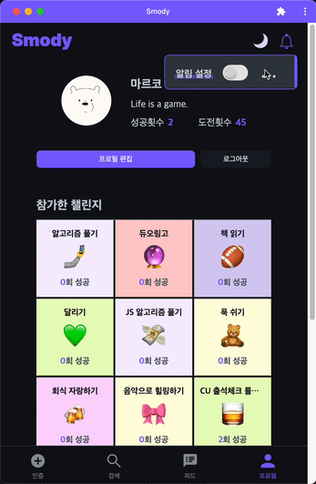
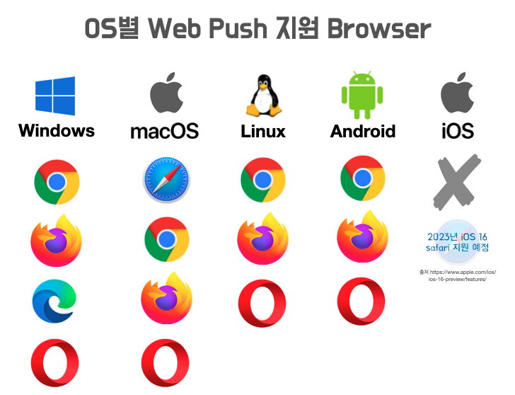
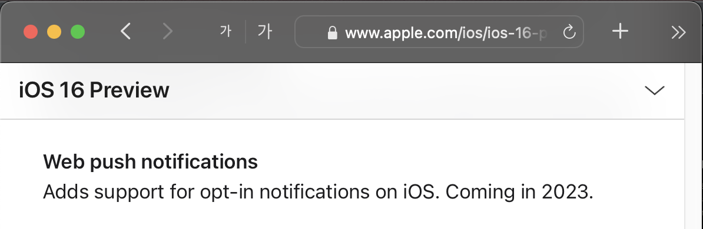
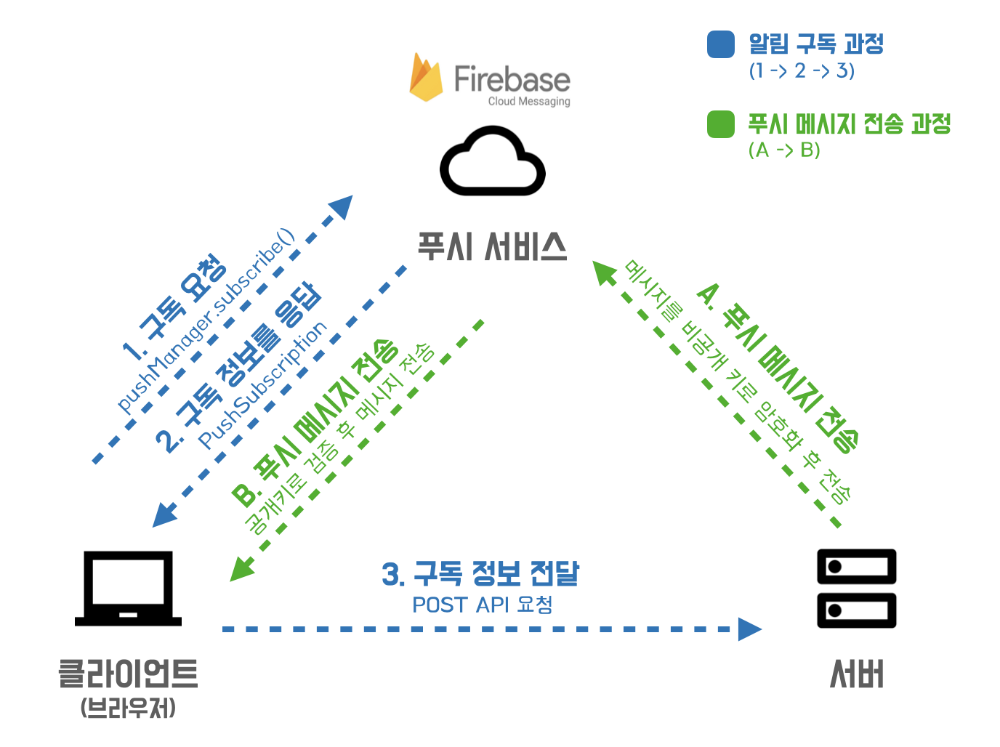
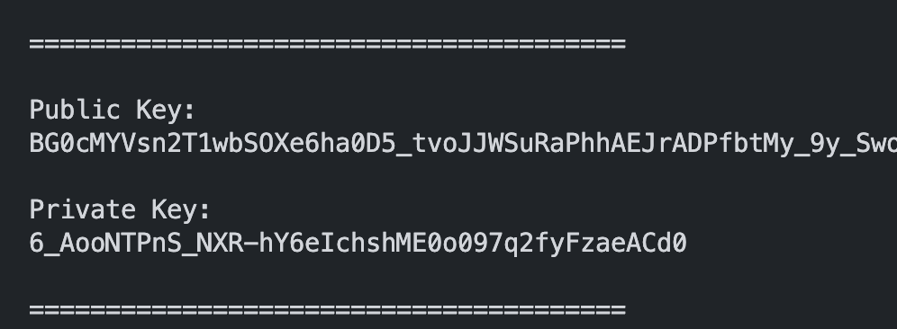
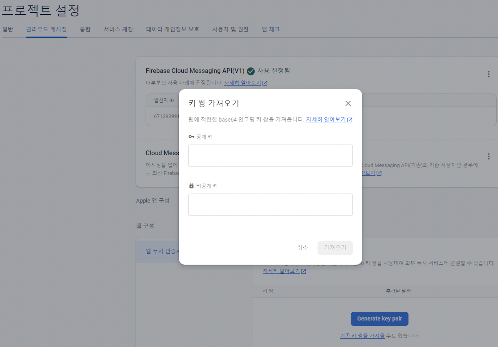
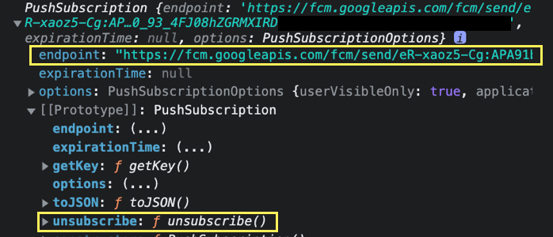

## 1. Web Push Notification이란?

-   웹 푸시 알림은 브라우저를 통해 웹 사이트에서 사용자의 기기로 전송되는 실행 가능한 메시지이다.

    -   알림을 받기 위해 별도의 앱 설치나 이메일 등을 필요로 하지 않고 웹 사이트에서 알림 허용 버튼을 클릭하기만 하면 구독이 가능하여 접근성이 좋다.
    -   알림을 구독한 후에는 웹 사이트가 닫혀 있는 백그라운드에서도 작동하여 알림을 수신할 수 있다.
    -   대부분의 기기, OS, 브라우저에서 웹 푸시 알림 기술을 허용한다.
    -   web-push는 HTTPS에서만 사용 가능하다(개발용인 localhost도 가능)
        

### 1-1. Web Push의 브라우저 호환성

-   Google과 Microsoft는 협력하여 PWA 및 Web Push 생태계를 이끌어 가고 있으나, Apple은 폐쇄적으로 iOS에서 Web Push를 지원하지 않고 있었다. 현재 iOS를 제외하고 대부분의 기기(PC, 모바일)와 크롬 등의 주요 브라우저에서 지원되고 있다.

    

-   그러나 희망적이게도 Apple이 WWDC22에서 Web Push에 대한 지원 계획을 밝히며, Web Push가 점점 웹 기술 표준이 되어가고 있다.

### 1-2. **iOS의 웹 푸시 지원 계획**

-   Apple은 2023년에 iOS의 safari에서도 Web push notifications에 대한 지원을 추가할 계획이라고 한다.
-   계획대로 진행된다면, 기존에 web push가 지원되던 환경인 window, mac, android 외에 iOS까지 추가되어 대부분의 디바이스에서 Web Push 알림 기능이 가능해진다.



-   iOS16 preview 링크 : [https://www.apple.com/ios/ios-16-preview/features/](https://www.apple.com/ios/ios-16-preview/features/)

-   관련 영상 : **WWDC2022 - Meet Web Push for Safari** [https://developer.apple.com/videos/play/wwdc2022/10098/](https://developer.apple.com/videos/play/wwdc2022/10098/)

## 2. Web Push Protocol



웹 푸시 프로토콜은 `클라이언트` 와 `서버` 가 `푸시 서비스` 와 상호작용하기 위해 정해진 규약이다.

-   구성요소
    -   일단, 웹 푸시에는 이처럼 `클라이언트`, `서버` , `푸시 서비스` 라는 구성 요소가 필요하다.
    -   `클라이언트`는 푸시 메시지를 수신하는 대상이며 User Agent 브라우저를 의미한다. 반대로 `서버`는 푸시 메시지를 발송하는 주체이며 애플리케이션과 상호작용하는 서버이다. 이미 기존 서비스에는 이러한 클라이언트와 서버가 있을 것이다. 새롭게 필요한 것은 `푸시 서비스` 인데, 이것은 무엇일까?

### 2-1. 푸시 서비스

-   `푸시 서비스`는 푸시 메시지를 `클라이언트`(브라우저)로 전달하는 기능을 담당한다.
    -   푸시 메시지 전달 기능을 서버에서 직접 구현할 수도 있겠으나, 이러한 기능까지 추가한 서버를 운용하려면 많은 비용이 발생하고 환경이 복잡할 수 있다. 따라서 `푸시 서비스` 인 구글의 `FCM`(Firebase Cloud Messaging)과 애플의 `APNs`(Apple Push Notification Service)에게 푸시 메시지 전달 기능을 분리하여 위임한다.
    -   즉, 구독과 푸시 메시지 전달 기능과 관련해서 `클라이언트` 와 `서버` 사이에서 중간자 역할을 하는 것이 `푸시 서비스` 이다.
    -   참고로 `APNs` 은 iOS 앱에서 발송된 모든 푸시 알림을 중간에서 신뢰도를 검사한 후 각 기기로 푸시 알림을 전달하는 중간자이며 iOS 앱 구현 시 필요하다. `FCM` 은 메시지를 안정적으로 무료 전송할 수 있는 크로스 플랫폼 메시징 솔루션이다. 따라서 이번 프로젝트에서 웹 푸시 구현 시, 푸시 서비스로서 `FCM` 을 사용하였다.
        -   APNs [https://developer.apple.com/documentation/usernotifications/setting_up_a_remote_notification_server/sending_notification_requests_to_apns/](https://developer.apple.com/documentation/usernotifications/setting_up_a_remote_notification_server/sending_notification_requests_to_apns/)
        -   FCM [https://firebase.google.com/docs/cloud-messaging?hl=ko](https://firebase.google.com/docs/cloud-messaging?hl=ko)

### 2-2. 구독 과정

웹 사이트에서 푸시 알림 구독 과정은 다음과 같다.

1. `클라이언트`는 `푸시 서비스`에게 현재 웹 사이트에 대한 구독 요청을 하고, `푸시 서비스`는 이에 대한 응답으로 `클라이언트`에게 해당 브라우저의 웹 사이트 구독 정보를 전달한다.
2. `클라이언트` 는 받은 구독 정보를 `서버` 에게 전달한다. `서버` 는 해당 구독 정보를 사용자 정보와 함께 DB에 저장한다.

-   구독 정보

    -   서버는 구독 정보를 저장해두었다가, 푸시 알림이 필요할 때 꺼내서 사용한다.
    -   구독 정보에는 브라우저를 식별하는 정보가 담겨있다.

        ```tsx
        // 구독정보
        {
          "endpoint": "https://fcm.googleapis.com/fcm/send/eM_5INpg~~",
          "expirationTime": null,
          "keys": {
            "p256dh": "BG8J42gZ5ILUZ8XM1p-dHxJhJI4yg2Wlut~~",
            "auth": "9qoctardEyiiwN~~"
          }
        }
        ```

### 2-3. 구독 취소 과정

구독 취소 과정도 구독 과정과 비슷하나 더 간단하다.

1. `클라이언트` 는 `푸시 서비스` 에게 현재 웹 사이트에 대한 구독 취소를 요청한다.
2. `클라이언트` 는 `서버` 에게 현재 웹 사이트에 대한 구독 정보의 DB 삭제를 요청한다.

### 2-4. 푸시 메시지 전송 과정

1. `서버` 는 푸시 메시지를 저장된 구독 정보를 통해 `푸시 서비스` 에 전달한다.
2. `푸시 서비스` 는 전달받은 푸시 메시지를 해당 `브라우저` 에 전달한다.

## 3. VAPID Key 생성, 등록, 요청

### 3-1. VAPID Key란?

-   브라우저에 내장된 Web Push API는 일관성을 유지하고 안전한 푸시 메시지 전송을 위해 `VAPID(Voluntary Application Server Identification)` 인증 방식을 지원하기 시작했다.
-   VAPID는 `공개키 암호화` 방식의 키 쌍(공개키와 비공개키)으로 검증한다.
    -   `서버`에서 `푸시 서비스`에게 푸시 알림 요청을 보낼 때, 일련의 정보가 담긴 JWT를 `VAPID 비공개키`로 서명(암호화)한 후 함께 전달한다.
    -   `푸시 서비스` 는 `VAPID 공개키`를 사용하여 서버의 푸시 알림 요청에 대한 유효성을 검증한다.
    -   한 쌍의 VAPID 키를 이용한 이러한 과정을 통해 `푸시 서비스` 는 `서버` 를 식별하고, 푸시 메시지 요청의 유효성을 검증한다.
-   VAPID 인증 방식을 통한 푸시 서비스 구독 및 메시지 전송 과정
    1. [구독] `클라이언트` 는 구독할 때 공개키를 `푸시 서비스` 로 전달한다
    2. [구독] `푸시 서비스` 는 클라이언트를 등록한 후 `클라이언트` 에게 구독 정보를 전달한다.
    3. [구독] `클라이언트` 는 푸시 서비스로부터 받은 구독 정보를 `서버` 로 전달한다
    4. [전송] `서버` 는 푸시 메시지를 보낼 때 사용자 구독 정보와 메시지를 비공개키로 암호화한 후 `푸시 서비스` 로 전달한다
    5. [전송] `푸시 서비스`는 공개키를 사용하여 검증한 후 `클라이언트` 로 푸시 메시지를 전달한다

### 3-2. VAPID Key 생성

-   [https://github.com/web-push-libs/web-push](https://github.com/web-push-libs/web-push)

```tsx
npx web-push generate-vapid-keys
```

-   web-push 라이브러리를 받고, 상기 코드를 터미널에 입력하면 아래와 같이 VAPID key 쌍을 생성할 수 있다. 일단 생성된 key들을 메모장에 적어두자.

    

### 3-3. [서버] 서버에 VAPID Key 등록

-   VAPID 공개키와 비공개키를 서버의 default.json파일에 추가한다.

    -   default.json 파일은 애플리케이션 서버 설정 파일이며, 이후 푸시 서비스에게 메시지를 전달할 때 설정 파일에 저장된 VAPID 키 값을 불러온 후 사용한다.

        ```tsx
        {
          "subject": "mailto:smody@abc.com", //  VAPID 인증 데이터에 포함되는 연락처
          "vapidPublic": "", // 생성된 VAPID 공개키
          "vapidPrivate": "" // 생성된 VAPID 비공개키
        }
        ```

### 3-4. 푸시 서비스(Firebase)에 VAPID Key 등록

-   Firebase에서 아까 생성한 VAPID Key를 등록한다.

    -   Firebase에서 새 프로젝트를 만들고 웹 앱을 등록한 후,
        -   [https://console.firebase.google.com/?hl=ko](https://console.firebase.google.com/?hl=ko)
    -   Firebase에 VAPID 공개키와 비공개키를 등록한다.

        -   Firebase 앱의 `프로젝트 설정` > `웹 푸시 인증서` > `기존 키 쌍을 가져올 수도 있습니다` 를 클릭한 후, 아까 서버 환경변수에 저장했던 VAPID 공개키와 비공개키를 입력한다

        

### 3-5. 서버에게 VAPID 공개키 요청

-   클라이언트는 VAPID 키를 아직 알지 못한다. 클라이언트(브라우저)가 푸시 서비스를 구독하려면 `VAPID 공개키`가 필요하다.

    -   클라이언트는 서버에게 공개키 요청 API를 호출한다.

        ```tsx
        const getVapidPublicKey = () => {
            return axios.get('/web-push/public-key')
        }

        const vapid = getVapidPublicKey() // public key 가져오기
        ```

        -   서버는 공개키를 줄 수 있는 GET 메서드 API를 구현해둔다.

## 4. Notifications API

-   [https://developer.mozilla.org/ko/docs/Web/API/Notifications_API](https://developer.mozilla.org/ko/docs/Web/API/Notifications_API)
-   Notifications API는 사용자에게 보이게 될 시스템 알림을 구성하기 위한 기능을 제공한다.

### 4-1. `Notification.requestPermission()` - “알림 권한 승인 요청”

-   [https://developer.mozilla.org/en-US/docs/Web/API/Notification/requestPermission](https://developer.mozilla.org/en-US/docs/Web/API/Notification/requestPermission)
-   일단, 사용자로부터 알림 권한을 획득한 경우에만 알림을 표시할 수 있으므로, 알림 권한 승인을 요청하는 `Notification.requestPermission()`메서드를 사용한다.
    -   참고로, 앞서 언급했듯이 아직 iOS에서는 지원되지 않는다.

### 4-2. **`Notification.permission` - “알림 권한 상태”**

-   [https://developer.mozilla.org/en-US/docs/Web/API/Notification/permission](https://developer.mozilla.org/en-US/docs/Web/API/Notification/permission)
-   알림 권한 상태는 **`Notification.permission` 을 통해 확인할 수 있으며, 다음과 같이 세 가지 중에 하나이다.**
    -   `default` : 알림 권한을 요청하며 사용자에게 팝업 메시지를 표시
    -   `denied` : 사용자가 거부한 상태
    -   `granted` : 사용자가 허가한 상태

```tsx
const subscribe = () => {
    if (!('Notification' in window)) {
        // 브라우저가 Notification API를 지원하는지 확인한다.
        alert('알림을 지원하지 않는 데스크탑 브라우저입니다')
        return
    }

    if (Notification.permission === 'granted') {
        // 이미 알림 권한이 허가됐는지 확인한다.
        // 그렇다면, 알림을 표시한다.
        const notification = new Notification('안녕하세요!')
        return
    }

    // 알림 권한이 거부된 상태는 아니라면
    if (Notification.permission !== 'denied') {
        // 사용자에게 알림 권한 승인을 요청한다
        Notification.requestPermission().then(permission => {
            // 사용자가 승인하면, 알림을 표시한다
            if (permission === 'granted') {
                const notification = new Notification('알림이 구독되었습니다')
            }
        })
    }
}
```

### 4-3. **`ServiceWorkerRegistration.showNotification()` - “휴대폰에서 브라우저 꺼져 있어도 알림이 뜨네”**

-   [https://developer.mozilla.org/en-US/docs/Web/API/ServiceWorkerRegistration/showNotification](https://developer.mozilla.org/en-US/docs/Web/API/ServiceWorkerRegistration/showNotification)
-   `new Notification()` 을 통한 알림은 테스크탑 환경에서는 작동하나, 모바일 기기나 백그라운드에서 환경에서 작동하지 않는다. 왜냐하면, 알림을 보여주는 것은 브라우저가 아닌 OS이기 때문이다. 이러한 문제는 서비스워커에서 **`ServiceWorkerRegistration.showNotification()` 를 사용함으로써, 모바일 및 백그라운드 환경에서도 알림을 생성할 수 있다.**
    -   서비스워커에서 push 이벤트에 대한 핸들러에 **`ServiceWorkerRegistration.showNotification()` 를 추가하여** 알림을 생성한다.
    -   **`showNotification()` 메서드의** 사용 방법은 `new Notification()` 과 비슷하다. 첫 번째 매개변수로 title을 받고, 두 번째 매개변수로 options을 받으며, options에는 body, icon, badge, vibrate 등을 받을 수 있다.
        -   `body`: 알림의 본문
        -   `icon`: 알림에 표시되는 아이콘 이미지
        -   `badge`: 모바일 상단 상태표시줄 등에 표시되는 알림의 뱃지 이미지(이미지는 배경이 투명한 알파 채널이어야 한다)
        -   `image`: 이미지 미리보기나 썸네일 등을 제공하기 위한 이미지
        -   `actions`: 사용자에게 메뉴 선택을 받는 액션
        -   `tag`: 동일한 태그를 가진 알림은 덮어씌워져 한 번만 전달됨
        -   `renotify`: tag 옵션을 지정하더라도 renotify 옵션을 true로 지정하면, 알림(소리, 진동)을 다시 보냄
        -   `vibrate`: 알림 진동 커스텀
    -   참고로 위와 같은 옵션을 이용한 다양한 web push 데모를 아래 웹 사이트에서 실행해 볼 수 있다.
        -   <https://web-push-book.gauntface.com/demos/notification-examples/>

```tsx
// ServiceWorkerRegistration.showNotification() 예시
navigator.serviceWorker.register('sw.js')

function showNotification() {
    Notification.requestPermission(result => {
        if (result === 'granted') {
            navigator.serviceWorker.ready.then(registration => {
                registration.showNotification('Vibration Sample', {
                    body: 'Buzz! Buzz!',
                    icon: '../images/touch/chrome-touch-icon-192x192.png',
                    tag: 'vibration-sample',
                })
            })
        }
    })
}
```

## 5. Push API

-   [https://developer.mozilla.org/ko/docs/Web/API/Push_API](https://developer.mozilla.org/ko/docs/Web/API/Push_API)
-   `Push API` 를 사용하여 `클라이언트` 에서 `푸시 서비스` 로 구독 요청
    -   Push API는 웹 앱이 현재 로드되어 있지 않더라도 서버로부터 메시지를 받을 수 있도록 하는 기능이다. 이는 개발자들이 비동기적으로 사용자에게 새로운 내용을 시기적절하게 전달할 수 있도록 만들어 준다.
-   Push API를 사용하기 위해, `navigator.serviceWorker`를 통해, **`ServiceWorkerRegistration.pushManager`** 에 접근한다.

    ```tsx
    const option = {
        // 푸시 알림을 사용자에게 보여줄지에 대한 여부이며 true로 설정
        userVisibleOnly: true,
        // 서버에서 받은 VAPID 공개키
        applicationServerKey: publicKey,
    }

    navigator.serviceWorker.ready.then(registration => {
        registration.pushManager.subscribe(option).then(subscription => {
            // 구독 요청 성공 후 푸시 서비스에서 PushSubscription 객체를 받는다.
        })
    })
    ```

### 5-1. `PushManager` - “알림 구독할게요”

-   [https://developer.mozilla.org/en-US/docs/Web/API/PushManager](https://developer.mozilla.org/en-US/docs/Web/API/PushManager)
-   이 인터페이스는 `ServiceWorkerRegistration.pushManager` 를 통해 접근할 수 있다.
    -   [https://developer.mozilla.org/en-US/docs/Web/API/ServiceWorkerRegistration/pushManager](https://developer.mozilla.org/en-US/docs/Web/API/ServiceWorkerRegistration/pushManager)
-   `subscribe()`
    -   `pushManager`에는 `푸시 서비스` 에게 직접 구독 요청할 수 있는 `subscribe()` 메서드가 존재한다. `subscribe(option)` 메서드의 첫 번째 인자에 publicKey를 담은 옵션 객체를 전달한다.
    -   구독 요청이 성공하면 `클라이언트`는 응답값으로 “구독 정보” `PushSubscription` 객체를 받는다.

### 5-2.`PushSubscription` - “여기로 알림 보내주시는 곳은 맞는데, 이제 구독 취소할게요”

-   [https://developer.mozilla.org/en-US/docs/Web/API/PushSubscription](https://developer.mozilla.org/en-US/docs/Web/API/PushSubscription)
-   `endpoint`
    -   endpoint는 푸시 서버를 가리키는 커스텀 URL의 형식을 지닌다. 이것은 푸시 서비스에 구독된 특정 서비스 워커 인스턴스로 푸시 메시지를 보낼 때 사용된다. 따라서 타인이 endpoint를 가로 채서 푸시 기능을 남용하지 않도록 endpoint를 숨기는 것이 좋다.
-   `unsubscribe()`
    -   푸시 서비스에게 해당 브라우저의 구독 취소를 요청하는 메서드이다.



```tsx
{
 "endpoint": "https://fcm.googleapis.com/fcm/send/eM_5INpgUqU:APA91bFGn9FTIkMy-9ubS_Nln~~~~~",
  "expirationTime": null,
  "keys": {
    "p256dh": "BG8J42gZ5ILUZ8XM1p-dHxJhJI4yg2WlutpQ1bMPkQzzxstio4S6U1Mu8~~~~",
    "auth": "9qoctardEyiiwNde~~~~"
  }
}
```

### 5-3. `PushEvent` - “알림 왔는데, 브라우저에 보여주세요”

-   [https://developer.mozilla.org/en-US/docs/Web/API/PushEvent](https://developer.mozilla.org/en-US/docs/Web/API/PushEvent)
-   해당 브라우저의 서비스워커에 전달된 푸시 메시지가 있을 경우 발생하는 이벤트이다.
-   서버의 푸시 메시지 전달 요청을 받은 푸시 서비스에서 해당 브라우저에게 푸시 메시지를 전달하여 서비스워커의 push 이벤트를 트리거한다. 이벤트리스너 콜백함수에서 `self.registration.showNotification()` 를 호출하면, 푸시 메시지가 백그라운드 여부 등에 상관 없이 브라우저에 표시된다.

```tsx
// service-worker.js
// 서버에서 보내온 푸시 메시지 data가 event 객체에 담겨온다.
// 아래 코드에서는 서버에서 보내온 푸시 메시지 데이터 {title, body}로 해당 브라우저에 알림 생성한다

self.addEventListener('push', event => {
    const { title, body } = event.data.json()
    const options = {
        body,
        icon: './image/favicon-32x32.png',
        badge: './image/favicon-16x16.png',
    }

    event.waitUntil(self.registration.showNotification(title, options))
})
```

## 6. 종합 및 예시 - 알림 구독 버튼의 콜백 함수(`subscribe()`)

-   앞에서 살펴본 개념을 종합하여, 이번 프로젝트에서 작성했던 알림 구독 관련 코드를 전체적으로 살펴보자. 알림 구독 버튼의 클릭 이벤트 리스너에 부착한 `subscribe()` 콜백 함수부터 시작하여, 해당 콜백 함수 내부에서 분기하여 실행하는 구독 취소 함수( `pushUnsubscribe()` )와 구독 함수(`pushSubscribe()`) 등을 차례로 확인한다.

    ```tsx
    // subscribe() 함수 예시 코드
    import { pushStatus } from 'pwa/pushStatus'

    // 알림 구독 버튼의 클릭 이벤트 리스너 콜백함수인데, 클릭할 때마다 구독 또는 구독 취소 로직을 실행한다.
    const subscribe = () => {
        if (!pushStatus.pushSupport) {
            // Push API 지원 여부 확인
            return
        }
        // 알림 구독 버튼을 누르면, Push API가 지원되는 경우 알림 권한 허용을 요청한다
        Notification.requestPermission().then(permission => {
            pushStatus.notificationPermission = permission

            if (permission !== 'granted') {
                return
            }

            if (pushStatus.pushSubscription) {
                pushUnsubscribe() // 아래에서 설명
            } else {
                pushSubscribe() // 아래에서 설명
            }
        })
    }
    ```

### 6-1. 구독 취소 함수(`pushUnsubscribe()`)

-   클라이언트에 저장된 pushSubscription이 이미 있는 경우, 구독 취소를 요청하기 위해 `pushUnsubscribe()` 함수를 호출한다.

    ```tsx
    import { pushStatus } from 'pwa/pushStatus'

    const pushUnsubscribe = () => {
        if (!pushStatus.pushSubscription) {
            return
        }

        pushStatus.pushSubscription.unsubscribe().then(result => {
            if (result && pushStatus.pushSubscription) {
                postUnsubscribe({
                    endpoint: pushStatus.pushSubscription.endpoint,
                })
                pushStatus.pushSubscription = null
            }
        })
    }

    // 위 코드의 postUnsubscribe(서버 DB에서 해당 endpoint가 있는 구독정보를 삭제한다)
    const postUnsubscribe = async endpoint => {
        return authApiClient.axios.post('/web-push/unsubscribe', { endpoint })
    }
    ```

### 6-2. 구독 함수(`pushSubscribe()`)

-   클라이언트에 저장된 pushSubscription이 없는 경우, 푸시 서비스에 구독 요청을 하고 서버에게 구독 정보를 전달하는 `pushSubscribe()` 함수를 호출한다.
-   전달 예시 코드(`pushSubscribe()` 함수)

    ```tsx
    import { pushStatus } from 'pwa/pushStatus'
    import { urlB64ToUint8Array } from 'utils'

    const pushSubscribe = () => {
        const publicKey = urlB64ToUint8Array(vapid.data.publicKey)
        const option = {
            userVisibleOnly: true,
            applicationServerKey: publicKey,
        }

        navigator.serviceWorker.ready.then(registration => {
            registration.pushManager
                .subscribe(option)
                .then(subscription => {
                    // 구독 요청 성공 시 받는 PushSubscription객체
                    postSubscribe(subscription) // 서버에게 전달
                    // 클라이언트에서 푸시 관련 상태를 별도의 객체(pushStatus)를 만들어 관리했다.
                    pushStatus.pushSubscription = subscription
                })
                .catch(() => {
                    pushStatus.pushSubscription = null
                })
        })
    }
    ```

-   위 코드에서 추가 설명이 필요한 부분

    -   `urlB64ToUint8Array()` 유틸 함수

        -   VAPID 공개키를 `브라우저`에서 `푸시 서비스`로 전달 시, `Uint8Array` 형식으로 변환하여 전달해야 하므로, 다음과 같은 유틸 함수를 사용한다.

            ```tsx
            const urlB64ToUint8Array = (base64String: string) => {
                const padding = '='.repeat((4 - (base64String.length % 4)) % 4)
                const base64 = (base64String + padding)
                    .replace(/-/g, '+')
                    .replace(/_/g, '/')

                const rawData = atob(base64)
                const outputArray = new Uint8Array(rawData.length)

                for (let i = 0; i < rawData.length; i++) {
                    outputArray[i] = rawData.charCodeAt(i)
                }

                return outputArray
            }
            ```

    -   `postSubscribe(subscription)` 함수

        -   `클라이언트` → `서버` 로 “구독 정보” `PushSubscription` 객체를 전달하는 POST 요청

            ```tsx
            const postSubscribe = async (subscription: PushSubscription) => {
                return authApiClient.axios.post(
                    '/web-push/subscribe',
                    subscription
                )
            }
            ```

    -   `pushStatus` 객체

        -   편의를 위해 클라이언트에서 푸시 관련 상태를 별도의 객체(pushStatus)에서 모아 관리하였다.

            ```tsx
            // pushStatus.ts
            type PushStatus = {
                pushSupport: boolean
                pushSubscription: PushSubscription | null
                serviceWorkerRegistration?: ServiceWorkerRegistration
                notificationPermission?: 'granted' | 'default' | 'denied'
            }

            export const isSupported =
                'serviceWorker' in navigator &&
                'Notification' in window &&
                'PushManager' in window

            export const pushStatus: PushStatus = {
                pushSupport: false,
                pushSubscription: null,
                serviceWorkerRegistration: undefined,
                notificationPermission: undefined,
            }

            // updatePushStatus()는 앱 로드 후 serviceWorker 등록 시 호출한다.
            export const updatePushStatus = async (
                registration: ServiceWorkerRegistration
            ) => {
                pushStatus.serviceWorkerRegistration = registration
                pushStatus.pushSupport = !!registration?.pushManager
                pushStatus.pushSubscription = await registration?.pushManager?.getSubscription()
                pushStatus.notificationPermission = Notification.permission
            }
            ```

-   이와 같이 알림 구독이 완료됐다. 푸시 메시지를 받아서 보여주는 것은 앞에서 살펴본 PushEvent와 showNotification 등을 사용하면 된다. 간단히 다시 정리하면 다음과 같다.
    -   `서버`에서 푸시 메시지를 `푸시 서비스`에게 보내면, 그 다음 `푸시 서비스`가 `클라이언트`의 서비스워커에게 푸시 메시지를 전달하고, 서비스워커는 백그라운드에서 `PushEvent`를 감지한 후 `showNotification()` 메서드를 통해 브라우저에 알림을 표시한다.

```tsx
// service-worker.js
// 서버에서 보내온 푸시 메시지 data가 event 객체에 담겨온다.
// 아래 코드에서는 서버에서 보내온 푸시 메시지 데이터 {title, body}로 해당 브라우저에 알림 생성한다

self.addEventListener('push', event => {
    const { title, body } = event.data.json()
    const options = {
        body,
        icon: './image/favicon-32x32.png',
        badge: './image/favicon-16x16.png',
    }

    event.waitUntil(self.registration.showNotification(title, options))
})
```

> **참고자료**
>
> -   <https://www.w3.org/TR/push-api/>
> -   <https://notifications.spec.whatwg.org/>
> -   <https://www.rfc-editor.org/rfc/rfc8292>
> -   <https://developer.mozilla.org/ko/docs/Web/Progressive_web_apps/Re-engageable_Notifications_Push>
> -   SNS 앱 예제로 배우는 프로그레시브 웹 앱
