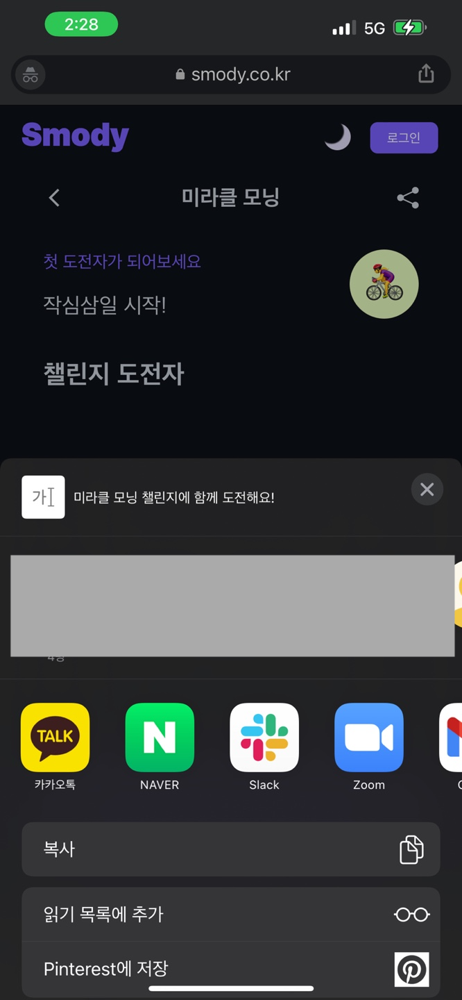
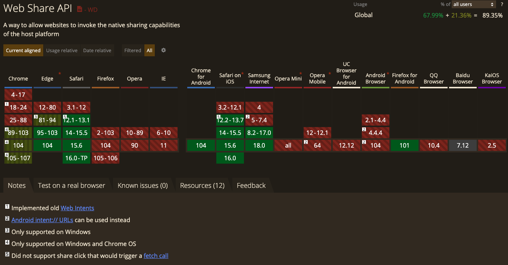

## 1. Web Share API

- [https://w3c.github.io/web-share/](https://w3c.github.io/web-share/)
- 우리가 만든 웹 앱에서 url이나 파일 등을 카카오톡과 같은 다른 앱으로 공유하려면, Web Share API를 사용하면 된다.



- Web Share API에는 `share()` 과 `canShare()`라는 메서드가 있다.

### 1-1. `navigator.canShare()`

- [https://developer.mozilla.org/en-US/docs/Web/API/Navigator/canShare](https://developer.mozilla.org/en-US/docs/Web/API/Navigator/canShare)
- canShare() 또는 canShare(data)와 같이 사용하며, 해당 브라우저에서 해당 data 인자를 공유할 수 있는지 여부를 판단하여 boolean이 반환된다.

### 1-2. `navigator.share()`

- [https://developer.mozilla.org/en-US/docs/Web/API/Navigator/share](https://developer.mozilla.org/en-US/docs/Web/API/Navigator/share)
- navigator.share(data)와 같이 사용한다.
  - 매개변수 data 객체의 속성으로는 `url`, `text`, `title`, `files` 가 가능하다.
    - `files` 는 공유할 파일을 나타내는 객체의 배열이다.
      - [https://developer.mozilla.org/en-US/docs/Web/API/File](https://developer.mozilla.org/en-US/docs/Web/API/File)
      - 일반적으로 pdf, 오디오(mp3, flac…), 이미지(jpeg, png, gif…), 텍스트(html, txt, csv…), 동영상(mp4, mpeg…) 등의 파일을 공유할 수 있다.

## 2. URL 공유

```jsx
const share = shareData => {
  if (!navigator.canShare) {
    alert('Web Share API가 지원되지 않는 브라우저입니다')
    return
  }

  if (navigator.share) {
    navigator.share({
      title: document.title,
      text: '스모디와 작심삼일을 함께 극복해요',
      url: document.location.href,
    })
  } else {
    alert('Web Share API가 지원되지 않는 브라우저입니다')
  }
}
```

## 3. 파일 공유

```jsx
const share = (files) => {
 if(!navigator.canShare) {
    alert('Web Share API가 지원되지 않는 브라우저입니다');
  return;
 }

 if (navigator.canShare({ files })) {
    try {
      await navigator.share({
        files,
        title: 'Smody',
        text: '챌린지 이미지'
     url: document.location.href,
      })
    } catch (error) {
   alert('파일 공유 중 에러가 발생했습니다')
    }
  } else {
    alert('해당 파일을 공유할 수 없는 환경입니다');
  }
};
```

## 4. 브라우저 지원

- Web Share API는 모바일(chrome for android, safari on ios, samsung internet)에서는 어느 정도 지원되고 있다.
- PC에서는 Safari와 Edge에서 사용 가능하다.
  - pc옹 Chrome에서는 Windows와 Chrome OS에서만 지원되며, Mac OS의 Chrome에서는 아직 지원되지 않고 있다(hurry up).



## 5. 나의 PWA를 공유 대상으로 만들기

- 지금까지 나의 웹 앱에서 카카오톡과 같은 다른 앱으로 공유하는 방법을 살펴봤다. 그런데, 반대로 다른 앱에서 나의 웹 앱으로 공유할 수 있도록 만들 수는 없을까?
- Progressive Web App이며 관련 설정이 충족되면 나의 웹 앱도 공유 대상으로 등록할 수 있다고 한다. 아직 하고 있는 프로젝트에서는 웹 앱이 공유 대상이 될 필요까지는 없어서 해보진 않았으나, 아래 링크를 참조하면 어렵지 않게 할수 있을 것 같다.
  - [https://web.dev/web-share-target/](https://web.dev/web-share-target/)
