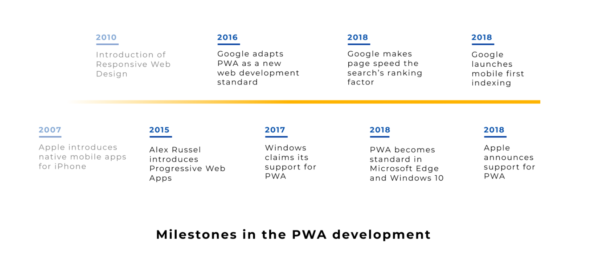
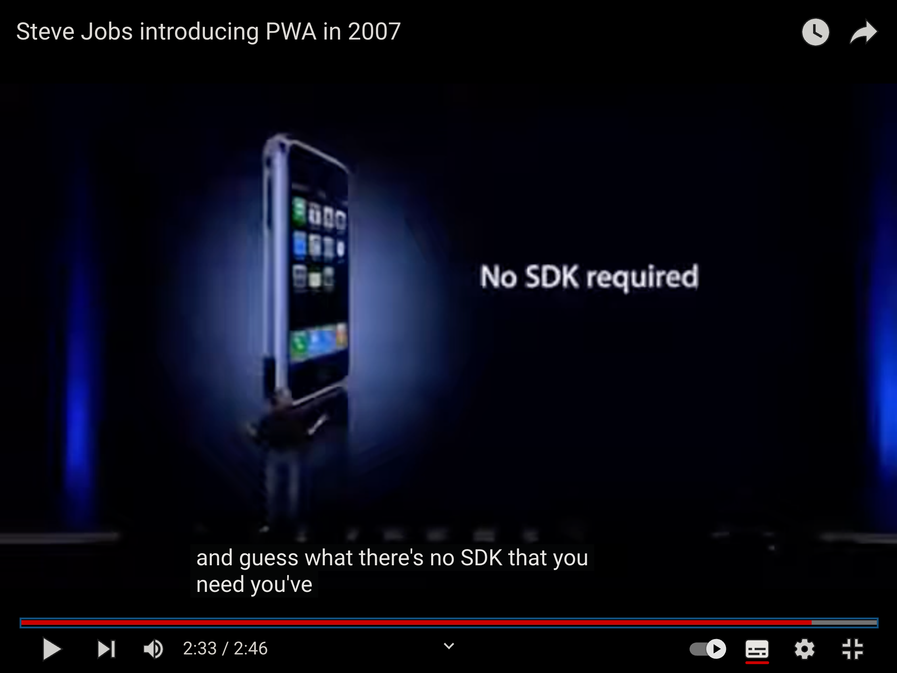
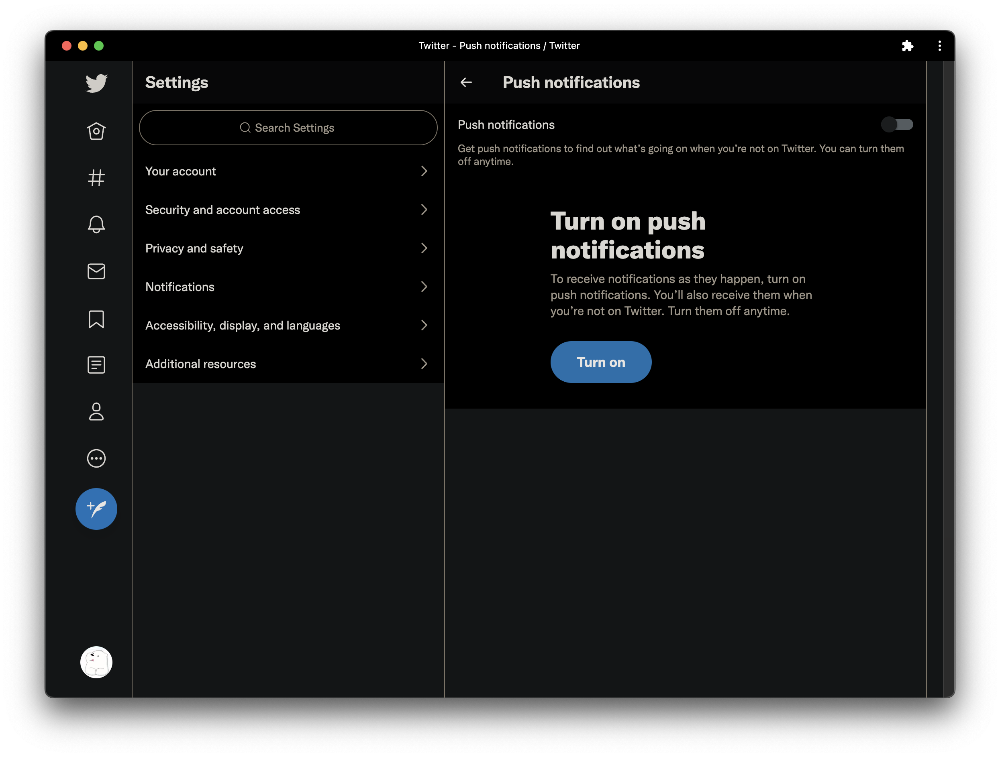
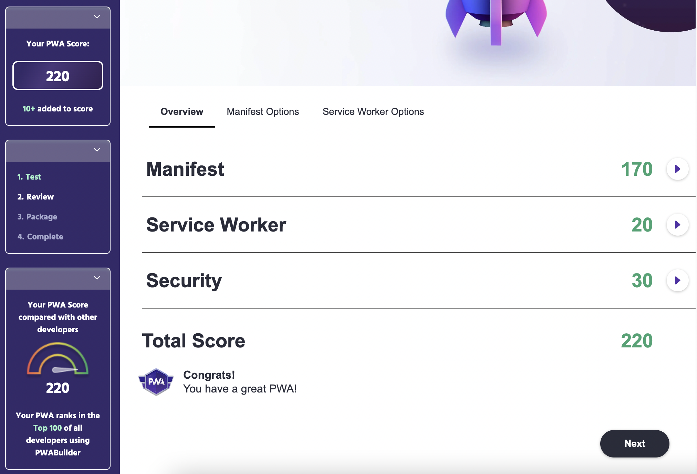

## 1. PWA 개발의 역사

-   프로그레시브 웹 앱(PWA)은 2015년 구글의 크롬 엔지니어인 [Alex Russell이 고안한 개념](https://infrequently.org/2015/06/progressive-apps-escaping-tabs-without-losing-our-soul/)에서 시작하여, Google이 I/O 2016 발표에서 새로운 웹 개발 표준으로 채택했다.
    -   [Progressive Web Apps: Escaping Tabs Without Losing Our Soul](https://papago.naver.net/apis/site/proxy?url=https%3A%2F%2Finfrequently.org%2F2015%2F06%2Fprogressive-apps-escaping-tabs-without-losing-our-soul%2F) - Alex Russell, 2015
-   사실 PWA 아이디어는 이전부터 있어왔는데, 2007년 아이폰 첫 출시 당시 스티브 잡스의 키노트가 그 시작이었다고 보인다. 당시에는 외부 앱들이 아이폰의 인기를 높이는 데 도움이 되는 것이 당연해보였으므로, 스티브 잡스는 개발자들이 웹 표준 기술을 활용하여 아이폰의 앱을 개발하길 원했다. 따라서 스티브 잡스는 SDK가 필요없고 웹 기술만으로 아이폰의 앱을 만들 수 있다고 연설했다.

    

    > “There’s no SDK that you need! You’ve got everything you need if you know how to write apps using the most modern web standards to write amazing apps for the iPhone today.”
    > ”SDK는 필요 없습니다. 최신 웹 표준 기술을 사용하여 아이폰의 앱을 만드는 방법을 알고 있다면, 모든 것이 갖춰졌습니다.”

    -   Steve Jobs, Apple Keynote 2007 -
        **출처 :** [https://youtu.be/QvQ9JNm_qWc](https://youtu.be/QvQ9JNm_qWc)
        >

-   그러나 Apple은 입장을 빠르게 변경하여 2007년 10월에는 iPhone용 SDK를, 그리고 2008년 7월에는 App Store를 발표했다. Apple은 App Store 덕분에 엄청난 수익을 얻어왔으니, 돌이켜 보면 입장 변경의 이유는 꽤 자명해보인다.
-   이후 거의 10년 간 “유니버셜 앱"이라는 개념은 동결되었다. 그 동안 네이티브 앱은 모바일 네트워크를 지배하고, 구글과 애플이 모바일 파워를 구축하는 데 도움을 주었다.
-   PWA가 정식 데뷔를 한 2016년 이후 PWA는 테크놀로지 업계에서 “The Next Big Thing”으로 인식되었다. 2017년에는 경쟁사였던 Google과 Microsoft가 PWA 표준을 개발하는데 파트너십을 맺기로 결정했다. 덕분에 PWA는 크롬 OS, 안드로이드, 윈도우에서 작동하기 시작했고, 이제는 PWA를 Microsoft Store에도 게시할 수 있다.
-   2018년에 Apple도 PWA에 대한 지원을 발표했으나, 핵심 PWA 기술 중 `Service Worker` 등만 지원했을 뿐, `Push 알림` 등의 기술은 아직 도입하지 않는 심각한 한계가 존재한다.
    -   <https://www.apple.com/ios/ios-16-preview/features/>

## 2. PWA의 정의

-   Progressive Web Application은 `웹의 편리한 접근성`과 `네이티브 앱의 기능적인 장점 및 사용성`을 결합한 차세대 웹 앱을 의미한다.
-   더 명확한 정의는?
    -   하지만 명확한 정의는 어렵다. `점진적` 이라는 `Progressive` 의 의미처럼 `사용자의 환경에 알맞게 기능을 제공`하고 `사용하면 할수록 점점 더 개선될 수 있다고` 볼 수 있다 . 즉, 아직 완벽하진 않고 실험적 기능에서 점진적으로 확장 및 개선되고자 하는 비전이 담겨있는 것 같다.
-   어떤 플랫폼에서 작동하는지?
    -   PWA는 일반적인 `웹 환경` 내에서, `서비스 워커` 및 여러 API를 통해 `네이티브 앱에서만 구현할 수 있던 다양한 기능`을 사용자에게 제공한다.

## 3. PWA의 장점

-   사용자
    -   짧은 로딩 시간과 적은 용량
    -   느린 네트워크 환경에서도 우수한 성능
    -   앱과 유사한 사용자 경험(홈 화면에 추가, 오프라인 모드, 푸시 알림)
-   기업
    -   앱 다운로드 및 설치에 플랫폼이 개입하지 않음
    -   더 높은 사용자 참여 및 전환율
    -   검색 노출 향상(구글의 Mobile-First Indexing 및 Pagespeed 알고리즘 덕분)
-   개발자
    -   iOS 및 Android OS 용의 앱을 별도로 개발할 필요 없음
    -   App Store 또는 Google Play에서 유료 개발자 계정이 필요 없음
    -   앱 업데이트를 독립적으로 가능

## 4. PWA가 되기 위한 핵심 조건 3가지

1. HTTPS
    - 기존의 웹 페이지보다 더욱 강력하고 민감한 새 기능을 제공하기 때문에 `보안` 문제가 선결되어야 한다. 따라서 PWA는 HTTPS 환경(또는 로컬호스트)에서만 작동하도록 제한되어 있다.
2. Web App Manifest
    - 홈 화면에 `설치`하기 위해서는 관련 기본 정보가 담긴 웹 앱 매니페스트 파일이 필요하다.
3. Service Worker
    - 오프라인 환경에서의 웹페이지 접근, 백그라운드 동기화, 푸시 알림 등 다양한 기능은 서비스 워커를 통해 제공된다.

## 5. PWA 도입 사례

### 5-1. Twitter Lite

-   Twitter Lite는 [mobile.twitter.com](http://mobile.twitter.com/) 에서 사용할 수 있는 프로그레시브 웹 앱이다. Twitter Lite는 빠르고, 데이터를 덜 사용하며, 저장공간(기존 앱에 비해 3% 미만)은 덜 차지하며, 최신 브라우저에서 푸시 알림과 오프라인 사용을 지원한다. 이를 통해 사용자 경험을 크게 개선하고 재참여율을 높였다고 한다.

    -   Twitter Lite는 기본 앱과 동일하게 작동하고 사용자의 브라우저가 닫혀 있어도 도착하는 웹 푸시 알림을 구현했다.

        > Twitter Lite 도입 후 성과 : 세션당 페이지 수 65% 증가, 보낸 트윗 75% 증가, 이탈률 20% 감소

-   관련 자료
    -   **[Twitter Lite PWA Significantly Increases Engagement and Reduces Data Usage](https://web.dev/twitter/)**
    -   **[How we built Twitter Lite](https://blog.twitter.com/engineering/en_us/topics/open-source/2017/how-we-built-twitter-lite)**
    -   **[Twitter Lite and High Performance React Progressive Web Apps at Scale](https://medium.com/@paularmstrong/twitter-lite-and-high-performance-react-progressive-web-apps-at-scale-d28a00e780a3)**

### 5-2. 기타 사례 확인

-   [https://www.pwastats.com](https://www.pwastats.com/)
-   [https://appsco.pe/](https://appsco.pe/toplist)

## 6. iOS의 웹 푸시 지원 계획

-   Apple은 2023년에 iOS의 safari에서도 Web push notifications에 대한 지원을 추가할 계획이라고 한다.
-   계획대로 진행된다면, 기존에 web push가 지원되던 환경인 window, mac, android 외에 iOS까지 추가되어 대부분의 디바이스에서 알림 기능이 가능해진다. 이후 PWA에 대한 수요가 더 높아질 것으로 기대된다.
-   관련 영상 : **WWDC2022 - Meet Web Push for Safari** [https://developer.apple.com/videos/play/wwdc2022/10098/](https://developer.apple.com/videos/play/wwdc2022/10098/)

iOS16 preview 링크 : [https://www.apple.com/ios/ios-16-preview/features/](https://www.apple.com/ios/ios-16-preview/features/)

## 7. PWA 관련 포스팅

-   이번에 우아한테크코스 팀 프로젝트에서 스모디(<https://www.smody.co.kr>)를 개발하면서 학습하고 적용한 PWA 관련 내용을 차례로 포스팅하려고 한다. <https://www.pwabuilder.com/> 에서 스모디의 PWA 점수를 측정한 결과, 220점으로 측정되었다. 해당 웹 사이트에서 중간 중간 PWA 점수를 측정하면서, 미비한 부분을 채워나가면 PWA 개발에 도움이 될 것 같다.

### 7-1. PWA 포스팅 목차

-   [프로그레시브 웹 앱이란?](https://wonsss.github.io/PWA/what-is-pwa/)
-   [설치 가능한 웹 앱을 구성하기 위한 Manifest 설정하기](https://wonsss.github.io/PWA/web-app-manifest/)
-   [PWA의 InApp 설치 버튼 만들기(BeforeInstallPromptEvent)](https://wonsss.github.io/PWA/before-install-prompt/)
-   [PWA의 핵심, 서비스 워커란?](https://wonsss.github.io/PWA/service-worker/)
-   [서비스워커와 클라이언트 간 통신 방법](https://wonsss.github.io/PWA/communicate-with-serviceworker/)
-   [Web Share API로 ‘다른 앱으로 공유’ 기능 추가](https://wonsss.github.io/PWA/web-share-api/)
-   [오프라인 환경에서 웹 페이지 사용(캐시 스토리지, IndexedDB)](https://wonsss.github.io/PWA/offline-support/)
-   [Web Push를 통하여 백그라운드에서도 사용자에게 알림 보내기(Push API, Notifications API, ServiceWorker, FCM)](https://wonsss.github.io/PWA/web-push-notification/)

> 참고
>
> -   MDN
> -   [https://www.divante.com/pwabook/chapter/02-the-history-of-pwas](https://www.divante.com/pwabook/chapter/02-the-history-of-pwas)
> -   SNS 앱 예제로 배우는 프로그레시브 웹 앱
