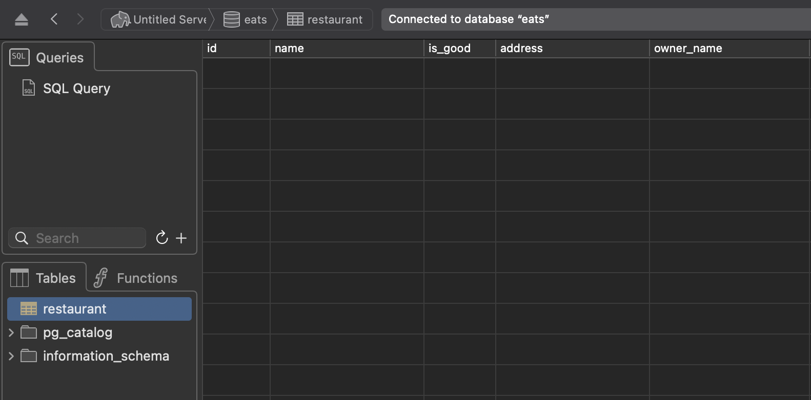

## 1. Backend(NestJs) Setup

- nest 애플리케이션 생성하기(터미널)

```tsx
nest g application
```

- 프로젝트 설치 및 실행

```tsx
npm install
npm run start:dev
```

- github 저장소 생성 및 연결

<https://github.com/new> 에서 저장소 생성

```tsx
git init
git remote add origin 저장소주소
```

- gitignore 익스텐션(vscode)
  - VS Marketplace 링크: <https://marketplace.visualstudio.com/items?itemName=codezombiech.gitignore>
  - cmd + shift + p  → add gitignore 후 작업하는 언어용 gitignore 템플릿 사용 → node

## 2. GraphQL API

### 2.0. Apollo Server Setup

- GraphQL, Apollo, ApolloServer 설치

<https://docs.nestjs.com/graphql/quick-start> 참고

```tsx
# For Express and Apollo (default)
$ npm i @nestjs/graphql @nestjs/apollo @apollo/server graphql
```

- main.ts는 해당 애플리케이션을 실행하기 위한 것이다. app.module은 main.ts로 import되는 유일한 모듈이다.
  - NestFactory가 AppModule로부터 애플리케이션을 생성한다.
  - 즉, 결국 모든 것들은 AppModule로 import된다.

패키지가 설치되면, `GraphQLModule` 을 import하고 `forRoot()` static 메서드로 설정할 수 있다.

```tsx
import { Module } from '@nestjs/common';
import { GraphQLModule } from '@nestjs/graphql';
import { ApolloDriver, ApolloDriverConfig } from '@nestjs/apollo';

@Module({
  imports: [
    GraphQLModule.forRoot<ApolloDriverConfig>({
      driver: ApolloDriver,
    }),
  ],
})
export class AppModule {}
```

`forRoot()` 메서드는 인자에 옵션으로서 객체를 받는다.

### Code First

code first 방법에서는 데코레이터와 타입스크립트 클래스를 GraphQL 스키마를 생성하는 데 사용한다.

```tsx
GraphQLModule.forRoot<ApolloDriverConfig>({
  driver: ApolloDriver,
  autoSchemaFile: join(process.cwd(), 'src/schema.gql'),
}),
```

`autoShcemeFile` 속성 값은 자동 생성된 스키마가 만들어지는 경로이다. 또는, 스키마를 메모리에서 바로 생성할 수 있는데, 그렇게 하려면 `autoShcemeFile` 속성 값을 true로 설정한다.

```tsx
GraphQLModule.forRoot<ApolloDriverConfig>({
  driver: ApolloDriver,
  autoSchemaFile: true,
}),
```

기본적으로, 생성된 스키마 내 타입들은 포함된 모듈에서 정의된 순서대로 정렬되어 있다. 스키마를 사전식으로 정렬하려면, `sortScheme` 속성을 true 로 설정한다.

```tsx
GraphQLModule.forRoot<ApolloDriverConfig>({
  driver: ApolloDriver,
  autoSchemaFile: join(process.cwd(), 'src/schema.gql'),
  sortSchema: true,
}),
```

### Scheme first

scheme first 방법을 사용하려면, `typePaths` 속성을 옵션 객체에 추가함으로써 시작한다. `typePaths` 속성은 `GraphQLModule` 이 GraphQL SDL 스키마 정의 파일을 찾아야 하는 위치를 나타낸다. 이 파일들은 메모리에서 결합되며, 이는 스키마를 여러 파일로 쪼개고 이들을 각자의 resolver 가까이에 위치하게 하는 것을 가능하게 한다.

```tsx
GraphQLModule.forRoot<ApolloDriverConfig>({
  driver: ApolloDriver,
  typePaths: ['./**/*.graphql'],
}),
```

GraphQL SDL 타입에 대응하는 타입스크립트 정의(클래스와 인터페이스)가 필요하다. 해당 타입스크립트 정의를 직접 작성하는 것은 지루하고 군더더기의 일이다. 이 문제르 해결하기 위해, @nestjs/graphql 패키지는 추상구문트리(AST)로부터 자동으로 타입스크립트 정의를 생성한다. 이 기능을 활성화려면, `definitions` 옵션 속성을 추가한다.

```tsx
GraphQLModule.forRoot<ApolloDriverConfig>({
  driver: ApolloDriver,
  typePaths: ['./**/*.graphql'],
  definitions: {
    path: join(process.cwd(), 'src/graphql.ts'),
  },
}),
```

### 2.1. 첫 resolver(예시)

- 아래의 명령어로 nestjs 모듈을 생성한다.

```tsx
nest g mo restaurants
```

- resolver 파일을 만들어 module의 providers에 연결한다.

```tsx
// src/restaurants/restaurants.module.ts

import { Module } from '@nestjs/common';
import { RestaurantsResolver } from './restaurants.resolver';

@Module({
  providers: [RestaurantsResolver],
})
export class RestaurantsModule {}
```

- resolver는 `@Resolver()` 데코레이터가 달려있는 간단한 class이다.

```tsx
// src/restaurants/restaurants.module.ts

import { Resolver, Query } from '@nestjs/graphql';

@Resolver()
export class RestaurantsResolver {
  @Query(() => Boolean)
  isPizzaGood(): boolean {
    return true;
  }
}
```

- 위와 같은 resolver 파일의 타입스크립트를 통해 아래와 같은 graphQL 스키마 파일이 자동 생성된다.

```tsx
// src/schema.gql

# ------------------------------------------------------
# THIS FILE WAS AUTOMATICALLY GENERATED (DO NOT MODIFY)
# ------------------------------------------------------

type Query {
  isPizzaGood: Boolean!
}
```

- schema.gql 파일이 자동생성되지 않고, 메모리 내에서만 생성되도록 하려면 `autoSchemeFile` 속성을 true 로 설정한다.

```tsx
import { Module } from '@nestjs/common';
import { AppController } from './app.controller';
import { AppService } from './app.service';
import { GraphQLModule } from '@nestjs/graphql';
import { ApolloDriver, ApolloDriverConfig } from '@nestjs/apollo';
import { RestaurantsModule } from './restaurants/restaurants.module';

@Module({
  imports: [
    GraphQLModule.forRoot<ApolloDriverConfig>({
      driver: ApolloDriver,
      autoSchemaFile: true,
      sortSchema: true,
    }),
    RestaurantsModule,
  ],
  controllers: [AppController],
  providers: [AppService],
})
export class AppModule {}
```

- npm run start:dev 를 통해 서버 실행 후, <http://127.0.0.1:3000/graphql> 접속하면 플레이그라운드가 나온다.

### 2.2.  object type

- GraphQL 스키마의에서 대부분의 정의는 object type이다. object type은 애플리케이션 클라이언트가 상호 작용해야 하는 도메인 객체를 나타낸다.
- 예를 들어, author과 post의 리스트를 가져와야 하는 API가 있다고 했을 때, 이 기능을 지원할 Author 타입과 Post 타입을 정의해야 한다.
- scheme first 방법을 사용하면, SDL로 스키마를 아래와 같이 정의한다.

```tsx
type Author {
  id: Int!
  firstName: String
  lastName: String
  posts: [Post!]!
}
```

- 그리고 code first 방법을 사용하면,TypeScript 클래스와 데코레이터를 사용함으로써 해당 클래스 사용하여 스키마를 정의하고 TypeScript 데코레이터를 사용함으로써 해당 클래스 필드 위에 주석을 단다. 위에서 본 SDL과 동일한 기능을 code first 방식으로 작성하면 아래와 같다.

```tsx
// authors/models/author.model.ts
import { Field, Int, ObjectType } from '@nestjs/graphql';
import { Post } from './post';

@ObjectType()
export class Author {
  @Field(type => Int)
  id: number;

  @Field({ nullable: true })
  firstName?: string;

  @Field({ nullable: true })
  lastName?: string;

  @Field(type => [Post])
  posts: Post[];
}
```

- `@Field()` 데코레이터는 옵셔널 타입 함수 및 선택적으로 옵션 객체를 받는다.
- 타입 함수는 타입스크립트 타입 시스템과 GraphQL 타입 시스템 사이에 잠재적인 모호성이 있을 때 필요한 것이다. 특히, string이나 boolean 같은 타입에 필요하기보다는, number 타입에서 필요하다(number 타입은 GraphQL에서 Int 나 Float 타입으로 매핑되어야 하기 때문). 타입 함수는 단순히 원하는 GraphQL 타입을 반환해야 한다.
- 옵션 객체는 다음과 같은 key/value 쌍을 가질 수 있다.
  - `nullable` : 필드가 nullable인지 여부 명세(SDL에서는 각각의 필드는 기본적으로 non-nullable 이다), boolean
  - `description` : 필드 설명 설정, string
  - `deprecationReason` : 해당 필드가 deprecated 되었음을 표시, string

```tsx
// 예시
@Field({ description: `Book title`, deprecationReason: 'Not useful in v2 schema' })
title: string;
```

- 필드가 배열일 경우, Field() 데코레이터의 타입 함수 내에서 배열 타입을 아래와 같이 직접 명시해야 한다.

```tsx
@Field(type => [Post])
posts: Post[];
```

- 배열의 아이템이 nullable임을 정의하려면, `nullable` 속성에 `items` 를 아래와 같이 설정한다.

```tsx
@Field(type => [Post], { nullable: 'items' })
posts: Post[];
```

- 만약 배열과 아이템 모두 nullable이라면, `nullable` 을 `itemsAndList` 로 설정한다.

- 파일명의 entity는 데이터베이스에 있는 모델 같은 의미를 나타내며, model로 대체해도 의미가 통한다.

```tsx
//src/restaurants/entities/restaurant.entity.ts

import { Field, ObjectType } from '@nestjs/graphql';

@ObjectType()
export class Restaurant {
  @Field(() => String)
  name: string;

  @Field(() => Boolean, { nullable: true })
  isGood?: boolean;
}
```

```tsx
// src/restaurants/restaurants.resolver.ts
import { Resolver, Query } from '@nestjs/graphql';
import { Restaurant } from './entities/restaurant.entity';

@Resolver()
export class RestaurantsResolver {
  @Query(() => Restaurant)
  myRestaurant() {
    return true;
  }
}
```

- 타입함수에서 type이나 returns 같이 의미 없는 인자를 사용하고 싶을 때, 이들을 결국 사용하지 않았다고 타입스크립트가 경고가 띄우는 것을 무시하려면, eslint rule을 다음과 같이 변경한다.

```tsx
'@typescript-eslint/no-unused-vars': 'off'
```

### 2.3. Arguments

Args 데코레이터 옵션

- 요청으로부터 사용하려는 인자를 추출하려면 메서드 핸들러에서  `@Args()` 데코레이터를 사용한다.

```tsx
@Args('id') id: string
```

- 만약 number 타입을 사용한다면, 조금 더 신경을 써야 한다. 타입스크립트의 number 타입은 GraphQL에게 해당 타입이 결국 Int와 Float 중 무엇인지에 대해 충분한 정보를 주지 못한다. 그래서 명시적으로 타입을 넘겨야 한다. 이렇게 하기 위해, `Args()` 데코레이터에 인자 옵션이 담긴 두 번째 인자를 넘긴다.

```tsx
@Args('id', { type: () => Int }) id: number
```

- 옵션 객체에는 다음과 같은 key/value 쌍이 올 수 있다.
  - `type` : GraphQL 타입을 반환하는 함수
  - `defaultValue` : 기본 값, `any`
  - `description`:  설명 metadata; `string`
  - `deprecationReason`: 필드를 deprecate시키고 이유에 대한 메타 데이터를 제공; `string`
  - `nullable`: 필드가 nullable 인지 여부

```tsx
import { Resolver, Query, Args } from '@nestjs/graphql';
import { Restaurant } from './entities/restaurant.entity';

@Resolver((of) => Restaurant)
export class RestaurantsResolver {
  @Query((returns) => [Restaurant])
  restaurants(@Args('veganOnly') veganOnly: boolean): Restaurant[] {
    return [];
  }
}
```

### 2.4. InputTypes and ArgumentTypes

- `@InputType`은 graphQL에 argument로 전달할 수 있는 특수한 유형의 객체이다. Mutation이 객체를 argument로 받고 싶은 경우 사용한다. InputType을 사용하면 다음과 같이 요청해야 한다.

```tsx
// src/restaurants/dtos/create-restaurant.dto.ts

import { InputType, Field } from '@nestjs/graphql';

@InputType()  // 여기만 차이
export class CreateRestaurantDto {
  @Field((type) => String)
  name: string;

  @Field((type) => Boolean, { nullable: true })
  isGood?: boolean;

  @Field((type) => String)
  address: string;

  @Field((type) => String)
  ownerName: string;
}
```

```tsx
@Mutation((returns) => Boolean)
  createRestaurant(
    @Args('createResaurantDto') createRestaurantDto: CreateRestaurantDto,
  ): boolean {
    return true;
  }
```

```tsx
// 클라이언트에서 뮤테이션 요청

mutation {
 createStore(newStoreInfo : {
  name: "",
  isVegan : true,
  address: "",
  ownerName:""
})
```

- `@ArgsType`을 사용하면, 다음과 같이 작성하고 클라이언트에서 요청하면 된다.

```tsx
// src/restaurants/dtos/create-restaurant.dto.ts

import { ArgsType, Field } from '@nestjs/graphql';

@ArgsType()  // 여기만 차이
export class CreateRestaurantDto {
  @Field((type) => String)
  name: string;

  @Field((type) => Boolean, { nullable: true })
  isGood?: boolean;

  @Field((type) => String)
  address: string;

  @Field((type) => String)
  ownerName: string;
}
```

```tsx
@Mutation((returns) => Boolean)
  createRestaurant(@Args() createRestaurantDto: CreateRestaurantDto): boolean {
    return true;
}
```

```tsx
// 클라이언트에서 뮤테이션 요청

mutation {
 createStore(name: "name", isVegan: true, ownerName : "with", address:"안양")
}
```

### 2.5. ArgsType 유효성 검사

- class-validator , class-transformer 설치

```bash
npm i class-validator class-transformer
```

- dto 클래스에서 유효성 검사 데코레이터 추가

```tsx
// src/restaurants/dtos/create-restaurant.dto.ts

import { ArgsType, Field } from '@nestjs/graphql';
import { IsBoolean, IsString, Length } from 'class-validator';

@ArgsType()
export class CreateRestaurantDto {
  @Field((type) => String)
  @IsString()
  @Length(5, 10)
  name: string;

  @Field((type) => Boolean, { nullable: true })
  @IsBoolean()
  isGood?: boolean;

  @Field((type) => String)
  @IsString()
  address: string;

  @Field((type) => String)
  @IsString()
  ownerName: string;
}
```

- validation pipe 추가

```tsx
// src/main.ts

import { NestFactory } from '@nestjs/core';
import { AppModule } from './app.module';
import { ValidationPipe } from '@nestjs/common';

async function bootstrap() {
  const app = await NestFactory.create(AppModule);
  app.useGlobalPipes(new ValidationPipe());
  await app.listen(3000);
}
bootstrap();
```

- 플레이그라운드에서 뮤테이션 요청
  - 위에서 name 길이를 5글자 이상 10글자 이하로 유효성 검사를 걸었으므로, 아래와 같이 요청하면 400 에러 발생 확인

## 3. Database 설정

### 3.0. TypeORM과 PostgreSQL

- TypeORM을 쓰면 SQL문을 쓰는 대신에 타입스크립트 코드를 써서 데이터베이스와 상호작용을 할 수 있다.
  - <https://typeorm.io/#/>
- 이 강의에서는 PostgreSQL을 사용한다. TypeORM을 설치하기 전에 PostgreSQL을 설치한다.
  - <https://postgresapp.com/>
- MacOS라면 PostgreSQL의 GUI인 Postico도 설치하는 것을 권장한다. Postico 앱을 실행하면 구매 버튼이 있지만, 구매하지 않아도 무료로 평생 사용 가능하니 구입은 선택사항이다.
  - <https://eggerapps.at/postico2/>
- windowOS라면 PostgreSQL의 GUI로서 pgAdmin을 설치한다.
  - <https://www.pgadmin.org/>
- Postico에서 데이터베이스를 새로 만들고, Postgres에서 새로 만든 해당 데이터베이스를 더블 클릭하면 터미널에 연결된다. 터미널에서 `\du;` 을 입력하여 데이터베이스의 모든 사용자를 확인한다.
  - 유저의 패스워드를 변경하려면, `ALTER USER 유저명 WITH PASSWORD 변경할비밀번호`  명령어를 입력한다. 나중에 데이터베이스 연결할 때 필요하므로 유저명과 비밀번호를 기억한다.

### 3.3. TypeORM 설치

- TypeORM
  - <https://github.com/typeorm/typeorm>
  - TypeORM은 TypeScript 및 JavaScript를 위한 객체-관계 매핑(ORM) 라이브러리이다.
  - ORM은 데이터베이스와 상호작용하는 애플리케이션을 개발할 때 개발자들이 SQL 쿼리를 직접 작성하는 대신 객체 지향적인 접근 방식으로 데이터를 다룰 수 있게 도와준다.
  - TypeORM은 다양한 데이터베이스 시스템과 호환되며, 데이터베이스 스키마를 TypeScript 또는 JavaScript 클래스로 정의할 수 있다. 이를 통해 개발자는 데이터베이스 테이블과 관계를 객체로 표현할 수 있고, 이를 사용하여 데이터베이스에 쿼리를 전달하고 결과를 받아올 수 있다.
  - TypeORM은 데이터베이스의 CRUD (Create, Read, Update, Delete) 작업을 지원하며, 트랜잭션, 쿼리 빌더, 마이그레이션 등 다양한 기능을 제공한다. 또한, 강력한 쿼리 언어와 캐싱 기능, 지연 로딩 및 예외 처리 등을 제공하여 개발자들이 효율적이고 안정적인 데이터베이스 애플리케이션을 개발할 수 있도록 도와준다.
  - TypeORM은 사용하기 쉬운 문법과 풍부한 기능 세트를 제공하여 개발자들이 데이터베이스 관련 작업에 집중할 수 있도록 도움을 준다. 또한, 다양한 환경에서 사용할 수 있는 유연성과 확장성을 제공하여 대규모 애플리케이션에서도 효과적으로 사용할 수 있다.

    [data:image/svg+xml,%3csvg%20xmlns=%27http://www.w3.org/2000/svg%27%20version=%271.1%27%20width=%2738%27%20height=%2738%27/%3e](data:image/svg+xml,%3csvg%20xmlns=%27http://www.w3.org/2000/svg%27%20version=%271.1%27%20width=%2738%27%20height=%2738%27/%3e)

- NestJS는 데이터베이스에 구애받지 않으므로 모든 SQL 또는 NoSQL 데이터베이스와 쉽게 통합할 수 있다.
  - <https://docs.nestjs.com/techniques/database>
- TypeORM Integration
  - <https://docs.nestjs.com/techniques/database#typeorm-integration>
  - SQL 및 NoSQL 데이터베이스와의 통합을 위해 Nest는 `@nestjs/typeorm` 패키지를 제공한다.
  - Nestjs는 TypeORM 통합환경이 잘 갖추어져 있다. NestJS에서 다른 ORM으로 sequelize를 사용할 수도 있고, monogdb를 쓴다면 mongoose를 써도 된다. 하지만 TypeORM은 타입스크립트 기반이어서 타입스크립트로 작업한다면 더 낫다.
- 설치

```bash
npm install --save @nestjs/typeorm typeorm pg

// pg는 postgres
```

- TypeORM 설정
  - <https://github.com/typeorm/typeorm#creating-a-new-datasource>

```tsx
// app.module.ts 에서 @Module imports 
import { TypeOrmModule } from '@nestjs/typeorm';
import { Module } from '@nestjs/common';
import { AppController } from './app.controller';
import { AppService } from './app.service';

@Module({
  imports: [
    TypeOrmModule.forRoot({
      type: 'postgres',
      host: 'localhost',
      port: 5432,
      username: 'marco',
      password: '12345',
      database: 'eats',
      synchronize: true,
      logging: true,
    }),
 ],
  controllers: [AppController],
  providers: [AppService],
})
export class AppModule {}
```

- `synchronize: true`
  - `synchronize: true` 는 TypeORM이 데이터베이스에 연결할 때, 데이터베이스를 해당 모듈의 현재 상태로 마이그레이션한다는 의미이다.
  - production에서는 `synchronize: true` 로 사용하면 안된다. `synchronize: true` 를 production에서 사용하면 production 데이터가 손실될 수 있기 때문이다.

### PostgreSQL에서 쓰는 네이밍을 snake_case로 자동 변경

PostgreSQL 에서 테이블이나 컬럼 이름은 snake_case 를 많이 쓰는데, TypeScript 에서는 클래스 이름은 PascalCase 를 프로퍼티 이름은 camelCase 를 쓰는데 번거롭지 않게 자동 변환하면 좋다.

`typeorm-naming-strategies` 라는 패키지를 설치하고,

```bash
npm i typeorm-naming-strategies
```

SnakeNamingStrategy 를 import 하여 TypeORM configuration 옵션에 넣어주면, PostgreSQL 에서 쓰는 네이밍을 snake_case 로 알아서 바꿔준다.

```jsx
import { SnakeNamingStrategy } from 'typeorm-naming-strategies';

TypeOrmModule.forRoot({
 // ...
 namingStrategy: new SnakeNamingStrategy(),
})
```

### 3.4. ConfigService

- 응용 프로그램은 종종 다른 환경에서 실행되는데, 환경에 따라 다른 환경 설정을 사용해야 한다.
- 환경 변수 파일(.env)을 Node.js에서 이용하는 가장 흔한 방법은 `dotenv` 패키지를 사용하는 것이다. 이것을 사용할 수도 있지만, NestJS에서는 NestJS의 설정 방법을 이용해본다.
- NestJS는 ConfigModule을 갖고 있다. NestJS에서 이 기술을 사용하는 좋은 방법은 적절한 .env 파일을 로드하는 ConfigService를 노출하는 ConfigModule을 만드는 것이다. @nestjs/config 패키지를 설치한다.
  - <https://docs.nestjs.com/techniques/configuration>
  - 참고로 `@nestjs/config` 패키지는 내부적으로 `dotenv` 를 사용한다.

```bash
ConfigModule.forRoot({ isGlobal: true }), 
// isGlobal은 이 앱 어디서나 config 모듈에 접근할 수 있다는 설정이다.
```

```bash
npm i --save @nestjs/config 
```

### 3.5. ConfigService 설정(cross-env)

- cross-env
  - <https://www.npmjs.com/package/cross-env>
  - cross-env는 JavaScript 및 Node.js 프로젝트에서 환경 변수를 설정하기 위한 유틸리티이다. Node.js 애플리케이션은 실행되는 환경에 따라 다른 환경 변수 값을 필요로 할 수 있다. cross-env는 이러한 환경 변수를 설정하고 관리하기 위해 사용된다.
  - cross-env를 사용하면 개발자는 각 운영 체제에 맞는 방식으로 환경 변수를 설정할 수 있다. 일반적으로 운영 체제마다 환경 변수를 설정하는 방법이 다르기 때문에 cross-env는 이를 추상화하여 개발자가 명령어를 작성할 때 운영 체제에 관계없이 일관된 방식으로 환경 변수를 설정할 수 있도록 도와준다.
  - 예를 들어, 개발 중에는 데이터베이스 연결 문자열이 개발 서버의 주소를 가리키고, 프로덕션 환경에서는 실제 서버의 주소를 가리킬 수 있다. cross-env를 사용하면 개발 환경과 프로덕션 환경 간의 환경 변수 설정을 간편하게 변경할 수 있다.
  - 간단히 말해, cross-env는 Node.js 프로젝트에서 운영 체제에 독립적인 방식으로 환경 변수를 설정할 수 있게 도와주는 도구이다.

```bash
npm i cross-env
```

```bash
// package.json

"scripts" : {
 "start": "cross-env NODE_ENV=prod nest start",
 "start:dev": "cross-env NODE_ENV=dev nest start --watch",
}
```

```bash
// src/app.module.ts

ConfigModule.forRoot({
    isGlobal: true,
    envFilePath: process.env.NODE_ENV === 'dev' ? '.env.dev' : '.env.test',
}),
```

- deploy 하는 production 일 때는 env 파일을 다른 방식으로 얻을 것이라서, configModule의 env 파일을 무시하는 옵션을 추가한다.

```bash
ConfigModule.forRoot({
    ignoreEnvFile: process.env.NODE_ENV === 'prod',
  }),
```

- env로 대체
  - 기본적으로 .env에서 읽어오는 값은 string이다.

    ```bash
    // .env.dev
    DB_HOST=localhost
    DB_PORT=5432
    DB_USERNAME=marco
    DB_PASSWORD=블라블라
    DB_DATABASE=eats
    ```

    ```tsx
    // app.module.ts 에서 @Module imports 
    
    TypeOrmModule.forRoot({
      type: 'postgres',
      host: process.env.DB_HOST,
      port: +process.env.DB_PORT,
      username: process.env.DB_USERNAME,
      password: process.env.DB_PASSWORD,
      database: process.env.DB_DATABASE,
      synchronize: true,
      logging: true,
      namingStrategy: new SnakeNamingStrategy(),
    }),
    ```

### 3.6. ConfigService 유효성 검사(Joi)

- joi
  - <https://joi.dev>
  - <https://www.npmjs.com/package/joi>
  - Joi는 Node.js 및 JavaScript를 위한 데이터 유효성 검사 라이브러리이다. 데이터 유효성 검사는 입력된 데이터가 원하는 형식과 규칙을 따르는지 확인하는 작업을 말한다. 이를 통해 사용자로부터 올바른 데이터를 수집하고 처리할 수 있습니다.
  - Joi는 강력하고 유연한 검증 기능을 제공합니다. 다양한 데이터 유형(문자열, 숫자, 날짜 등)과 유효성 검사 규칙(최소/최대 길이, 패턴 일치 등)을 정의할 수 있다. 또한, Joi는 사용자 정의 규칙을 생성하여 복잡한 유효성 검사를 수행할 수 있도록 지원한다.

    ```tsx
    npm i joi
    ```

- joi는 자바스크립트로 만들어진 패키지이므로, 이를 import할 때 아래와 같이 한다.

```tsx
import * as Joi from 'joi';
```

- joi를 활용함으로써 환경변수마저 유효성을 검사할 수 있어 더 좋은 보안을 갖출 수 있다.

## 4. TypeORM과 NestJS

### 4.0. Entity

<https://typeorm.io/entities>

- Entity는 데이터베이스 테이블(또는 MongoDB를 사용할 때 컬렉션)에 매핑되는 클래스이다. 새 클래스를 정의하고 그 클래스를 `@Entity()`로 데코레이팅함으로써 Entity를 만들 수 있다.

```tsx
import { Entity, PrimaryGeneratedColumn, Column } from "typeorm"

@Entity()
export class User {
    @PrimaryGeneratedColumn()
    id: number

    @Column()
    firstName: string

    @Column()
    lastName: string

    @Column()
    isActive: boolean
}
```

위 코드는 다음과 같은 데이터베이스 테이블을 만든다.

```tsx
+-------------+--------------+----------------------------+
|                          user                           |
+-------------+--------------+----------------------------+
| id          | int(11)      | PRIMARY KEY AUTO_INCREMENT |
| firstName   | varchar(255) |                            |
| lastName    | varchar(255) |                            |
| isActive    | boolean      |                            |
+-------------+--------------+----------------------------+
```

기본 Entity는 칼럼과 관계들로 구성되어 있다. 각각의 entity는 primary 칼럼을 가져야 한다(또는 몽고DB를 사용한다면 ObjectId 칼럼을 가져야 한다)

각각의 entity는 DataSource의 옵션에 등록되어야 한다.

```tsx
import { DataSource } from "typeorm"
import { User } from "./entity/User"

const myDataSource = new DataSource({
    type: "mysql",
    host: "localhost",
    port: 3306,
    username: "test",
    password: "test",
    database: "test",
    entities: [User],
})
```

또는 entity들이 있는 전체 디렉터리를 특정할 수 있고, 이러면 모든 entity가 불려진다.

```tsx
import { DataSource } from "typeorm"

const dataSource = new DataSource({
    type: "mysql",
    host: "localhost",
    port: 3306,
    username: "test",
    password: "test",
    database: "test",
    entities: ["entity/*.js"],
})
```

- 아래와 같이 클래스에 데코레이터를 추가함으로써 클래스 하나에서 DB에 model을 생성하고 자동으로 GraphQL 스키마를 작성한다.

```tsx
import { Field, ObjectType } from '@nestjs/graphql';
import { Column, Entity, PrimaryGeneratedColumn } from 'typeorm';

@ObjectType()
@Entity()
export class Restaurant {
  @Field((returns) => Number)
  @PrimaryGeneratedColumn()
  id: number;

  @Field((returns) => String)
  @Column()
  name: string;

  @Field((returns) => Boolean, { nullable: true })
  @Column()
  isGood?: boolean;

  @Field((returns) => String)
  @Column()
  address: string;

  @Field((returns) => String)
  @Column()
  ownerName: string;
}
```



### 4.1. Data Mapper vs Active Record

<https://typeorm.io/active-record-data-mapper>

- TypeORM은 Active Record 패턴과 Data Mapper 패턴 둘 다를 지원하는 ORM(객체-관계 매핑) 라이브러리이다. 이 두 패턴은 객체 지향 프로그래밍에서 데이터베이스와의 상호작용을 다루는 데 사용되는 서로 다른 접근 방식이다.
- Active Record는 소규모 앱에서 단순하게 사용할 수 있도록 도와준다.
  - Active Record 패턴은 모델 내에서 데이터베이스에 액세스하는 접근 방식이다. 모든 Active Record 클래스는 BaseEntity 클래스를 확장한다.

```tsx
import { BaseEntity, Entity, PrimaryGeneratedColumn, Column } from "typeorm"

@Entity()
export class User extends BaseEntity {
    @PrimaryGeneratedColumn()
    id: number

    @Column()
    firstName: string

    @Column()
    lastName: string

    @Column()
    isActive: boolean
}

// example how to save AR entity
const user = new User();
user.firstName = "Timber";
user.isActive = true;
await user.save();
const users = await User.find({ skip: 2, take: 5 });
```

- Data Mapper는 분리된 구조를 가지고 있어 도메인 객체와 데이터베이스 간의 결합도를 낮출 수 있으며, 유지보수에 좋고 대규모 앱에서 유용하다.
  - Repository는 Entity랑 상호작용한다.
  - NestJS + TypeORM 개발 환경에서 Repository를 사용하는 모듈을 쓸 수 있기 때문이다. 또한, Repository를 사용하면 어디서든지 접근할 수 있다. 그리고 Data Mappere 패턴을 사용하여 Repository를 테스트하고 simulate할 수 있다.
  - Data Mapper는 모델 대신 리포지토리 내의 데이터베이스에 액세스하는 접근 방식이다. 데이터 매퍼 접근 방식을 사용하여 "리포지토리"라는 별도의 클래스에서 모든 쿼리 메서드를 정의하고 리포지토리를 사용하여 객체를 저장, 제거 및 로드합니다.
  - Data Mapper 예시

```tsx
import { Entity, PrimaryGeneratedColumn, Column } from "typeorm"

@Entity()
export class User {
    @PrimaryGeneratedColumn()
    id: number

    @Column()
    firstName: string

    @Column()
    lastName: string

    @Column()
    isActive: boolean
}

const userRepository = dataSource.getRepository(User)

// example how to save DM entity
const user = new User()
user.firstName = "Timber"
user.lastName = "Saw"
user.isActive = true
await userRepository.save(user)

// example how to remove DM entity
await userRepository.remove(user)

// example how to load DM entities
const users = await userRepository.find({ skip: 2, take: 5 })
const newUsers = await userRepository.findBy({ isActive: true })
const timber = await userRepository.findOneBy({
    firstName: "Timber",
    lastName: "Saw",
})
```

### 4.2. Repository 패턴

<https://docs.nestjs.com/techniques/database#repository-pattern>

- TypeORM은 repository 디자인패턴을 지원하므로 각 entity들은 자체 repository가 있다.
- 이러한 repository는 데이터베이스 연결을 통해 얻을 수 있다.
- 모듈은 현재 범위(현재 모듈)에 등록될 repository를 정의하기 위해 `forFeature()` 메서드를 사용한다.

```tsx
// src/restaurants/restaurants.module.ts

import { Module } from '@nestjs/common';
import { RestaurantsResolver } from './restaurants.resolver';
import { TypeOrmModule } from '@nestjs/typeorm';
import { Restaurant } from './entities/restaurant.entity';
import { RestaurantService } from './restaurants.service';

@Module({
  imports: [TypeOrmModule.forFeature([Restaurant])],
  providers: [RestaurantsResolver, RestaurantService],
})
export class RestaurantsModule {}
```

- `@InjectRepository()` 데코레이터를 사용함으로써 Repository를 Service에 주입할 수 있다.

```tsx
// src/restaurants/restaurants.service.ts

import { Inject, Injectable } from '@nestjs/common';
import { InjectRepository } from '@nestjs/typeorm';
import { Restaurant } from './entities/restaurant.entity';
import { Repository } from 'typeorm';

@Injectable()
export class RestaurantService {
  constructor(
    @InjectRepository(Restaurant)
    private readonly restaurants: Repository<Restaurant>,
  ) {}

  getAll(): Promise<Restaurant[]> {
    return this.restaurants.find();
  }
}
```

- resolver는 graphQL query를 사용할 수 있다. resolver에서 service로 연결된다. service는 DB에 접근한다.

```tsx
// src/restaurants/restaurants.resolver.ts

import { Resolver, Query, Args, Mutation } from '@nestjs/graphql';
import { Restaurant } from './entities/restaurant.entity';
import { CreateRestaurantDto } from './dtos/create-restaurant.dto';
import { RestaurantService } from './restaurants.service';

@Resolver((of) => Restaurant)
export class RestaurantsResolver {
  constructor(private readonly restaurantService: RestaurantService) {}

  @Query((returns) => [Restaurant])
  restaurants(): Promise<Restaurant[]> {
    return this.restaurantService.getAll();
  }
}
```

### 4.3. 정리

- 전체 흐름: AppModule → TypeOrmModule → RestaurantsModule → RestaurantResolver → RestaurantService
  - 1) TypeOrmModule에 DB로 전송할 entity들 설정

        ```tsx
        // src/app.module.ts
        TypeOrmModule.forRoot({
          type: 'postgres',
          host: process.env.DB_HOST,
          port: +process.env.DB_PORT,
          username: process.env.DB_USERNAME,
          password: process.env.DB_PASSWORD,
          database: process.env.DB_DATABASE,
          synchronize: process.env.NODE_ENV !== 'prod',
          logging: process.env.NODE_ENV !== 'prod',
          namingStrategy: new SnakeNamingStrategy(),
          entities: [Restaurant],
        }),
        ```

  - 2) RestaurantsModule
    - TypeOrmModule의 Restaurant 엔티티를 다른 곳에서 Inject할 수 있도록 import하기
      - `imports: [TypeOrmModule.forFeature([Restaurant])]`
    - RestaurantService를 providers에 주입함으로써 RestaurantResolver에서 사용이 가능해진다(class에 inject 가능)

        ```tsx
        // src/restaurants/restaurants.resolver.ts
        
        @Module({
          imports: [TypeOrmModule.forFeature([Restaurant])],
          providers: [RestaurantsResolver, RestaurantService],
        })
        export class RestaurantsModule {}
        ```

  - 3) RestaurantService
    - `@InjectRepository(entity)`: 전달받은 entity를 기반으로 Repository 생성
    - 이 Service에 Repository의 메서드들을 통해 DB에 접근하는 방식 지정한다. 즉 Service로 DB에 접근한다.

    ```tsx
      constructor(
        @InjectRepository(Restaurant)
        private readonly restaurants: Repository<Restaurant>,
      ) {}
    ```

  - 4) RestaurantResolver
    - GraphQL Query/Mutation으로 DB에 접근하는 RestaurantService의 메서드들 활용

### 4.4. Create

- create()
  - 새 엔티티 인스턴스를 생성하고, 이 객체에서 모든 엔티티 속성을 새 엔티티로 복사한다. 엔티티 스키마에 존재하는 속성만 복사된다.
- save()
  - 데이터베이스에 저장하려면 save 메서드를 사용해야 한다.
  - 주어진 엔티티를 데이터베이스에 저장한다. 엔티티가 데이터베이스에 존재하지 않으면 삽입하고, 그렇지 않으면 업데이트한다.

```tsx
// 서비스
createRestaurant(
  createRestaurantDto: CreateRestaurantDto,
): Promise<Restaurant> {
  const newRestaurant = this.restaurants.create(createRestaurantDto);
  return this.restaurants.save(newRestaurant);
}
```

### 4.5 Mapped Types 을 사용해서 entity를 통해 dto 생성

<https://docs.nestjs.com/graphql/mapped-types>

- dto와 entity를 통합하여 entity 수정만 하더라도 dto가 연동되어 생성되도록 해야 한다.
  - entity 하나만으로 dto, graphQL 스키마, 데이터베이스 테이블이 자동 변경될 수 있게 하고 싶다.
- mapped type은 base type을 바탕으로 다른 버전을 만들 수 있게 해준다.
- Mapped types은 code first 방식에서만 사용 가능하다.
- CRUD(Create/Read/Update/Delete)와 같은 기능을 구축할 때 기본 엔터티 유형에 대한 변형을 구성하는 것이 종종 유용하다. NestJS는 이 작업을 보다 편리하게 하기 위해 유형 변환을 수행하는 여러 유틸리티 함수를 제공한다.
- MappedTypes 이 반환하는 타입은 `@ArgsType()` 대신 `@InputType()`이다.
  - `@InputType()`을 쓴다면, resolver에서 argument에 이름이 있어야 한다. 아래 예시에서 `@Args('input')` 처럼 ‘input’ 같은 이름을 넣어줘야 한다. 반대로 `@ArgsType()` 을 썼다면, `@Args()` 처럼 인자를 비워야 한다.

    ```tsx
    @Mutation((returns) => Boolean)
      async createRestaurant(
        @Args('input') createRestaurantDto: CreateRestaurantDto,
    ```

- MappedTypes 함수의 두번째 혹은 세번째 인자는 결과인 자식 클래스에 적용되는 데코레이터 함수를 변경하는 데 사용할 수 있다. 이 인자를 **지정하지 않으면 자식 클래스는 부모** 클래스(첫 번째 인수에서 참조하는 클래스) 와 동일한 데코레이터를 사용한다 . 만약 부모와 자식의 데코레이터 함수가 다른 경우 해당 인인자에 자식 클래스에게 적용될 타입을 명시한다.

    ```tsx
    // 자식 클래스
    @InputType()
    export class UpdateUserInput extends PartialType(User, InputType) {}
    ```

  - 또는 부모 클래스에서 원래 타입 외에 추가로 자식 클래스에서 확장해서 사용할 때 쓸 타입을 추가하면서 인자 옵션으로 `{isAbstract : true}` 를 추가할 수도 있다. 아래 예시에서 이렇게 했을 때, InputType은 해당 스키마에 실제로 포함되진 않고 자식 클래스에서 확장해서 쓸 때 적용된다.

    ```tsx
    // 부모 클래스
    @InputType({ isAbstract: true })
    @ObjectType()
    @Entity()
    export class Restaurant {
    ```

- 이전 코드에서는 dto에서 유효성 검사를 했는데, mapped type 통해 dto는 entity를 통해 생성되도록 변경했다. dto가 아니라 entity에서도 유효성 검사를 할 수 있다.

Mapped Types 종류

- Partial

```tsx
@InputType()
export class UpdateUserInput extends PartialType(CreateUserInput) {}
```

- Pick

```tsx
@InputType()
export class UpdateEmailInput extends PickType(CreateUserInput, [
  'email',
] as const) {}
```

- Omit

```tsx
@InputType()
export class UpdateUserInput extends OmitType(CreateUserInput, [
  'email',
] as const) {}
```

- Intersection

```tsx
@InputType()
export class UpdateUserInput extends IntersectionType(
  CreateUserInput,
  AdditionalUserInfo,
) {}
```

- Composition

```tsx
@InputType()
export class UpdateUserInput extends PartialType(
  OmitType(CreateUserInput, ['email'] as const),
) {}
```

### 4.6. Optional Types and Columns

- @IsOptional
  - validator를 위한 데코레이터로 default value를 가진 요소는 API에 전달되지 않게 되고 전달되지 않는 요소는 validator가 검사하지 않게 한다.
- @Column
  - typeORM을 위한 데코레이터로 DB에 저장될 default value를 default 요소로 정의한다.
- @Field
  - GraphQL을 위한 데코레이터로 API에 요소를 전달 하지 않을때 default value를 전달할 값을 정의한다.

### 4.7. Update

- update()
  - update 메서드는 엔티티를 부분적으로 업데이트한다. 엔티티는 주어진 조건으로 찾을 수 있다. save 메소드와 달리 캐스케이드, 관계 및 기타 작업이 포함되지 않은 기본 작업을 실행한다. 빠르고 효율적인 UPDATE 쿼리를 실행한다. 데이터베이스에 엔터티가 있는지 확인하지 않는다.

```tsx
// service

updateRestaurant({ id, data }: UpdateRestaurantDto) {
  return this.restaurants.update(id, { ...data });
}
```
