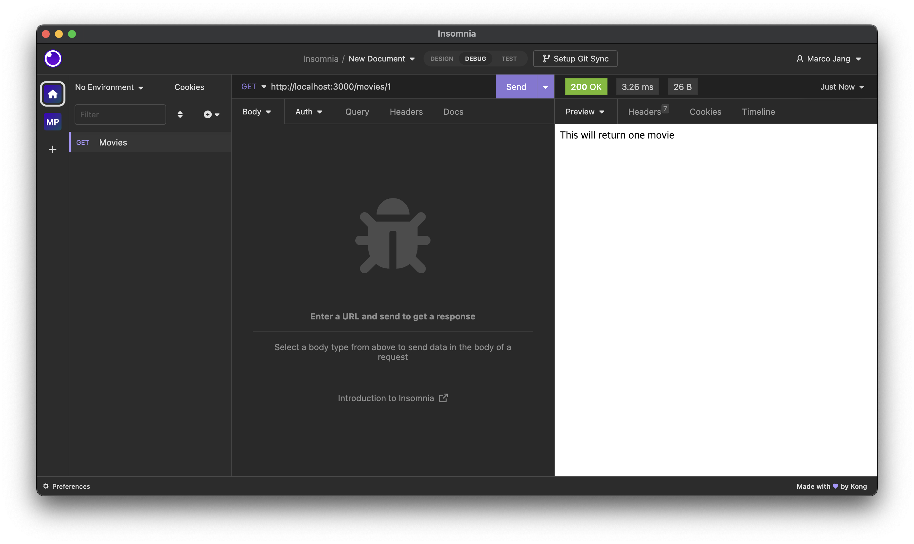
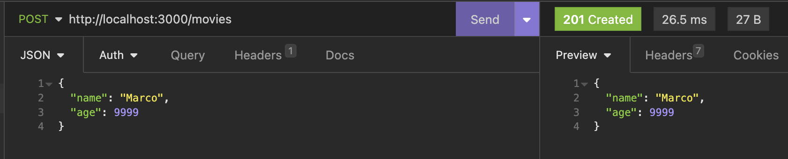
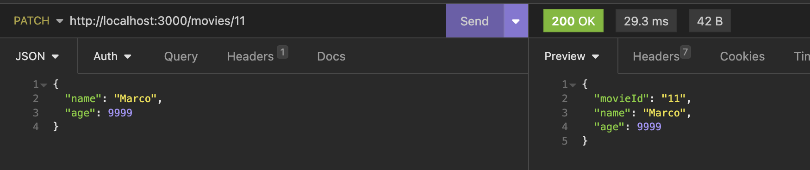

# NestJS로 API 만들기

## 0. Introduction

- nest js 는 구조가 있다. 구조 덕분에 순서와 룰이 있어서, 이를 따르기만 하면 큰 규모의 백엔드를 쉽게 만들 수 있다.
- nestJs는 nodeJs의 프레임워크로서, Express 위에서 동작한다.

### Insomnia

Insomnia는 개발자 친화적인 인터페이스, 내장된 자동화 및 확장 가능한 플러그인 생태계를 제공하는 Rest 클라이언트이다. 이를 통해 API 엔드포인트를 테스트할 수 있다.

<https://insomnia.rest>

### 설치

<https://docs.nestjs.com/>

Nest CLI를 사용하면 새 프로젝트를 설정하는 것이 매우 간단하다.

npm이 설치된 상태에서 OS 터미널에서 다음 명령을 사용하여 새 Nest 프로젝트를 만들 수 있다.

```bash
npm i -g @nestjs/cli
nest new project-name
```

## 1. NestJs 구조

### module

```jsx
// app.module.ts

import { Module } from '@nestjs/common';
import { AppController } from './app.controller';
import { AppService } from './app.service';

@Module({
  imports: [],
  controllers: [AppController],
  providers: [AppService],
})
export class AppModule {}
```

`@Module` 로 시작하는 코드는 데코레이터이다. 데코레이터는 클래스에 함수 기능을 추가할 수 있다. Modules 모듈은 @Module 데코레이터로 주석이 달린 클래스이다. 데코레이터는 Nest가 애플레이케이션 구조를 구성하는 데 사용하는 메타데이터를 제공한다.

모듈은 Nest에서 애플리케이션 구조를 범위로 구성하는 데 사용된다.  컨트롤러와 공급자는 선언된 모듈에 따라 범위가 지정된다. 모듈과 해당 클래스는 Nest가 DI(종속성 주입)를 수행하는 방법을 결정하는 그래프를 형성한다.

<https://docs.nestjs.com/modules#modules>

### controllers

NestJs는 main.ts 파일에서 시작하며, 해당 파일 안에서 하나의 AppModule을 생성한다. AppModule은 모든 것의 루트 모듈과 같다.

컨트롤러는 들어오는 요청을 처리하고(url을 가져오고) 클라이언트에 응답을 반환(함수 실행)하는 역할을 한다. 아래 코드에서 @Get(”/hello”)이 express의 app.get("/hello", getHello)처럼 라우터 같은 역할을 한다.

```tsx
// app.controller.ts

import { Controller, Get } from '@nestjs/common';
import { AppService } from './app.service';

@Controller()
export class AppController {
  constructor(private readonly appService: AppService) {}

  @Get("/hello")  
  getHello(): string {
    return this.appService.getHello();
  }
}
```

데코레이터는 꾸미는 함수와 붙어 있어야 한다.

@GET은 GET 요청이고, @POST는 POST 요청을 한다.

<https://docs.nestjs.com/controllers>

### services

NestJS는 컨트롤러에서 비즈니스 로직을 분리하고 싶어한다. 컨트롤러의 책임은 들어오는 url 요청을 처리하여 응답을 반환하는 것이다. 나머지 비즈니스 로직은 서비스로 분리된다.

```jsx
// app.service.ts

import { Injectable } from '@nestjs/common';

@Injectable()
export class AppService {
  getHello(): string {
    return 'Hello World!';
  }
}
```

## 2. Rest API

- nest 가능한 명령어 확인


```jsx
nest g co // 컨트롤러 생성
```

위와 같은 컨트롤러 생성 명령어 실행 시, 컨트롤러가 생성되고 모듈에 컨트롤러가 자동으로 주입된다.

### Param

Param은 Path Variable을 받아올 때 사용하며 요청 주소에 포함되어있는 변수를 담는다. (예, /users/123에서 123) 만약 어떤 resource를 식별하고 싶으면 Path Variable을 사용한다.

```jsx
import { Controller, Get, Param, Post, Delete, Patch } from '@nestjs/common';

@Controller('movies')
export class MoviesController {
  @Get()
  getAll() {
    return 'This will return all movies';
  }

  @Get('/:id')
  getOne(@Param('id') movieId: string) {
    return `This will return one movie with the id:${movieId}`;
  }

  @Post()
  create() {
    return 'This will create a movie';
  }

  @Delete('/:id')
  remove(@Param('id') movieId: string) {
    return `This will delete a movie with the id:${movieId}`;
  }

  @Patch('/:id')
  patch(@Param('id') movieId: string) {
    return `This will patch a movie with the id:${movieId}`;
  }
}
```

insomnia에서 api 테스트할 수 있다.



### Query

Query는 Query Parameter를 받아올 때 사용하고, 주소 이후에 "?" 뒤에 있는 변수를 담는다. (예, /users?id=123 에서 id=123)

정렬이나 필터링을 한다면 Query Parameter를 사용하는 것이 적절하다.

```jsx
@Get('search')
  search(@Query('year') searchingYear: string) {
    return `We are searching for a movie made after: ${searchingYear}`;
}
```


### Body

```jsx
@Post()
  create(@Body() movieData) {
    return movieData;
  }
```



```jsx
@Patch('/:id')
  patch(@Param('id') movieId: string, @Body() updateData) {
    return { movieId, ...updateData };
  }
```



### services

```jsx
nest g s
```

entites에 실제로 데이터베이스 모델을 만들어야 한다.

- 인터페이스는 컴파일 후 자바스크립트 코드로 남지 않는다. 반면, 클래스는 서버에서 컴파일 후 자바스크립트 코드로 남아 있으므로 사용할 수 있다.

```tsx
// entities/movie.entity.ts

export class Movie {
  id: number;
  title: string;
  year: number;
  genres: string[];
}
```

SRP에 따라 서비스에 비즈니스 로직을 짠다. 아래는 가짜 데이터베이스 유사 코드이다.

```tsx
// movies.service.ts'
import { Injectable, NotFoundException } from '@nestjs/common';
import { Movie } from './entities/movie.entity';

@Injectable()
export class MoviesService {
  private movies: Movie[] = [];

  getAll(): Movie[] {
    return this.movies;
  }

  getOne(id: string): Movie {
    const movie = this.movies.find((movie) => movie.id === +id);
    if (!movie) {
      throw new NotFoundException(`Movie with ID ${id} not found.`);
    }
    return movie;
  }

  deleteOne(id: string) {
    this.getOne(id);
    this.movies = this.movies.filter((movie) => movie.id !== +id);
  }

  create(movieData) {
    this.movies.push({
      id: this.movies.length + 1,
      ...movieData,
    });
  }

  update(id: string, updateData) {
    const movie = this.getOne(id);
    this.deleteOne(id);
    this.movies.push({ ...movie, ...updateData });
  }
}
```

- Built-in HTTP exceptions
  - 위 코드에서 NotFoundException 같은 예외는 Nest가 제공하는 기본 HttpException에서 상속되는 일련의 표준 예외 중 하나이다. 이러한 표준 예외들은 @nestjs/common 패키지에서 가져올 수 있으며 일반적인 HTTP 예외를 나타낸다.
  - <https://docs.nestjs.com/exception-filters#built-in-http-exceptions>

```tsx
// movies.controller.ts

import {
  Controller,
  Get,
  Param,
  Post,
  Delete,
  Patch,
  Body,
  Query,
} from '@nestjs/common';
import { MoviesService } from './movies.service';
import { Movie } from './entities/movie.entity';

@Controller('movies')
export class MoviesController {
  constructor(private readonly moviesService: MoviesService) {}
  @Get()
  getAll(): Movie[] {
    return this.moviesService.getAll();
  }

  @Get('/:id')
  getOne(@Param('id') movieId: string): Movie {
    return this.moviesService.getOne(movieId);
  }

  @Post()
  create(@Body() movieData) {
    return this.moviesService.create(movieData);
  }

  @Delete('/:id')
  remove(@Param('id') movieId: string) {
    return this.moviesService.deleteOne(movieId);
  }

  @Patch('/:id')
  patch(@Param('id') movieId: string, @Body() updateData) {
    return this.moviesService.update(movieId, updateData);
  }
}
```

### DTO - class-transformer, class-valiadator

DTO(Data Transfer Object, 데이터 전송 객체) 타입을 통해 코드를 간결하게 만드는 데 도움을 주고, NestJS가  들어오는 쿼리에 대해 유효성을 검증할 수 있게 해준다.

DTO를 만들고 유효성 검사를 할 데코레이터를 추가한다.

```bash
npm i class-transformer class-validator
```

<https://github.com/typestack/class-validator#usage>

```tsx
// movie/dto/create-movie-dto.ts

import { IsString, IsNumber } from 'class-validator';

export class CreateMovieDto {
  @IsString()
  readonly title: string;

  @IsNumber()
  readonly year: number;

  @IsString({ each: true })
  readonly genres: string[];
}
```

들어오는 쿼리에 대해 유효성을 검증할 코드를 파이프라고 칭할 수 있으며 일종의 미들웨어와 유사하게 생각할 수 있다.  파이프를 만들어보자. `app.useGlobalPipes` 는 main.ts에 추가해야 한다.

- whitelist: true로 설정하면 유효성 검사기는 class-validator의 유효성 검사 데코레이터를 적어도 하나라도 사용하지 않은 모든 속성 객체를 제거합니다.
- forbidNonWhitelisted: true로 설정했을 때, DTO에 데코레이터가 없는 속성은 HttpException 을 던진다. forbidNonWhitelisted 옵션은 whitelist에서 유효한 속성이 아닌 것을 제외하는 것 대신에 에러를 날려주는 것이기 때문에, 먼저 whitelist 옵션이 true로 되어있어야 사용 가능한 옵션이다.
- transform: true로 설정하면 ValidationPipe는 payload를 DTO 클래스에 따라 유형이 지정된 객체로 자동 변환한다.

```tsx
// main.ts

import { NestFactory } from '@nestjs/core';
import { AppModule } from './app.module';
import { ValidationPipe } from '@nestjs/common';

async function bootstrap() {
  const app = await NestFactory.create(AppModule);
  app.useGlobalPipes(
    new ValidationPipe({
      whitelist: true,
      forbidNonWhitelisted: true,
      transform: true,
    }),
  );
  await app.listen(3000);
}
bootstrap();
```


- class-validator의 @IsOptional() 은 값이 empty(또는 null또는 undefined)여도 유효성검사를 무시한다.

### DTO - mapped-types

mapped-types는 DTO 타입을 변환시키고 사용할 수 있게 해주는 패키지이다.

<https://docs.nestjs.com/openapi/mapped-types>

```tsx
@nestjs/swagger
```

```tsx
import { ApiProperty } from '@nestjs/swagger';

export class CreateCatDto {
  @ApiProperty()
  name: string;

  @ApiProperty()
  age: number;

  @ApiProperty()
  breed: string;
}
```

- `PartialType()`부모 DTO의 모든 속성들을 물려받지만 전부 Optional

```tsx
export class UpdateCatDto extends PartialType(CreateCatDto) {}
```

- `PickType()`부모 DTO의 속성 중 몇 개만 골라서 물려받음

```tsx
export class UpdateCatAgeDto extends PickType(CreateCatDto, ['age'] as const) {}
```

- `OmitType()`부모 DTO의 속성 중 몇 개를 제외하고 물려받음.

```tsx
export class UpdateCatDto extends OmitType(CreateCatDto, ['name'] as const) {}
```

- `IntersectionType()` 은 여러 부모 DTO의 속성들을 모두 물려받음.

```tsx
export class AdditionalCatInfo {
  @ApiProperty()
  color: string;
}
```

```tsx
export class UpdateCatDto extends IntersectionType(
  CreateCatDto,
  AdditionalCatInfo,
) {}
```

- `composition` : 위와 같은 타입 매핑 유틸리티 함수는 합성 가능하다.

```tsx
export class UpdateCatDto extends PartialType(
  OmitType(CreateCatDto, ['name'] as const),
) {}
```

### ****Modules and Dependency Injection****

movies module을 새로 만들고, app module로부터 movies module을 분리할 수 있다.

```tsx
// 모듈 만들기
nest g mo
```

```tsx
// app.module.ts

import { Module } from '@nestjs/common';
import { MoviesModule } from './movies/movies.module';

@Module({
  imports: [MoviesModule],
  controllers: [],
  providers: [],
})
export class AppModule {}
```

```tsx
// movies.module.ts

import { Module } from '@nestjs/common';
import { MoviesController } from './movies.controller';
import { MoviesService } from './movies.service';

@Module({
  controllers: [MoviesController],
  providers: [MoviesService],
})
export class MoviesModule {}
```

### ****Express on NestJS****

NestJS는 Express 프레임워크 위에서 돌아간다. 그러나 Fastify 라이브러리 위에서 돌아가도록 전환할 수 있다. Fastify는 성능 향상 장점이 있다.

Express 프레임워크 위에서 돌아가므로 @req, @res 객체를 사용할 수 있으나, Fastify 로 전환하는 경우 호환되지 않는 문제가 발생하므로 Express에서만 돌아가는 객체를 많이 사용하지 않는 것이 바람직하다.

## 3. Unit Test

유닛 테스트는 시스템에서 함수 같은 하나의 유닛만을 각각 테스트하는 방법이다. 반면, e2e 테스트는 전체 시스템을 테스트하는 방법이다.  

### Test setup - MoviesService 정의

```tsx
import { Test, TestingModule } from '@nestjs/testing';
import { MoviesService } from './movies.service';
import { NotFoundException } from '@nestjs/common';

describe('MoviesService', () => {
  let service: MoviesService;

  beforeEach(async () => {
    const module: TestingModule = await Test.createTestingModule({
      providers: [MoviesService],
    }).compile();
    service = module.get<MoviesService>(MoviesService);
  });

 it('should be defined', () => {
    expect(service).toBeDefined();
  });
```

### getAll, getOne 테스트

```tsx
describe('getAll', () => {
    it('should return an array', () => {
      const result = service.getAll();
      expect(result).toBeInstanceOf(Array);
    });
  });

  describe('getOne', () => {
    it('should return a movie', () => {
      service.create({
        title: 'Test Movie',
        genres: ['test'],
        year: 2000,
      });
      const movie = service.getOne(1);
      expect(movie).toBeDefined();
    });

    it('should throw 404 error', () => {
      try {
        service.getOne(999);
      } catch (e) {
        expect(e).toBeInstanceOf(NotFoundException);
      }
    });
  });
```

### delete, create 테스트

```tsx
describe('deleteOne', () => {
    it('deletes a movie', () => {
      service.create({
        title: 'Test Movie',
        genres: ['test'],
        year: 2000,
      });
      const beforeDelete = service.getAll().length;
      service.deleteOne(1);
      const afterDelete = service.getAll().length;
      expect(afterDelete).toBeLessThan(beforeDelete);
    });
    it('should return a 404', () => {
      try {
        service.deleteOne(999);
      } catch (e) {
        expect(e).toBeInstanceOf(NotFoundException);
      }
    });
  });

  describe('create', () => {
    it('should create a movie', () => {
      const beforeCreate = service.getAll().length;
      service.create({
        title: 'Test Movie',
        genres: ['test'],
        year: 2000,
      });
      const afterCreate = service.getAll().length;
      expect(afterCreate).toBeGreaterThan(beforeCreate);
    });
  });
```

## 4. E2E Test

```tsx
import { Test, TestingModule } from '@nestjs/testing';
import { INestApplication, ValidationPipe } from '@nestjs/common';
import * as request from 'supertest';
import { AppModule } from './../src/app.module';

describe('AppController (e2e)', () => {
  let app: INestApplication;

  beforeAll(async () => {
    const moduleFixture: TestingModule = await Test.createTestingModule({
      imports: [AppModule],
    }).compile();

    app = moduleFixture.createNestApplication();
    app.useGlobalPipes(
      new ValidationPipe({
        whitelist: true,
        forbidNonWhitelisted: true,
        transform: true,
      }),
    );
    await app.init();
  });

  describe('/movies', () => {
    it('GET', () => {
      return request(app.getHttpServer()).get('/movies').expect(200).expect([]);
    });
    it('POST 201', () => {
      return request(app.getHttpServer())
        .post('/movies')
        .send({
          title: 'Test',
          year: 2000,
          genres: ['test'],
        })
        .expect(201);
    });
    it('POST 400', () => {
      return request(app.getHttpServer())
        .post('/movies')
        .send({
          title: 'Test',
          year: 2000,
          genres: ['test'],
          other: 'thing',
        })
        .expect(400);
    });
    it('DELETE', () => {
      return request(app.getHttpServer()).delete('/movies').expect(404);
    });
  });

  describe('/movies/:id', () => {
    it('GET 200', () => {
      return request(app.getHttpServer()).get('/movies/1').expect(200);
    });
    it('GET 404', () => {
      return request(app.getHttpServer()).get('/movies/999').expect(404);
    });
    it('PATCH 200', () => {
      return request(app.getHttpServer())
        .patch('/movies/1')
        .send({ title: 'Updated Test' })
        .expect(200);
    });
    it('DELETE 200', () => {
      return request(app.getHttpServer()).delete('/movies/1').expect(200);
    });
  });
});
```

- 테스트에서도 실제 어플리케이션의 환경을 적용해줘야 한다. 아래와 같은  pipe 적용이 기존 테스트 설정에서 생략되어 있었는데 실제 어플리케이션 환경과 동일하게 하기 위해 추가한다.

    ```tsx
        app.useGlobalPipes(
          new ValidationPipe({
            whitelist: true,
            forbidNonWhitelisted: true,
            transform: true,
          }),
        );
    ```

- beforeEach(fn, timeout)
  - 각각의 테스트가 실행되기 전에 매번 함수를 실행한다.
  - 각각의 테스트 전에 각 테스트에서 사용할 전역 상태를 재설정하려는 경우에 유용하다.
  - 함수가 promise을 반환하거나 generator인 경우 Jest는 테스트를 실행하기 전에 해당 promise가 해결될 때까지 기다린다.
  - 밀리초로 대기할 시간을 지정할 수 있다. (기본 시간 5초)
  - <https://jestjs.io/docs/api#beforeeachfn-timeout>
- beforeAll(fn, timeout)
  - 모든 테스트가 실행되기 전에 딱 한 번 함수를 실행한다.
- afterEach(fn, timeout)
  - 각각의 테스트가 완료된 후 함수를 실행한다.
- afterAll(fn, timeout)
  - 모든 테스트가 완료된 후 함수를 실행한다.
