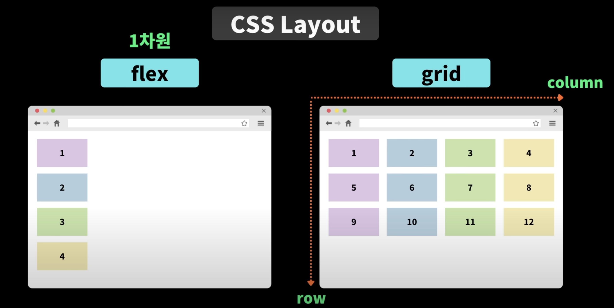
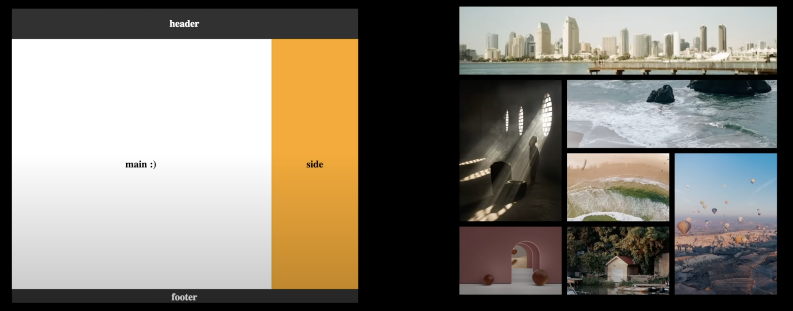
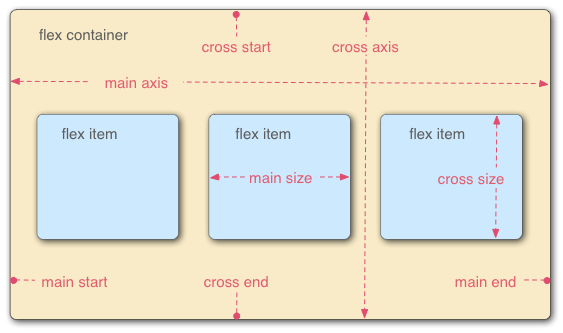
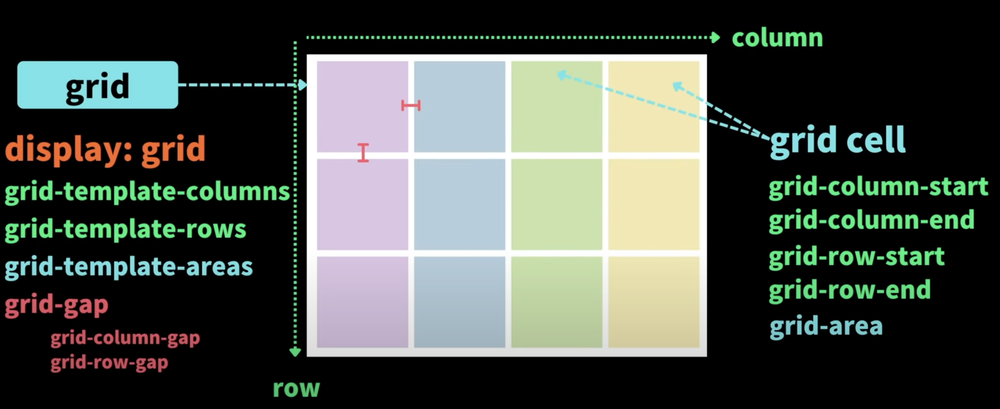
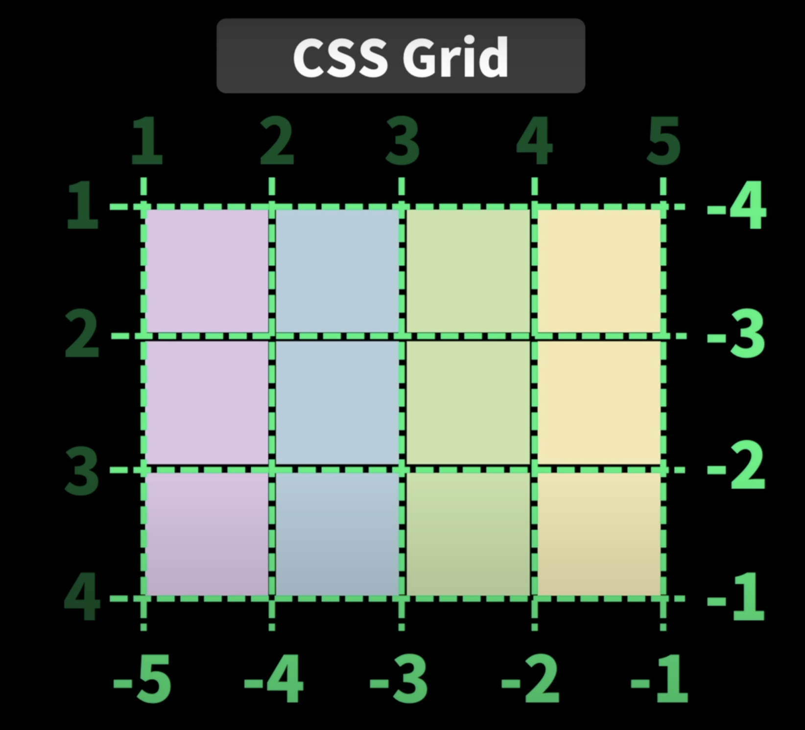
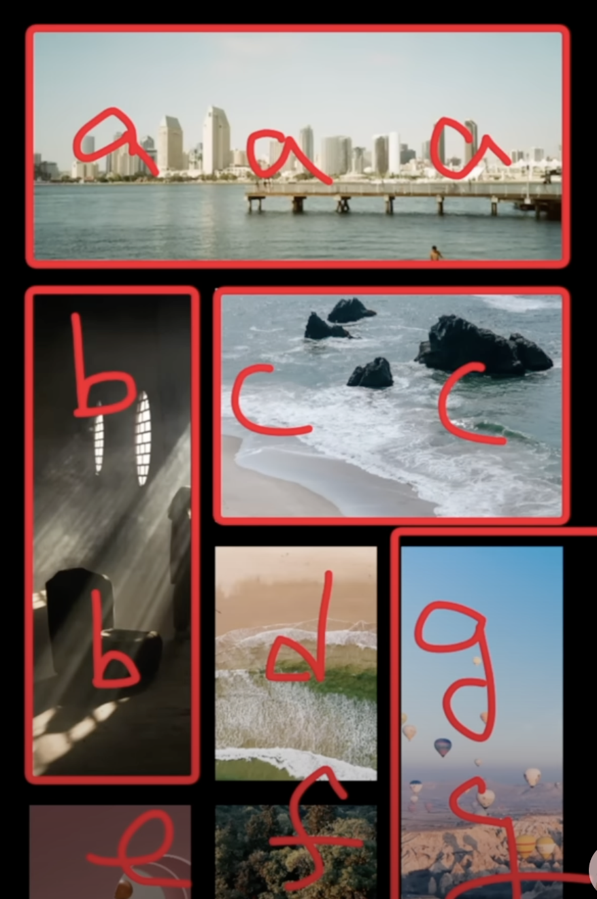
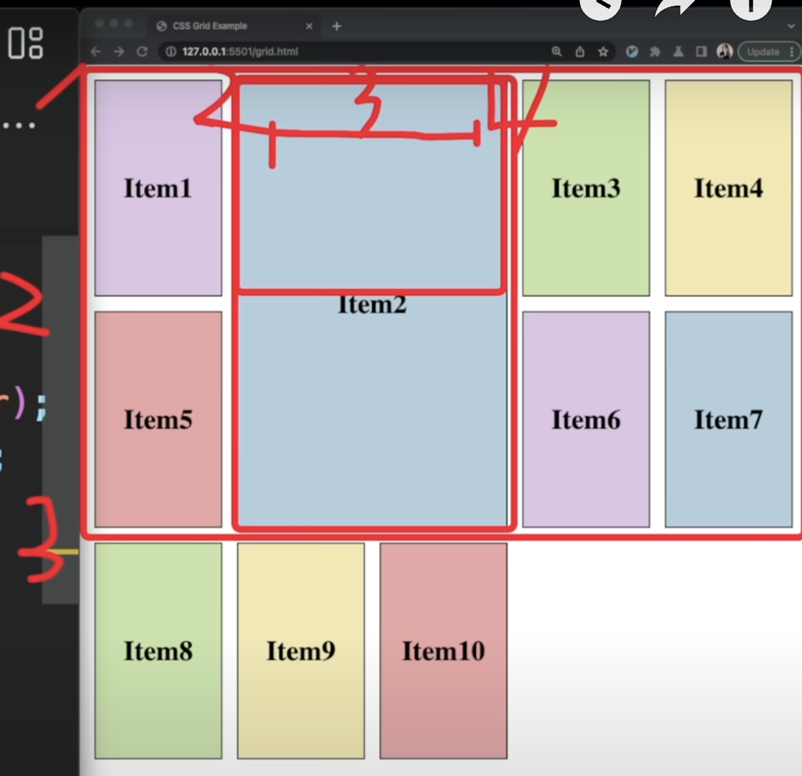
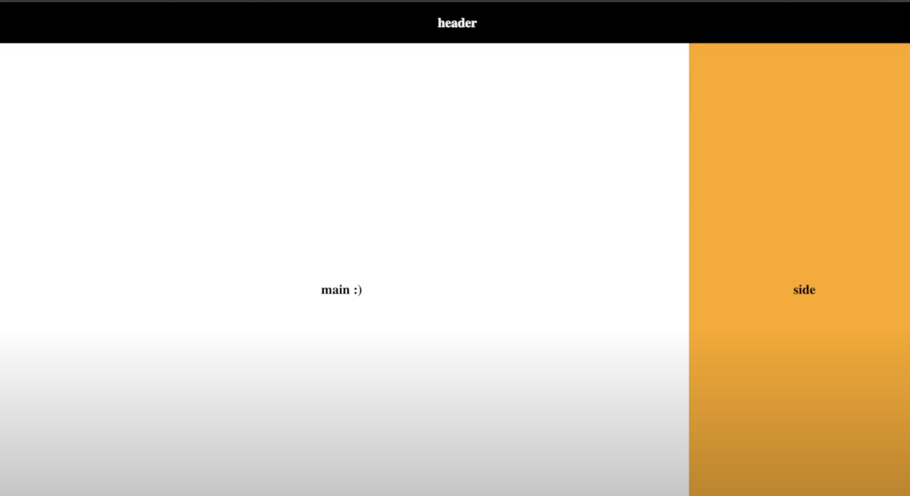

## display

- `display: inline;`
  - 비유하자면, 물건
  - 인라인 레벨의 대표적인 요소로는 `<span>`이 있다.
- `display: inline-block`
  - 비유하자면, 한 줄에 여러개가 진열 가능한 상자
- `display: block;`
  - 비유하자면, 한 줄에 한 개씩만 진열 가능한 상자
  - 블록 레벨의 대표적인 요소로 `<div>`가 있다.

## position

- `position: static`
  - position 기본값은 `static` 이다.
  - 📍 일반적인 문서 흐름에 따라 배치한다.
  - 🙅‍♂️ top, bottom, left, right, z-index 적용이 불가하다.
- `position: relative`
  - 📍 일반적인 문서 흐름에 따라 배치한다.
  - `자기 자신`을 기준으로 top, bottom, left, right의 값에 따라 오프셋을 적용한다.(오프셋이 다른 요소에는 영향을 주지 않으므로 요소가 차지하는 공간은 static일 때와 같다)
  - z-index의 값이 auto가 아니라면 💩 새로운 쌓임 맥락을 생성한다.
- `position: absolute`
  - 🚀 일반적인 문서 흐름에서 제거되어, 페이지 레이아웃에서 공간도 배정되지 않는다.
  - `가장 가까운 부모 박스`(위치 지정 요소가 있는 조상)의 위치를 기준으로 top, bottom, left, right의 값에 따라 오프셋을 적용한다.
  - z-index의 값이 auto가 아니라면 💩 새로운 쌓임 맥락을 생성한다.
- `position: fixed`
  - 🚀 일반적인 문서 흐름에서 제거되어, 페이지 레이아웃에서 공간도 배정되지 않는다.
  - `뷰포트의 초기 컨테이닝 블록`을 기준으로  top, bottom, left, right의 값에 따라 오프셋을 적용한다. 즉, 속성값의 배치 기준이 자신이나 부모 요소가 아닌 브라우저 전체화면이다.
  - 💩 항상 새로운 쌓임 맥락을 생성한다.
- `position: sticky`
  - 📍 일반적인 문서 흐름에 따라 배치한다.
  - `가장 가까운 스크롤`(overflow가 hidden, scroll, auto, overlay 중 하나)되는 블록 레벨 조상을 기준으로 top, bottom, left, right의 값에 따라 오프셋을 적용한다. 즉, 원래 있어야 하는 자리에 있으면서 스크롤되어도 원래 있던 자리에 그대로 붙어있다.
  - 💩 항상 새로운 쌓임 맥락을 생성한다.

## Flex와 Grid의 차이

- flex는 기본적으로 아이템들을 row나 column 중 택하여 1차원적으로 배치한다.
  - flex도 wrap이라는 속성을 이용하면, 한 줄 아이템이 넘치면 다음 줄로 줄바꾸기를 하여 2차원적인 배치를 할 수도 있다.
- 반면, grid는 아이템들을 row와 column을 통해 2차원적으로 배치한다.



flex로 대부분 레이아웃을 만들 수 있어 flex가 보편적으로 많이 쓰이나, grid 형태로 자유자재로 아이템을 배치하거나 웹사이트 전체 구조를 grid 형태로 잡는 경우 grid를 유용하게 쓸 수 있다.



## Flexbox

- flexbox는 container에 적용할 수 있는 속성값과 그 하위에 있는 item에 적용할 수 있는 속성값이 존재한다.

flex item이 배치되고 있는 방향으로 진행하는 축을 기본축이라 하는데, 수평(행) 또는 수직(열)  중에 선택할 수 있고 기본값은 수평(행)이다.



### flex container 속성값

- display: flex;
- flex-direction
  - 기본값은 row이다. row-reverse로 하면 수평 역순이다. column으로 하면 수직으로 배치되고, column-reverse로 하면 수직 역순이다.
- flex-wrap
  - 기본값은 nowrap이며, 아이템이 아무리 많아도 한줄에서 벗어나지 않는다.
  - wrap을 적용하면, 아이템이 많아지면 줄바꿈이 자동으로 된다. 역순으로 정렬하는 wrap-reverse도 존재한다.
- flex-flow
- justify-content
  - 기본축을 기준으로 아이템을 어떻게 배치할지 결정한다.
  - 기본값은 flex-start이며, 아이템들이 왼쪽에 붙어서 배치된다.
  - flex-end는 반대로 오른쪽에 붙어서 배치된다.
  - space-around는 아이템을 둘러싸는 여백이 부여된다.
  - space-evenly는 동일한 간격을 아이템 사이에 넣어준다.
  - space-between은 아이템을 왼쪽과 오른쪽은 화면에 맞게 배치하고 아이템 사이에만 동일한 여백을 넣어준다.
- align-content
  - 교차축을 기준으로 아이템을 어떻게 배치할지 결정한다. justify-content에서 사용한 속성값을 사용할 수 있다.
- align-items
  - 교차축을 기준으로 아이템을 어디에 배치할지 결정한다.
  - 기본값은 stretch이며, 교차축 방향으로 부모 요소를 채우기 위해 모든 flex item의 사이즈를 늘인다.
  - center는 아이템 고유의 면적을 유지하는 동시에 교차축을 따라 중심에 배치된다. 비슷하게 start와 end도 있다.

### flex item 속성값

- order
  - order를 지정하면 html에 작성된 순서와 달리, order의 숫자값에 따라 정렬된다.
- flex-grow
  - 기본값은 0이고, container를 채우려 하지 않고 item들은 각자 정의된 사이즈를 유지한다.
  - 1 이상의 숫자를 적용하면, container를 채우기 위해 늘어난다. item의 고유 사이즈를 넘을 정도로 뷰포트 사이즈가 커지면, item들은 각자의 flex-grow 값에 비례하여 사이즈가 변경된다.
- flex-shrink
  - 기본값은 0이다.
  - flex-grow와 반대의 메커니즘으로서, 뷰포트 사이즈가 작아질 때, item들은 flex-shrink 값에 비례하여 더 작아진다.
- flex-basis
  - 기본값은 auto으로서, flex-grow나 flex-shrink에 지정된 값에 맞추어 아이템들이 공간을 얼마나 차지해야 하는지 세부적으로 명시하도록 도와준다.
  - 2개의 item에 각각 60%, 40%를 적용하면 뷰포트에서 기본축을 기준으로 공간을 60%, 40%씩 차지한다.
- flex
  - flex-grow, flex-shrink, basis를 한번에 적용할 수 있다.
- align-self
  - 아이템별로 아이템을 정렬할 수 있다.

## Grid

- container에 `display: grid` 로 적용하면, 그 하위 자식 요소들은 grid cell이 된다.



- grid line



### grid container 속성값

- display: grid
- grid-template-columns

```css
grid-template-columns: 100px 100px 100px;  // 가로로 총 3개의 열(각각 100px width)
grid-template-columns: repeat(3, 100px); // 위와 동일한 효과 
grid-template-columns: repeat(3, 20%); // 뷰포트의 사용가능한 너비에서 20%씩 3개의 열(총 60%)
grid-template-columns: 1fr 2fr 1fr; // 뷰포트에서 25%, 50%, 25%씩 차지하는 3개의 열
```

- grid-template-rows
- grid-auto-rows
  - 각 줄에 고정된 height 크기 적용

```css
grid-auto-rows: minmax(150px, auto); // 컨텐트가 있으면 auto, 없으면 최소 150px
```

- grid-gap

```css
grid-row-gap: 10px;
grid-column-gap: 10px;
grid-gap: 10px;
```

- grid-template-areas
  - grid-area와 함께 사용한다.

```css
.container {
    display: grid;
    grid-template-columns: repeat(3, 1fr);
    grid-auto-rows: 150px;
    grid-gap: 1rem;
    grid-template-areas: 
    'a a a'
    'b c c'
    'b d g'
    'e f g'
}

.image1 {
    grid-area: a;
}

.image2 {
    grid-area: b;
}

.image3 {
    grid-area: c;
}

.image4 {
    grid-area: d;
}

.image5 {
    grid-area: e;
}
.image6 {
    grid-area: f;
}
.image7 {
    grid-area: g;
}
```



### grid cell 속성값

- grid-column-start
- grid-column-end
- grid-row-start
- grid-row-start

```css
.item2 {
 grid-column-start: 2;
 grid-column-end: 4;
 grid-row-start: 1;
 grid-row-end: 3;
}

// 위와 같이하면 번거로우니 더 간편하게 축약한 속성은 다음과 같다.

.item2 {
 grid-column: 2 / 4;
 grid-row: 1 / 3;
}

.item2 {
 grid-column: 2 / span 2;
 grid-row: 1 / sapn 2;
}
```



- grid-area

### grid로 페이지 레이아웃 잡기

```css
body {
 width: 100vw;
 height: 100vh;
 margin: 0;
 display: grid;
 grid-template-columns: 3fr 1fr;
 grid-template-rows: 100px auto 50px;
 grid-template-areas: 
  'header header'
  'main aside'
  'footer footer';
}

header {
 grid-area: header;
}

main {
 grid-area: main;
}

aside {
 grid-area: aside;
}

footer {
 grid-area: footer;
}
```



## Reference

[CSS position - MDN](https://developer.mozilla.org/ko/docs/Web/CSS/position)

[CSS Flexbox 완전 정리 - 드림코딩](https://youtu.be/7neASrWEFEM)

[CSS Grid 완전 정리 - 드림 코딩](https://youtu.be/nxi1EXmPHRs)
