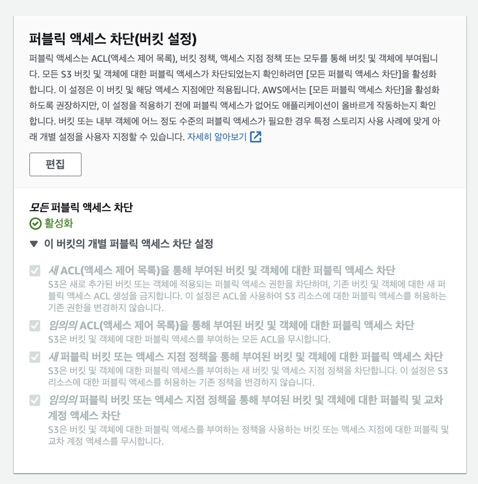
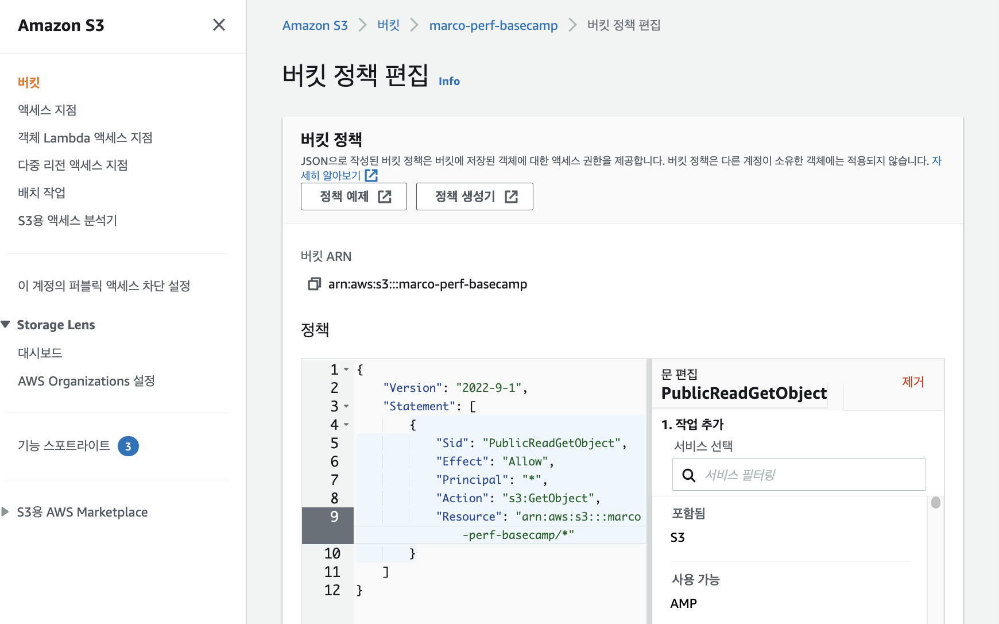
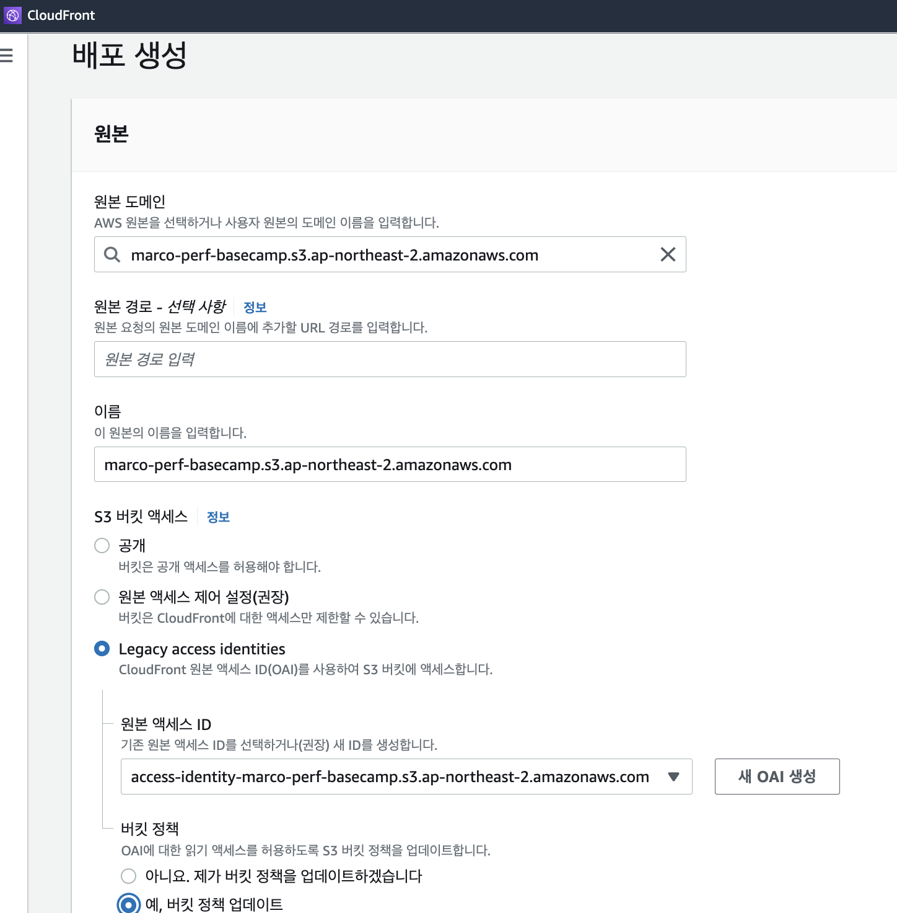
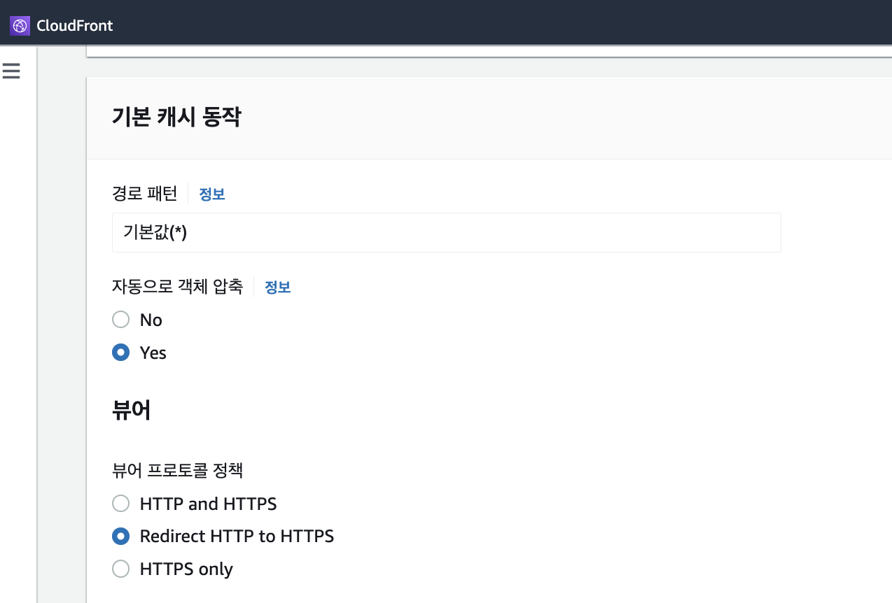
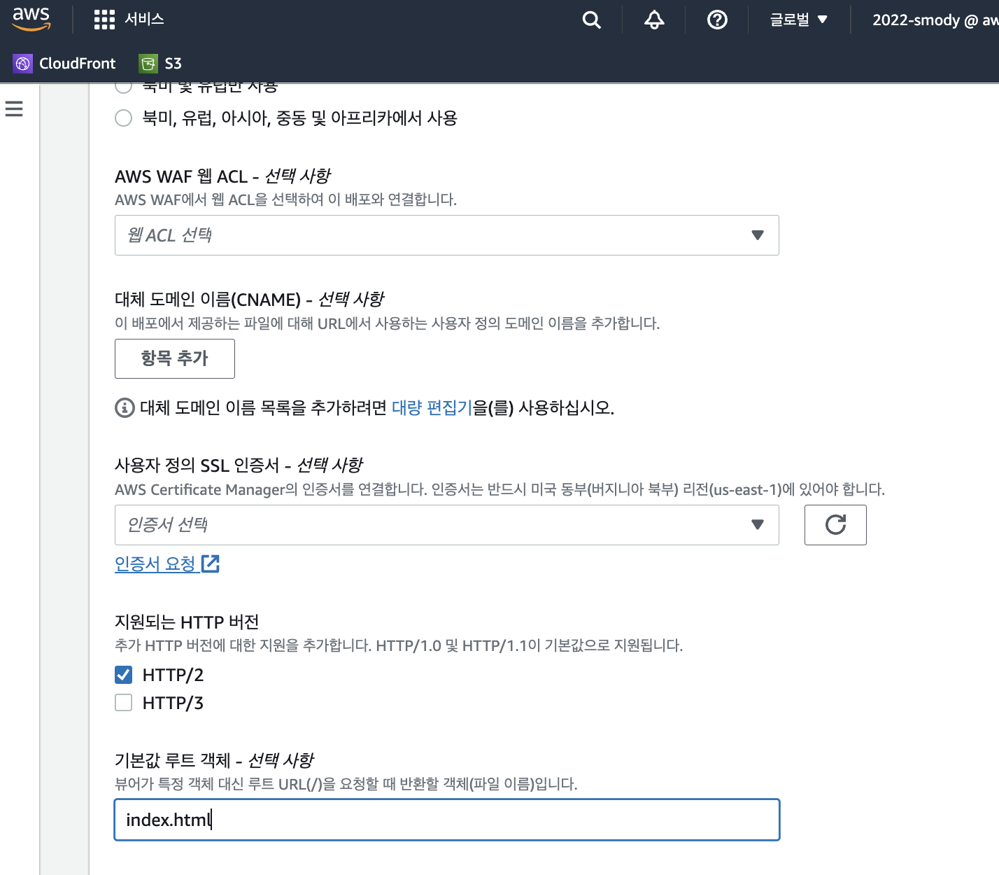
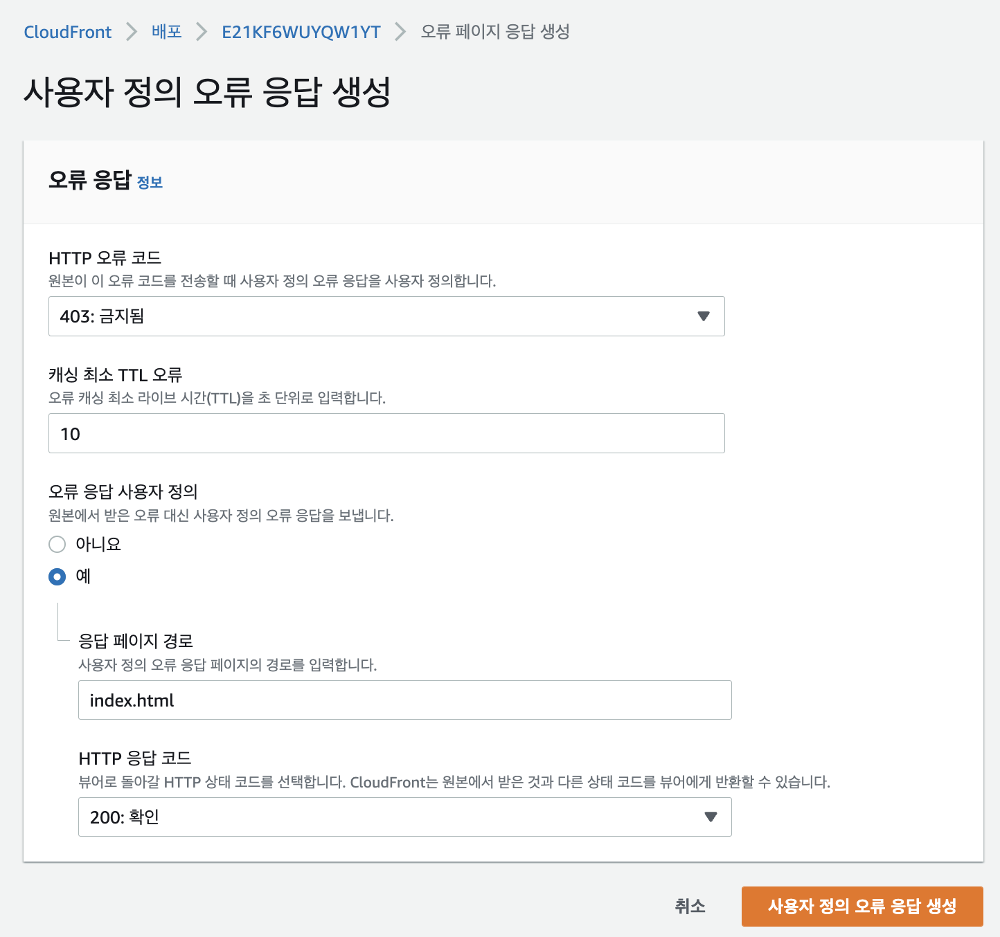
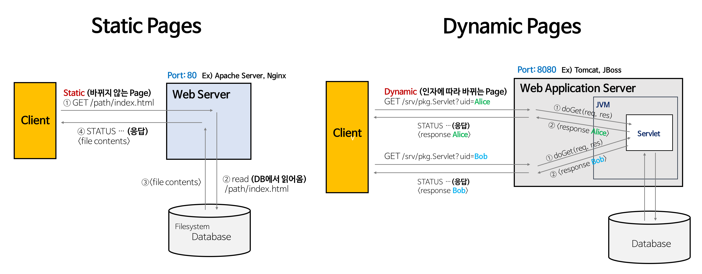
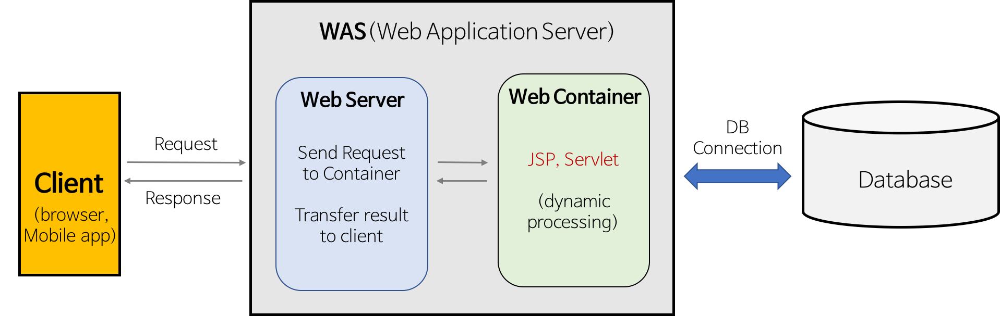

## Nginx(웹서버)

엔진엑스(Nginx)는 Igor Sysoev라는 러시아 개발자가 `동시접속 처리에 특화된` 웹 서버 프로그램이다. `Apache`보다 동작이 단순하고, 전달자 역할만 하기 때문에 동시접속 처리에 특화되어 있다.

동시접속자(약 700명) 이상이라면 서버를 증설하거나 Nginx 환경을 권장한다고 한다. 지금은 아파치가 시장 점유율을 많이 차지하지만, 아마존웹서비스(AWS) 상에서는 시장 점유율 44%에 달할정도로 가볍고, 성능이 좋은 엔진이라고 한다.

-   정적 파일을 처리하는 HTTP 서버로서의 역할
    -   웹서버의 역할은 HTML, CSS, Javascript, 이미지와 같은 정보를 웹 브라우저(Chrome, IE, Opera, Firefox 등)에 전송하는 역할을 한다. (HTTP 프로토콜을 준수)
-   응용프로그램 서버에 요청을 보내는 리버스 프록시로서의 역할

## S3란?

> Amazon Simple Storage Service(Amazon S3)는 업계 최고의 확장성, 데이터 가용성, 보안 및 성능을 제공하는 객체 스토리지 서비스입니다.
>
> [AWS 사용 설명서](https://docs.aws.amazon.com/ko_kr/AmazonS3/latest/userguide/Welcome.html)에서 S3에 대해 위와 같이 설명한다. 즉, S3(Simple Storage Service)는 이름 그대로 간단한 저장소를 제공하는 서비스이다. 주로 정적 컨텐츠를 저장할 때 사용된다.

### S3와 EC2 차이점

-   S3(Simple Storage Service)는 클라우드 공간에 데이터(파일)를 저장하고 사용자에게 제공 해 주는 온라인 스토리지 웹 서비스이다.
    -   (일반적인 기존의 환경으로 기준으로 얘기하자면 CDN서버나 FTP로 파일을 업로드 / 다운로드 할 수 있는 공간을 생각하면 된다.)
    -   AWS 콘솔을 통해서 업로드 / 다운로드가 가능 하고 http를 통한 접근이 가능하기 때문에 `브라우저를 통한 서비스가 가능`하다. 일반적인 시스템과는 파일(또는 데이터) 다르게 key, value 조합인 객체 타입의 구조로 구성된다. key는 파일 혹은 데이터 이름 value 파일 혹은 데이터 그 자체를 말한다.
    -   `정적인 html이나 이미지` 등을 제공 하는데 용이 하다. `대량 트래픽에 대응` 하기 위한 시스템 구축이 필요 없다. 권한 및 캐싱 전략을 쉽게 추가 할 수 있다.
-   EC2(Elastic Compute Cloud)는 AWS에서 제공하는 가상 컴퓨터 머신이라고 생각하면 된다. 기존의 웹 서버를 구축하기 위해서 사용한다.
    -   기존에는 웹 서비스를 제공하기 위해서 직접 물리적인 서버를 구축하거나 호스팅 업체에서 제공하는 서버의 서비스를 사용한다. 컴퓨터의 용량이나 트래픽을 시작부터 정해서 특정 공간을 임대하는 방식이나 보니 사용량이 몰릴때 `유연하게 대처하기 어렵다.`

## 웹 컨텐츠를 S3에 저장하면 다음과 같은 이점이 있다

1. S3 버킷이 `자동으로 확장 및 축소`되기 때문에 스토리지 공간을 계획하여 특정 크기를 할당할 필요가 없다.
2. `서버리스(Serverless)` 서비스이기 때문에 파일이 저장되는 서버를 관리하거나 패치할 필요가 없다.
    > `서버리스` 란 무엇인가?
    >
    > - 서버리스(serverless)란 개발자가 `서버를 관리할 필요 없이` 애플리케이션을 빌드하고 실행할 수 있도록 하는 [클라우드 네이티브](https://www.redhat.com/ko/topics/cloud-native-apps) 개발 모델이다.
    > - 서버리스 모델에도 `서버가 존재`하긴 하지만, 애플리케이션 개발에서와 달리 `추상화`되어 있다. [`클라우드 제공업체`](https://www.redhat.com/ko/topics/cloud-computing/what-are-cloud-providers)가 서버 [인프라](https://www.redhat.com/ko/topics/cloud-computing/what-is-it-infrastructure)에 대한 [프로비저닝](https://www.redhat.com/ko/topics/automation/what-is-provisioning), 유지 관리, 스케일링 등의 일상적인 작업`을 처리하며, 개발자는 배포를 위해 코드를 [컨테이너](https://www.redhat.com/ko/topics/containers)에 패키징하기만 하면 된다.
    > - 서버 관리 : 서버 [인프라](https://www.redhat.com/ko/topics/cloud-computing/what-is-it-infrastructure)에 대한 [프로비저닝](https://www.redhat.com/ko/topics/automation/what-is-provisioning), 유지 관리, 스케일링 등의 일상적인 작업
    > - 이 작업을 개발자가 직접 안하게 되니 서버리스다.
    > - 서버리스 애플리케이션은 배포되고 나면 필요에 따라 [자동](https://www.redhat.com/ko/topics/automation)으로 스케일 업되거나 스케일 다운된다. [퍼블릭 클라우드](https://www.redhat.com/ko/topics/cloud-computing/what-is-public-cloud) 제공업체의 서버리스 오퍼링은 일반적으로 [이벤트 기반](https://www.redhat.com/ko/topics/integration/what-is-event-driven-architecture) 실행 모델을 통해 온디맨드로 미터링된다. 그러므로 서버리스 기능이 유휴 상태일 때는 아무런 비용도 들지 않는다.
3. 애플리케이션에 `서버`가 필요하더라도 정적 콘텐츠에 대한 요청을 처리할 필요가 없기 때문에 `서버` 크기를 줄일 수 있다.
    - 즉, 동적 애플리케이션가 돌아가는 백엔드 앱 서버와 분리하여 별도의 이미지 서버를 구축하면 이미지에 대한 요청을 백엔드 앱 서버가 처리할 필요가 없기 때문에 백엔드 앱 서버의 크기와 부하를 줄일 수 있다.

## S3 관련 용어

### 버킷

데이터를 저장하고 있는 `컨테이너`이다. S3는 객체 단위로 데이터를 저장한다. 따라서 버킷은 객체 들의 컨테이너라고 할 수 있다.

### 객체

S3에 저장되는 데이터의 기본 단위

### 키

버킷 내의 각 객체를 식별할 수 있는 고유한 값이다.

관련 용어에 대한 자세한 설명은 아래 북마크된 문서의 Amazon S3 작동 방식 부분에서 확인 가능하다.

[Amazon S3란 무엇인가요?](https://docs.aws.amazon.com/ko_kr/AmazonS3/latest/userguide/Welcome.html)

## CloudFront란? - 성능 최적화

> CloudFront는 전 세계의 정적/동적 웹 콘텐츠, 비디오 스트림 및 API를 안전하게 대규모로 전송할 수 있는 콘텐츠 전송 네트워크(CDN) 서비스입니다. CloudFront에서 데이터를 전송하면 설계상 S3에서 직접 사용자에게 전송하는 것보다 더욱 `비용 효율적`입니다.

[AWS 블로그 문서](https://aws.amazon.com/ko/blogs/korea/amazon-s3-amazon-cloudfront-a-match-made-in-the-cloud/)에는 위와 같이 CloudFront가 정의돼 있다. 즉, CloudFront는 CDN 서비스이다.

CloudFront는 엣지 로케이션 덕분에 전 세계 네트워크를 통해 컨텐츠를 빠르게 제공할 수 있다. CloudFront의 특징을 정리하면 다음과 같다.

1. CloudFront는 컨텐츠를 `캐싱`하고 있다.

    - 사용자가 요청한 컨텐트를 CloudFront에서 캐싱하고 있다면 바로 제공한다.
    - 그렇지 않다면 S3와 같이 컨텐츠를 저장하고 있는 서버에서 컨텐츠를 가져온 후 제공 및 저장 과정을 거친다. CloudFront는 TCP Handshake에 최적화되어 있기 때문에 S3와 빠르게 통신이 가능하다. 이와 관련해서 AWS 블로그에 아래와 같이 명시돼 있다.

        > 콘텐츠가 엣지 서버에 아직 캐싱되어 있지 않으면 CloudFront가 S3 버킷 오리진에서 해당 콘텐츠를 가져옵니다. 그 밖에도 콘텐츠가 퍼블릭 인터넷이 아닌 AWS 프라이빗 네트워크를 통해 전송되는 동시에 CloudFront가 TCP 핸드셰이크를 최적화하기 때문에 요청 및 콘텐츠 반환 속도가 퍼블릭 인터넷을 통해 액세스하는 것보다 훨씬 빠릅니다.

2. CloudFront는 전 세계 여러 곳에 `엣지 서버`가 존재한다.
    - 사용자가 CloudFront에서 제공하는 컨텐츠를 요청했을 때, 가까운 엣지 로케이션으로 라우팅됩니다.
    - 덕분에 사용자는 물리적으로 가까운 위치의 서버로부터 컨텐츠를 제공 받는다.

## S3 및 CloudFront로 정적 사이트 배포하기

### S3 버킷 생성

-   버킷의 모든 퍼블릭 액세스를 차단한다.



### S3 버킷 정책 설정



### 버킷 정책 설정 시 참고 속성

-   Version : “2012–10–17”, “2008–10–17” 값을 가질 수 있습니다.
-   ID : (optional) Policy 의 구분자로 UUID를 사용하기를 권장합니다. 예) cd3ad3d9–2776–4ef1-a904–4c229d1642ee”
-   SID : (optional) Statement ID로 statement 를 구분하기 위해서 사용
-   Effect : Allow, Deny 사용
-   Principal , NotPrincipal : 대상(주체)를 지정합니다. 예를 들면 Users, Services, Federated users, Roles 가 될 수 있습니다.
-   Action, NotAction : 서비스의 API Calls를 지정합니다.
-   Resource, NotResource : Action이 영향을 미치는 리소스 리스트를 지정합니다.
-   Condition : 조건을 넣어 줄 수 있습니다. 조건을 충족되는 경우에만 해당 정책을 적용시킬 수 있습니다.

```jsx
{
    "Version": "2012-10-17",
    "Statement": [
        {
            "Sid": "S3ReadOnlyPolicy",
            "Effect": "Allow",
            "Principal": "*",
            "Action": "s3:GetObject",
            "Resource": "arn:aws:s3:::{버킷이름}/*",
            "Condition": {
                "IpAddress": {
                    "aws:SourceIp": "{현재IP}"
                }
            }
        }
    ]
}
```

### S3 정적 웹 사이트 호스팅

-   S3에서 정적 웹 사이트 호스팅 바로 가능


### CloudFront 배포 후 S3 버킷 엑세스

-   배포 생성

    -   Legacy access identities가 OAI 사용 설정임

        -   새 OAI 생성 후, 버킷 정책 업데이트 체크
        -   Redirect HTTP to HTTPS 체크

        

        

    -   배포 완료

-   CloudFront에서 `일반` 탭에서 `설정` 섹션의 편집 버튼 누르고

    -   `기본값 루트 객체`에 `index.html` 설정



### 사용자 정의 오류 응답 생성

-   index외 다른 route path 응답 페이지 경로를 index.html로 설정한다.
    -   예를 들어 /search 페이지 새로고침 시 403 에러가 발생하는데, 에러 응답 페이지를 index로 설정하여 200 응답이 되도록 하는 것이다.
        

## [참고내용] Web Server와 WAS의 차이

> 참고 자료 출처 : [https://gmlwjd9405.github.io/2018/10/27/webserver-vs-was.html](https://gmlwjd9405.github.io/2018/10/27/webserver-vs-was.html)



### Web Server(ex, Nginx)

-   Static Pages
    -   Web Server는 파일 경로 이름을 받아 경로와 일치하는 file contents를 반환한다.
    -   항상 동일한 페이지를 반환한다.
    -   Ex) image, html, css, javascript 파일과 같이 컴퓨터에 저장되어 있는 파일들
-   Web Server의 개념
    -   소프트웨어와 하드웨어로 구분된다.
        -   1. 하드웨어 : Web 서버가 설치되어 있는 컴퓨터
        -   2. 소프트웨어 : 웹 브라우저 클라이언트로부터 HTTP 요청을 받아 정적인 컨텐츠(.html .jpeg .css 등)를 제공하는 컴퓨터 프로그램
-   Web Server의 기능
    -   HTTP 프로토콜을 기반으로 하여 클라이언트(웹 브라우저 또는 웹 크롤러)의 요청을 서비스 하는 기능을 담당한다.
    -   요청에 따라 아래의 두 가지 기능 중 적절하게 선택하여 수행한다.
        -   기능 1) 정적인 컨텐츠 제공
            -   WAS를 거치지 않고 바로 자원을 제공한다.
        -   기능 2) 동적인 컨텐츠 제공을 위한 요청 전달
            -   클라이언트의 요청(Request)을 WAS에 보내고, WAS가 처리한 결과를 클라이언트에게 전달(응답, Response)한다.
                클라이언트는 일반적으로 웹 브라우저를 의미한다.
    -   Web Server의 예
        Ex) Apache Server, Nginx, IIS(Windows 전용 Web 서버) 등

### WAS(ex, Spring boot)

-   Dynamic Pages
    -   인자의 내용에 맞게 동적인 contents를 반환한다.
        즉, 웹 서버에 의해서 실행되는 프로그램을 통해서 만들어진 결과물 Servlet: WAS 위에서 돌아가는 Java Program
        개발자는 Servlet에 doGet()을 구현한다.



> 참고 자료
>
> -   [Amazon S3란 무엇인가요?](https://docs.aws.amazon.com/ko_kr/AmazonS3/latest/userguide/Welcome.html)

> -   [실전 Amazon S3와 CloudFront로 정적 파일 배포하기 | Amazon Web Services](https://aws.amazon.com/ko/blogs/korea/amazon-s3-amazon-cloudfront-a-match-made-in-the-cloud/)

> -   [사례별로 알아본 안전한 S3 사용 가이드 | 우아한형제들 기술블로그](https://techblog.woowahan.com/6217/)

> -   [[Web] Web Server와 WAS의 차이와 웹 서비스 구조 - Heee's Development Blog](https://gmlwjd9405.github.io/2018/10/27/webserver-vs-was.html)

> -   [[Web] Web Server와 WAS의 차이와 웹 서비스 구조
>     ](https://gmlwjd9405.github.io/2018/10/27/webserver-vs-was.html)
