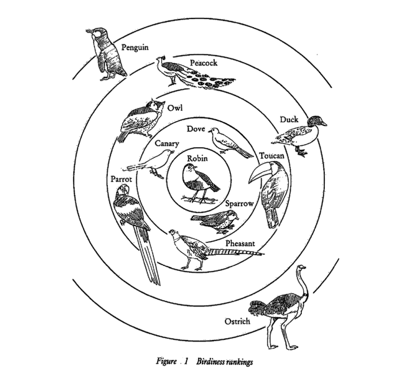
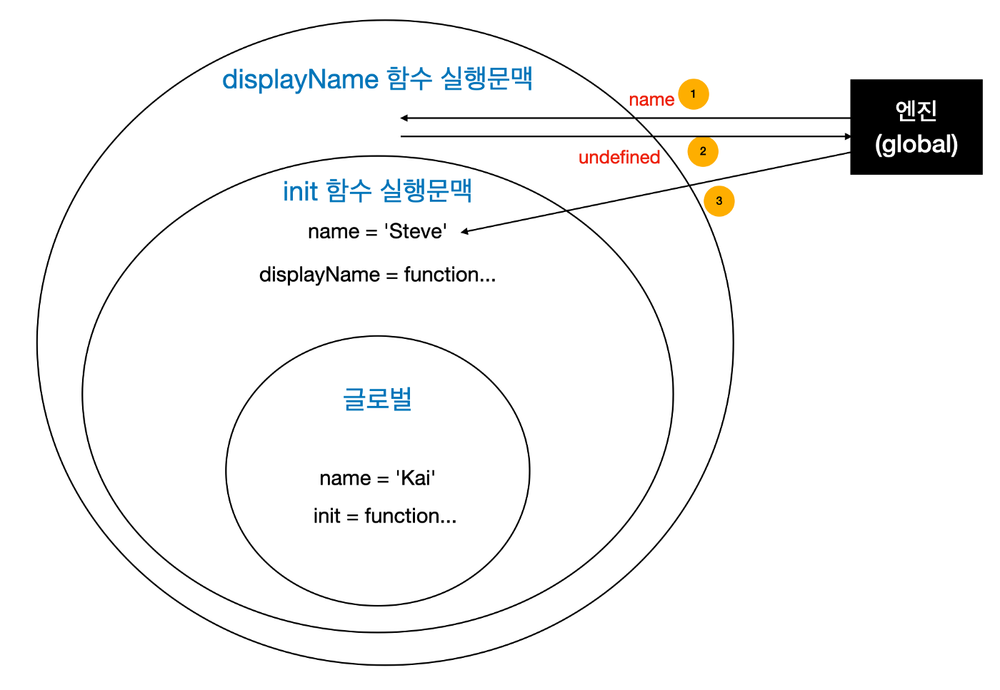

> 임성묵님의 [자바스크립트는 왜 프로토타입을 선택했을까](https://medium.com/@limsungmook/%EC%9E%90%EB%B0%94%EC%8A%A4%ED%81%AC%EB%A6%BD%ED%8A%B8%EB%8A%94-%EC%99%9C-%ED%94%84%EB%A1%9C%ED%86%A0%ED%83%80%EC%9E%85%EC%9D%84-%EC%84%A0%ED%83%9D%ED%96%88%EC%9D%84%EA%B9%8C-997f985adb42) 포스팅과 모던자바스크립트 딥다이브 등을 읽으며 프로토타입 관련 개념에 대해 정리한 내용입니다.

# 자바스크립트에서 프로토타입이란?

- 객체는 자신을 만드는데 사용된 원형인 프로토타입 객체를 참조하고 있다.
  - 즉, 객체 안에 `숨겨진 링크` 인 `proto 속성`이 있고, 이는 자신을 만들어낸`원형`인`프로토타입 객체`를 참조한다. 이러한 링크를`프로토타입`이라고 한다.

## 프로토타입 체이닝

 어떤 데이터의 `proto 속성`내부에서 다시 `proto 속성`이 또 다시 연쇄적으로 이어지는데, 이를`프로토타입 체인`이라 하고, 이 체인을 따라가며 검색하는 것을`프로토타입 체이닝` 이라고 한다.

- 자바스크립트는 객체의 프로퍼티(메서드 포함)에 접근하려고 할 때 해당 객체에 접근하려는 프로퍼티가 없다면 `[[Prototype]]` 내부 슬롯의 참조를 따라 자신의 부모 역할을 하는 프로토타입의 프로퍼티를 순차적으로 검색한다. 이를 프로토타입 체인이라 한다. 프로토타입 체인은 자바스크립트 객체지향 프로그래밍의 상속을 구현하는 메커니즘이다.

## 프로토타입의 생성 시점

프로토타입은 `생성자 함수가 생성되는 시점`에 더불어 생성된다. 즉, 프로토타입과 생성자 함수는 항상 쌍으로 존재한다.

### 생성자 함수는 어떻게 생성될까?

- 생성자 함수로서 호출할 수 `있는` 함수

  - 일반 함수(`함수 선언문`, `함수 표현식`)
  - 일반 함수는 constructor이며, 함수 객체를 생성하는 시점에 프로토타입도 더불어 생성한다.

```jsx
function Person(name) {
    this.name = name
}

console.log(Person.prototype) // {constructor: ƒ}
new Person('Marco') // Person {name: 'Marco'}
```

- 생성자 함수로서 호출할 수 `없는` 함수

  - `화살표 함수`, `ES6 메서드 축약 표현`
  - non-constructor이며, 프로토타입이 생성되지 않는다.

  ```jsx
  // 화살표 함수는 non-constructor다.
  const Person = name => {
      this.name = name
  }

  // non-constructor는 프로토타입이 생성되지 않는다.
  console.log(Person.prototype) // undefined
  new Person('Marco') // Uncaught TypeError: aPerson is not a constructor
  ```

### 왜 이렇게 생성자 함수로서 호출할 수 없는 함수가 도입되었을까?

- 기존의 `일반 함수`의 경우, new 연산자와 함께 호출하면 생성자 함수로 동작하고, new 연산자가 없으면 자동으로 일반 함수로 호출하게 된다.
- 이는 유연한 문법을 제공한다는 장점이 있지만, 반대로 사용자가 `실수할 가능성`을 높인다는 단점이 있다.
- 따라서 ES6 이후부터는 함수의 목적에 맞는 함수 선언 방법을 3가지(일반함수, 화살표 함수, ES6의 메서드 축약 표현)의 종류로 구분하였다.

# 자바스크립트는 왜 프로토타입을 선택했을까?

프로토타입은 자바스크립트의 상속을 지원하기 위한 방법이다. 그런데 왜 다른 언어처럼 `클래스` 가 아니라 `프로토타입` 일까?

- 그 이유는 자바스크립트가 접근한 `철학적 사고방식` 에서 기원한다. 클래스와 프로토타입은 객체를 바라보는 개념 자체가 완전히 다르다.

## 클래스 기반 객체지향 언어는?

우선 프로토타입과 대척점인 `클래스 기반 객체지향 언어` 에 대해 살펴보자.

- `클래스 기반 객체지향 언어` (Java, C# 등)은 플라톤 철학에 따라 `“현실 세계에 존재하는 모든 것에는 반드시 본질(이데아)이 존재한다”` 고 가정한다.
- 또한, 플라톤 철학을 계승한 아리스토텔레스는 속성에 따라 모든 것을 `분류(Classification)` 할 수 있다고 본다.
- 즉, `프로퍼티`가 유사한 객체가 있다면 `일반화 과정`을 통해 `클래스`로 추상화될 수 있다고 본다.

## 분류(Classification) 개념에 대한 반박한 비트겐슈타인(의미사용이론, 가족 유사성 이론)

- 비트겐슈타인은 서양 철학의 전통적인 아리스토텔레스의 분류 개념을 반박하며, “_사실상 올바른 분류란 없다_”고 주장했다.
  - “_세계에 미리 내재되어서 대상과 언어를 완전히 규정하는 어떤 언어란 존재하지 않는다_”
  - 예를 들어, ‘게임’의 경우 실제 여러 게임들 간의 `공통 속성`은 사실상 없음을 알 수 있다.
- 즉, `속성(프로퍼티)` 으로 분류하는 Java로 개발하면, 최적의 클래스 설계를 찾는 것이 어려워 `확장성`을 고려하면 좋은 방식이 아닐 수도 있다.
- 비트겐슈타인은 `의미사용이론` 과 `가족 유사성 이론` 을 주장했다.
  - 의미사용이론이란, 단어의 진정한 본래의 의미란 존재하지 않고 상황과 맥락에 의해서 결정된다고 주장한다.
  - 가족유사성 이론은, 현실에서 대상을 분류할 때 `공통 속성`이 아닌 `유사성`을 통해 분류한다고 주장한다.

## Rosch의 프로토타입 이론

- 1975년 인지심리학자 Rosch는 비트겐슈타인의 이론을 바탕으로, 실험을 통해 `프로토타입 이론` 을 주장했다.
- 로쉬는 “인간은 ‘등급이 매겨진 (개념) 구조(graded structure)’를 가진다”라고 주장한다.
  - 인간은 사물을 분류할 때 자연스럽게 `유사성` 이 높은 순서대로 등급을 매긴다. 이렇게 분류했을 때 `가장 높은 유사성 등급을 가진 것`이 바로 `프로토타입` 이다.
- 즉, 객체는 `정의` 로부터 분류되는 것이 아니라, 현실에 존재하는 것 중 가장 좋은 `본보기` 를 `원형(프로토타입)` 으로 선택하여, 이로부터 범주화되는 것이다.

## 프로토타입 기반 객체지향 프로그래밍

- 프로토타입 언어에서는 `분류`를 우선하지 않는다. 생성된 객체 위주로 `유사성`을 정의한다.
  - 즉, 개별 객체(instance) 수준에서 메소드와 변수를 추가할 수 있다. 개별 객체 수준에서 객체를 수정하고 발전시키는 능력은 **`선험적 분류의 필요성을 줄이고` `반복적`인 프로그래밍 및 디자인 스타일**을 장려
- 어휘, 쓰임새는 `맥락(context)`에 의해 평가된다.

  - 실행 컨텍스트, 스코프 체인, 클로저, this, 호이스팅 등등이 모두 프로토타입의 `맥락` 을 표현하기 위한 것이다.
- ‘참새'는 새의 범주를 대표할 만한 가장 전형적인 녀석이라고 한다. 이 녀석을 ‘원형(prototype)'으로 간주해보자. 그러면 닭의 프로토타입이 참새라고 하면,
  - 닭1의 프로토타입은 참새1이다.
  - 닭1에 없는 속성은 프로토타입 체인을 통해 위로 참조된다.
  - 닭1에서 속성을 변경해도 프로토타입인 참새1은 변하지 않는다.(아래에서 위로 변경 X)
  - 프로토타입인 참새1에서 속성을 변경하면 닭1에서 동일한 속성이 변경된다.(위에서 아래로 변경 O)
  - 그리고 닭은 오리의 프로토타입이 될 수 있다. `참새→ 닭 → 오리` (프로토타입 체이닝)
- 개별 인스턴스가 무엇인가의 프로토타입이 될 수 있다.


        출처 : <https://laurabecker.gitlab.io/classes/as/08-semantics.pdf>

```jsx
function 참새() {
    this.날개갯수 = 2
    this.날수있나 = true
}
const 참새1 = new 참새()

console.log('참새의 날개 갯수 : ', 참새1.날개갯수) // 2

function 닭() {
    this.벼슬 = true
}
닭.prototype = 참새1 // reference(오른쪽이 인스턴스인 점 주목)
const 닭1 = new 닭()
console.log('닭1 날개 : ', 닭1.날개갯수, ', 날수있나? ', 닭1.날수있나) // 2, true
닭1.날수있나 = false
console.log('다시 물어본다. 닭1은 날 수 있나? :', 닭1.날수있나) // false
// 아래는 고전적인 방식의 프로토타입 연결
function 펭귄() {
    참새.call(this) // copy properties
}
펭귄.prototype = Object.create(참새.prototype) // 프로토타입 연결
const 펭귄1 = new 펭귄()
console.log(
    '펭귄1 날개 : ',
    펭귄1.날개갯수,
    ', 날수있나? ',
    펭귄1.날수있나
) // 2, true
펭귄1.날수있나 = false
console.log('다시 물어본다. 펭귄1은 날 수 있나? :', 펭귄1.날수있나) // false
```

# 호이스팅이란?

실행 컨텍스트 생성 시 렉시컬 스코프 내의 선언이 끌어올려 지는 것이다

- 자바스크립트 엔진은 코드가 로드될 때 실행 컨텍스트를 생성하고 그 안에 선언된 변수, 함수를 실행 컨텍스트 최상단으로 호이스팅한다. 이러한 범위를 렉시컬 스코프라 한다.

  ```jsx
  // 전역 실행컨텍스트 생성. 전체 정의(name, init) 호이스팅
  var name = 'Kai'
  init() // init 실행컨텍스트 생성. 내부 정의(name, displayName) 호이스팅
  function init() {
      var name = 'Steve'
      function displayName() {
          // var name = 'troll?'; // 주석 해제되면 호이스팅
          console.log(name) // 현재 실행컨텍스트 내에 정의된게 없으니 outer 로 chain
      }
      displayName() // displayName 실행컨텍스트 생성. 내부 정의 호이스팅.
  }
  ```


출처: [자바스크립트는 왜 프로토타입을 선택했을까 | 임성묵](https://medium.com/@limsungmook/%EC%9E%90%EB%B0%94%EC%8A%A4%ED%81%AC%EB%A6%BD%ED%8A%B8%EB%8A%94-%EC%99%9C-%ED%94%84%EB%A1%9C%ED%86%A0%ED%83%80%EC%9E%85%EC%9D%84-%EC%84%A0%ED%83%9D%ED%96%88%EC%9D%84%EA%B9%8C-997f985adb42)

위 그림에서는 가장 바깥 원에서부터 안쪽 원으로 Scope Chain 을 하게 된다.

## 프로토타입 언어인 자바스크립트에 도대체 왜 ‘실행 문맥', ‘렉시컬 스코프', ‘호이스팅'이 존재하는가 ?

- 프로토타입 철학의 근원인 비트겐슈타인류에서 가장 중요하게 생각하는 것이 바로 ‘어휘'이고 이것은 ‘문맥(context)’ 내에서만 의미를 가진다는 것이 핵심이다. ‘실행 문맥', ‘렉시컬 스코프', ‘호이스팅'은 이 핵심을 자바스크립트에서 구현하기 위해 자연스럽게 발생한 특징이다.
  - 예시에서 name은 어디에서나 같은 것이 아니고, 맥락 즉 실행컨테스트에 따라 다른 의미를 가졌다.

# 스코프와 스코프체인이란?

- 스코프는 어떤 변수들에 접근할 수 있는 유효범위로 코드 어디서든 참조할 수 있는 전역스코프, 함수 자신과 하위 함수에서만 참조할 수 있는 지역스코프가 있다.
- 함수안에서 선언된 변수는 해당 함수안에서만 사용할 수 있으니 전역변수에 영향을 끼칠 수 없다. 내부함수는 호출된 변수를 찾기위해 먼저 자신의 스코프에서 찾고 없으면 한단계씩 외부로 나가면서 찾는다. 이렇게 꼬리를 물고 계속 범위를 넓히면서 찾는 관계를 스코프 체인이라고 부른다.

# this란?

- 비트겐슈타인은 그의 대표적인 저서 ‘철학적 탐구'에서 단어의 쓰임새가 곧 의미라는 점을 강조했다(의미사용이론). ‘벽돌!’이라고 크게 외칠 때, 그것이 어디서 ‘발화’되느냐에 따라서 단어의 의미가 달라졌다.
- “벽돌!”
  - (벽돌이 필요할 때) : 벽돌을 달라
  - (벽돌로 보수해야 할 때) : 벽돌을 채우라
  - (벽돌이 떨어질 때) : 벽돌을 피해라
- 어디서 ‘발화’되느냐에 따라서 단어의 의미가 달라진다. 즉, 실행컨텍스트에 따라서 같은 단어도 의미가 달라진다.
- 이것이 바로 프로토타입과 클래스의 대표적인 차이이다. 전혀 다르게 단어를 보는 방식이고 중요한 세계관의 차이이다. 미리 분류하고 정의한 클래스를 가장 중요하게 여기는 전통적인 방식과는 달리, 프로토타입에서는 받아들이는 주체와 문맥이 가장 중요하다. 프로그래밍으로 보자면 실행(invoke)하는 ‘객체' 가 중요하다는 의미이다.

```jsx
foo.bar()
bar.call(foo)
var boundBar = bar.bind(foo)
```

- 위처럼 foo 객체를 통해 발화한 함수는 내부 this 가 무조건 foo 를 가리킨다. 만약 아무것도 지정되어있지 않으면 글로벌(브라우져라면 window)을 가리킨다.
- this가 헷갈린다면, 발화지점(실행컨텍스트)을 생각하라.

> 참고자료
>
> - 모던 자바스크립트 딥다이브
> - [자바스크립트는 왜 프로토타입을 선택했을까](https://medium.com/@limsungmook/%EC%9E%90%EB%B0%94%EC%8A%A4%ED%81%AC%EB%A6%BD%ED%8A%B8%EB%8A%94-%EC%99%9C-%ED%94%84%EB%A1%9C%ED%86%A0%ED%83%80%EC%9E%85%EC%9D%84-%EC%84%A0%ED%83%9D%ED%96%88%EC%9D%84%EA%B9%8C-997f985adb42)
