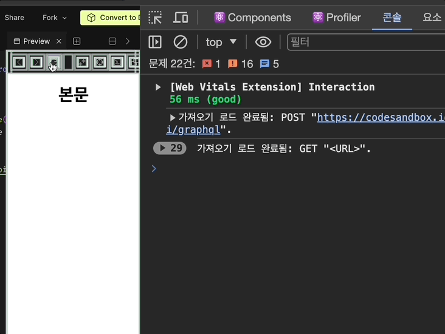
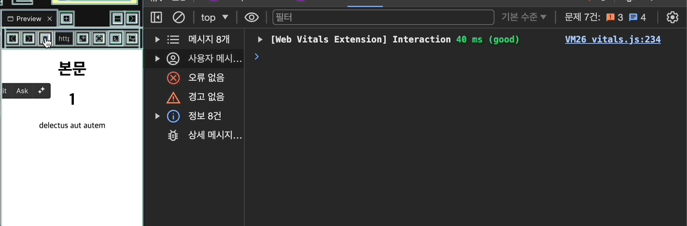
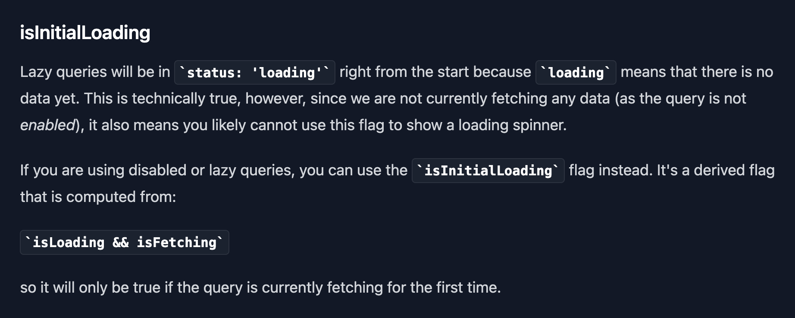
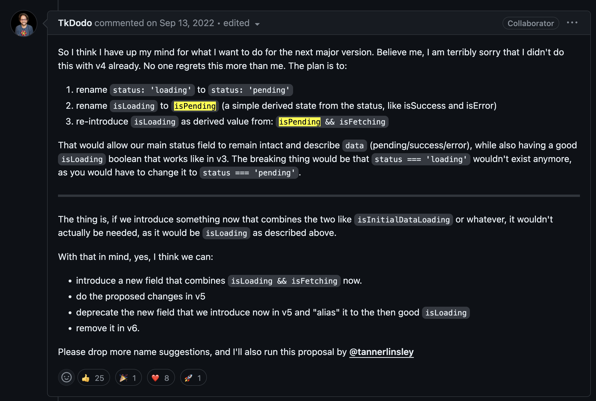
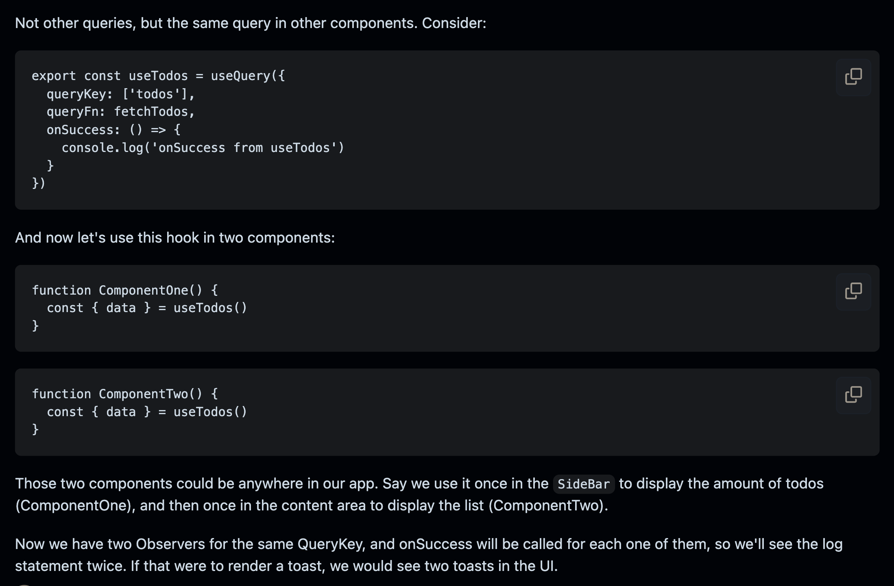
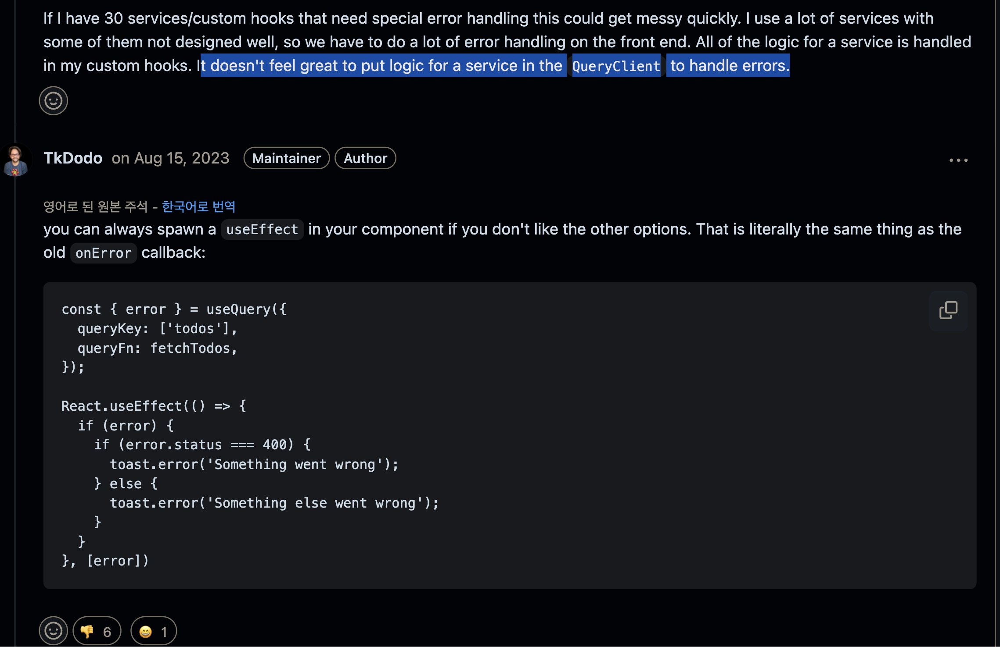

## 1. (v4) idle 상태가 제거됨

더 나은 오프라인 기능 지원을 위해 `fetchStatus` 라는 새 status를 도입하게 되었고, 이 `fetchStatus` 에  `'idle'` 이 포함됩니다.

따라서 기존 `status` 에 있던 `idle` 상태는 제거됩니다.

이제 실제로 data를 fetch하지 않아도 query는 `loading` 상태가 될 수 있다는 점을 명심해야 합니다.

- [왜 status 외에 fetchStatus라는 상태가 추가로 필요한가요?](https://tanstack.com/query/v4/docs/react/guides/queries#why-two-different-states)
  - 백그라운드 리페치와 stale-whiel-revalidate 로직은 `status`와 `fetchStatus`의 조합을 통해 가능합니다.
  - 예를 들어, `success` 상태의 쿼리는 보통 `idle` 상태의 `fetchStatus`를 가지지만, 백그라운드 리페치가 일어나고 있다면 `fetching` 상태일 수도 있습니다.
  - 마운트된 쿼리가 데이터가 없다면, 보통 `loading` status와 `fetching` fetchStatus를 가지지만, 네트워크 연결이 없다면 `paused`  fetchStatus를 일 수도 있습니다.
  - 따라서 쿼리는 `loading` 상태이지만 실제로 데이터를 fetch하고 있지 않을 수도 있다는 점을 명심해야 합니다.
    - `status` 는 `data` 에 대한 정보를 줍니다: “그 데이터 갖고 있어 없어?”
    - `fetchStatus` 는 `queryFn` 에 대한 정보를 줍니다. “호출중이야 아니야?”

- 이러한 변화는 아직 `data` 가 없는 쿼리를 `disabled` 하고 `isLoading` 을 사용했던 경우에 가장 많은 영향을 미칩니다.
  - 이 때문에 v4가 처음 나왔을 때 혼란을 겪은 이슈[useQuery return always isLoading with true when enabled is false #3975](https://github.com/TanStack/query/issues/3975)

### v3의 status 확인

- v3에서는 `idle` 상태가 있었기에, disabled인 쿼리들은 `idle` 상태부터 시작했습니다. `loading` 은 그 다음이었습니다.
- `enabled: false` 이고 캐시된 데이터가 없다면 `isIdle` 은 true입니다. 그리고 이 때  `isLoading` 은 false 입니다.
- enabled 옵션을 제어하는 경우, 이전 isLoading 은 `false` (idle이면) → `true` (fetch 시작 로딩중) → `false` (로딩끝) 3단계 변화가 있었습니다.



[react-query v3 demo - codesandbox](https://codesandbox.io/p/sandbox/react-yeje-react-query-deiteo-pecing-raibeureori-forked-33qhmc?layout=%7B%22sidebarPanel%22%3A%22EXPLORER%22%2C%22rootPanelGroup%22%3A%7B%22direction%22%3A%22horizontal%22%2C%22contentType%22%3A%22UNKNOWN%22%2C%22type%22%3A%22PANEL_GROUP%22%2C%22id%22%3A%22ROOT_LAYOUT%22%2C%22panels%22%3A%5B%7B%22type%22%3A%22PANEL_GROUP%22%2C%22contentType%22%3A%22UNKNOWN%22%2C%22direction%22%3A%22vertical%22%2C%22id%22%3A%22clr8160nq00063b6i5a2v9r7j%22%2C%22sizes%22%3A%5B70%2C30%5D%2C%22panels%22%3A%5B%7B%22type%22%3A%22PANEL_GROUP%22%2C%22contentType%22%3A%22EDITOR%22%2C%22direction%22%3A%22horizontal%22%2C%22id%22%3A%22EDITOR%22%2C%22panels%22%3A%5B%7B%22type%22%3A%22PANEL%22%2C%22contentType%22%3A%22EDITOR%22%2C%22id%22%3A%22clr8160nq00023b6iqyhlff4o%22%7D%5D%7D%2C%7B%22type%22%3A%22PANEL_GROUP%22%2C%22contentType%22%3A%22SHELLS%22%2C%22direction%22%3A%22horizontal%22%2C%22id%22%3A%22SHELLS%22%2C%22panels%22%3A%5B%7B%22type%22%3A%22PANEL%22%2C%22contentType%22%3A%22SHELLS%22%2C%22id%22%3A%22clr8160nq00033b6ip1b2bazh%22%7D%5D%2C%22sizes%22%3A%5B100%5D%7D%5D%7D%2C%7B%22type%22%3A%22PANEL_GROUP%22%2C%22contentType%22%3A%22DEVTOOLS%22%2C%22direction%22%3A%22vertical%22%2C%22id%22%3A%22DEVTOOLS%22%2C%22panels%22%3A%5B%7B%22type%22%3A%22PANEL%22%2C%22contentType%22%3A%22DEVTOOLS%22%2C%22id%22%3A%22clr8160nq00053b6i8gis4yjc%22%7D%5D%2C%22sizes%22%3A%5B100%5D%7D%5D%2C%22sizes%22%3A%5B63.22449285890176%2C36.77550714109824%5D%7D%2C%22tabbedPanels%22%3A%7B%22clr8160nq00023b6iqyhlff4o%22%3A%7B%22id%22%3A%22clr8160nq00023b6iqyhlff4o%22%2C%22tabs%22%3A%5B%5D%7D%2C%22clr8160nq00053b6i8gis4yjc%22%3A%7B%22tabs%22%3A%5B%7B%22id%22%3A%22clr8160nq00043b6i3lbz88kd%22%2C%22mode%22%3A%22permanent%22%2C%22type%22%3A%22UNASSIGNED_PORT%22%2C%22port%22%3A0%2C%22path%22%3A%22%2F%22%7D%5D%2C%22id%22%3A%22clr8160nq00053b6i8gis4yjc%22%2C%22activeTabId%22%3A%22clr8160nq00043b6i3lbz88kd%22%7D%2C%22clr8160nq00033b6ip1b2bazh%22%3A%7B%22tabs%22%3A%5B%5D%2C%22id%22%3A%22clr8160nq00033b6ip1b2bazh%22%7D%7D%2C%22showDevtools%22%3Atrue%2C%22showShells%22%3Atrue%2C%22showSidebar%22%3Atrue%2C%22sidebarPanelSize%22%3A15%7D)

- Status(v3)
  - `status === 'idle'`  : 쿼리가 현재 disabled 인 경우
  - `status === 'loading'`  : 쿼리에 데이터가 없고, 현재 fetching 중일 때
  - `status === 'error'` : 쿼리가 에러에 부딪혔을 때
  - `status === 'success'` : 쿼리가 성공했고 데이터 사용 가능할 때

### v4의 status와 fetchStatus 확인

- v4에서는 `idle` 상태가 사라지면서, disabled인 쿼리들이 `loading` 상태부터 시작하게 됩니다.
- `enabled: false` 이고 캐시된 데이터가 없다면 `isLoading` 은 true 입니다.
- enabled 옵션을 제어하는 경우,  이제 isLoading은 `true` (idle이거나 로딩중이면) → `false` (로딩끝) 2단계 변화만 있습니다.



[react-query v4 demo - codesandbox](https://codesandbox.io/p/sandbox/react-yeje-react-query-deiteo-pecing-raibeureori-forked-xh6s49?layout=%7B%22sidebarPanel%22%3A%22EXPLORER%22%2C%22rootPanelGroup%22%3A%7B%22direction%22%3A%22horizontal%22%2C%22contentType%22%3A%22UNKNOWN%22%2C%22type%22%3A%22PANEL_GROUP%22%2C%22id%22%3A%22ROOT_LAYOUT%22%2C%22panels%22%3A%5B%7B%22type%22%3A%22PANEL_GROUP%22%2C%22contentType%22%3A%22UNKNOWN%22%2C%22direction%22%3A%22vertical%22%2C%22id%22%3A%22clr81q62g00063b6henypo7tx%22%2C%22sizes%22%3A%5B70%2C30%5D%2C%22panels%22%3A%5B%7B%22type%22%3A%22PANEL_GROUP%22%2C%22contentType%22%3A%22EDITOR%22%2C%22direction%22%3A%22horizontal%22%2C%22id%22%3A%22EDITOR%22%2C%22panels%22%3A%5B%7B%22type%22%3A%22PANEL%22%2C%22contentType%22%3A%22EDITOR%22%2C%22id%22%3A%22clr81q62f00023b6hw2lhxmxv%22%7D%5D%7D%2C%7B%22type%22%3A%22PANEL_GROUP%22%2C%22contentType%22%3A%22SHELLS%22%2C%22direction%22%3A%22horizontal%22%2C%22id%22%3A%22SHELLS%22%2C%22panels%22%3A%5B%7B%22type%22%3A%22PANEL%22%2C%22contentType%22%3A%22SHELLS%22%2C%22id%22%3A%22clr81q62f00033b6h6ldjho6b%22%7D%5D%2C%22sizes%22%3A%5B100%5D%7D%5D%7D%2C%7B%22type%22%3A%22PANEL_GROUP%22%2C%22contentType%22%3A%22DEVTOOLS%22%2C%22direction%22%3A%22vertical%22%2C%22id%22%3A%22DEVTOOLS%22%2C%22panels%22%3A%5B%7B%22type%22%3A%22PANEL%22%2C%22contentType%22%3A%22DEVTOOLS%22%2C%22id%22%3A%22clr81q62g00053b6hr6ffxs53%22%7D%5D%2C%22sizes%22%3A%5B100%5D%7D%5D%2C%22sizes%22%3A%5B55.96156917017086%2C44.03843082982914%5D%7D%2C%22tabbedPanels%22%3A%7B%22clr81q62f00023b6hw2lhxmxv%22%3A%7B%22tabs%22%3A%5B%7B%22id%22%3A%22clr81q62f00013b6h9utkm9z2%22%2C%22mode%22%3A%22permanent%22%2C%22type%22%3A%22FILE%22%2C%22filepath%22%3A%22%2Fsrc%2Findex.js%22%7D%5D%2C%22id%22%3A%22clr81q62f00023b6hw2lhxmxv%22%2C%22activeTabId%22%3A%22clr81q62f00013b6h9utkm9z2%22%7D%2C%22clr81q62g00053b6hr6ffxs53%22%3A%7B%22id%22%3A%22clr81q62g00053b6hr6ffxs53%22%2C%22tabs%22%3A%5B%7B%22id%22%3A%22clr81q62f00043b6h6nz6cemv%22%2C%22mode%22%3A%22permanent%22%2C%22type%22%3A%22UNASSIGNED_PORT%22%2C%22port%22%3A0%2C%22path%22%3A%22%2F%22%7D%5D%2C%22activeTabId%22%3A%22clr81q62f00043b6h6nz6cemv%22%7D%2C%22clr81q62f00033b6h6ldjho6b%22%3A%7B%22tabs%22%3A%5B%5D%2C%22id%22%3A%22clr81q62f00033b6h6ldjho6b%22%7D%7D%2C%22showDevtools%22%3Atrue%2C%22showShells%22%3Atrue%2C%22showSidebar%22%3Atrue%2C%22sidebarPanelSize%22%3A15%7D)

- Status(v4)
  - `status === 'loading'` : 쿼리에 데이터가 없을 때
    - (+) 쿼리가 현재 disabled 인 경우
  - `status === 'error'` : 쿼리가 에러에 부딪혔을 때
  - `status === 'success'` : 쿼리가 성공했고 데이터 사용 가능할 때
- FetchStatus(v4)
  - **`fetchStatus === 'idle'`** - 쿼리가 현재 어떤 것도 하고 있지 않을 때
  - **`fetchStatus === 'fetching'`** : 쿼리가 현재 fetching 중일 때
  - **`fetchStatus === 'paused'`** - 쿼리는 fetch 하길 원하나, 중지되었을 때. 관련해서는  **[Network Mode](https://tanstack.com/query/v4/docs/react/guides/network-mode) 를 참고**

### v3에서 v4로 마이그레이션

- v4에서 v3에서 쓰던 `isLoading` 같은 동작을 유지하려면,  `isLoading` 대신 `isInitialLoading` 을 사용할 수 있습니다.
  - (참고) v3의 `isLoading` 과 v4의 `isInitialLoading` 은 동일하게 동작합니다.
- 그런데 v4 베타버전 사용중이라 `isInitialLoading` 이 없다면,  동일하게 동작하는 `isLoading && sFetching` 을 사용할 수 있습니다.



<https://tanstack.com/query/v4/docs/react/guides/disabling-queries>

### v5에서는..?

- 또 rename됩니다.
  - ****`status: loading` →`status: pending`**
  - ****`isLoading` → `isPending`**
  - ****`isInitialLoading` → `isLoading`**
    - v3에서 v5로 바로 넘어가면,  `isLoading` 동작은 동일함
- 사실 이는 v4에서 발생했던 위와 같은 문제 때문에, v4 초기부터 예정된 v5의 변화였습니다.

    

## 2. (v5) useQuery에서 onSuccess, onError, onSettled 콜백이 제거됨

[RFC: remove callbacks from useQuery · TanStack/query · Discussion #5279](https://github.com/TanStack/query/discussions/5279)

- `v4`까지 있던 onSuccess, onError, onSettled Callback은 `useQuery` 옵션에서 [@Deprecated](https://github.com/TanStack/query/pull/5353)됐습니다. (단, `useMutation`에서는 사용 가능합니다.)

### 왜 제거했을까?

- 예상대로 동작하지 않을 가능성이 높은 나쁜 API이기 때문입니다.
  - useQuery에서 onSuccess, onError, onSettled는 query가 성공, 오류, 실행되었을 때 호출되는 콜백입니다. 그런데 컴포넌트에서 자식 컴포넌트나 형제 컴포넌트에서 해당 쿼리 훅을 중복하여 호출하면 정의한 콜백도 여러 번 호출되는 문제가 있습니다. 또한, useQuery 내부의 콜백을 사용한 구현은 한눈에 알아볼 수가 없는 문제가 있습니다.

        ```jsx
        export function useTodos() {
          return useQuery({
            queryKey: ['todos', 'list'],
            queryFn: fetchTodos,
            onError: (error) => {
              toast.error(error.message)
            },
          })
        }
        ```

        

### 대안: global callback이나 useEffect에서 콜백 구현

- `QueryClient` 설정 시, 전역 queryCache에 글로벌 콜백(onSuccess, onError, onSetteld)을 전달하는 것이 좋은 해결 방법입니다. 이 글로벌 콜백은 Query당 한 번만 호출됩니다.

        ```jsx
        const queryClient = new QueryClient({
            queryCache: new QueryCache({
            onError: (error) =>
                toast.error(`Something went wrong: ${error.message}`),
            }),
        })
        ```

  - Query마다 onError에서 다른 메세지를 보여주려면 Query의 `meta` 필드를 이용
    - `meta` 객체에 전달한 값은 해당 Query에 접근할 수 있는 모든 곳에서 사용할 수 있습니다.

          ```jsx
          const queryClient = new QueryClient({
              queryCache: new QueryCache({
              onError: (error, query) => {
                  if (query.meta.errorMessage) {
                  toast.error(query.meta.errorMessage)
                  }
              },
              }),
          })
          
          export function useTodos() {
              return useQuery({
              queryKey: ['todos', 'list'],
              queryFn: fetchTodos,
              meta: {
                  errorMessage: 'Failed to fetch todos',
              },
              })
          }
          ```

- useEffect를 사용한 콜백 구현
  - 에러 핸들링을 하기 위한 서비스 로직을 QueryClient에 넣는 것이 끌리지 않을 수 있습니다. useEffect를 사용하면 이전에 useQuery의 콜백을 사용한던 것과 동일한 효과입니다.

        

- 현재 v4를 사용하더라도 나중에 v5로 버전 업데이트하면 이 부분이 큰 브레이킹 체인지가 될 수 있으니 미리 컨벤션을 맞추고 기존 코드도 리팩터링을 하는 것이 좋습니다. `useQuery`에서는 onSuccess, onError, onSettled 콜백을 사용하지 말고, `QueryClient` 나 `useEffect` 에서 처리해야 합니다.

## [참고] react-query 사용 시 멘탈 모델 - Service Layer Pattern

- useQuery에서 `onSuccess` 에 대한 여러 사용 케이스가 있지만, 다음 케이스들이 일반적입니다.
    1. UI 알림
        - `useQuery` 의 경우, GET API 호출 성공 시 사용자에게 알림을 주는 경우가 있을 수 있으나, 그 유용성에 대해서는 의문입니다.
    2. Data 조작
        - 데이터 조작은 순수한 네트워크 요청 단계에서 이뤄져야 합니다. 그게 아니면, 차라리 데이터 조작이 필요한 컴포넌트의 가까이에서 이뤄지게 하는 것이 적절합니다.
    3. 연쇄적 호출 (A 응답값이 B 요청을 하기 위해 필요한 경우)
        - 연쇄적 호출은 [dependent-queries](https://tanstack.com/query/v4/docs/react/guides/dependent-queries) 패턴을 따라서 layer 4에서 하거나, layer 1에서 처리합니다.

### Layer 1: 순수한 네트워크 요청

- 이 레이어는 네트워크 호출을 실행하고 데이터를 반환하는 것만 합니다.
- HTTP 응답값에서 복잡한 객체를 프론트엔드에서 사용할만한 데이터 형태로 매핑하거나 에러를 노멀라이징하는 추가 로직도 수행할 수 있습니다.

```tsx
export const fetchById= (id: string) => {
  try {
    const data = await apiClient.getById(id);
    return mapBadAPIContractToGoodClientContract(data)
  } catch (e: unknown) {
    throw ServiceErrorFactory.create(e)
  }
};
```

### Layer 2: API 상태 (Hook)

- 이 레이어는 Layer 1의 네트워크 요청을 실행하고, 그것을 `react-query` 에 캐싱하는 역할만 수행합니다.
- 옵션을 전달하고, stale time들을 변경하는 등 `react-query` 가 허용하는 어떤 것이든 할 수 있습니다. 하지만 `onSuccess` 나 `onError` 에는 의존해서는 안 됩니다.
  - 만약 모든 호출자의 네트워크 응답값을 조작해야 한다면, Layer 1 에서 해야 합니다.
  - 만약 특정 호출자의 네트워크 응답값을 조작해야 한다면, Layer 3에서 해야 합니다.
  - 언제나 의미있는 응답값에 대한 연쇄적 호출이 필요하다면, Layer 1에서 해야 합니다. 그렇지 않으면, `react-query` 가 각각 캐싱하는 것을 허용하고, [dependent-queries](https://tanstack.com/query/v4/docs/react/guides/dependent-queries) 패턴을 따릅니다.
  - 알림 표시가 필요하다면, Layer 3이나 Layer 4에서 합니다.

```tsx
export const useFetchById= (id: string) => {
const cacheKey = [CacheKey.FetchById, id]

  return useQuery<FetchByIdResponse, ServiceError>(
    cacheKey,
    () => fetchById(id),
    {
      enabled: Boolean(id)
    },
  )
}
```

### Layer 3: Page Hook (Optional)

- 페이지 훅에서 Layer 2 훅을 감싸서, 리액트 컴포넌트 내부의 비즈니스 로직을 이곳으로 분리할 수 있고, Layer 2로부터 그러한 비즈니스 로직을 완전히 제거할 수도 있습니다. 페이지 훅은 옵셔널입니다.

```tsx
export const usePageWithId= (id: string) => {
  const {
    data,
    error,
    isLoading,
    isSuccess,
    isError
} = useFetchById(id)

  /**
   * (optional) 네트워크 에러를 리액트 컴포넌트로 mapping
   */
  let errorFallbackComponent: ReactNode | undefined
  if (isError) {
    errorFallbackComponent = mapErrorToFallbackComponent(error?.code)
  }

  /**
  * (optional) 응답값을 컴포넌트 props 데이터로 mapping
   */
  let props: PageWithIdProps| undefined
  if (data) {
    props = mapMyDataToMyComponentProps(data)
  }

  /**
   * (optional) API 호출 성공 시 액션
   */
  useEffect(() => {
    if (isSucces) {
      showToastNotification('Success!')
    }
  }, [isSuccess])

  /**
   * (optional) API 호출 실패 시 액션
   */
  useEffect(() => {
    if (isError) {
      showToastNotification('Error!')
    }
  }, [isError])

  return { props, isLoading, isError, errorFallbackComponent }
}
```

### Layer 4: Page Building

- Layer 3의 페이지 훅을 호출하거나,  Layer 2의  `useQuery` 훅을 호출하여 페이지를 만들 수 있습니다.

```tsx
export const PageWithId= ({id}: {id: string}) => {
  const {
    props,
    isError,
    isLoading,
    errorFallbackComponent,
  } = usePageWithId(id);

// Layer 3 이 없다면, 아래와 같은 일반적인 useQuery 훅을 호출
//  const {
//    data,
//    error,
//    isLoading,
//    isSuccess,
//    isError
//  } = useFetchById(id)

  if (isLoading) {
    return <Loading />;
  }

  if (isError) {
    return errorFallbackComponent;
  }

  return <PageTemplate {...props} />;
};
```
