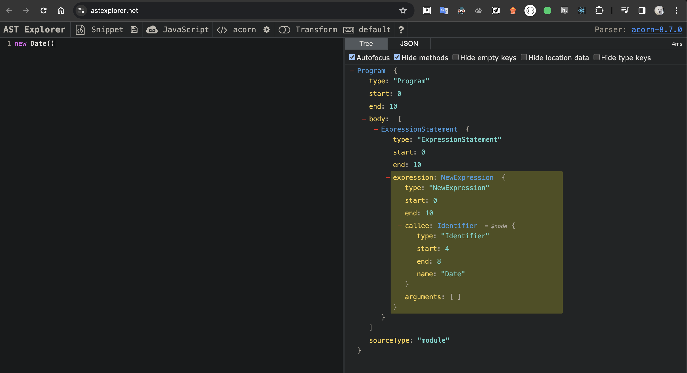
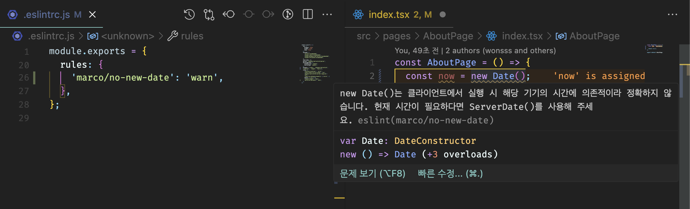

기존에 만들어진 유명한 ESLint Plugin을 사용만 해봤는데, 나만의 혹은 속한 조직의 코딩 컨벤션을 반영하는 ESLint Plugin을 만들어보고 싶다는 생각이 들었다.
ESLint Plugin을 만들기 전에 ESLint를 활용한 정적 코드 분석이란 무엇인지 알아보고, ESLint Plugin을 만들어보자.

## ESLint를 활용한 정적 코드 분석이란

-   정적 코드 분석
    -   정적 코드 분석이란 코드의 실행과는 별개로 코드 그 자체만으로 코드 스멜을 찾아내어 문제의 소지가 있는 코드를 사전에 수정하는 것을 의미한다.
    -   자바스크립트 생태계에서 가장 많이 쓰는 정적 코드 분석 도구는 ESLint이다.
-   ESLint가 코드 분석하는 과정

    1. 자바스크립트 코드를 문자열로 읽는다.
    2. 자바스크립트 코드를 분석할 수 있는 파서(ESLint의 기본 파서는 [espree](https://github.com/eslint/espree))로 코드를 구조화한다.
    3. 2번에서 구조화한 트리를 AST(Abstract Syntax Tree)라 하며, 이 구조화된 트리를 기준으로 각종 규칙과 대조한다.
    4. 규칙과 대조했을 대 이를 위반한 코드를 알리거나(report) 수정한다(fix).

-   파서로 js나 ts 코드 분석하고 싶다면, <https://astexplorer.net/> 에서 확인 가능하다.

## ESLint Plugin 만들기

`new Date()`를 금지시키는 규칙을 예시로 만들어 보자.

### 1. 규칙 대상인 new Date()에 대해 AST로 분석한다



AST로 확인한 결과, 하나의 노드가 "NewExpression" 타입이며, callee.name이 "Date"이고, arguments.length가 0일 때 `new Date()` 노드인 것으로 판단할 수 있다.

### 2. [yeoman](https://yeoman.io/)과 [generator-eslint](https://www.npmjs.com/package/generator-eslint) 설치하여 나만의 eslint-plugin 패키지 만들기

-   `yo eslint:plugin`
    -   yeoman으로 eslint:plugin 설정 generate
-   `yo eslint:rule`
    -   커스텀 rule 만들기

```js
// lib/rules/no-new-date.js
/**
 * @fileoverview marco
 * @author marco
 */
"use strict"

/** @type {import('eslint').Rule.RuleModule} */
module.exports = {
	meta: {
		type: "suggestion",
		docs: {
			description: "disallow use of the new Date()",
			recommended: false,
		},
		fixable: "code",
		schema: [],
		messages: {
			message:
				"new Date()는 클라이언트에서 실행 시 해당 기기의 시간에 의존적이라 정확하지 않습니다. 현재 시간이 필요하다면 ServerDate()를 사용해 주세요.",
		},
	},

	create(context) {
		return {
			// AST로 확인한 결과, 금지해야 할 new Date() 노드는 NewExpression 타입이며, callee.name이 Date이고 arguments가 없는 경우이다.
			NewExpression(node) {
				if (
					node.callee.name === "Date" &&
					node.arguments.length === 0
				) {
					context.report({
						node,
						messageId: "message",
						fix: fixer => fixer.replaceText(node, "ServerDate()"), // fixer를 이용하여 ServerDate()로 대체하도록 한다.
					})
				}
			},
		}
	},
}
```

### npm publish

npm publish를 통해 npm에 [해당 플러그인 패키지](https://www.npmjs.com/package/eslint-plugin-marco) 배포를 완료하였다. 아래 명령어로 설치하여 사용할 수 있다.

`npm install eslint-plugin-marco --save-dev`

### 해당 eslint-rule 적용 결과 확인



> 참고 자료 : 모던 리액트 딥다이브 - 김용찬 -
