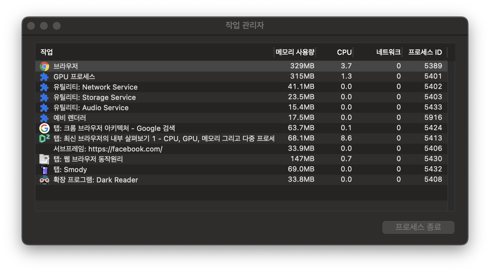
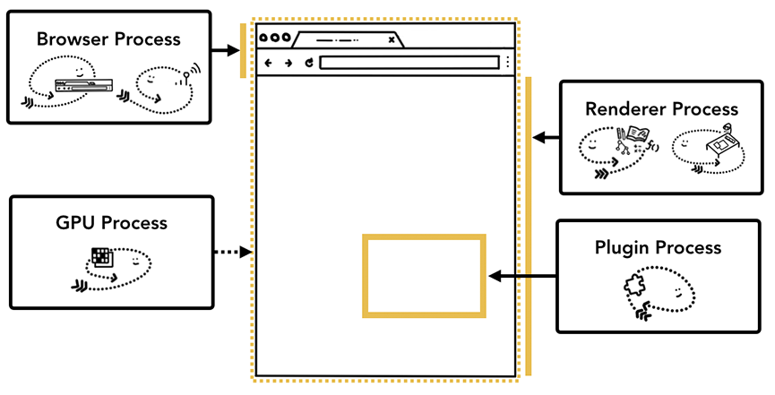
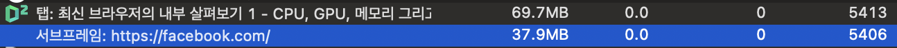
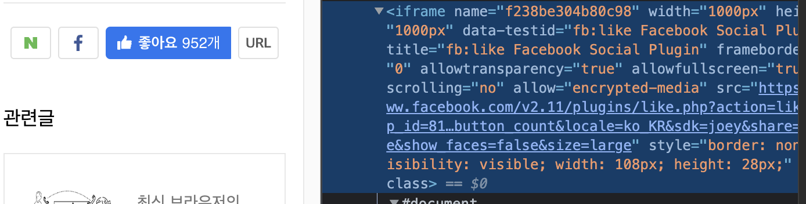
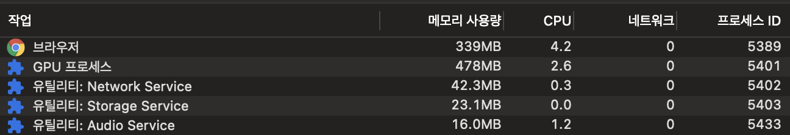
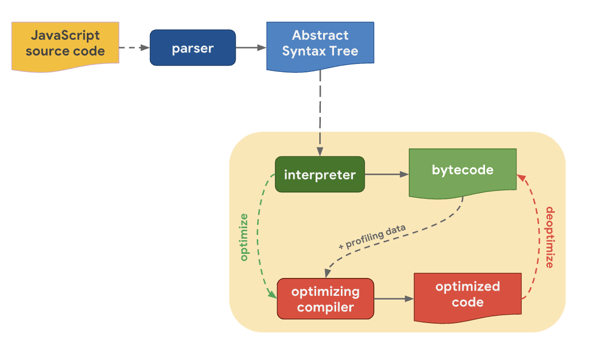

크롬 브라우저의 아키텍처, 웹페이지가 화면에 그려지는 과정, 성능 향상 방법 등을 중심으로 웹 브라우저의 동작원리에 대하여 여러 레퍼런스를 살펴보고 정리하였습니다. 주로 참고한 자료는 Google Developers의 [Inside look at modern web browser](https://developer.chrome.com/blog/inside-browser-part1/) 시리즈와 내용을 잘 번역해준 [네이버 D2](https://d2.naver.com/helloworld/2922312)입니다. 그러나 이 외에도 다양한 출처에서 관련 내용을 합쳐서 정리하였고 추가적으로 적은 내용 중 부정확한 내용이 있을 수도 있으니 참고하고 읽어주시길 바랍니다. 혹시 부정확한 내용이 있을 경우 댓글 등을 통해 문의해주시면 감사하겠습니다.

## 1. 크롬의 멀티프로세서 아키텍처

- 브라우저는 프로세스와 스레드를 어떻게 사용할까?
  - 스레드를 많이 사용하는 프로세스 하나만 사용할 수도 있고,
  - 스레드를 조금만 사용하는 프로세스를 여러 개 만들어 IPC로 통신할 수도 있다(크롬).
- 크롬의 브라우저 아키텍처
  - 크롬은 `탭`마다 프로세스를 할당(process per tab)했으나, 이제는 `사이트`(iframe에 있는 사이트 포함)마다 프로세스를 할당(process per site)한다.
  - 탭마다 `렌더러 프로세스`를 실행한다.

> 프로세스
>
> 프로세스는 운영체제로부터 메모리 등 자원을 할당받는 작업의 단위이다. 즉, 운영체제는 프로세스가 작업할 메모리 “한 조각”을 준다. 이 전용 메모리 공간에 애플리케이션의 모든 상태가 저장된다. 애플리케이션을 닫으면 프로세스가 사라지고 운영체제가 메모리를 비운다. 그리고 두 프로세스가 서로 정보를 공유해야 할 때는 IPC(프로세스간 통신)을 사용한다.

> 스레드
>
> 스레드는 프로세스가 할당받은 자원을 이용하는 실행의 단위이다. 같은 프로세스 내에 스레드끼리 프로세스 내의 주소 공간이나 자원들을 공유하면서 실행된다

### Chrome의 프로세스 종류

> Chrome 맞춤설정(점 세개) > 도구 더보기 > 작업 관리자

크롬의 작업 관리자를 열어보면, 크롬 애플리케이션에서 여러 개의 프로세스가 동시에 실행되고 있음을 확인할 수 있다.

- 브라우저 프로세스(크롬 앱 전체에서 1 프로세스만 존재)
  - 모든 렌더러 프로세스들을 관리한다.
  - 주소 표시줄, 북마크 막대, 뒤로가기 버튼, 앞으로가기 버튼 등 브라우저의 UI 영역을 제어한다.
  - 네트워크 요청이나 파일 접근과 같이 보이지 않으며 권한이 필요한 부분도 관리한다.
- 렌더러 프로세스(탭 1개당 프로세스 1개씩)
  - 탭 안에서 `웹 사이트가 표시`되는 부분의 모든 것을 처리한다
- GPU 프로세스(크롬 앱 전체에서 해당 프로세스 1개)
  - 브라우저에서 `하드웨어 가속`은 주로 GPU를 사용한 그래픽 작업의 가속을 의미한다
  - GPU는 여러 애플리케이션의 요청을 처리하고 같은 화면에 요청받은 내용을 그리기 때문에 별도의 프로세스로 분리되어 있다
- 서브프레임 (iframe 1개당 프로세스 1개씩)
- 확장프로그램 (확장프로그램 1개당 프로세스 1개씩)

### 다중 프로세스 아키텍처가 크롬에 주는 이점

1. [렌더러 프로세스 분리 - 탭 별 작동 가능성]
    - 각 탭이 독립적인 각각의 렌더러 프로세스에 의해 실행되므로, 어떤 탭이 응답하지 않더라도 다른 탭은 작동 가능하다.
    - 마찬가지로 브라우저 프로세스와 렌더러 프로세스는 서로 분리되어 있으므로, 웹 페이지를 그리다가 오류가 발생해도 브라우저 전체에는 문제가 발생하지 않는다.

2. [프로세스 기능 제한 - 보안]
   - 브라우저는 특정 프로세스가 특정 기능을 사용할 수 없게 제한할 수 있다. 예를 들어, 렌더러 프로세스는 웹 페이지를 실행할 수는 있지만, 임의의 파일에 접근할 수는 없다.
3. [사이트 격리 - 보안]
   - iframe의 사이트도 별도의 렌더러 프로세스에서 실행된다. 이를 통해 하나의 탭 내부에 여러 iframe들의 서로 다른 사이트 간에 메모리 공유가 방지되었다.
   - 동일 출처 정책(SOP)에 따르면 한 사이트는 다른 사이트의 동의 없이 그 사이트의 데이터에 접근할 수 없어야 하기 때문에, 이와 같이 iframe까지 사이트를 격리하는 것이 보안상 효과적이다.
   - 네이버 D2의 사이트에 페이스북 좋아요 기능을 위한 iframe이 있다. 작업관리자에서 이들을 확인하면, D2의 탭과 내부의 페이스북의 iframe이 서로 분리된 각자의 렌더러 프로세스로서 실행되고 있음을 확인할 수 있다.

### 메모리 사용 체계

- 프로세스 내부의 스레드 간에는 메모리를 공유할 수 있다. 하지만 프로세스들은 각자 전용 메모리 공간을 사용하므로, 프로세스가 많아지면 메모리 사용량이 그만큼 많아진다.
- 렌더러 프로세스의 메모리 절약 방법
  - 크롬은 메모리를 절약하기 위해 실행 가능한 프로세스의 총 개수를 제한한다. 기기의 메모리 용량과 CPU 성능에 따라 실행 가능한 프로세스의 총 개수는 다르다. 한도에 다다르면 열려 있는 탭 중에서 동일한 사이트들을 하나의 `렌더러 프로세스`로 모은다.
- 브라우저 프로세스의 메모리 절약 방법
  - 브라우저 프로세스에도 동일한 접근 방식이 적용된다. 성능이 좋은 하드웨어에서는 각 서비스(Network Service, Storage Service, Audio Service 등)를 여러 프로세스로 분할하여 안정성을 높이고, 리소스가 제한적인 장치에서 실행 중일 때에는 서비스들을 하나의 `브라우저 프로세스`에서 실행하여 메모리 사용량을 줄인다.

## 2. 내비게이션 과정에서 일어나는 일

- 사이트 요청
  - 브라우저의 페이지 렌더링 준비 과정
  - 내비게이션(사이트 간의 이동)에서 크롬의 여러 프로세스와 스레드의 역할
  - 내비게이션 과정의 속도 향상을 위한 서비스 워커와 내비게이션 프리로드

### 브라우저 프로세스에서 시작

- 브라우저 프로세스는 탭 영역 밖의 모든 부분(주소창, 네트워크, 저장소 등)을 제어한다.
- 브라우저 프로세스에는 UI 스레드, 네트워크 스레드, 스토리지 스레드 등이 있다.(참고로 성능이 좋은 하드웨어의 경우, 각 서비스가 개별 프로세스로 분리된다고 앞서 설명하였다)
- UI 스레드
  - 브라우저의 버튼과 주소창의 입력란 등을 그린다
- 네트워크 스레드
  - 인터넷에서 데이터를 가져오기 위한 네트워크 스택을 다룬다
- 스토리지 스레드
  - 파일에 대한 접근을 제어한다

즉, 주소 표시줄에 URL을 입력하면 브라우저 프로세스의 UI 스레드가 입력을 처리하는 것부터 시작한다.

### 내비게이션(사이트 이동)

- 1단계: 입력 처리
  - `UI 스레드`는 주소 표시줄에 입력된 내용을 파싱하여 검색어인지 URL인지 확인한다.
- 2단계: 내비게이션(사이트 이동) 시작
  - 주소 표시줄에 내용 입력 후 Enter 키를 누르면, 사이트 콘텐츠를 가져오기 위해 `UI 스레드`는  `네트워크 스레드` 에게 네트워크 호출을 요청한다.
  - `네트워크 스레드` 는 DNS Lookup 및 TLS 연결 설정과 같은 프로토콜을 거쳐 네트워크 요청(HTTP Request)을 처리한다.

    > DNS Lookup: DNS에서 호스트에 대한 IP 주소를 찾아서 확인한다.

    > TLS 연결 설정: 브라우저는 IP 주소에 있는 서버에게 랜덤한 숫자를 적은 번호표(Random Sequence)를 전달한다. 서버는 이에 대해 1을 더한 번호표를 브라우저에게 응답한다. 브라우저도 다시 1을 더한 번호표를 브라우저게 응답한다. 이는 데이터를 주고 받기 위해, 서로 번호표를 주고 받는 3 Way-Handshake 과정이다. 3 Way-Handshake 과정이 끝나면 브라우저는 서버에게 해당 IP에 있는 데이터를 요청한다.

- 3단계: 응답 읽기
  - 서버로부터 HTTP 응답을 받게 되면, `네트워크 스레드`는 응답 헤더의 Content-Type이나 다양한 방식을 통해 페이로드의 실제 형식을 확인한다.
  - 데이터 형식이 렌더러 프로세스가 다룰 수 있는 `HTML 파일`이라면, `네트워크 스레드`는 해당 데이터를 `렌더러 프로세스`에 전달한다.
  - 반대로, 응답 페이로드가 `렌더러 프로세스`가 다룰 수 없는 데이터 형식일 수 있다. 예를 들어 데이터 형식이 ZIP 파일이라면, 다운로드 요청이므로 다운로드 매니저에 데이터를 전달하는 단계로 가야 한다.
  - 도메인이 알려진 악성 사이트인지 여부 등도 검사한다.
- 4단계: 렌더러 프로세스 찾기
  - 위에서 모든 검사가 끝나고 요청된 사이트로 이동할 수 있는 상태이면, `네트워크 스레드`는 `UI 스레드`에게 데이터가 준비되었음을 알린다.
  - `UI 스레드`는 웹 페이지의 렌더링을 수행할 `렌더러 프로세스`를 찾는다.
- 5단계: 내비게이션(사이트 이동) 실행
  - 데이터(HTML)와 `렌더러 프로세스` 가 준비되면, `브라우저 프로세스`는 `렌더러 프로세스`로 IPC 메시지(HTML 데이터)를 전송한다.
  - `브라우저 프로세스`는 `렌더러 프로세스`가 내비게이션을 실행했음을 확인하면, 새 페이지 사이트 정보를 반영한 주소 표시줄 등의 브라우저 UI를 업데이트한다.
- 추가 단계: 초기 로드 완료
  - `렌더러 프로세스`는 내비게이션 실행 이후, 리소스를 로딩하고 페이지를 렌더링한다(렌더링 과정은 목차 ‘3. 렌더러 프로세스의 내부 동작’을 참고한다)
  - `렌더러 프로세스` 가 렌더링을 끝내면(onload 이벤트 실행 완료), `브라우저 프로세스` 로 IPC 메시지를 보낸다. 이에 따라, 브라우저 프로세스의 `UI 스레드` 는 해당 탭의 로딩 스피너(파비콘 위치)의 작동을 중지한다.

### 서비스 워커

- 서비스 워커가 도입된 후, 내비게이션 과정에 변화가 생겼다.
  - 서비스 워커가 캐시에서 페이지를 로드하도록 설정되었다면 네트워크에서 데이터를 요청하지 않아도 된다.
- 서비스 워커는 `렌더러 프로세스` (워커 스레드)에서 실행되는 JavaScript 코드이다.
- 앞서 살펴본 2단계에서 `UI 스레드`는  `네트워크 스레드` 에게 네트워크 호출을 요청했다.
  - 여기에서 `네트워크 스레드`는 요청받은 도메인을 등록된 서비스 워커의 scope와 비교한다(서비스 워커의 scope는 참조(reference)로 유지되기 때문에 렌더러 프로세스 밖에서도 확인 가능한 것 같다).
  - 해당 URL에 등록된 서비스 워커가 있으면 `네트워크 스레드`는 `UI 스레드`에게 이 사실을 알린다.
- `UI 스레드`는  `렌더러 프로세스`를 찾고 `서비스 워커(워커 스레드)`를 실행하도록 한다.
  - `서비스 워커(워커 스레드)`는 fetch 이벤트에서 캐시 응답하는 로직이 있으면, 네트워크에 데이터를 요청하지 않고 캐시(Cache Storage API)에서 데이터를 가져올 수 있다.

### 서비스워커 조금 더 살펴보기

[Service workers](https://chromium.googlesource.com/chromium/src/+/master/content/browser/service_worker/README.md)

- 서비스 워커는 오프라인 지원, 푸시 알림 및 백그라운드 동기화 같은 앱과 유사한 기능의 기반을 형성하는 웹 플랫폼 기능이다. 서비스 워커는 document와 분리된 워커 스레드에서 실행되는 이벤트 기반 자바스크립트 프로그램이다.
- 서비스 워커는 소속된 탭의 해당 렌더러 프로세스(탭별로 생성됨) 내 워커 스레드에서 작동하고 있다. 렌더러 프로세스에는 기본적으로 UI를 담당하는 메인스레드가 있는데, 서비스 워커를 통해 워커 스레드가 생기면 해당 탭은 멀티스레드가 된다.
- 서비스 워커가 등록되어 브라우저에 설치되면, 이후 서비스 워커가 축출되거나 수동으로 삭제되지 전까지는 브라우저에 영구적으로 존재한다.
- 브라우저는 워커 스레드에 이벤트를 전달하여 스레드를 시작하고, 더 이상 전달할 이벤트가 없으면 스레드를 중지한다. 아래의 gif를 보면, push 이벤트가 들어오자 갑자기 워커 스레드가 시작되었음을 확인할 수 있다. 그리고 push 이벤트 이후 해당 서비스 워커에 대한 어떠한 이벤트도 없으면, 작업관리자에서 해당 스레드가 중지되어 사라진다.

- 서비스 워커는 scope URL을 가진 origin에 묶이며, 해당 scope에 해당하는 페이지나 웹 워커를 제어할 수 있다.
- 서비스 워커는 `브라우저 프로세스` 및 `렌더러 프로세스`와 관련이 있다.
- 브라우저 프로세스
  - 브라우저 프로세스는 서비스 워커 등록을 관리한다
  - 브라우저 프로세스는 렌더러 프로세스 내의 서비스워커 스레드의 시작과 중지 동작을 제어한다
  - 브라우저 프로세스는 렌더러 프로세스에게 서비스 워커를 향해 이벤트를 전달하도록 요청한다
  - 브라우저 프로세스는 렌더러 프로세스가 웹에 노출하는 서비스 워커 API 대부분을 구현한다.
- 렌더러 프로세스
  - 렌더러 프로세스는 서비스 워커 스레드를 실행한다.
  - 렌더러 프로세스는 서비스 워커 스레드에 이벤트를 전달한다.
  - 렌더러 프로세스는 웹에 노출되는 서비스 워커 API surface를 제공한다.
- 서비스 워커는 스레드가 있고 따라서 실행 컨텍스트도 있다.

### 내비게이션 프리로드

- 위와 같이 브라우저 프로세스와 렌더러 프로세스 사이를 왕복하는 상황에서, 서비스 워커가 캐시가 아닌 네트워크에서 데이터를 요청하기로 하면, 다음과 같이 지연이 발생한다.
- 서비스 워커 없었던 경우 일반적인 리소스 로딩(지연X)
  - 1. UI 스레드(네트워크 호출 요청) →
  - 2. 네트워크 스레드(네트워크 요청 처리) →
  - 3. UI 스레드(렌더러 프로세스 찾고 IPC 통신) →
  - 4. 렌더러 프로세스의 메인 스레드(리소스 로드 및 렌더링 처리)
- 서비스 워커 있는 경우 서비스 워커의 시작과 리소스 로딩을 순차적으로 처리(지연O)
  - 1. UI 스레드(네트워크 호출 요청) →
  - 2. 네트워크 스레드(서비스 워커 존재 확인 알림) →
  - 3. UI 스레드(서비스 워커 실행 요청) →
  - 4. 렌더러 프로세스의 워커 스레드(캐시 응답 로직 없어서 다시 네트워크 호출 요청) →
  - 5. 네트워크 스레드(네트워크 요청 처리) →
  - 6. UI 스레드(렌더러 프로세스 찾고 IPC 통신) →
  - 7. 렌더러 프로세스의 메인 스레드(리소스 로드 및 렌더링 처리)
- 따라서 지연을 줄이기 위해 서비스 워커의 시작과 리소스 로딩을 병렬로 처리한다. 이러한 매커니즘을 내비게이션 프리로드라고 한다.
  - UI 스레드가 네트워크 스레드에 네트워크 호출 요청, 이와 동시에 UI 스레드는 렌더러 프로세스에 서비스 워커 실행 요청
- Navigation preload 적용을 하게 되면, 네트워크 요청을 막지 않아 사용자가 응답을 더 빨리 받을 수 있다. [시연 유튜브](https://www.youtube.com/watch?v=icv_DpQLryE) 를 통해 그 효과를 확인할 수 있으며, 적용 전후 효과는 아래와 같다.

- 현재 진행 중인 프로젝트에도 내비게이션 프리로드 메커니즘을 적용하여 성능을 향상시켜 봐야겠다. 적용 방법은 [구글 web dev(**Speed up service worker with navigation preloads)**](https://web.dev/navigation-preload/)에 상세히 설명되어 있다.

## 3. 렌더러 프로세스의 내부 동작

### 렌더러 프로세스는 웹 콘텐츠를 처리한다

- 렌더러 프로세스에는 메인 스레드, 워커 스레드, 컴포지터 스레드, 래스터 스레드가 있다.
  - 렌더러 프로세스는 HTML, CSS, JavaScript를 웹 페이지로 변환하는 것이 목표이며, 결국 탭 내부의 모든 작업을 담당한다.
- 메인 스레드는 브라우저로 전송된 대부분의 코드를 처리한다. 메인 스레드는 HTML을 파싱하여 DOM을 만들고, CSS를 파싱하여 구체적 스타일을 적용하고, 자바스크립트를 파싱하고 평가 및 실행한다. 메인 스레드는 사용자 이벤트도 처리한다. 그래서 메인 스레드가 다른 어떤 일을 오래 하고 있을 때, 웹 페이지가 사용자 상호작용에 대해 응답하지 않을 수 있고 나쁜 사용자 경험으로 이어진다.([메인 스레드 작업 줄이기](https://web.dev/mainthread-work-breakdown/))
- 워커 스레드는 웹 워커나 서비스 워커를 사용하는 경우에 일부 JavaScript 코드를 처리한다.
- 컴포지터 스레드와 래스터 스레드는 웹 페이지를 효율적이고 부드럽게 렌더링하는 데 도움을 준다.

[https://web.dev/critical-rendering-path-render-tree-construction/](https://web.dev/critical-rendering-path-render-tree-construction/)

### 1) HTML 파싱하여 DOM 트리 구축

- HTML 데이터를 수신하면, 렌더러 프로세스의 메인 스레드(렌더링 엔진)는 HTML을 파싱하여 DOM으로 변환한다.

> `렌더링 엔진`은 스크린에 텍스트와 이미지를 그리는 소프트웨어이다. 엔진은 문서(HTML)에서 구조화된 텍스트를 그리고 주어진 스타일 선언(CSS)에 따라 적절하게 형식을 지정한다.  (ex, Blink, Gecko, EdgeHTML, WebKit) - [MDN](https://developer.mozilla.org/en-US/docs/Glossary/Rendering_engine) -
>

> `렌더러 프로세스`는 HTML을 해석하고 layout하기 위해 `렌더링 엔진`을 사용한다.(크롬은 렌더링 엔진으로 [Blink 엔진](https://www.chromium.org/blink/)을 사용한다. 다만 iOS용 크롬은 webkit 엔진을 사용한다)  - 참고: [크로미움](https://www.chromium.org/developers/design-documents/multi-process-architecture/) -

- 하위 리소스 로딩
  - 메인 스레드는 DOM 구축을 위한 파싱과 동시에 `프리로드 스캐너` 를 동시에 실행하여 이미지, CSS, JS 등 외부 리소스에 대하여 브라우저 프로세스의 네트워크 스레드에 요청을 보낸다. 이를 통해 속도를 향상한다.

### 2) 스타일 파싱

- 렌더링 엔진은 가시적인 노드 각각에 매칭되는 적절한 CSSOM 규칙을 찾고 적용한다. CSSOM 트리는 DOM이 화면에 어떻게 표시될 지 알려주는 역할을 한다.

### 3) 렌더 트리

- 최종 아웃풋은 내용과 스타일 정보를 포함한 렌더 트리이다. 렌더링 엔진은 DOM 트리와 CSSOM 트리를 합쳐서 렌더 트리를 만든다.
- 렌더 트리는 오직 화면에 표시되어야 할 노드들만 포함한다.
  - 렌더 트리에 포함되지 않음:  `display: none` , meta 태그
  - 렌더 트리에 포함됨(공간을 차지함): `visibility: hidden` ,  `opacity: 0`
  - DOM 트리에는 포함되진 않지만 레이아웃 트리에는 포함되는 경우 : psudeo class의 콘텐츠(ex, `p::before{content:"Hi!}`)
- 즉, 렌더 트리에서는 어떤 노드들이 `보여야 하는지`와 그들의 `computed style`을 확인하였다.

### 4) 레이아웃

- 리플로우 과정이라고도 불린다.
- 레이아웃 단계는 기기의 뷰포트 내에서 노드들의 정확한 `위치`와 `크기`를 계산하는 과정이다.
- 정확한 크기와 위치(x,y,z)를 확인하기 위해, 렌더링 엔진은 렌더 트리의 root에서 시작하여 트리 전체를 횡단하기 시작한다.
  - [크기] %나 em 같은 상대적인 단위들은 뷰포트에 맞춰서 픽셀 단위로 변환된다.
  - [위치] x축 y축뿐만 아니라 z축도 Box 별로 적용된다. 렌더 트리의 페인팅 순서는 [쌓임 맥락](https://developer.mozilla.org/en-US/docs/Web/CSS/CSS_Positioning/Understanding_z_index/The_stacking_context)으로 설명된다. root 요소는 root 쌓임 맥락을 형성한다. parent 요소의 child의 쌓임 맥락에 있는 z-index 값들은 오직 그 parent 요소 하에서만 의미가 있다. 쌓임 맥락은 자동으로 부모 쌓임 맥락 안에서 단일 단위로 간주된다.

### 5) 페인팅

- 이제 어떤 노드가 가시적이며, 그 노드들의 계산된 스타일과 geometry(위치 및 크기)를 알고 있다. 남은 마지막 단계는 최종 렌더 트리를 가져와 화면에 실제 픽셀로 그리는 `페인팅`이다.

### 최적화

- [Critical Rendering Path](https://web.dev/critical-rendering-path-render-tree-construction/)의 최적화란, DOM 트리, CSSOM 트리, 렌더 트리, 레이아웃, 페인팅 단계를 수행하는 데 소요되는 총 시간을 줄이는 과정이다. 이를 통해 콘텐츠가 가능한 한 빨리 화면에 렌더링되고 초기 렌더링 후 화면 업데이트 사이의 시간이 줄어든다.
- UI가 업데이트 되는 3가지 상황
  - Layout부터(Reflow): 요소의 크기나 위치가 변경됐거나, 브라우저 창의 크기를 변경했을 때 주로 발생한다. 이후 그 다음 단계인 Paint, Composite도 잇따른다.
  - Paint부터(Repaint): 배경 이미지, 색상, 그림자 등 레이아웃의 수치는 변경시키지 않는 스타일의 변경이 일어났을 때 발생한다. 이후 그 다음 단계인 Composite가 잇따른다.
  - Composite만: Layout과 Paint를 수행하지 않고 레이어의 합성만 발생하므로 성능상 가장 큰 이점을 가진다.

> 예를 들어, transform이라는 css 속성은 composite 단계만 발생하므로 reflow가 발생하는 left, right, width, height 등의 css 속성보다 성능 개선에 유리하다.

- 애니메이션
  - 요소에 애니메이션이 적용되면, 브라우저는 모든 프레임(보통 60fps) 사이에서 렌더링 작업을 해야 한다. 만약 애니메이션에서 프레임이 누락되면 웹 페이지가 버벅대는 것처럼 보인다.
  - 이 작업은 메인 스레드(싱글 스레드)에서 실행되므로, JavaScript가 실행되는 동안 렌더링이 막혀 애니메이션에서 프레임이 누락될 수 있다.
  - [해결1] 애니메이션 구현을 위해서는 끊김없이 부드럽게 처리하도록 위해, JavaScript 작업을 작은 덩어리로 나누고 `requestAnimationFrame()` 메서드를 사용하여 프레임마다 실행하도록 스케줄을 관리할 수 있다. ([참고](https://web.dev/optimize-javascript-execution/))
  - [해결2] 또 다른 해결책으로는, 메인 스레드를 막지 않기 위해 웹 워커에서 JavaScript를 실행하는 방법도 있다. ([참고](https://youtu.be/X57mh8tKkgE))

## 5. 자바스크립트 파싱

- 렌더러 프로세스의 메인 스레드에서 HTML 파싱 중 `<script>` 태그를 만나면, 렌더링 엔진의 HTML 파싱이 중단되고 제어 권한이 `자바스크립트 엔진`에게 넘어간다. 자바스크립트 엔진은 해당 자바스크립를 파싱하여 AST(Abstract Syntax Tree)를 만들고 실행한다. 실행이 완료되면 HTML 파싱이 재개된다.
  - 로딩 속도를 향상하기 위해, HTML 파싱이 중단되지 않도록 `<script>` 태그에 async 속성이나 defer 속성을 추가할 수 있다. async 속성은 페이지가 파싱되는 동안에 스크립트도 실행된다. defer 속성은 페이지의 파싱이 모두 끝난 후에 스크립트가 실행된다.
- 중요한 리소스를 미리 로드하여 페이지 로딩 속도를 향상시킬 수도 있다. CSS, CSS에 지정된 글꼴이나 배경 이미지, JavaScript 등의 리소스를 미리 로드할 수 있다. 하지만, 모든 것을 미리 로드하는 것은 생산성이 떨어질 수 있으니 성능을 확인하며 적절히 적용하는 것이 좋다.
  - `<link rel="preload">` 코드를 사용하여 프리로드를 구현하며, 구현 방법은 [web dev(**중요한 자산을 미리 로드하여 로딩 속도 향상)**](https://web.dev/preload-critical-assets/)에 상세히 설명되어 있다.

### 자바스크립트 엔진

자바스크립트 엔진은 자바스크립트 코드를 실행한다. 초기 자바스크립트 엔진은 단순한 인터프리터였다. 하지만 오늘날 자바스크립트 엔진들은 성능 향상을 위해 Just-in-time 컴파일레이션이라고 불리는 컴파일레이션과 인터프리테이션의 세련된 조합을 사용한다. 브라우저 내부에서, 자바스크립트 엔진은 DOM을 통해 렌더링 엔진과 함께 실행된다. 브라우저 벤더마다 자바스크립트 엔진이 있으며, 크롬은 [V8엔진](https://v8.dev/)을 갖고 있다. 이러한 자바스크립트 엔진들은 ECMAScript의 구현체이다. 참고로 WebAssembly의 구현체이기도 하다. 2017년에 V8엔진 등이 WebAssembly에 대한 지원을 추가하면서, 성능이 중요한 부분에 대해 미리 컴파일된 실행 파일을 사용할 수 있게 됐다.
[https://en.wikipedia.org/wiki/JavaScript_engine](https://en.wikipedia.org/wiki/JavaScript_engine)

### JIT(just-in-time) 컴파일레이션

JIT 컴파일레이션은 프로그램 실행 전이 아니라 실행(런타임)하는 동안 컴파일레이션을 하는 방법이다. 자바스크립트에서 호이스팅이 가능한 이유가 바로 이러한 JIT 컴파일레이션 시스템을 사용하기 때문이다. 참고로 호이스팅은 변수 정보를 수집하는 과정을 설명하기 위해 만들어진 가상의 개념이다.

[https://en.wikipedia.org/wiki/Just-in-time_compilation](https://en.wikipedia.org/wiki/Just-in-time_compilation)
[https://www.harleighabel.tech/blog-post-6.html](https://www.harleighabel.tech/blog-post-6.html)
[https://www.makeuseof.com/javascript-hoisting/](https://www.makeuseof.com/javascript-hoisting/)
[https://web.stanford.edu/class/cs98si/slides/overview.html](https://web.stanford.edu/class/cs98si/slides/overview.html)

<https://mathiasbynens.be/notes/prototypes>
