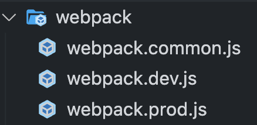
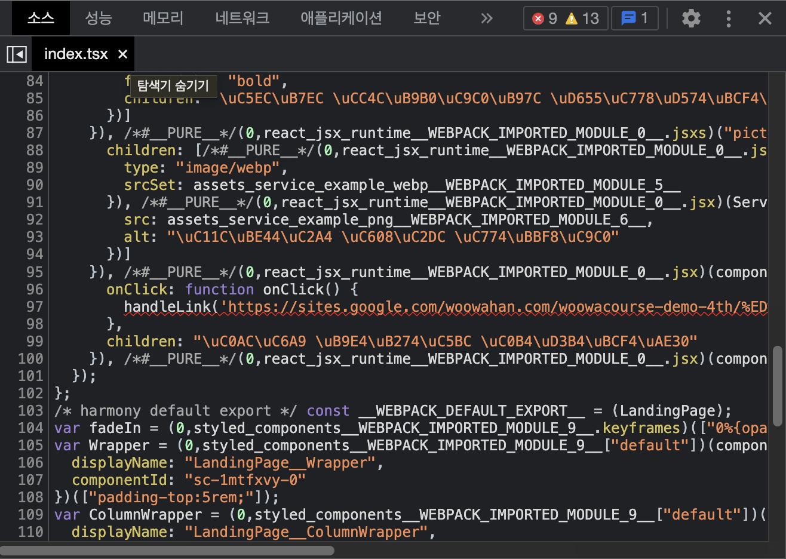
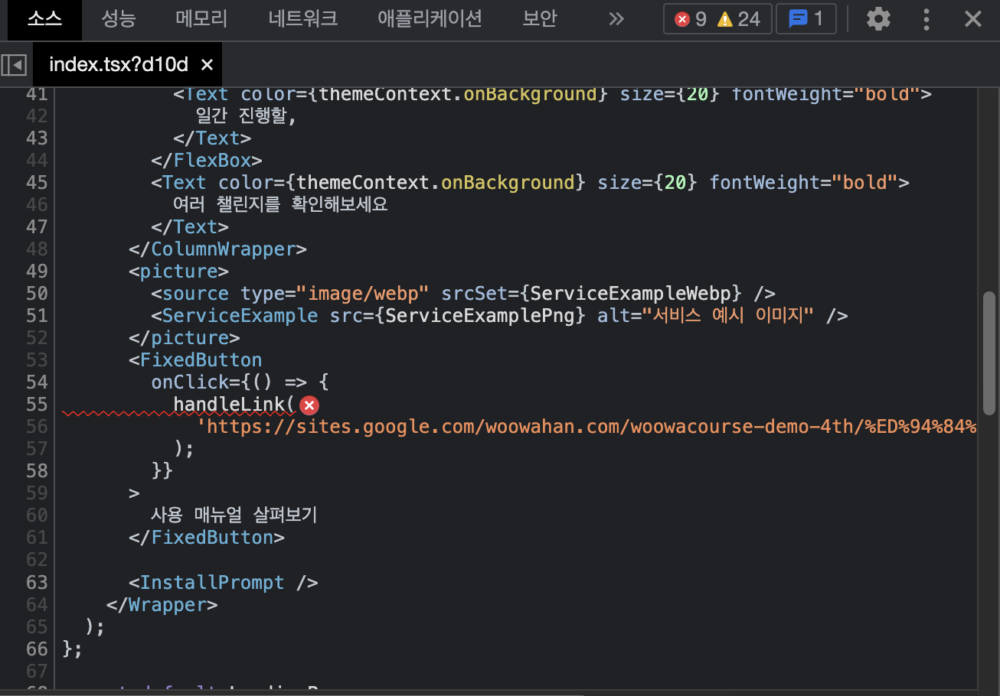
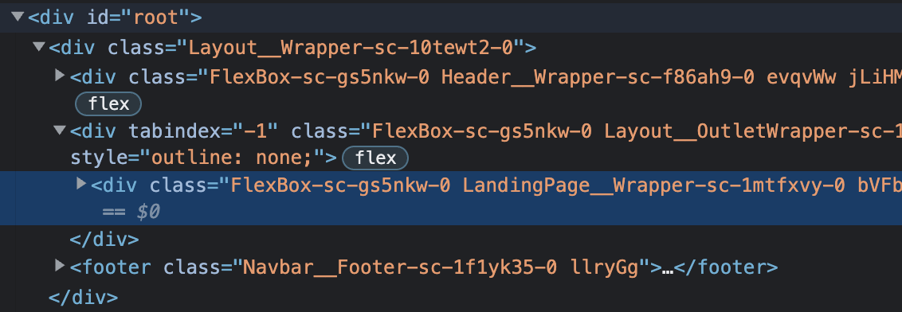
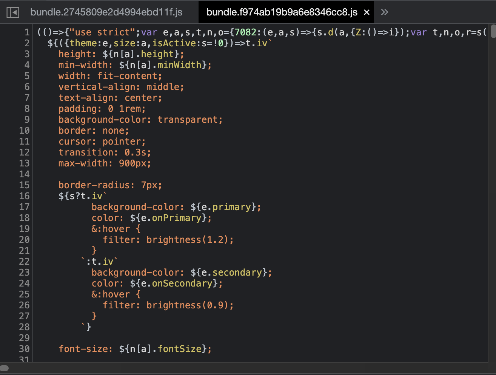
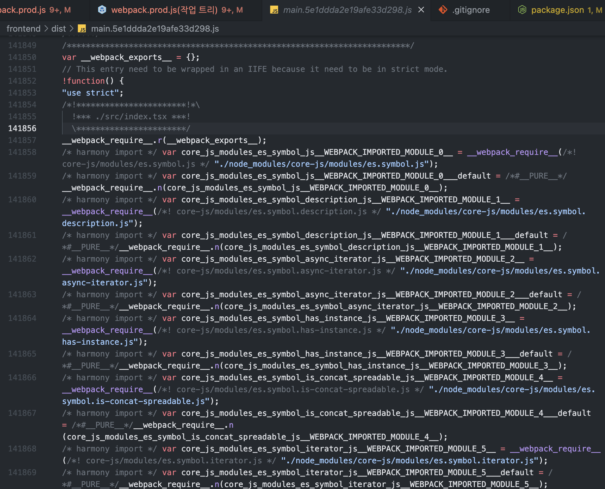
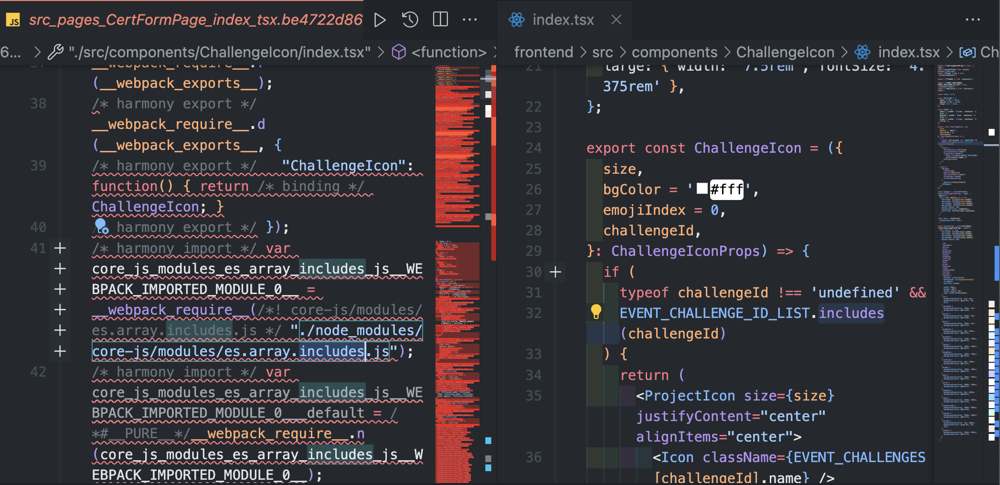
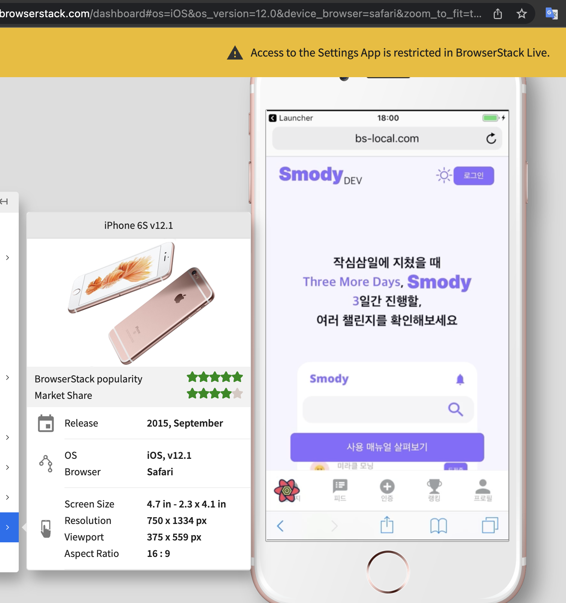

[Smody 프로젝트](https://www.smody.co.kr)의 빌드 환경을 직접 구축한 과정을 정리하였다. 모듈 번들러로 웹팩을 사용하였고, 고민한 여러 로더들에 대한 비교와 편리한 플러그인 옵션 등에 대해 설명한다.

# 목차

#### [1. 모듈 번들러, 그리고 웹팩이란?](#1-모듈-번들러-그리고-웹팩이란) <br/>

#### [2. dev, prod 모드에 따른 웹팩 설정 분리](#2-dev-prod-모드에-따른-웹팩-설정-분리) <br/>

#### [3. webpack.common.js](#3-webpackcommonjs) <br/>

**[3-1. entry, output](#3-1-entry-output)** <br/>
[3-1-1) entry](#3-1-1-entry) <br/>
[3-1-2) output.publicPath](#3-1-2-outputpublicpath) <br/>
[3-1-3) output.path](#3-1-3-outputpath) <br/>
[3-1-4) output.filename](#3-1-4-outputfilename)<br/>
[3-1-5) output.clean](#3-1-5-outputclean)<br/>
**[3-2. resolve](#3-2-resolve)**<br/>
**[3-3. rules - assets 처리](#3-3-rules---assets-처리)**<br/>
[3-3-1) 이미지 불러오기](#3-3-1-이미지-불러오기)<br/>
[3-3-2) svg 불러오기](#3-3-2-svg-불러오기)<br/>
**[3-4. plugins](#3-4-plugins)**<br/>
[3-4-1) HTMLWebpackPlugin](#3-4-1-htmlwebpackplugin)<br/>
[3-4-2) CopyWebpackPlugin](#3-4-2-copywebpackplugin)<br/>
[3-4-3) ProgressPlugin](#3-4-3-progressplugin)<br/>
**[3-5. devServer](#3-5-devserver)**<br/>
[3-5-1) historyApiFallBack](#3-5-1-historyapifallback)<br/>

#### [4. webpack.dev.js](#4-webpackdevjs)<br/>

**[4-1. mode](#4-1-mode)**<br/>
**[4-2. 환경변수 주입](#4-2-환경변수-주입)**<br/>
[4-2-1) dotenv 라이브러리](#4-2-1-dotenv-라이브러리)<br/>
[4-2-2) DefinePlugin](#4-2-2-defineplugin)<br/>
**[4-3. devtool](#4-2-2-defineplugin)**<br/>
**[4-4. babel-loader](#4-4-babel-loader)**<br/>
[4-4-1) esbuild-loader나 ts-loader 대신에 babel-loader를 선택한 이유](#4-4-1-esbuild-loader나-ts-loader-대신에-babel-loader를-선택한-이유)<br/>
[4-4-2) babel 설정 포맷](#4-4-2-babel-설정-포맷)<br/>
[4-4-3) presets](#4-4-3-presets)<br/>
[4-4-4) 빌드 속도 개선](#4-4-4-빌드-속도-개선)<br/>

#### [5. webpack.prod.js](#5-webpackprodjs)<br/>

**[5-1. 타입체킹](#5-1-타입체킹)**<br/>
**[5-2. babel-plugin-styled-components](#5-2-babel-plugin-styled-components)**<br/>
[5-2-1) displayName](#5-2-1-displayname)<br/>
[5-2-2) minify](#5-2-2-minify)<br/>
[5-2-3) transpileTemplateLiterals](#5-2-3-transpiletemplateliterals)<br/>
[5-2-4) pure](#5-2-4-pure)<br/>
**[5-3. 폴리필](#5-3-폴리필)**<br/>
[5-3-1) 폴리필이란](#5-3-1-폴리필이란)<br/>
[5-3-2) @babel/preset-env로 폴리필 적용](#5-3-2-babelpreset-env로-폴리필-적용)<br/>
[5-3-3) browserslist](#5-3-3-browserslist)<br/>
[5-3-4) @babel/preset-env의 폴리필 적용 옵션](#5-3-4-code-classlanguage-textbabelpreset-envcode의-폴리필-적용-옵션)<br/>

## 1. 모듈 번들러, 그리고 웹팩이란?

우선 모듈 번들러와 웹팩에 대해 간단히 이해해보자.

`모듈 번들러`는 웹 애플리케이션을 동작시키기 위한 서로 연관 관계가 있는 웹 구성 자원(HTML, CSS, JavaScript, Images 등)을 모두 각각의 모듈로 보고 이들의 의존성을 묶고 조합해서 합쳐진 하나의 결과물(static한 자원)을 만드는 도구이다.

모듈 번들러는 왜 분리된 코드 조각(모듈)을 왜 묶어야(번들링)할까?

사용자가 웹사이트에 접속했을 때, 모든 파일은 네트워크 통신을 통해 가져오게 된다. 그런데 파일 하나 하나 요청하고 가져온다면 로딩 속도는 늦어지게 된다. 브라우저 HTTP의 동시 최대 연결 수도 브라우저마다 다르긴 하나 크롬, 사파리 등 대부분 6건으로 제한되어 있기 때문에, 너무 많은 수의 정적 리소스를 요청해야 하면 네트워크 병목 현상이 발생하여 페이지 로딩이 느리게 될 것이다.
즉, 모듈 번들러를 통해 여러 리소스를 번들링하면 로딩 속도를 개선할 수 있다.

또한 웹 서비스를 개발하고 배포할 때 HTML, CSS, JS압축, 이미지 압축, CSS 전처리기 변환과 같은 추가 작업들도 해야 하는데, 모듈 번들러는 이러한 일들도 자동화해준다.

`웹팩`은 프론트엔드에서 가장 많이 사용되고 있는 모듈 번들러 중 하나이다. 엔트리 포인트를 시작으로 연결되어 었는 모든 모듈을 하나로 합쳐서 아웃풋 포인트로 결과물을 저장한이다. 자바스크립트 모듈 뿐만 아니라 스타일시트, 이미지 파일까지도 모듈로 제공해 주기 때문에 일관성 있게 개발할 수 있다. 웹팩을 사용할 떄 중요한 속성이 4가지가 있다. 바로 entry, output, loader, plugin이다.

[[참고]-웹팩으로 해결하려는 문제?](https://joshua1988.github.io/webpack-guide/motivation/problem-to-solve.html#%EC%9E%90%EB%B0%94%EC%8A%A4%ED%81%AC%EB%A6%BD%ED%8A%B8-%EB%B3%80%EC%88%98-%EC%9C%A0%ED%9A%A8-%EB%B2%94%EC%9C%84-%EB%AC%B8%EC%A0%9C)

[[참고]-브라우저 HTTP 최대 연결수 알아보기](https://medium.com/@syalot005006/%EB%B8%8C%EB%9D%BC%EC%9A%B0%EC%A0%80-http-%EC%B5%9C%EB%8C%80-%EC%97%B0%EA%B2%B0%EC%88%98-%EC%95%8C%EC%95%84%EB%B3%B4%EA%B8%B0-3f7aa1453bc2)

[[참고]-모듈 번들러(module bundler)란?](https://developer-talk.tistory.com/550)

## 2. dev, prod 모드에 따른 웹팩 설정 분리



### webpack-merge 라이브러리 사용

[webpack-merge](https://www.npmjs.com/package/webpack-merge)

웹팩 설정을 development 모드와 production 모드 별로 분리하여, `webpack.development.js`와 `webpack.production.js`를 만들었다.
두 설정의 공통 설정은 `webpack.common.js`로 추출하여 중복을 제거하고 가독성을 향상하였다.

`webpack-merge` 라이브러리를 사용함으로써, 분리된 `webpack.common.js`를 `webpack.development.js`와 `webpack.production.js` 각각과 합칠 수 있다.

```javascript
// `webpack.production.js`
const { merge } = require('webpack-merge');
const common = require('./webpack.common');

module.exports = merge(common, {
    mode: 'production',

})

// `webpack.development.js`
const { merge } = require('webpack-merge');
const common = require('./webpack.common');

module.exports = merge(common, {
    mode: 'development',

})
```

- `package.json`의 scripts 속성에서 빌드하려는 모드에 따라 해당 웹팩 설정 파일을 config 옵션을 통해 적용하도록 설정한다.

```json
// package.json
  "scripts": {
    "start:dev": "webpack serve --open --config webpack/webpack.dev.js",
    "build:dev": "webpack --config webpack/webpack.dev.js",
    "start:prod": "webpack serve --open --config webpack/webpack.prod.js",
    "build:prod": "webpack --config webpack/webpack.prod.js",
  }
```

## 3. webpack.common.js

- 프로젝트에서 사용한 공통 웹팩 설정의 코드는 다음과 같다.

```javascript
const HtmlWebpackPlugin = require('html-webpack-plugin');
const CopyWebpackPlugin = require('copy-webpack-plugin');
const ProgressPlugin = require('progress-webpack-plugin');
const path = require('path');

module.exports = {
  entry: './src/index.tsx',
  output: {
    publicPath: '/',
    path: path.join(__dirname, '../dist'),
    filename: '[name].[chunkhash].js',
    clean: true,
  },
  resolve: {
    extensions: ['.js', '.jsx', '.ts', '.tsx'],
    modules: [
      path.resolve(__dirname, '../src'),
      path.resolve(__dirname, '../node_modules'),
    ],
  },
  module: {
    rules: [
      {
        test: /\.(png|webp)$/,
        type: 'asset',
        generator: {
          filename: 'assets/[name][hash][ext]',
        },
      },
      {
        test: /\.svg$/,
        use: ['@svgr/webpack'],
      },
    ],
  },
  plugins: [
    new HtmlWebpackPlugin({
      template: './public/index.html',
    }),
    new CopyWebpackPlugin({
      patterns: [
        { from: './public/image', to: 'image' },
        { from: './public/manifest.json', to: '.' },
        { from: './public/pwaServiceWorker.js', to: '.' },
      ],
    }),
    new ProgressPlugin(true),
  ],
  devServer: {
    historyApiFallback: true,
    port: 3000,
    hot: true,
    open: true,
  },
  performance: {
    hints: false,
  },
};
```

### 3-1. entry, output

#### 3-1-1) entry

```jsx
  entry: './src/index.tsx',
```

`entry` 속성은 웹팩의 최초 진입점인 자바스크립트 파일 경로를 적어야 한다.

```jsx
  output: {
    publicPath: '/',
    path: path.join(__dirname, '../dist'),
    filename: '[name].[chunkhash].js',
    clean: true,
  },
```

`output` 속성은 웹팩을 돌리고 난 결과물의 파일 경로를 의미한다.

#### 3-1-2) output.publicPath

`publicPath` 옵션으로 `/` 를 지정하였다. 이 옵션은 브라우저에서 참조될 때 출력 디렉터리의 공용 URL을 지정한다. 해당 옵션의 값은 런타임 또는 로더가 생성한 모든 URL에 접두사로 추가된다. 이 옵션은 대부분의 경우 `/`로 끝난다.

[[참고] webpack output](https://webpack.kr/configuration/output/)

[[참고] webpack publicPath](https://webpack.kr/configuration/output/#outputpublicpath)

#### 3-1-3) output.path

```javascript  
path: path.join(__dirname, '../dist'),
```

`path` 옵션은 출력 디렉터리를 설정한다.
 해당 옵션에서 사용한 `path` 모듈은 내장 모듈이므로 별도의 라이브러리 설치 없이 `const path = require('path');` 와 같이 불러서 사용한다.

`path.join([...paths])` 은 여러 인자를 넣으면 하나의 경로로 합쳐서 반환한다.  `__dirname` 키워드 변수를 넣으면 실행시 현재 파일 경로로 바뀐다.  

결과적으로 이 옵션은 웹팩이 만든 결과물을 본 설정파일이 위치한 디렉터리의 상위 디렉터리에서 dist라는 이름의 디렉터리에 넣는다.

[[참고] Nodejs, path module, __dirname, __filename 에 대해 톺아보기](https://p-iknow.netlify.app/node-js/path-moudle/)

#### 3-1-4) output.filename

`filename` 옵션에서는 캐시버스팅을 위해 `[chunkHash]`를 추가함으로써 생성된 번들의 파일 이름에 hash 값을 추가하였다.
hash 옵션에는 hash, chunkHash, contentHash가 존재한다.
`hash`는 빌드 할 때마다 무조건 변경되며, 각 chunk들은 같은 hash 값을 가진다.

그러나 변경사항이 있는 chunk의 hash만 변경하려면 `hash` 대신 `chunkHash`를 사용해야 한다.
`chunkHash`는 chunk 별로 고유의 hash 값을 가지며, 빌드할 때 변경이 일어난 entry의 hash 값만 변경된다.

하지만 css파일이 존재하여 변경사항이 있는 css파일의 hash도 변경되도록 하려면, `chunkHash` 대신 `contentHash`를 사용해야 한다.
`contentHash`는 전체 chunk의 content가 아니라 추출된 content에 의해서만 계산된 hash값을 가진다.

본 프로젝트에서는 CSS in JS 방식으로서 css 파일이 생성되진 않는 styled-components 라이브러리를 사용하기 때문에, `chunkHash`를 사용하여도 충분한 hash 효과를 얻을 수 있었다.

[[참고] Hash vs chunkhash vs ContentHash
](https://medium.com/@sahilkkrazy/hash-vs-chunkhash-vs-contenthash-e94d38a32208)

#### 3-1-5) output.clean

각 빌드 전에 /dist 폴더를 정리하기 위해 output.clean 옵션을 사용한다.

### 3-2. resolve

```javascript
  resolve: {
    extensions: ['.js', '.jsx', '.ts', '.tsx'],
    modules: [
      path.resolve(__dirname, '../src'),
      path.resolve(__dirname, '../node_modules'),
    ],
  },
```

`resolve` 옵션은 모듈을 해석하는 방식을 변경할 수 있다.

`extensions`은 확장자 목록을 설정하면, 설정된 확장자에 해당하는 파일은 import 시 파일 확장자를 명시하지 않아도 된다. 이러한 편리함 때문에 extensions 옵션을 설정했다.

`modules`은 모듈을 해석할 때 검색할 디렉터리 목록을 웹팩에 알려준다. 목록의 앞에 있는 경로부터 모듈을 탐색한다. node_modules보다 src를 먼저 탐색하기 위해 src를 배열의 첫 요소로 두었다.

[[참고] webpack - resolve](https://webpack.kr/configuration/resolve/)

### 3-3. rules - assets 처리

```jsx
 module: {
    rules: [
      {
        test: /\.(png|webp)$/,
        type: 'asset',
        generator: {
          filename: 'assets/[name][hash][ext]',
        },
      },
      {
        test: /\.svg$/,
        use: ['@svgr/webpack'],
      },
    ],
  },
```

#### 3-3-1) 이미지 불러오기

```jsx
{
    test: /\.(png|webp)$/,
    type: 'asset',
    generator: {
        filename: 'assets/[name][hash][ext]',
    },
},
```

이미지를 불러오는 방법은 크게 두 가지 종류가 있다.

- 파일을 output 디렉터리에 파일을 emit하고 URL로 불러오는 방식(`asset/resource` 타입)
- data URI을 inline으로 사용하는 방식(`asset/inline` 타입)

data URI의 경우 성능상 좋진않지만, 네트워크 요청의 수가 줄어든다는 장점이 있다. 대개 URL로 불러오는 방식을 사용하나, 크기가 작은 이미지의 경우 data URI을 사용하는 것도 좋은 선택일 수 있다.

따라서 이미지 크기에 따라 두 방식을 적절하게 혼용해서 사용하기 위해 이미지 처리 방법으로서 Asset Modules 타입 중 `asset` 타입을 선택했다. `asset` 타입은 data URI를 export할지 각각의 파일을 emit할 지 자동으로 선택한다.

참고로 webpack4 이전에는 asset 파일을 사용하기 위해 별도의 로더를 사용했으나, webpack5 이후부터는 별도의 로더 없이도 `asset`, `asset/resource`, `asset/inline`와 같은 `Asset Modules` 타입을 사용함으로써 해결할 수 있다.

Asset Modules에 대한 내용은 이전에 작성한 아래의 포스팅을 참고한다.

[[참고] webpack5의 Asset Modules](https://wonsss.github.io/webpack/webpack5-asset-modules/)

#### 3-3-2) svg 불러오기

```jsx
{
    test: /\.svg$/,
    use: ['@svgr/webpack'],
},
```

본 프로젝트에서 svg 파일을 자주 사용하였다. svg 파일을 리액트 컴포넌트로서 import하여 사용하기 위해, 웹팩의 공식 로더인 [@svgr/webpack](https://react-svgr.com/docs/webpack/)를 사용하였다.

해당 로더를 적용하면, 리액트 코드에서 svg를 다음과 같이 컴포넌트로 import하여 사용할 수 있다.

```jsx
// index.tsx
import PlusIcon from 'assets/plus.svg';

const index = () => {
  return (
    <PlusIcon />
  )
}
```

### 3-4. plugins

플러그인은 웹팩의 기본적인 동작에 추가적인 기능을 제공한다. 로더는 파일을 해석하고 변환하는 과정에 관여하는 데 반해, 플러그인은 해당 결과물의 형태를 바꾸는 역할을 한다.

```jsx
  plugins: [
    new HtmlWebpackPlugin({
      template: './public/index.html',
    }),
    new CopyWebpackPlugin({
      patterns: [
        { from: './public/image', to: 'image' },
        { from: './public/manifest.json', to: '.' },
        { from: './public/pwaServiceWorker.js', to: '.' },
      ],
    }),
    new ProgressPlugin(true),
  ],
```

#### 3-4-1) HTMLWebpackPlugin

```jsx
new HtmlWebpackPlugin({
  template: './public/index.html',
}),
```

[HtmlWebpackPlugin](https://www.npmjs.com/package/html-webpack-plugin)은 출력된 디렉터리에 HTML을 생성하는 플러그인이다. template 옵션에 본 프로젝트의 index.html이 있는 경로를 적어, 출력된 디렉터리에 해당 index.html을 주입한다.

[[참고] - HTML 자동 주입 플러그인](https://yamoo9.gitbook.io/webpack/webpack/webpack-plugins/automatic-injection-to-html-document)

#### 3-4-2) CopyWebpackPlugin

```jsx
  new CopyWebpackPlugin({
    patterns: [
      { from: './public/image', to: 'image' },
      { from: './public/manifest.json', to: '.' },
      { from: './public/pwaServiceWorker.js', to: '.' },
    ],
  }),
```

[CopyWebpackPlugin](https://webpack.js.org/plugins/copy-webpack-plugin/)은 이미 존재하는 개별 파일 또는 전체 디렉터리를 빌드된 디렉터리에 복사하기 위해 사용한다. 이 플러그인은 빌드 과정에서 생성된 파일을 복사하는 것이 아니라, 이미 소스 트리에 존재하는 파일을 복사할 때 사용한다.

본 프로젝트에서는 PWA 관련 manifest, serviceWorker 등의 파일을 빌드 디렉터리에 주입하기 위해 사용하였다.

#### 3-4-3) ProgressPlugin

[ProgressPlugin](https://webpack.kr/plugins/progress-plugin)은 단지 편의 기능으로서 웹팩 컴파일 진행 상황을 보기 위해 사용하였다.

### 3-5. devServer

```jsx
devServer: {
  historyApiFallback: true, // History 라우팅 대체 사용 설정
  port: 3000, // 포트 번호 설정
  hot: true, // 핫 모듈 교체(HMR) 활성화 설정
  open: true, // 개발 서버 자동 실행 설정
},
```

개발 서버는 핫 모듈 교체(HMR) 및 오류 보고 기능을 제공한다. 이를 사용하면 개발 과정에 도움이 된다.

`package.json`에서 npm 스크립트 `start` 명령으로 'webpack serve'를 추가하고, 웹팩 설정에 위와 같은 `devServer` 옵션을 추가한다.

#### 3-5-1) historyApiFallBack

devServer 옵션 중 historyApiFallBack 옵션은 react 사용 시 중요하다.

React Router DOM은 내부적으로 HTML5의 HistoryAPI를 사용하고 있어 새로고침하거나 미지정 경로로 이동하면 404 응답이 나오게 된다.

이러한 문제를 해결하기 위해 historyApiFallBack 옵션을 true로 설정하면, 새로고침하거나 미지정 경로로 이동한 경우 404 응답 대신 index.html을 제공한다.

옵션 적용 결과를 예를 들자면, <http://localhost:3000/> 대한 GET 및 <http://localhost:3000/profile>에 대한 GET은 모두 <http://localhost:3000/>로 fallback하여 index.html을 서빙하고 react-router는 /profile 라우팅을 처리하게 된다.

historyApiFallBack 옵션이 활성화된 devSever가 실행되면 콘솔에 다음과 같이 표시된다.

`[webpack-dev-server] 404s will fallback to '/index.html'`

## 4. webpack.dev.js

지금까지 웹팩 공통 설정을 살펴보았다. 이제 development에서만 사용하는 웹팩 설정을 설명한다. webpack.dev.js의 전체 코드는 다음과 같다.

```javascript
// webpack.dev.js
const webpack = require('webpack');
const isLocal = process.env.NODE_ENV === 'local';
const dotenv = require('dotenv');
const { merge } = require('webpack-merge');
const common = require('./webpack.common');
const path = require('path');
const SpeedMeasurePlugin = require('speed-measure-webpack-plugin');
const smp = new SpeedMeasurePlugin();

dotenv.config({ path: path.join(__dirname, '../.env') });

module.exports = smp.wrap(
  merge(common, {
    mode: 'development',
    devtool: 'eval-cheap-module-source-map',
    cache: {
      type: 'filesystem',
    },
    module: {
      rules: [
        {
          test: /\.(js|jsx|ts|tsx)$/i,
          exclude: /node_modules/,
          loader: 'babel-loader',
          options: {
            cacheCompression: false,
            cacheDirectory: true,
            presets: [
              '@babel/preset-env',
              ['@babel/preset-react', { runtime: 'automatic' }],
              '@babel/preset-typescript',
            ],
            plugins: [['babel-plugin-styled-components']],
          },
        },
      ],
    },
    optimization: {
      runtimeChunk: {
        name: (entrypoint) => `runtime-${entrypoint.name}`,
      },
    },
    plugins: [
      new webpack.DefinePlugin({
        'process.env.BASE_URL': JSON.stringify(process.env.DEV_BASE_URL),
        'process.env.CLIENT_ID': JSON.stringify(process.env.CLIENT_ID),
        'process.env.PUBLIC_KEY': JSON.stringify(process.env.PUBLIC_KEY),
        'process.env.IS_LOCAL': JSON.stringify(isLocal),
      }),
    ],
  }),
);
```

### 4-1. mode

우선 `mode` 옵션에 development를 설정하여 개발에 최적화된 webpack 내장 기능을 사용할 수 있다. 예를 들어, DefinePlugin의 process.env.NODE_ENV를 development로 설정하고, 모듈과 청크에 유용한 이름을 사용할 수 있다.

[[참고] webpack mode](https://webpack.kr/configuration/mode/#mode-production)

### 4-2. 환경변수 주입

```jsx
const webpack = require('webpack');
const dotenv = require('dotenv');
dotenv.config({ path: path.join(__dirname, '../.env') });

// 중략

   plugins: [
      new webpack.DefinePlugin({
        'process.env.BASE_URL': JSON.stringify(process.env.DEV_BASE_URL),
        'process.env.CLIENT_ID': JSON.stringify(process.env.CLIENT_ID),
        'process.env.PUBLIC_KEY': JSON.stringify(process.env.PUBLIC_KEY),
        'process.env.IS_LOCAL': JSON.stringify(isLocal),
      }),
    ],
```

#### 4-2-1) dotenv 라이브러리

```jsx
const dotenv = require('dotenv');
dotenv.config({ path: path.join(__dirname, '../.env') });
```

[dotenv](https://www.npmjs.com/package/dotenv) 라이브러리는 환경 변수를 파일에 저장할 수 있도록 해준다.
이 라이브러리는 경로로 지정한 `.env` 파일로부터 환경 변수를 읽어 `process.env`에 설정한다.

[[참고] dotenv로 환경 변수 관리하기](https://www.daleseo.com/js-dotenv/)

#### 4-2-2) DefinePlugin

웹팩의 `DefinePlugin`은 모든 자바스크립트 코드에서 접근이 가능한 전역 변수를 선언하기 위해서 사용되는 플러그인이다.

`EnvironmentPlugin`을 사용하면 환경 변수를 전역에 주입할 수 있다. 반면, `DefinePlugin`은 환경 변수 뿐만 아니라 일반 전역 변수 주입도 가능하므로 범용성을 고려하여 `DefinePlugin`을 사용하였다.

[[참고] 웹팩(Webpack) DefinePlugin, EnvironmentPlugin 사용법](https://www.daleseo.com/webpack-plugins-define-environment/)

### 4-3. devtool

```jsx
devtool: 'eval-cheap-module-source-map',
```

개발 모드에서 원활한 디버깅을 위해 소스맵을 사용하기로 결정했다.
소스맵이란 웹팩이 빌드한 코드와 원본 코드를 연결해주는 기능이다.
디버깅 시, 웹팩으로 빌드된 코드로부터 원본 코드를 유추하기는 쉽지 않다.

소스맵의 여러 옵션 중 `eval-cheap-module-source-map`을 사용하였다. 해당 옵션은 고품질 소스맵 옵션인 `eval-source-map`보다 빌드 속도가 더 빠르면서, 코드 품질 자체에서도 유의미한 차이가 나지 않았기 때문이다.

- 소스맵 적용하지 않은 경우


- 소스맵 적용한 경우

[[참고] webpack - Devtool](https://webpack.kr/configuration/devtool/)

### 4-4. babel-loader

#### 4-4-1) esbuild-loader나 ts-loader 대신에 babel-loader를 선택한 이유

로더는 모듈을 입력받아 원하는 형태로 변환하여 새로운 모듈을 출력한다.
`babel-loader`, `ts-loader`, `esbuild-loader`와 같은 로더를 통해  ES6, 리액트, 타입스크립트에 대한 트랜스파일링을 기본적으로 할 수 있다.

비슷한 기능을 하는 `babel-loader`, `ts-loader`, `esbuild-loader`들을 사용하면서 비교한 결과, 다음과 같은 결론에 도달하여 `babel-loader`를 사용하기로 결정하였다.

- [babel-loader](https://github.com/babel/babel-loader)
  - 가능: 트랜스파일링(babel7 버전 이후에는 typescript도 가능), 폴리필, 캐시
  - 불가: 타입체킹(그러나 tsc --noEmit이나 ForkTsCheckerWebpackPlugin을 통해 가능)
  - 특징: 폴리필이 가능하고, 캐시 활용 및 최적화 적용 시 속도도 빠름
- [ts-loader](https://github.com/TypeStrong/ts-loader)
  - 가능: 트랜스파일링, 타입체킹
  - 불가: 폴리필, [HMR](https://github.com/TypeStrong/ts-loader#hot-module-replacement)
  - 특징: 자체적인 강력한 타입체킹
- [esbuild-loader](https://github.com/privatenumber/esbuild-loader)
  - 가능: 트랜스파일링
  - 불가: 폴리필, 타입체킹(그러나 tsc --noEmit이나 ForkTsCheckerWebpackPlugin을 통해 가능)
  - 특징: 기본적으로 빠른 빌드 속도, 자체적인 minification 지원하므로 플러그인 줄일 수 있음, 그러나 esbuild에서 지원하는 문법에 한계가 있어 목표 브라우저에서도 작동하는지 검증이 필요함

처음에는 babel-loader를 사용하다가 빌드 속도를 개선하기 위해 esbuild-loader를 사용하였다. 당시에 빌드시간이 30초에서 8초로 감소하는 큰 효과가 있었다.

그러나 폴리필 적용 및 번들링 품질 등의 이슈를 해결하기 위해 babel-loader를 다시 사용하기로 결정했다. 빌드 속도는 최적화 옵션 및 캐시 시스템을 적용함으로써, babel-loader로도 rebuild 시 2초 미만의 빌드 속도가 나오는 더 나은 효과를 얻었다. 또한, babel-loader에서는 styled-component에 대한 `babel-plugin-styled-components` 플러그인이 있어서 styled-component 관련 압축이 가능해지고 디버깅이 용이해졌다.

이제 개발 환경에서 babel-loader 적용 옵션을 살펴보자.

```jsx
module: {
  rules: [
    {
      test: /\.(js|jsx|ts|tsx)$/i,
      exclude: /node_modules/,
      loader: 'babel-loader',
      options: {
        cacheCompression: false,
        cacheDirectory: true,
        presets: [
          '@babel/preset-env',
          ['@babel/preset-react', { runtime: 'automatic' }],
          '@babel/preset-typescript',
        ],
        plugins: [['babel-plugin-styled-components']],
      },
    },
  ],
},
```

[[참고]-프론트엔드 개발환경의 이해: Babel](https://jeonghwan-kim.github.io/series/2019/12/22/frontend-dev-env-babel.html)

[[참고]-Webpack 5 빌드 속도 개선하기](https://kdevkr.github.io/archive/improve-webpack5-build-speed.html)

[[참고]-Webpack 빌드에 날개를 달아줄 Esbuild-Loader](https://fe-developers.kakaoent.com/2022/220707-webpack-esbuild-loader/)

[[참고]-babel-loader와 ts-loader의 빌드 결과가 다른 현상](https://jeonghwan-kim.github.io/dev/2021/03/08/babel-typescript.html)

[[참고]-바벨과 타입스크립트의 아름다운 결혼](https://ui.toast.com/weekly-pick/ko_20181220)

#### 4-4-2) babel 설정 포맷

project-wide 설정을 하는 방법 2가지는 `babel.config.json`을 루트 디렉터리에 위치하는 방법과 웹팩의 바벨로더 설정 중 options에 바벨 설정 파일을 명시적으로 하는 방법이다.

development와 production 모드별로 바벨 설정을 다르게 주기 위해, 두 번째 방법인 웹팩의 바벨로더 설정 중 options에 바벨 설정 파일을 명시적으로 하는 방법을 선택하였다.

[[참고] Babel Project-wide configuration](https://babeljs.io/docs/en/config-files#project-wide-configuration)

#### 4-4-3) presets

```jsx
presets: [
  '@babel/preset-env',
  ['@babel/preset-react', { runtime: 'automatic' }],
  '@babel/preset-typescript',
],
```

`@babel/preset-env`는 ES6를 트랜스파일링하기 위해 사용한다. 화살표 함수는 ES6 문법인데, 대부분의 브라우저가 ES6를 지원하나 그렇지 않은 브라우저도 있으므로 ES5로 트랜스파일링 해줄 필요가 있다.

그런데 웹팩에 target 설정도 다음과 같이 해주어야, 화살표 함수 등을 preset-env가 트랜스파일링을 해줄 수 있다.

```jsx
target: ['web', 'es5'],
```

[[참고] StackOverFlow - JavaScript - babel-preset-env not transpiling arrow functions for IE11](https://stackoverflow.com/questions/52821427/javascript-babel-preset-env-not-transpiling-arrow-functions-for-ie11)

`@babel/preset-react`는 React를 트랜스파일링하기 위해 사용한다.
그러나 해당 플러그인에 옵션을 설정하지 않으면 `Uncaught ReferenceError: React is not defined` 에러가 발생한다. 왜냐하면 이 플러그인 프리셋에 기본으로 속해있는 플러그인 중 [@babel/plugin-transform-react-jsx](https://babeljs.io/docs/en/babel-plugin-transform-react-jsx)이 jsx파일을 React.createElement 형태로 바꿔주어 `import React from 'react'` 코드가 필요하기 때문이다. 이를 자동으로 해결하기 위해, 옵션에 `{ runtime: 'automatic' }`을 추가한다.

[[참고] StackOverFlow - Uncaught ReferenceError: React is not defined](https://stackoverflow.com/questions/32070303/uncaught-referenceerror-react-is-not-defined/)

`@babel/preset-typescript`는 TypeScript를 트랜스파일링하기 위해 사용한다.

#### 4-4-4) 빌드 속도 개선

```jsx
  cache: {
    type: 'filesystem',
  },

 module: {
      rules: [
        {
          test: /\.(js|jsx|ts|tsx)$/i,
          exclude: /node_modules/,
          loader: 'babel-loader',
          options: {
            cacheCompression: false,
            cacheDirectory: true,
            // 이하 생략
           ,
          },
        },
      ],
    },
```

웹팩에서 `cache`의 타입을 `filesystem`으로 설정하면 캐시를 사용할 수 있게 된다.
웹팩 캐시의 기본 디렉터리는 `node_modules/.cache/webpack`이다.

[[참고] webpack - Cache](https://webpack.kr/configuration/cache/)

그리고 바벨로더에서 `options: {cacheCompression: false , cacheDirectory: true},`을 적용함으로써 활성화할 수 있다.

`cacheCompression`의 기본값은 true인데 이를 통해 바벨은 결과물을 Gzip으로 압축하여 변환한다. false로 설정하면 수천 개의 파일을 트랜스파일할 때 이점이 있다.

`cacheDirectory`의 기본값은 false인데, true로 설정하면 로더의 결과물을 캐시하게 된다.
바벨로더의 캐시 디렉터리는 `node_modules/.cache/babel-loader`이다.

[[참고] babel - options](https://github.com/babel/babel-loader#options)

이와 같이 캐시를 적용한 후 rebuild를 하면, 매번 비싼 바벨 재컴파일 과정을 할 필요 없이 먼저 캐시로부터 읽으려고 시도하게 된다. 코드에 큰 변화가 없는 rebuild의 경우 빌드시간이 1초 정도로 매우 빨라진다.

## 5. webpack.prod.js

이제 production 모드의 웹팩 설정을 살펴보자.

```jsx
// webpack.prod.js
const webpack = require('webpack');
const dotenv = require('dotenv');
const { merge } = require('webpack-merge');
const common = require('./webpack.common');
const path = require('path');
const ForkTsCheckerWebpackPlugin = require('fork-ts-checker-webpack-plugin');

dotenv.config({ path: path.join(__dirname, '../.env') });

module.exports = smp.wrap(
  merge(common, {
    mode: 'production',
    devtool: false,
    target: ['web', 'es5'],
    module: {
      rules: [
        {
          test: /\.(js|jsx|ts|tsx)$/i,
          exclude: /node_modules/,
          loader: 'babel-loader',
          options: {
            presets: [
              [
                '@babel/preset-env',
                {
                  useBuiltIns: 'usage',
                  corejs: {
                    version: 3,
                  },
                },
              ],
              ['@babel/preset-react', { runtime: 'automatic' }],
              '@babel/preset-typescript',
            ],
            plugins: [
              [
                'babel-plugin-styled-components',
                {
                  displayName: false,
                  minify: true,
                  transpileTemplateLiterals: true,
                  pure: true,
                },
              ],
            ],
          },
        },
      ],
    },
    optimization: {
      splitChunks: {
        chunks: 'all',
      },
    },
    plugins: [
      new ForkTsCheckerWebpackPlugin(),
      new webpack.DefinePlugin({
        'process.env.BASE_URL': JSON.stringify(process.env.PROD_BASE_URL),
        'process.env.IS_LOCAL': false,
      }),
    ],
  }),
);
```

앞서 살펴본 development 모드와 달리, devtool을 껐고, 폴리필을 추가하였으며, 압축 최적화를 하였고, 타입체크를 추가하였다.

### 5-1. 타입체킹

babel-loader에는 ts-loader와 달리 자체적인 타입체킹 기능이 없으므로, `ForkTsCheckerWebpackPlugin` 을 플러그인에 추가함으로써 production 모드에서 웹팩 실행 시 타입체킹을 하고 빌드가 되도록 하였다.

tsconfig.json에서 noEmitOnError 옵션도 활성화함으로써, 타입체킹에 실패하면 빌드가 되지 않도록 하였다.

development에서는 vscode의 tsserver를 통해 코드 수정 시점의 타입체킹을 볼 수 있으며, 빠른 빌드를 통한 개발 속도 향상을 위해 웹팩 실행 시 타입체킹을 추가하지 않았다.

그러나 코드 품질을 위해 production에서 최종 빌드할 때는 전체적인 타입체킹을 할 필요가 있다고 판단하여, `ForkTsCheckerWebpackPlugin`을 웹팩 플러그인에 추가하였다.

또한 scripts에 `tsc && webpack`과 같이 타입체킹을 하는 방법도 있으나, `ForkTsCheckerWebpackPlugin`을 사용할 때보다 웹팩 실행 시간이 전체적으로 느려진다는 점을 확인하여 tsc는 사용하지 않았다.

### 5-2. babel-plugin-styled-components

```jsx
plugins: [
  [
    'babel-plugin-styled-components',
    {
      displayName: false,
      minify: true,
      transpileTemplateLiterals: true,
      pure: true, 
    },
  ],
],
```

`babel-plugin-styled-components`은 styled-components 코드의 압축 및 더 나은 디버깅 환경을 지원하는 플러그인이다.

#### 5-2-1) displayName

`displayName` 옵션은 css 클래스 이름에 해당 컴포넌트 이름을 표시하여 디버깅을 도와준다. 다만 이 옵션은 development에서만 사용하였고, production에서는 의도적으로 껐다.

참고로 displayName 옵션을 켜면, 다음과 같이 class이름 앞에 컴포넌트의 이름이 접두사로 추가된다.



#### 5-2-2) minify

`minify` 옵션은 다음과 같이 웹팩이 압축하지 못한 styled-components 코드를 압축한다.



#### 5-2-3) transpileTemplateLiterals

`transpileTemplateLiterals` 옵션은 템플릿 리터럴 문법을 트랜스파일하는 옵션이다.

바벨에도 해당 트랜스파일을 해주는 `babel-plugin-transform-es2015-template-literals` 라는 플러그인이 있으나, 이 플러그인은 트랜스파일된 코드가 장황하다는 단점이 있다.

하지만 `babel-plugin-styled-components` 플러그인은 간결하다는 장점이 있어서 이를 선택하였다.

```jsx
// babel-plugin-transform-es2015-template-literals
var _templateObject = _taggedTemplateLiteral(['width: 100%;'], ['width: 100%;'])
function _taggedTemplateLiteral(strings, raw) {
  return Object.freeze(Object.defineProperties(strings, { raw: { value: Object.freeze(raw) } }))
}
var Simple = _styledComponents2.default.div(_templateObject)


// babel-plugin-styled-components
var Simple = _styledComponents2.default.div(['width: 100%;'])
```

#### 5-2-4) pure

styled components에서 죽은 코드를 제거하기 위해 pure 옵션을 사용할 수 있다.

[[참고] styled-components Babel Plugin](https://styled-components.com/docs/tooling#babel-plugin)

### 5-3. 폴리필

#### 5-3-1) 폴리필이란

폴리필이란 브라우저가 지원하지 않는 자바스크립트 코드를 지원 가능하도록 변환한 코드를 뜻한다. 하위 브라우저가 지원하는 자바스크립트 코드를 사용해 자바스크립트의 최신 기능을 구현하는 방식이다.

babel-loader에서 `@babel/preset-env`를 사용하면 ES6를 ES5로 `트랜스파일`했지만, ES6의 모든 기능을 지원하는 것은 아니다.

트랜스파일은 기존 코드가 구 표준을 준수하는 코드로 변경되는 방식이기 때문에, 엔진에 없는 함수를 지원하기 위해서는 명세서 내 정의를 읽고 이에 맞게 함수를 구현해야 사용할 수 있다. 이렇게 변경된 표준을 준수할 수 있도록 새롭게 구현한 함수 코드를 폴리필이라 한다.
폴리필을 사용하려면 `@babel/preset-env`에서 targets, useBuiltIns, corejs 옵션을 명시해야 한다.

바벨 내부에는 core-js 라는 라이브러리가 탑재되어 ES6 이후의 문법들을 폴리필 처리할 수 있다.

[[참고] 폴리필](https://ko.javascript.info/polyfills)

#### 5-3-2) @babel/preset-env로 폴리필 적용

```jsx
[
  '@babel/preset-env',
  {
    useBuiltIns: 'usage',
    corejs: {
      version: 3,
    },
  },
],
```

이전에 esbuild-loader를 사용할 때 es2020을 target으로 트랜스파일링하였는데, 그 결과 smody 프로젝트의 웹사이트는 safari 13, ie 11, chrome 79에서부터 에러가 발생하여 전체사이트 로드를 실패하였다. 해당 브라우저 버전 이하에서는 es2020을 지원하지 않았기 때문이다. 또한 esbuild-loader는 폴리필이 불가하므로, babel-loader를 사용하여 트랜스파일링할 수 없는 새 기능에 폴리필을 하고자 했다.

`@babel/preset-env`을 통해 폴리필을 적용한다.

#### 5-3-3) browserslist

`targets` 옵션은 루트 디렉터리에 만든 `.browserslistrc` 파일을 통해서도 대체된다.  

브라우저스리스트는 브라우저를 선택하는 옵션 기능만 따로 뽑아 놓은 도구이다.
`.browserslistrc` 파일 내에 다음과 같이 타겟 리스트 목록을 위한 쿼리를 적는다.

```json
>= 0.5% in KR
```

이는 현 시점에서 한국에서 사용 점유율 0.5% 이상의 브라우저들만 타겟으로 하겠다는 뜻이다. 해당 쿼리를 통한 타겟 브라우저 목록을 확인하려면, 해당 파일이 있는 루트 디렉터리에서 `npx browserslist` 명령어를 입력한다.
2022년 10월에 해당 명령어 입력 후 콘솔에 표시된 타겟 브라우저 목록은 다음과 같았다.

```plain
and_chr 106
android 4.4.3-4.4.4
chrome 105
chrome 104
edge 105
ios_saf 16.0
ios_saf 15.6
ios_saf 15.5
ios_saf 15.0-15.1
ios_saf 14.5-14.8
ios_saf 14.0-14.4
ios_saf 13.4-13.7
samsung 18.0
samsung 17.0
```

참고로 target이 매우 구형 브라우저이면 과도한 폴리필이 추가되어 최신 브라우저에서도 크기가 큰 bundle file을 로드하게 되는 낭비가 발생할 수도 있다.

[[참고] browserslist 쾌속 가이드](https://blog.shiren.dev/2020-12-01/)

#### 5-3-4) `@babel/preset-env`의 폴리필 적용 옵션

`useBuiltIns`와 `corejs` 옵션을 설정함으로써 폴리필을 적용할 수 있다.

`useBuiltIns` 옵션은 어떤 방식으로 폴리필을 사용할지 설정한다. 기본값은 false 였기 때문에, 해당 옵션을 설정하지 않았을 때 폴리필이 동작하지 않았다. useBuiltIns 옵션에는 false 이외에 `usage`, `entry` 가 있는데, 이들을 설정하면 폴리필 패키지인 core-js를 사용하여 폴리필이 동작한다.

`entry` 옵션은 타겟 브라우저에서 필요한 폴리필을 모두 포함시킨다. 이 옵션을 사용할 때 entry point에 core-js를 직접 import한다. 해당 옵션을 통해 빌드하면 core-js를 직접 import했던 코드가, 타겟 브라우저에 필요한 특정 core-js 모듈만 import하도록 변경된다.

```jsx
// entry 옵션 사용 시, entry point인 index.tsx에 추가
import 'core-js/stable';
import 'regenerator-runtime/runtime';
```

위 코드가 폴리필 entry 옵션을 통해 빌드된 결과는 다음과 같다.


`usage` 옵션은 타겟 브라우저에서 지원되지 않으며 해당 프로젝트 코드에서 사용하는 기능에 대해서만 폴리필이 추가되도록 한다. 타겟 브라우저에서 지원되지 않는 기능을 모두 폴리필로 추가할 필요는 없다고 판단하여, 본 프로젝트에서는 usage 옵션을 사용했다.



[[참고] StackOverFlow - Confused about useBuiltIns option of @babel/preset-env (using Browserslist Integration)](https://stackoverflow.com/questions/52625979/confused-about-usebuiltins-option-of-babel-preset-env-using-browserslist-integ)

[[참고] babel - useBuiltIns](https://babeljs.io/docs/en/babel-preset-env#usebuiltins)

`corejs` 옵션은 버전을 의미하며 기본값은 2이다. 버전 2는 업데이트가 중단되었으므로 버전 3을 사용했다.

core-js@3에서 변화한 점은 core-js의 github 문서를 통해 확인할 수 있다.

[[참고] corejs - What changed in core-js@3?](https://github.com/zloirock/core-js/blob/master/docs/2019-03-19-core-js-3-babel-and-a-look-into-the-future.md#what-changed-in-core-js3)

폴리필을 적용한 결과물이 타겟 브라우저에서 작동하는지 여부는 크로스 브라우징 테스트 서비스를 이용하여 확인할 수 있다.
[BrowserStack](https://www.browserstack.com/) 등의 일부 무료 서비스를 통해 확인한 결과, 이전에 작동되지 않던 iOS 12의 safari에서도 팀 프로젝트 smody 사이트가 동작함을 확인하였다.(사실 타겟 브라우저는 iOS 13.4 이상이었으나, iOS 13과 iOS12가 지원하는 문법 기능에는 큰 차이가 없었나 보다)


  
웹팩 설정 끝😊.
