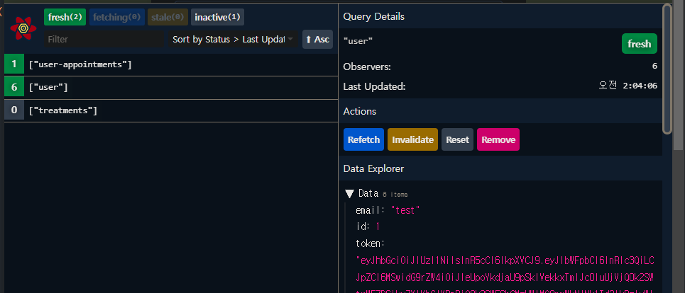
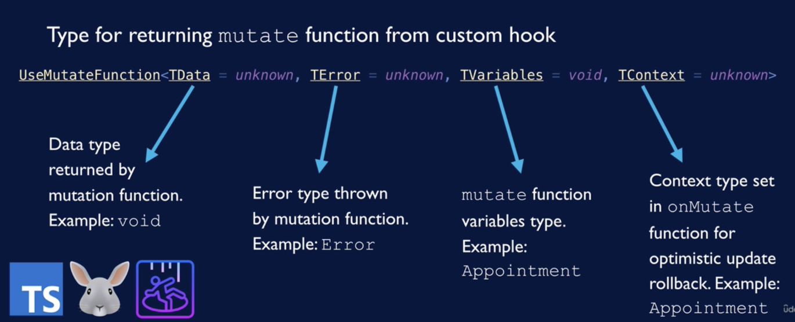

React Query 라이브러리를 사용하면서 정리한 내용입니다.

## useQuery, Pagination, Prefetching, Mutations

### state

- client state
  - 웹 브라우저 세션과 관련된 정보이다.
  - 예를 들어, 사용자가 선택한 언어나 테마 등이다. 단순히 사용자의 상태를 추적하는 것이다.
- Server state
  - 서버에 저장되는 정보이지만, 클라이언트에 표시되는 데 필요한 정보이다.
  - 예를 들어 블로그 게시물 데이터 등을 의미한다.

### React Query가 해결하고자 하는 문제는 무엇인가?

- 리액트 쿼리는 클라이언트의 서버 데이터 `캐시`를 관리한다.
  - 리액트 쿼리 캐시가 서버 데이터에 대한 단일 출처 공급원이다.
  - 리액트 쿼리 클라이언트를 어떻게 구성했느냐에 따라 해당 캐시의 데이터를 유지하는 것이다.
  - 즉, 데이터를 관리하는 것은 React Query이지만 서버의 새 데이터로 캐시를 업데이트하는 시기를 설정하는 것은 사용자의 몫이다.
- 클라이언트 캐시에 있는 데이터가 서버의 데이터와 일치하는 지 확인하기 위해서 두 가지 방법이 있다.
    1. 명령형 방법
        - 쿼리 클라이언트에서 해당 데이터를 무효화하고 캐시를 갱신할 새 데이터를 서버에서 가져오도록 지시한다.
    2. 선언형 방법
        - refetch를 트리거하는 조건을 구성한다. 예를 들어, 브라우저 창이 다시 포커스될 때나 stateTime을 통해 구성할 수도 있다.

#### React Query 기능 개요

- Fetching Data
- Loading / error states
  - 모든 쿼리의 loading 및 error 상태를 제공한다
- Pagination
  - pagination 또는 무한 스크롤이 필요한 경우 데이터를 나눠 가져올 수 있는 도구도 제공한다
- Prefetching
  - prefetching(미리 가져오기) 기능은 데이터를 미리 가져와서 캐시에 넣고 필요할 때 바로 사용하는 것이다. 이를 통해, 사용자가 데이터를 필요로 할 때 서버 연결을 기다리지 않고 캐시에서 해당 데이터를 즉시 가져올 수 있다.
- Mutations
  - 리액트 쿼리를 통해 서버에서 데이터를 Mutation(변형 또는 업데이트)할 수 있다.
- 중복 요청 방지
- 쿼리는 key로 식별되기 때문에, API 중복 요청을 방지할 수 있다. 예를 들어, 페이지 로드 후 해당 페이지의 여러 컴포넌트들이 동일한 api를 호출하는 경우, React Query는 중복 요청을 제거할 수 있다.
- 에러 발생 시 재시도 관리
- 쿼리가 성공하거나 오류가 났을 때를 구별하여 콜백을 달리 전달할 수 있다.

### 시작

- react-query 설치
  - `npm i react-query`
- Query Client 만들기
  - 쿼리와 캐시를 관리하는 클라이언트
- Query Provider 적용하기
  - query client를 값으로 받은 query provider를 적용함으로써 자녀 컴포넌트에게 해당 클라이언트 설정과 캐시를 제공한다
- useQuery 훅 실행하기
  - 서버에서 데이터를 가져오는 훅이다.

```tsx
import { QueryClient, QueryClientProvider } from 'react-query'
import { Posts } from './Posts'
import './App.css'

function App() {
    const queryClient = new QueryClient()
    return (
        <QueryClientProvider client={queryClient}>
            <div className="App">
                <h1>Blog Posts</h1>
                <Posts />
            </div>
        </QueryClientProvider>
    )
}

export default App
```

### useQuery

- queryKey
  - 쿼리 이름
- fetcher

  - 쿼리에 대한 데이터를 가져오는 방법이며 비동기 함수이다

- 비동기 함수의 데이터가 오기 전까지 data는 undefined이므로 이를 해결하려면 다음과 같은 조건을 두어야 한다

    ```tsx
    const { data } = useQuery('posts', fetchPosts)
    if (!data) return <div />
    ```

## 로딩 상태와 에러 처리하기

### isFetching vs. isLoading

isFetching은 비동기 쿼리가 Fetching을 완료하지 않았음을 의미한다. 비동기 함수가 아직 resolve되지 않았다. 항상 참이다.

isLoading은 isFetching의 부분집합으로서, 아직 가져오는 상태에 있음을 의미한다. 아직 쿼리 함수가 resolve되지 않아서 해당 쿼리를 만든 적이 없으며 캐시된 데이터도 없다.

이 둘의 차이는 Pagination에서 캐시된 데이터가 있는 경우와 없는 경우를 구분해야 할 때 유용하다.

- isFetching
  - true : 데이터 가져오는 중(캐싱된 데이터 유무는 상관 안함), 비동기 query 함수가 아직 resolve되지 않음
  - false : 데이터 가져왔음
  - 데이터를 refetch해야 할 때 유용
- isLoading (isFetching의 부분집합이다)
  - true : 데이터 가져오는 중 and 캐싱된 데이터도 없음, query 함수가 아직 resolve되지 않아서 첫번째 쿼리도 없음
  - false : 데이터 가져왔음 and 캐싱된 데이터 있음
  - 처음으로 로딩해서 데이터가 전혀 없을 때 확인 시 유용

### isError

쿼리 함수에서 오류가 발생하면 데이터를 얻지 못하므로, 데이터가 undefined인 경우를 방지하기 위해 early return 해야 한다.

이런 경우 isError를 사용하여 분기 후 처리하며, error를 통해 구체적인 에러 메시지를 확인할 수 있다.

```tsx
const { data, isError, error, isLoading } = useQuery('posts', fetchPosts)

if (isLoading) return <div>Loading...</div>
if (isError)
    return (
        <div>
            Error!<h1>{error.toString()}</h1>
        </div>
    )
```

### DevTool

```tsx
import { QueryClient, QueryClientProvider } from 'react-query'
import { ReactQueryDevtools } from 'react-query/devtools'

function App() {
    const queryClient = new QueryClient()
    return (
        <QueryClientProvider client={queryClient}>
            <ReactQueryDevtools />
        </QueryClientProvider>
    )
}

export default App
```

- stale time
  - 페이지를 새로고침하면 fetching에서 stale로 바로 변경되며, 결코 fresh 상태가 되진 않는다

### staleTime vs. cacheTime

- staleTime
  - staleTime은 `refetching`을 위한 것이다. 데이터가 만료되지 않으면 refetching은 실행되지 않기 때문에, 만료기간을 정하는 staleTime을 조정할 필요가 있다. (참고로 데이터 refetching의 트리거로는 만료된 데이터 외에도 component remount, window refocus 등이 있다)
  - staleTime의 기본값은 `0` 인데, 그 이유는 데이터를 항상 만료 상태로 둠으로써 클라이언트에게 실수로 만료된 데이터를 제공할 가능성을 줄일 수 있기 때문이다.
- cacheTime
  - cache란 나중에 다시 필요할 수도 있는 데이터를 위하여 저장하는 것인데, React Query에서 cache는 `fetching`하는 동안 보여주기 위한 backup 데이터로서 활용한다.
  - cache는 `cacheTime` 이후 만료되며, `cacheTime`의 기본값은 5분이다.
  - cache가 만료되면, 데이터는 가비지 콜렉팅된다. 특정 쿼리에 대한 활성 useQuery가 없는 경우, 해당 쿼리는 cold storage로 이동한다

### Refetch가 일어나지 않는 경우

- 쿼리들이 같은 query key를 사용할 경우
- 알려진 query key가 있을 경우, 어떠한 트리거가 있어야만 데이터를 refetch한다
- 예를 들어
  - component remount
  - window refocus
  - running refetch function
  - automated refetch
  - query invalidation after a mutation
- 해결 : Query key 배열
  - query key에 문자열 대신 배열을 전달하면 쿼리별로 캐시를 남길 수 있다.

### Pagination

```tsx
import { useState } from 'react'
import { useQuery } from 'react-query'

import { PostDetail } from './PostDetail'
const maxPostPage = 10

async function fetchPosts(pageNum) {
    const response = await fetch(
        `https://jsonplaceholder.typicode.com/posts?_limit=10&_page=${pageNum}`
    )
    return response.json()
}

export function Posts() {
    const [currentPage, setCurrentPage] = useState(0)
    const [selectedPost, setSelectedPost] = useState(null)

    const { data, isError, error, isLoading } = useQuery(
        ['posts', currentPage],
        () => fetchPosts(currentPage),
        {
            staleTime: 2000,
        }
    )

    if (isLoading) return <div>Loading...</div>
    if (isError)
        return (
            <div>
                Error!<h1>{error.toString()}</h1>
            </div>
        )

    return (
        <>
            <ul>
                {data.map(post => (
                    <li
                        key={post.id}
                        className="post-title"
                        onClick={() => setSelectedPost(post)}
                    >
                        {post.title}
                    </li>
                ))}
            </ul>
            <div className="pages">
                <button
                    disabled={currentPage <= 1}
                    onClick={() => {
                        setCurrentPage(prevValue => prevValue - 1)
                    }}
                >
                    Previous page
                </button>
                <span>Page {currentPage}</span>
                <button
                    disabled={currentPage >= maxPostPage}
                    onClick={() => {
                        setCurrentPage(prevValue => prevValue + 1)
                    }}
                >
                    Next page
                </button>
            </div>
            <hr />
            {selectedPost && <PostDetail post={selectedPost} />}
        </>
    )
}
```

위 코드에서 `pagination`을 하였으나, 다음 페이지 이동 시 아직 다음 페이지 데이터가 캐시에 없기 때문에, 로딩 인디케이터가 보여서 사용자 경험이 좋지 않았다.

이를 해결하기 위해 데이터를 미리 가져와 캐시에 넣음으로써 사용자가 기다릴 필요가 없도록 만들어보자.

즉, `Prefetching`은 데이터를 캐시에 추가하여 구성할 수 있지만 기본값은 만료된(stale) 상태이다.

사용자가 다음에 사용할 법한 모든 데이터에 `prefetching`을 사용할 수 있다. 페이지네이션뿐만 아니라 다수의 사용자가 웹사이트 방문 시 특정 탭을 누를 확률이 높다고 확인된다면 해당 데이터를 미리 가져올 수 있다.

`prefetchQuery`의 매개변수는 useQuery의 매개변수와 흡사하다. 이 때 필요한 쿼리 키는 useQuery에서 사용한 쿼리 키와 같다. React Query가 캐시에 이미 데이터가 있는지 쿼리 키를 통해 확인하기 때문이다.

쿼리 키가 바뀔 때도 지난 데이터를 유지하여 만약 이전 페이지로 돌아갔을 때 캐시에 해당 데이터가 있도록 만드려면, option에 `keepPreviousData`를 true로 설정하면 된다.

```tsx
import { useQuery, useQueryClient } from 'react-query'

const queryClient = useQueryClient()

useEffect(() => {
    if (currentPage < maxPostPage) {
        const nextPage = currentPage + 1
        queryClient.prefetchQuery(['posts', nextPage], () =>
            fetchPosts(nextPage)
        )
    }
}, [currentPage, queryClient])
```

### Mutations

뮤테이션은 서버에 데이터를 업데이트하도록 네트워크 호출을 하는 것이다.

서버 호출에서 모든 내용이 잘 진행될 것으로 예상한다면, optimistic 업데이트를 하고 사실이 아닌 것으로 판명되면 rollback을 진행할 수도 있다.

서버에서 받은 데이터로 쿼리 캐시를 업데이트할 수 있다.
관련 쿼리를 무효화하고 서버에서 리패치하여 클라이언트에 있는 데이터를 서버의 최신 데이터와 동기화한다.

- useQuery와 비슷하지만, 다음과 같은 점이 다르다
  - mutate 함수를 반환한다.
  - query key가 필요하지 않다
  - isLoading은 존재하나, isFetching은 없다(mutation은 캐시되지 않으므로)
  - retry 기본값은 0이다.

```tsx
import { useQuery, useMutation } from "react-query";

const deleteMutation = useMutation(postId => deletePost(postId));

  if (isLoading) return <div>Loading...</div>;
  if (isError) return <div>Error: {error.toString()}</div>;

return (

<button onClick={() => deleteMutation.mutate(post.id)}>Delete</button>
      {deleteMutation.isError && (
        <p style={{ color: "red" }}>Error: {deleteMutation.error.toString()}</p>
      )}
      {deleteMutation.isLoading && (
        <p style={{ color: "blue" }}>post 삭제 중</p>
      )}
      {deleteMutation.isSuccess && (
        <p style={{ color: "green" }}>post 삭제 성공</p>
      )}
)
```

## 동적 데이터 로드를 위한 무한 쿼리

### useInfiniteQuery

useInfiniteQuery는 다음 쿼리가 무엇이 될지 추적한다.

다음 쿼리는 데이터의 일부로 반환된다.

```tsx
{
    "count": 37,
    "next": "http://swapi.dev/api/species/?page=2",
    "previous": null,
    "results": [...]
}
```

useQuery에서 데이터는 단순히 쿼리 함수에서 반환되는 데이터였지만, useInfiniteQuery에서 반환된 객체는 두 개의 프로퍼티를 갖고 있다

- `pages`
  - pages에 있는 각 요소는 각각의 useQuery에서 받는 데이터에 해당한다
- `pageParams`
  - pageParams는 검색된 쿼리의 키를 추적한다. 잘 사용되진 않는다.

아래에서 `pageParam`은 query 함수에 전달되는 매개변수이다.

```tsx
useInfiniteQuery('sw-people', ({ pageParam = defaultUrl }) =>
    fetchURl(pageParam)
)
```

리액트쿼리는 pageParam의 현재 값을 유지한다(컴포넌트 상태 값의 일부가 아니다)

- 옵션 `getNextPageParam: (lastPage, allPages)`

  - 다음 페이지로 가는 방식을 정의하는 함수이다. pageParam을 업데이트한다.

```tsx
getNextPageParam: (lastPage) => lastPage.next || undefined,

// lastPage.next는 api 응답 시 받은 데이터 객체에 next라는 다음 url 프로퍼티가 전달되었기 때문에 사용할 수 있다.
// lastPage.next가 falsy면 undefined를 반환한다
```

useInfiniteQuery가 반환한 객체 프로퍼티는 다음과 같은 것들이 있다.

- `fetchNextPage`
  - 사용자가 더 많은 데이터를 요청할 때 호출하는 함수이다.
- `hasNextPage`
  - getNextPageParam 함수의 반환 값을 기반으로 한다. 이 프로퍼티를 useInfiniteQuery에 전달해서 마지막 쿼리의 데이터를 어떻게 사용할지 지시한다
- `isFetchingNextPage`
  - 다음 페이지를 가져오고 있는 것인지 아니면 일반적인 fetching인지 구분할 수 있다.
  - 로딩 스피너를 표시하는 데 사용한다

### React Infinite Scroller

- React Infinite Scroller는 무한스크롤 시 편리하게 사용할 수 있는 라이브러리이다.
- 사용법은 간단하다. 컴포넌트에서 두 개의 prop을 받는다. 라이브러리를 참고하여 무한스크롤 컴포넌트를 직접 만들어봤는데 나중에 관련해서도 정리할 예정이다.
  - `loadMore={fetchNextPage}`
  - `hasMore={hasNextPage}`

```tsx
import InfiniteScroll from 'react-infinite-scroller'
import { Person } from './Person'
import { useInfiniteQuery } from 'react-query'

const initialUrl = 'https://swapi.dev/api/people/'
const fetchUrl = async url => {
    const response = await fetch(url)
    return response.json()
}

export function InfinitePeople() {
    // TODO: get data for InfiniteScroll via React Query

    const {
        data,
        fetchNextPage,
        hasNextPage,
        isLoading,
        isError,
        isFetching,
        error,
    } = useInfiniteQuery(
        'sw-people',
        ({ pageParam = initialUrl }) => fetchUrl(pageParam),
        {
            getNextPageParam: lastPage => lastPage.next || undefined,
        }
    )

    if (isLoading) return <div className="loading">Loading...</div>
    if (isError) return <div>Error {error.toString()} </div>

    return (
        <>
            {isFetching && <div className="loading">Loading...</div>}
            <InfiniteScroll loadMore={fetchNextPage} hasMore={hasNextPage}>
                {data.pages.map(pageData => {
                    return pageData.results.map(person => (
                        <Person
                            key={person.name}
                            name={person.name}
                            hairColor={person.hair_color}
                            eyeColor={person.eye_color}
                        />
                    ))
                })}
            </InfiniteScroll>
        </>
    )
}
```

### Bi-directional Scrolling

- 양방향 스크롤링
  - fetchNextPage, hasNextPage, getNextPage
  - fetchPreviousPage, hasPreviousPage, getPreviousPage

## 더 큰 앱에서의 React Query 사용 팁: 설정, 집중화, 커스텀 훅

- query key들을 상수화함으로써, 문자열에서 오타를 내는 걸 방지한다. 쿼리 키의 일관성을 통해 캐시된 데이터를 얻을 수 있다.
- 로딩과 에러 처리를 각 컴포넌트별로 하지 않고 중앙에서 진행해보자.
- 데이터에 대한 fallback 값을 준비한다. 서버에서 데이터를 아직 받지 못하고 캐시가 비어있는 경우 사용한다. fallback 값을 data 의 기본값으로 정한다

```tsx
export function useTreatments(): Treatment[] {
    // TODO: get data from server via useQuery
    const fallback = []
    const { data = fallback } = useQuery(
        queryKeys.treatments,
        getTreatments
    )

    return data
}
```

### useIsFetching을 사용하는 중앙 집중식 fetching Indicator

- `useIsFetching` 훅을 사용하면 각각의 useQuery 커스텀 훅에 `isFetching` 을 사용하여 확인할 필요가 없다.
- `useIsFetching` 은 현재 fetching 상태인 쿼리 호출의 개수인 정수값을 반환한다. 반환값이 0보다 크다면 fetching 상태 호출이 존재하므로 참으로 평가된다.

```tsx
// Loading.tsx
import { Spinner, Text } from '@chakra-ui/react'
import { ReactElement } from 'react'
import { useIsFetching } from 'react-query'

export function Loading(): ReactElement {
    // will use React Query `useIsFetching` to determine whether or not to display
    const isFetching = useIsFetching() // for now, just don't display

    const display = isFetching ? 'inherit' : 'none'

    return (
        <Spinner
            thickness="4px"
            speed="0.65s"
            emptyColor="olive.200"
            color="olive.800"
            role="status"
            position="fixed"
            zIndex="9999"
            top="50%"
            left="50%"
            transform="translate(-50%, -50%)"
            display={display}
        >
            <Text display="none">Loading...</Text>
        </Spinner>
    )
}
```

### query client의 onError 옵션을 통한 error handling 중앙 집중화

모든 useQuery 호출에 에러 핸들링 방식을 적용함으로써, 각 호출마다 에러 핸들링을 따로 지정하지 않아도 되도록 한다

useIsFetching과 유사한 useError훅은 제공되지 않는다. 그 이유는 useError 훅이 존재할 수 없다. 왜냐하면 useIsFetching처럼 작동하려면 정수 이상의 값이 반환되어야 하는데, 구현하기 쉽지 않다고 한다.

따라서 useIsFetching과 같은 집중식 훅 대신에 QueryClient의 옵션에 onError 핸들러 기본값을 만들 수 있다.

```tsx
defaultOptions: {
 queries: { useQuery options},
 mutations: { useMutation options}
}
```

```tsx
// queryClient.ts
import { createStandaloneToast } from '@chakra-ui/react'
import { QueryClient } from 'react-query'

import { theme } from '../theme'

const toast = createStandaloneToast({ theme })

function queryErrorHandler(error: unknown): void {
    // error is type unknown because in js, anything can be an error (e.g. throw(5))
    const id = 'react-query-error'
    const title =
        error instanceof Error ? error.message : 'error connecting to server'

    // prevent duplicate toasts
    toast.closeAll()
    toast({ id, title, status: 'error', variant: 'subtle', isClosable: true })
}

export const queryClient = new QueryClient({
    defaultOptions: {
        queries: {
            onError: queryErrorHandler,
        },
    },
})
```

### onError 의 대안 - React의 Error Boundary

- 리액트 쿼리에서 `useErrorBoundary` 옵션을 true로 설정하면 리액트 쿼리 내에서 에러를 처리하지 않고 가장 가까운 에러 바운더리로 에러를 전파한다.

## PreFetching과 Pagination

### pre-populating data(데이터 미리 채우기)를 위한 옵션

- `prefetchQuery`
  - 서버에서 받은 데이터
  - queryClient의 메서드로 사용
  - 데이터가 캐시에 추가된다
- `setQueryData`
  - 클라이언트에서 받은 데이터(서버에서 mutation에 대한 응답으로 나온 데이터일 수도 있다)
  - queryClient의 메서드로 사용
  - 데이터가 캐시에 추가된다. useQuery가 데이터를 요청하면,캐시는 해당 데이터를 제공할 수 있다.
- `placeholderData`
  - 클라이언트에서 받은 데이터
  - useQuery의 옵션으로 사용
  - 데이터가 캐시에 추가되지 않는다. placeholder는 필요한 경우에만 사용한다. 달리 표시할 데이터가 없는 경우 사용하는 표시용 데이터일뿐이다. 다시 사용할 일이 없기 때문에 이를 캐시에 추가하지 않는다.
  - 고정값 또는 함수를 사용할 수 있다.
- `initialData`
  - 클라이언트에서 받은 데이터
  - useQuery의 옵션으로 사용
  - 데이터가 캐시에 추가된다

### Prefetch

```tsx
// prefetch하는 훅
export function usePrefetchTreatments(): void {
    const queryClient = useQueryClient()
    queryClient.prefetchQuery(queryKeys.treatments, getTreatments)
}
```

```tsx
// 사용 - Home 에서 prefetch한다
export function Home(): ReactElement {
    usePrefetchTreatments()

    // 생략
}
```

```tsx
export function useAppointments(): UseAppointments {
    const currentMonthYear = getMonthYearDetails(dayjs())
    const [monthYear, setMonthYear] = useState(currentMonthYear)
    function updateMonthYear(monthIncrement: number): void {
        setMonthYear(prevData => getNewMonthYear(prevData, monthIncrement))
    }
    const [showAll, setShowAll] = useState(false)

    const queryClient = useQueryClient()

    useEffect(() => {
        const nextMonthYear = getNewMonthYear(monthYear, 1)
        queryClient.prefetchQuery(
            [queryKeys.appointments, nextMonthYear.year, nextMonthYear.month],
            () => getAppointments(nextMonthYear.year, nextMonthYear.month)
        )
    }, [queryClient, monthYear])

    const fallback = {}

    const { data: appointments = fallback } = useQuery(
        [queryKeys.appointments, monthYear.year, monthYear.month],
        () => getAppointments(monthYear.year, monthYear.month)
    )

    return { appointments, monthYear, updateMonthYear, showAll, setShowAll }
}
```

## 데이터 변환과 Refetching

### useQuery의 select 옵션으로 필터링하기

[React Query Data Transformations](https://tkdodo.eu/blog/react-query-data-transformations)

- select 옵션
  - 이 옵션은 쿼리 함수에 의해 반환된 데이터의 부분을 선택하거나 변형하는 데 사용할 수 있다.

```tsx
const selectFn = useCallback(
    data => {
        getAvailableAppointments(data, user)
    },
    [user]
)

const { data: appointments = fallback } = useQuery(
    [queryKeys.appointments, monthYear.year, monthYear.month],
    () => getAppointments(monthYear.year, monthYear.month),
    {
        select: showAll ? undefined : selectFn,
    }
)
```

### Re-fetching 발생 요인

- 리액트 컴포넌트가 마운트될 때
  - refetchOnMount (boolean)
  - default : true
- 윈도우가 refocus될 때
  - refetchOnWindowFocus (boolean)
  - default: true
- 네트워크가 재연결될 때
  - refetchOnReconnect (boolean)
  - default : true
- refetchInterval이 만료된 경우
  - refetchInterval (ms)

### Re-Fetching 억제 방법

- staleTime 증가
  - refetch 트리거인 window refocus 및 네트워크 재연결 등이 일어나더라도 refetch는 데이터가 실제로 만료된 경우에만 작동하는데, stale time(만료 시간)을 증가시키면 데이터가 만료되는 주기가 길어져 refetching이 줄어든다
  - staleTime을 증가시키면, cacheTime을 staleTime보다 더 길게 설정해야 한다. 왜냐하면 만료된 데이터를 불러오는 동안 캐시에 백업된 내용을 보여줘야 하기 때문이다. 그런데 cacheTime이 staleTime보다 작아서 만료된 데이터보다 캐싱이 먼저 만료되면 refetch하는 동안 보여 줄 화면이 없게 되는 문제가 발생한다.
- refetchOnMount, refetchOnWindowFocus, refetchOnReconnect 옵션을 false로 설정한다(default는 true)

```jsx
const { data = fallback } = useQuery(queryKeys.treatments, getTreatments, {
    staleTime: 600000, // 10 minutes
    cacheTime: 900000, // 15 minutes
    refetchOnMount: false,
    refetchOnWindowFocus: false,
    refetchOnReconnect: false,
})
```

refetch를 제한하면 네트워크 호출을 줄일 수 있다. 하지만 refetch 제한은 신중히 해야 한다.

변경이 자주 일어나지 않는 데이터에 적용하는 것이 적절하다. 만약 실시간으로 변경이 자주 일어나는 중요한 정보들의 refetch를 제한한다면 정확하지 않은 정보가 클라이언트에 머무를 수 있다.

### 전역 refetch 옵션

전역에 refetch 옵션을 설정할 수 있다.

```jsx
export const queryClient = new QueryClient({
    defaultOptions: {
        queries: {
            onError: queryErrorHandler,
            staleTime: 600000, // 10 minutes
            cacheTime: 900000, // 15 minutes
            refetchOnMount: false,
            refetchOnWindowFocus: false,
            refetchOnReconnect: false,
        },
    },
})
```

그리고 이러한 전역 옵션을 개별 옵션에서 오버라이드할 수도 있다.

```jsx
const { data: appointments = fallback } = useQuery(
    [queryKeys.appointments, monthYear.year, monthYear.month],
    () => getAppointments(monthYear.year, monthYear.month),
    {
        select: showAll ? undefined : selectFn,
        staleTime: 0,
        cacheTime: 300000, // 5 minutes
        refetchOnMount: true,
        refetchOnWindowFocus: true,
        refetchOnReconnect: true,
        refetchInterval: 60000, // 1 minute
    }
)
```

## React Query와 Authentication

useAuth 훅의 책임은 signIn, signUn, signOut 함수를 제공하는 것이다.

React Query의 책임은 클라이언트의 서버 상태를 관리하는 것이다. 따라서 데이터 저장은 React Query에 해야 하고, 그러려면 useUser와 같은 특별한 훅이 필요하다.

### useAuth에서 query cache 값 설정

- React Query는 auth 정보의 제공자 역할을 한다
- `queryClient.setQueryData` 를 사용한다
  - 쿼리 키와 값을 가져와 쿼리 캐시에 해당 키에 대한 값을 설정할 수 있다.

### useQuery를 위한 localStorage의 initialData

[Initial Query Data | TanStack Query Docs](https://tanstack.com/query/v4/docs/guides/initial-query-data?from=reactQueryV3&original=https://react-query-v3.tanstack.com/guides/initial-query-data#using-initialdata-to-prepopulate-a-query)

```tsx
// auth/useAuth.tsx
import axios, { AxiosResponse } from 'axios'

import { User } from '../../../shared/types'
import { axiosInstance } from '../axiosInstance'
import { useCustomToast } from '../components/app/hooks/useCustomToast'
import { useUser } from '../components/user/hooks/useUser'

interface UseAuth {
    signin: (email: string, password: string) => Promise<void>
    signup: (email: string, password: string) => Promise<void>
    signout: () => void
}

type UserResponse = { user: User }
type ErrorResponse = { message: string }
type AuthResponseType = UserResponse | ErrorResponse

export function useAuth(): UseAuth {
    const SERVER_ERROR = 'There was an error contacting the server.'
    const toast = useCustomToast()
    const { clearUser, updateUser } = useUser()

    async function authServerCall(
        urlEndpoint: string,
        email: string,
        password: string
    ): Promise<void> {
        try {
            const {
                data,
                status,
            }: AxiosResponse<AuthResponseType> = await axiosInstance({
                url: urlEndpoint,
                method: 'POST',
                data: { email, password },
                headers: { 'Content-Type': 'application/json' },
            })

            if (status === 400) {
                const title = 'message' in data ? data.message : 'Unauthorized'
                toast({ title, status: 'warning' })
                return
            }

            if ('user' in data && 'token' in data.user) {
                toast({
                    title: `Logged in as ${data.user.email}`,
                    status: 'info',
                })

                // update stored user data
                updateUser(data.user)
            }
        } catch (errorResponse) {
            const title =
                axios.isAxiosError(errorResponse) &&
                errorResponse?.response?.data?.message
                    ? errorResponse?.response?.data?.message
                    : SERVER_ERROR
            toast({
                title,
                status: 'error',
            })
        }
    }

    async function signin(email: string, password: string): Promise<void> {
        authServerCall('/signin', email, password)
    }
    async function signup(email: string, password: string): Promise<void> {
        authServerCall('/user', email, password)
    }

    function signout(): void {
        // clear user from stored user data
        clearUser()
        toast({
            title: 'Logged out!',
            status: 'info',
        })
    }

    // Return the user object and auth methods
    return {
        signin,
        signup,
        signout,
    }
}
```

```jsx
// components/user/hooks/useUser.ts
import { AxiosResponse } from 'axios'
import { useQuery, useQueryClient } from 'react-query'

import type { User } from '../../../../../shared/types'
import { axiosInstance, getJWTHeader } from '../../../axiosInstance'
import { queryKeys } from '../../../react-query/constants'
import {
    clearStoredUser,
    getStoredUser,
    setStoredUser,
} from '../../../user-storage'

async function getUser(user: User | null): Promise<User | null> {
    if (!user) return null
    const { data }: AxiosResponse<{ user: User }> = await axiosInstance.get(
        `/user/${user.id}`,
        {
            headers: getJWTHeader(user),
        }
    )
    return data.user
}

interface UseUser {
    user: User | null;
    updateUser: (user: User) => void;
    clearUser: () => void;
}

export function useUser(): UseUser {
    const queryClient = useQueryClient()
    // call useQuery to update user data from server
    const { data: user } = useQuery(queryKeys.user, () => getUser(user), {
        initialData: getStoredUser(),
        onSuccess: (received: User | null) => {
            if (received) {
                setStoredUser(received)
            } else {
                clearStoredUser()
            }
        },
    })

    // meant to be called from useAuth
    function updateUser(newUser: User): void {
        // update the user in the query cache
        // 사용자가 성공적으로 인증할 경우 캐시에 사용자 정보를 업데이트한다
        queryClient.setQueryData(queryKeys.user, newUser)
    }

    // meant to be called from useAuth
    function clearUser() {
        // TODO: reset user to null in query cache
        queryClient.setQueryData(queryKeys.user, null)
    }

    return { user, updateUser, clearUser }
}
```

```jsx
// user-storage/index.tsx
import { User } from '../../../shared/types'

const USER_LOCALSTORAGE_KEY = 'lazyday_user'

// helper to get user from localstorage
export function getStoredUser(): User | null {
    const storedUser = localStorage.getItem(USER_LOCALSTORAGE_KEY)
    return storedUser ? JSON.parse(storedUser) : null
}

export function setStoredUser(user: User): void {
    localStorage.setItem(USER_LOCALSTORAGE_KEY, JSON.stringify(user))
}

export function clearStoredUser(): void {
    localStorage.removeItem(USER_LOCALSTORAGE_KEY)
}
```

### 의존적 쿼리(dependent query)

user가 쿼리의 truthy 결과에 의존하도록 해보자. 다시 말해 user가 falsey 쿼리를 비활성화하는 것이다.

user가 falsey라는 것은 사용자가 더 이상 로그인 상태가 아니라는 사실을 뜻하므로 더 이상 인가된 사용자만 볼 수 있는 데이터(의존적 쿼리)를 보여줄 필요가 없다.

- Observers
  - user 쿼리에 6개의 옵저버가 있는데, useUser 훅을 실행(`const { user } = useUser();`)하는 앱의 모든 컴포넌트가 해당 쿼리를 구독하고 있는데 이들을 옵저버라고 한다.(예를 들어, 사용자 예약현황, 사용자 정보, 상단 로그인정보 등등) 이다.



```jsx
import dayjs from 'dayjs'
import { useQuery } from 'react-query'

import type { Appointment, User } from '../../../../../shared/types'
import { axiosInstance, getJWTHeader } from '../../../axiosInstance'
import { queryKeys } from '../../../react-query/constants'
import { useUser } from './useUser'

// for when we need a query function for useQuery
async function getUserAppointments(
    user: User | null
): Promise<Appointment[] | null> {
    if (!user) return null
    const { data } = await axiosInstance.get(`/user/${user.id}/appointments`, {
        headers: getJWTHeader(user),
    })
    return data.appointments
}

export function useUserAppointments(): Appointment[] {
    // TODO replace with React Query
    const { user } = useUser()

    const fallback: Appointment[] = []
    const { data: userAppointments = fallback } = useQuery(
        'user-appointments',
        () => getUserAppointments(user),
        { enabled: !!user }
    )
    return userAppointments
}
```

### 로그아웃 후 쿼리 삭제 - queryClient.removeQueries 메서드

queryClient.setQueryData는 onSuccess를 발생시킨다. 이런 이유 때문에 queryKeys.user는 setQueryData를 사용해야 한다
`queryClient.setQueryData(queryKeys.user, null);`

user-appointment는 로컬스토리지 존재하지 않으므로 위에 onSuccess 옵션을 사용하지 않는다.

removeQueries는 onSuccess를 발생시키지 않으나, 해당 query를 삭제할 수 있다.

`queryClient.removeQueries('user-appointments');`

```jsx
// useUser
import { AxiosResponse } from 'axios'
import { useQuery, useQueryClient } from 'react-query'

import type { User } from '../../../../../shared/types'
import { axiosInstance, getJWTHeader } from '../../../axiosInstance'
import { queryKeys } from '../../../react-query/constants'
import {
    clearStoredUser,
    getStoredUser,
    setStoredUser,
} from '../../../user-storage'

async function getUser(user: User | null): Promise<User | null> {
    if (!user) return null
    const { data }: AxiosResponse<{ user: User }> = await axiosInstance.get(
        `/user/${user.id}`,
        {
            headers: getJWTHeader(user),
        }
    )
    return data.user
}

interface UseUser {
    user: User | null;
    updateUser: (user: User) => void;
    clearUser: () => void;
}

export function useUser(): UseUser {
    const queryClient = useQueryClient()
    // call useQuery to update user data from server
    const { data: user } = useQuery(queryKeys.user, () => getUser(user), {
        initialData: getStoredUser(),
        onSuccess: (received: User | null) => {
            if (received) {
                setStoredUser(received)
            } else {
                clearStoredUser()
            }
        },
    })

    // meant to be called from useAuth
    function updateUser(newUser: User): void {
        // update the user in the query cache
        // 사용자가 성공적으로 인증할 경우 캐시에 사용자 정보를 업데이트한다
        queryClient.setQueryData(queryKeys.user, newUser)
    }

    // meant to be called from useAuth
    function clearUser() {
        // reset user to null in query cache
        // queryClient.setQueryData는 onSuccess를 발생시킨다. 이런 이유 때문에 queryKeys.user는 setQueryData를 사용해야 한다
        queryClient.setQueryData(queryKeys.user, null)

        // user-appointment는 로컬스토리지 존재하지 않으므로 위에 onSuccess 옵션을 사용하지 않는다.
        // removeQueries는 onSuccess를 발생시키지 않으나, 해당 query를 삭제할 수 있다.
        queryClient.removeQueries('user-appointments')
    }

    return { user, updateUser, clearUser }
}
```

## useMutation

- 데이터 업데이트 방법
  - Query Invalidation : 이를 통해 데이터가 캐시에서 제거되고 refetch를 트리거할 수 있다.
  - Optimistic Update: mutate가 성공하기를 희망하지만 실패하더라도 롤백할 수 있다.

useMutation 사용법은 useQuery와 대체적으로 비슷하나, 차이점은 다음과 같다.

- 캐시 데이터가 없다
- 기본적으로 retry가 없다(구성할 수는 있다)
- refetch 함수가 없다
- isFetching만 있다.
  - 캐시데이터가 없어서 isLoading과 isFetching이 구분되지 않는다.
- mutate 함수를 반환한다
- onMutate 콜백이 있다.
  - optimistic queries에서 사용한다. mutate가 실패할 때 복원할 수 있도록 이전 상태를 저장하는 데 사용한다.

[useMutation | TanStack Query Docs](https://tanstack.com/query/v4/docs/reference/useMutation?from=reactQueryV3&original=https://react-query-v3.tanstack.com/reference/useMutation)

[Mutations | TanStack Query Docs](https://tanstack.com/query/v4/docs/guides/mutations?from=reactQueryV3&original=https://react-query-v3.tanstack.com/guides/mutations)



### mutation 후 refetch를 위해 query 무효화하기

mutation 후 기존에 캐시된 데이터는 최신 데이터가 아니므로, refetch를 하기 위해 React Query에게 기존 query를 무효화한다. 이를 통해 사용자가 새로고침할 필요가 없다.

- `invalidateQueries` 효과
  - query를 stale로 표시한다
  - query가 현재 렌더링 중이면 refetch를 트리거한다.
- `query key prefix`
  - `invalidateQueries` 는 정확한 key가 아닌 prefix를 사용한다. 따라서 동일한 쿼리 key prefix로 서로 관련된 쿼리를 설정하면 해당 key가 prefix로 있는 모든 쿼리를 한 번에 무효화할 수 있다.
  - 정확한 key로 설정하고 싶다면 {exact: true} 로 설정하면 된다.

[Query Keys | TanStack Query Docs](https://tanstack.com/query/v4/docs/guides/query-keys?from=reactQueryV3&original=https://react-query-v3.tanstack.com/guides/query-keys)

[Query Invalidation | TanStack Query Docs](https://tanstack.com/query/v4/docs/guides/query-invalidation?from=reactQueryV3&original=https://react-query-v3.tanstack.com/guides/query-invalidation#query-matching-with-invalidatequeries)

```tsx
async function setAppointmentUser(
    appointment: Appointment,
    userId: number | undefined
): Promise<void> {
    if (!userId) return
    const patchOp = appointment.userId ? 'replace' : 'add'
    const patchData = [{ op: patchOp, path: '/userId', value: userId }]
    await axiosInstance.patch(`/appointment/${appointment.id}`, {
        data: patchData,
    })
}

export function useReserveAppointment(): UseMutateFunction<
    void,
    unknown,
    Appointment,
    unknown
> {
    const { user } = useUser()
    const toast = useCustomToast()
    const queryClient = useQueryClient()

    const { mutate } = useMutation(
        (appointment: Appointment) => setAppointmentUser(appointment, user?.id),
        {
            onSuccess: () => {
                queryClient.invalidateQueries([queryKeys.appointments])
                toast({
                    title: 'You have reserved the appointment!',
                    status: 'success',
                })
            },
        }
    )

    return mutate
}
```

```tsx
// meant to be called from useAuth
function clearUser() {
    // reset user to null
    queryClient.setQueryData(queryKeys.user, null)

    // remove user appointments query
    queryClient.removeQueries([queryKeys.appointments, queryKeys.user])
}
```

### optimistic updates

optimistic updates는 서버로부터 응답을 받기 전에 사용자 캐시를 업데이트하는 것이다. 왜냐하면 서버에 요청한 mutation이 잘 작동할 것이라고 “낙관"하기 때문이다.

- 장점은 캐시가 더 빨리 업데이트된다는 것이다.
  - 캐시를 업데이트하기 위해 서버 응답을 기다릴 필요가 없기 때문이다.
  - 특히, 많은 컴포넌트가 의존하고 있는 경우 유용하다.
  - 서버에서 업데이트가 조금 오래 걸릴 경우 사용하면 사용자 입장에서 웹사이트가 훨씬 반응성이 좋게 느껴진다.
- 단점은 서버 업데이트가 실패할 경우 코드가 더 복잡해진다.

  - 서버 업데이트가 실패할 경우 캐시 업데이트 이전의 데이터로 되돌려야 한다. 따라서 해당 데이터를 저장해야 한다.
  - useMutation은 onMutate 콜백 함수가 있는데, 이는 롤백을 위해 onError에게 전달되는 context 값을 반환한다. onError는 전달받은 context 값을 통해 캐시 값을 이전으로 복원할 수 있다. 이 경우 context는 낙관적 업데이트를 적용하기 전의 context를 의미한다. onMutate 함수는 진행 중인 모든 refetch를 취소한다.

- Rollback(Cancel Query Flow)
  - 사용자가 mutate로 업데이트를 트리거한다
  - 서버로 업데이트를 보낸다
  - 서버에서 오는 데이터가 낙관적 업데이트를 훼손하지 않도록 onMutate 콜백 함수를 통해 진행중인 쿼리들을 취소한다. 쿼리 캐시를 (낙관적으로) 업데이트한다. onMutate 핸들러에서 반환된 context로 이전 캐시 값을 저장한다.
  - 서버 업데이트가 성공하면, 쿼리를 무효화한다(invalidateQueries)
  - 반면 실패하면 캐시를 낙관적 업데이트를 하기 전 상태로 되돌리기 위해서 onError 콜백 함수가 실행되고, onMutate에서 반환된 context를 사용한다.

[Optimistic Updates | TanStack Query Docs](https://tanstack.com/query/v4/docs/guides/optimistic-updates?from=reactQueryV3&original=https://react-query-v3.tanstack.com/guides/optimistic-updates)

[Query Cancellation | TanStack Query Docs](https://tanstack.com/query/v4/docs/guides/query-cancellation?from=reactQueryV3&original=https://react-query-v3.tanstack.com/guides/query-cancellation)

### query 취소

`AbortController` 인터페이스로 쿼리를 취소한다.

AbortController는  자바스크립트 표준 인터페이스이며, `AbortSignal` 객체를 DOM 요청에 보낸다.

```tsx
// query function
async function getUser(
    user: User | null,
    signal: AbortSignal
): Promise<User | null> {
    if (!user) return null
    const { data }: AxiosResponse<{ user: User }> = await axiosInstance.get(
        `/user/${user.id}`,
        {
            signal, // abortSignal from React Query
            headers: getJWTHeader(user),
        }
    )

    return data.user
}
```

```tsx
import jsonpatch from 'fast-json-patch';
import { UseMutateFunction, useMutation, useQueryClient } from 'react-query';

import type { User } from '../../../../../shared/types';
import { axiosInstance, getJWTHeader } from '../../../axiosInstance';
import { queryKeys } from '../../../react-query/constants';
import { useCustomToast } from '../../app/hooks/useCustomToast';
import { useUser } from './useUser';

// for when we need a server function
async function patchUserOnServer(
  newData: User | null,
  originalData: User | null
): Promise<User | null> {
  if (!newData || !originalData) return null;
  // create a patch for the difference between newData and originalData
  const patch = jsonpatch.compare(originalData, newData);

  // send patched data to the server
  const { data } = await axiosInstance.patch(
    `/user/${originalData.id}`,
    { patch },
    {
      headers: getJWTHeader(originalData),
    }
  );
  return data.user;
}

export function usePatchUser(): UseMutateFunction<
  User,
  unknown,
  User,
  unknown
> {
  const { user, updateUser } = useUser();
  const toast = useCustomToast();
  const queryClient = useQueryClient();

  const { mutate: patchUser } = useMutation(
    (newUserData: User) => patchUserOnServer(newUserData, user),
    {
      // onMutate returns context that is passed to onError
      onMutate: async (newData: User | null) => {
        // cancel any outgoing queries for user data, so old server data
        // doesn't overwrite our optimistic update
        queryClient.cancelQueries(queryKeys.user);

        // snapshot of previous user value
        const previousUserData: User = queryClient.getQueryData(queryKeys.user);

        // optimistically update the cache with new user value
        updateUser(newData);

        // return context object with snapshotted value
        return { previousUserData };
      },
      onError: (error, newData, context) => {
        // roll back cache to saved value
        if (context.previousUserData) {
          updateUser(context.previousUserData);
          toast({
            title: 'Update failed; restoring previous values',
            status: 'warning',
          });
        }
      },
      onSuccess: (userData: User | null) => {
        if (user) {
         // updateUser(newData); // 이제 불필요
          toast({
            title: 'User updated!',
            status: 'success',
          });
        }
      },
      onSettled: () => {
        // invalidate user query to make sure we're in sync with server data
        queryClient.invalidateQueries(queryKeys.user);
      },
    }
  );

  return patchUser;
}
```

## React Query 테스트 방법

[Testing React Query](https://tkdodo.eu/blog/testing-react-query)

React Query는 주로 서버와 클라이언트 간의 커뮤니케이션인 네트워크 호출과 연관되어 있다.

따라서 이러한 네트워크 호출을 흉내내는 것을 돕는 도구인 MSW를 사용한다.

- MSW(Mock Service Worker)

  - 네트워크 호출을 차단한 후 새로 정의한 핸들러에 따른 가짜 네트워크 응답을 반환한다.

```bash
npm i msw -D
```

- Testing Library, Jest

  - CRA로 앱을 만들었다면, Testing Library, Jest가 함께 설치되어 있다.
  - 하지만 CRA로 만들지 않았다면, 새로 설치해야 한다.

```bash
npm i @testing-library/react -D
npm i jest -D
```

### 테스트 전 준비

- Query Provider로 감싸기
  - Query Provider 내부에 렌더링할 요소를 포함할 함수를 생성한다.
- test-utils 폴더 내 index.tsx 파일에 전달된 모든 UI를 wrapping하도록 하는 함수를 작성한다.
  - 이는 Query Provider에게 제공하는 모든 JSX를 wrapping하여 테스트가 올바르게 실행되도록 해준다.

[Testing React Query](https://tkdodo.eu/blog/testing-react-query#for-components)

### test-utils/index

```tsx
// test-utils/index.tsx
/* eslint-disable no-console */

import { render, RenderResult } from '@testing-library/react'
import { ReactElement } from 'react'
import { QueryClient, QueryClientProvider, setLogger } from 'react-query'

import { generateQueryClient } from '../react-query/queryClient'

// suppress errors written to console
setLogger({
    log: console.log,
    warn: console.warn,
    error: () => {
        // swallow the errors
    },
})

// make this a function for unique queryClient per test
const generateTestQueryClient = () => {
    const client = generateQueryClient()
    const options = client.getDefaultOptions()
    options.queries = { ...options.queries, retry: false }
    return client
}

export function renderWithQueryClient(
    ui: ReactElement,
    client?: QueryClient
): RenderResult {
    const queryClient = client ?? generateTestQueryClient()
    return render(
        <QueryClientProvider client={queryClient}>{ui}</QueryClientProvider>
    )
}
```

testing-library의 screen은 렌더링 결과에 접근하는 방법이다. 자세한 내용은 testing-library 공식 홈페이지를 참고한다.

[Cheatsheet | Testing Library](https://testing-library.com/docs/dom-testing-library/cheatsheet/#queries)

### 렌더 테스트 방법

```tsx
// Treatments.test.tsx

import { screen } from '@testing-library/react'

import { renderWithQueryClient } from '../../../test-utils'
import { Treatments } from '../Treatments'

test('renders response from query', async () => {
    renderWithQueryClient(<Treatments />)

    const treatmentTitles = await screen.findAllByRole('heading', {
        name: /massage|facial|scrub/i,
    })
    expect(treatmentTitles).toHaveLength(3)
})
```

### 에러 테스트 방법

```tsx
/* eslint-disable no-console */

import { screen } from '@testing-library/react'
import { rest } from 'msw'
import { DefaultOptions, setLogger } from 'react-query'

import { server } from '../../../mocks/server'
import { defaultQueryClientOptions } from '../../../react-query/queryClient'
import { renderWithQueryClient } from '../../../test-utils'
import { AllStaff } from '../AllStaff'

setLogger({
    log: console.log,
    warn: console.warn,
    error: () => {
        // swallow the errors
    },
})

test('renders response from query', async () => {
    renderWithQueryClient(<AllStaff />)

    const staffNames = await screen.findAllByRole('heading', {
        name: /divya|sandra|michael|mateo/i,
    })
    expect(staffNames).toHaveLength(4)
})

test('handles query error', async () => {
    // (re)set handler to return a 500 error for staff and treatments
    server.resetHandlers(
        rest.get('http://localhost:3030/staff', (req, res, ctx) => {
            return res(ctx.status(500))
        }),
        rest.get('http://localhost:3030/treatments', (req, res, ctx) => {
            return res(ctx.status(500))
        })
    )

    const defaultOptions: DefaultOptions = defaultQueryClientOptions
    if (defaultOptions && defaultOptions.queries)
        defaultOptions.queries.retry = false

    renderWithQueryClient(<AllStaff />)

    // check for the toast alert
    const alertToast = await screen.findByRole('alert')
    expect(alertToast).toHaveTextContent('Request failed with status code 500')
})
```

```tsx
// Calendar.test.tsx

/* eslint-disable no-console */
import { screen } from '@testing-library/react'
import { rest } from 'msw'

import { server } from '../../../mocks/server'
import { renderWithQueryClient } from '../../../test-utils'
import { Calendar } from '../Calendar'

test('Appointment query error', async () => {
    // (re)set handler to return a 500 error for appointments
    server.resetHandlers(
        rest.get(
            'http://localhost:3030/appointments/:month/:year',
            (req, res, ctx) => {
                return res(ctx.status(500))
            }
        )
    )

    renderWithQueryClient(<Calendar />)

    // check for the toast alert
    const alertToast = await screen.findByRole('alert')
    expect(alertToast).toHaveTextContent('Request failed with status code 500')
})
```

### Mutation 테스트 방법

```tsx
// appointmentMutation.test.tsx
import {
    fireEvent,
    screen,
    waitForElementToBeRemoved,
} from '@testing-library/react'
import { MemoryRouter } from 'react-router-dom'

import { mockUser } from '../../../mocks/mockData'
import { renderWithQueryClient } from '../../../test-utils'
import { Calendar } from '../Calendar'

// mocking useUser to mimic a logged-in user
jest.mock('../../user/hooks/useUser', () => ({
    __esModule: true,
    useUser: () => ({ user: mockUser }),
}))

test('Reserve appointment', async () => {
    renderWithQueryClient(
        <MemoryRouter>
            <Calendar />
        </MemoryRouter>
    )

    // find all the appointments
    const appointments = await screen.findAllByRole('button', {
        name: /\d\d? [ap]m\s+(scrub|facial|massage)/i,
    })

    // click on the first one to reserve
    fireEvent.click(appointments[0])

    // check for the toast alert
    const alertToast = await screen.findByRole('alert')
    expect(alertToast).toHaveTextContent('reserve')

    // close alert to keep state clean and wait for it to disappear
    const alertCloseButton = screen.getByRole('button', { name: 'Close' })
    alertCloseButton.click()
    await waitForElementToBeRemoved(alertToast)
})

test('Cancel appointment', async () => {
    renderWithQueryClient(
        <MemoryRouter>
            <Calendar />
        </MemoryRouter>
    )

    // find all the cancel buttons
    const cancelButtons = await screen.findAllByRole('button', {
        name: /cancel appointment/i,
    })
    ㅃㅂ

    // click on the first one to cancel
    fireEvent.click(cancelButtons[0])

    // check for the toast alert
    const alertToast = await screen.findByRole('alert')
    expect(alertToast).toHaveTextContent('cancel')

    // close alert to keep state clean and wait for it to disappear
    const alertCloseButton = screen.getByRole('button', { name: 'Close' })
    alertCloseButton.click()
    await waitForElementToBeRemoved(alertToast)
})
```

- Link 컴포넌트는 reactRouterDom에서만 사용가능하므로 MemoryRouter로 wrapping한다.

```tsx
<IconButton
    aria-label="cancel appointment"
    onClick={() => {
        cancelAppointment(appointment)
    }}
    icon={<ImCancelCircle />}
/>
```

### React Query가 사용된 커스텀 훅 테스트하기

- custom hook testing library 를 설치한다

```tsx
npm i @testing-library/react-hooks -D
```

커스텀훅을 테스트해야 하므로 Provider wrapper 가 필요하다

[Testing React Query](https://tkdodo.eu/blog/testing-react-query#for-custom-hooks)

```tsx
// test-utils/index.tsx

// from https://tkdodo.eu/blog/testing-react-query#for-custom-hooks
export const createQueryClientWrapper = (): React.FC => {
    const queryClient = generateTestQueryClient()
    return ({ children }) => (
        <QueryClientProvider client={queryClient}>
            {children}
        </QueryClientProvider>
    )
}
```

각 테스트마다 자체 queryClient가 있어야 테스트를 깔끔하고 확실히 만들 수 있다.

```tsx
//useAppointments.tsx
import { act, renderHook } from '@testing-library/react-hooks'

import { createQueryClientWrapper } from '../../../test-utils'
import { useAppointments } from '../hooks/useAppointments'
import { AppointmentDateMap } from '../types'

const getAppointmentCount = (appointments: AppointmentDateMap) =>
    Object.values(appointments).reduce(
        (runningCount, appointmentsOnDate) =>
            runningCount + appointmentsOnDate.length,
        0
    )

test('filter appointments by availability', async () => {
    const { result, waitFor } = renderHook(() => useAppointments(), {
        wrapper: createQueryClientWrapper(),
    })

    await waitFor(() => getAppointmentCount(result.current.appointments) > 0)

    const filteredAppointmentLength = getAppointmentCount(
        result.current.appointments
    )

    act(() => result.current.setShowAll(true))

    await waitFor(() => {
        return (
            getAppointmentCount(result.current.appointments) >
            filteredAppointmentLength
        )
    })
})
```

`renderHook`을 실행하면 `result`와 `waitFor` 객체가 반환된다.

result는 훅의 결과가 포함된 객체이다. result의 property로 all, current, error가 있다. current는 해당 훅이 반환한 함수나 프로퍼티에 접근할 수 있다.

waitFor는 훅의 비동기 액션을 기다릴 수 있게 해준다.

renderHook은 커스텀훅을 인자로 받고, 옵션으로는 wrapper 옵션등을 받는다.

act를 실행하여 훅을 변경할 수 있다.

[React Hook Test with Jest](https://jewelism.github.io/fe/react-hook-test-jest.html#renderhook-result)

> 주로 참고한 내용 : udemy에서 [React Query : React로 서버 상태 관리하기] 강의
