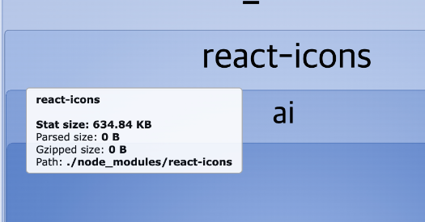
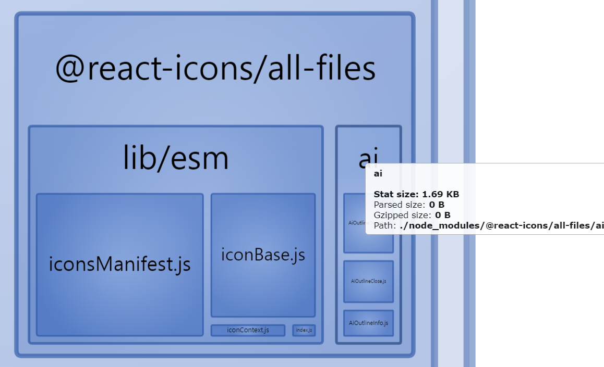

### Code Splitting

```jsx
import { lazy, Suspense } from 'react'

const Home = lazy(() => import('./pages/Home'))
const Search = lazy(() => import('./pages/Search'))

const App = () => {
    return (
        <Router>
            <Suspense fallback={<div>Loading...</div>}>
                <NavBar />
                <Routes>
                    <Route path="/" element={<Home />} />
                    <Route path="/search" element={<Search />} />
                </Routes>
                <Footer />
            </Suspense>
        </Router>
    )
}

export default App
```

### react-icons 패키지에서 사용하는 아이콘 가져오기

프로젝트에서 icon 3개만 사용하는 데 불필요하게 react-icons 패키지의 모든 아이콘을 다 가져와서 630kb를 차지한다.

프로젝트에서 사용하고 있는 icon만 가져오려면 기존에 설치한 react-icons 패키지 대신 @react-icons/all-files 패키지를 설치하고, import할 때 해당 아이콘 한 개씩 명시해서 가져온다.

-   before

    ```javascript
    import { AiOutlineInfo, AiOutlineClose } from 'react-icons/ai'
    ```

    

-   after

    ```javascript
    import { AiOutlineInfo } from '@react-icons/all-files/ai/AiOutlineInfo'
    import { AiOutlineClose } from '@react-icons/all-files/ai/AiOutlineClose'
    ```

    

> 참고
> [npmjs.com/package/@react-icons/all-files](https://www.npmjs.com/package/@react-icons/all-files) > [react-icons/react-icons#154](https://github.com/react-icons/react-icons/issues/154)
