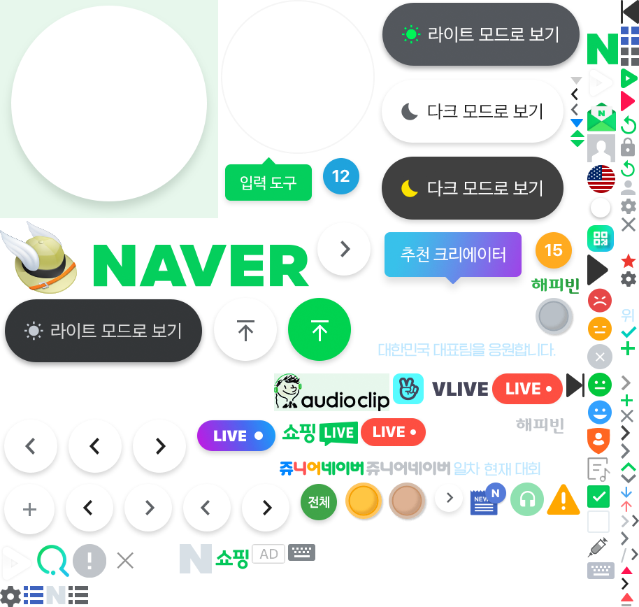
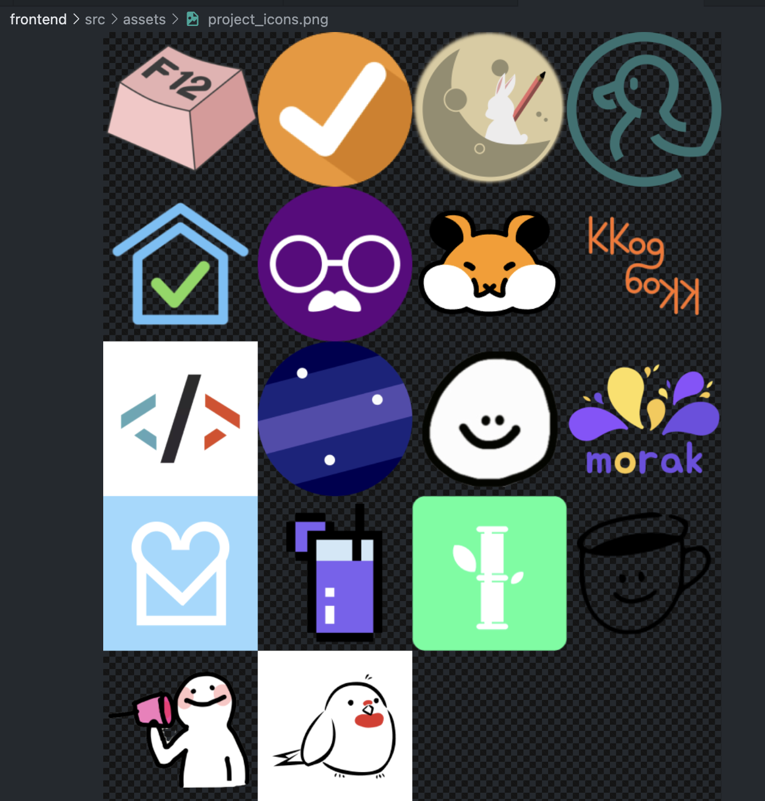

image sprite는 여러 이미지를 하나로 합친 이미지를 의미한다.

웹페이지에 사용된 이미지가 많으면 웹브라우저는 해당 이미지의 수만큼 HTTP 요청을 해야 하므로 로딩이 길어질 수 있다.
이러한 문제를 하나로 합쳐진 이미지 스프라이트를 사용하면, HTTP 요청 수가 줄어 메모리와 네트워크 사용량 측면에서 효율적이다.
(그러나 HTTP/2의 경우 오히려 작은 요청을 여러 번 날리는 것이 네트워크 사용량 측면에서 더 좋을 수도 있다)

이 방법은 네이버 웹사이트에서 네트워크 요청을 살펴보다가 수 십개의 작은 메뉴 버튼 등이 하나의 이미지로 합쳐져 있고 sprite라는 이름을 가지고 있는 것을 보고 힌트를 얻게 됐다.



구현은 여러 개의 개별 이미지를 사용하는 대신 하나로 합쳐진 단일 이미지를 사용하고, 해당 이미지를 css를 통해 표시할 부분을 지정하면 된다.

그러나 여러 이미지를 직접 하나의 이미지로 합치고, css로 이미지 각각의 background-position, width, height를 지정하는 것은 매우 번거로운 일이다.

이러한 작업은 아래와 같은 CSS Image Sprites 자동 생성 사이트를 통해 쉽게 처리할 수 있다.

<https://css.spritegen.com/>

<http://www.spritecow.com/>

합치고자 하는 이미지들을 업로드하면 자동으로 image sprite와 css를 만들어준다. 참고로 업로드하는 이미지의 파일명은 한글이 아니라 영문 및 숫자여야 css에도 이미지명이 기재되었다.



```css
// css
.a,
.b,
.c { display: inline-block; background: url('sprite.png') no-repeat; overflow: hidden;  width: 200px; height: 200px;}
.a {
    background-position: -0px -0px;
}
.b {
    background-position: -200px -0px;
}
.c {
    background-position: -400px -0px;
}
```

그런데 이미지를 상황에 따라 크기를 다르게 할 필요가 있어서 찾아봤으나, 적절한 방법을 찾기가 생각보다 어려웠다.

결국 css의 `zoom` 속성을 이용하여 이미지에 적용하는 것으로 해결하였다.

하지만 `zoom`이 비표준이기 때문에, 이미지 크기를 변경할 다른 표준화된 방법이 없다면, css image sprite를 만들 때 다양한 사이즈의 동일한 이미지를 만들어서 사용해야 할 것 같다.

[[참고] CSS로 이미지 스프라이트 구현하기](https://developer.mozilla.org/ko/docs/Web/CSS/CSS_Images/Implementing_image_sprites_in_CSS)

[[참고] mdn - zoom](https://developer.mozilla.org/en-US/docs/Web/CSS/zoom)

[[참고] stackoverflow - How can I scale an image in a CSS sprite](https://stackoverflow.com/a/16080995)
