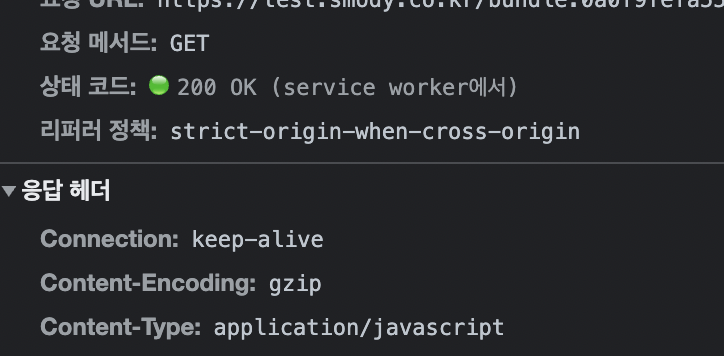
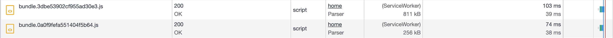
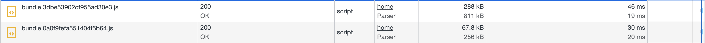

## Encoding 관련 헤더 필드

### Content-Encoding (엔티티 헤더 필드)

- `Content-Encoding`은 `엔티티 헤더 필드`의 일종이다.
- 엔티티 헤더 필드
  - 엔티티 헤더 필드는 request 메시지와 response 메시지에 포함된 엔티티에 사용되는 헤더이다.
  - 콘텐츠의 갱신 기간 같은 엔티티에 관한 정보를 포함한다.
- `Content-Encoding` 헤더 필드는 서버가 엔티티 바디에 대해서 실시한 `콘텐츠 인코딩` 형식(gzip, compress, deflate, identity 등)을 클라이언트에 전달하는 것이다.

```bash
Content-Encoding: gzip
```

### Accept-Encoding (리퀘스트 헤더 필드)

- `Accept-Encoding`은 `리퀘스트 헤더 필드`의 일종이다.
- 리퀘스트 헤더 필드

  - 클라이언트 측에서 서버 측으로 송신된 리퀘스트 메시지에 사용되는 헤더이다.
  - 리퀘스트의 부가적 정보와 클라이언트의 정보, 리스폰스 콘텐츠에 관한 우선 순위 등을 부가한다.

- `Accept-Encoding` 헤더 필드는 브라우저가 처리할 수 있는 `콘텐츠 인코딩`과 콘텐츠 인코딩의 상대적 우선 순위(콘텐츠 인코딩은 한번에 여러 개 지정 가능)를 전달하기 위해 사용된다.
  - 우선순위는 세미콜론으로 구분하고 "q="로 표시할 품질 지수를 더한다. 품질 계수는 0~1 내에서 지정하며 1이 가장 높다. 지정하지 않으면 암묵적으로 "q=1"이 지정된다.
  - "\*"(에스터리스크)를 지정하면 와일드 카드로서 모든 인코딩 포맷을 허용한다.

```bash
Accept-Encoding: gzip, deflate
```

## 파일 압축 후 전송을 통한 최적화

- 웹 서버에서 클라이언트에 텍스트 데이터(html, js, css 등)를 전달할 때, 텍스트 데이터를 gzip 등의 콘텐츠 인코딩을 통해 압축한 후 전송하면 속도가 더 빨라지고 트래픽량이 줄어든다.
- 콘텐츠 인코딩을 사용하면, 서버에서 텍스트 데이터를 압축 후 전송하고 클라이언트 브라우저가 압축을 풀어 사용한다.
- 다만, gzip을 사용하면 웹 서버와 브라우저의 CPU 사용량이 약간 늘어날 수 있으나, 그 정도는 미미하다고 한다.
- 그러나 용량이 아주 작거나 이미 충분히 압축된 파일은 압축하지 않고 그냥 전송하는 것이 더 효율적일 수 있다.

- 이전에 사용하던 AWS의 CloudFront에서는 이러한 gzip 등 압축이 서비스로서 지원됐으나, CloudFront를 사용하지 않는다면 사용 중인 웹 서버(Nginx)에서 gzip을 직접 설정한다.

### gzip이란?

- MDN에서 gzip 설명을 구글 번역하여 가져왔다.

> gzip은 파일 압축 및 압축 해제에 사용되는 파일 형식입니다. 파일 크기를 더 작게 만들어 더 빠른 네트워크 전송을 가능하게 하는 Deflate 알고리즘을 기반으로 합니다. gzip은 일반적으로 웹 서버와 최신 브라우저에서 지원됩니다. 즉, 서버는 파일을 보내기 전에 자동으로 gzip으로 압축하고 브라우저는 파일을 받으면 압축을 풀 수 있습니다.

- [gzip 공식 홈페이지](https://www.gzip.org/)

### Nginx에서 gzip 설정

- 웹 서버에서 아래 명령어를 입력하여 nginx 설정 파일을 수정하기 시작한다.

```bash
sudo vi /etc/nginx/nginx.conf
```

- nginx.conf 내에서 다음 코드와 같이 수정하여 gzip 압축 설정한다.

```bash
http {
    gzip on;
    gzip_types text/plain application/x-javascript text/xml text/css application/xml application/javascript;
    gzip_vary on;
    gzip_min_length 10240;
    gzip_comp_level 5;
    gzip_disable "MSIE [1-6].(?!.*SV1)";
}
```

- gzip 설정 설명

  - `gzip on;`
    - 압축을 가능하게 하기 위해 gzip 지시어를 추가한다. nginx는 기본으로 text/html의 MIME 타입만 압축한다.
  - `gzip_types text/plain application/x-javascript text/xml text/css application/xml application/javascript;`
    - 압축할 다른 MIME 타입을 명시한다.
  - `gzip_vary on;`
    - response 헤더에 Vary: Accept-Encoding이 추가된다.
  - `gzip_min_length 10240;`
    - 10kb 미만의 작은 파일은 압축하지 않도록 설정한다.
  - `gzip_comp_level 2;`
    - 압축률을 지정한다. 기본값은 1이며 9가 가장 높은 압축률이다. 압축률이 높을수록 CPU 사용량이 늘 수 있으므로 적정 단계로 설정한다.
  - `gzip_disable "MSIE [1-6].(?!.*SV1)";`
    - gzip 옵션이 지원되지 않는 IE 6 이하 브라우저에 대해서는 해당 설정이 작동하지 않도록 한다.

- 변경된 conf 설정 파일을 적용하기 위해 서버 reload

    ```bash
    sudo nginx -s reload
    ```

- 그 결과, 응답 헤더에 Content-Encoding: gzip 이 표시되며, 해당 파일이 Nginx에서 gzip으로 압축된 후 gz 형식으로 브라우저에 전달되었고, 브라우저에서 gzip 압축을 풀어서 사용했다는 사실을 알 수 있다.
    

- before & after

  - gzip 압축 전
        

  - gzip 압축 후
        

## Webpack에서 미리 압축하기

- 위와 같이 웹 서버 nginx에서 압축할 수도 있으나, 웹팩 빌드 시 정적 리소스를 미리 압축한 후, 웹 서버에 업로드할 수도 있다.

### CompressionWebpackPlugin

- `CompressionWebpackPlugin` 을 설치한다.

```json
// npm
npm install compression-webpack-plugin --save-dev

// yarn
yarn add -D compression-webpack-plugin
```

- webpack 설정에 plugin을 추가하고 option을 설정한다.

```javascript
// npm
const CompressionPlugin = require('compression-webpack-plugin')

module.exports = {
    plugins: [
        new CompressionPlugin({
            filename: '[path][base].gz',
            algorithm: 'gzip',
            test: /\.js$|\.css$|\.html$/,
            threshold: 10240,
            minRatio: 0.8,
        }),
    ],
}
```

> 참고자료
>
> - [NGINX Docs - Compression and Decompression](https://docs.nginx.com/nginx/admin-guide/web-server/compression/)
> - [Webpack Docs - CompressionWebpackPlugin](https://webpack.js.org/plugins/compression-webpack-plugin/)
