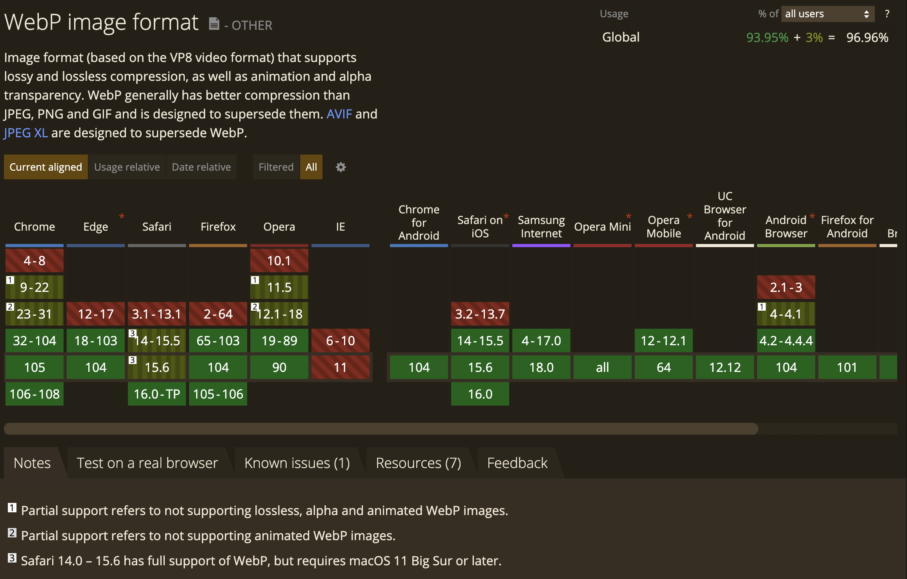
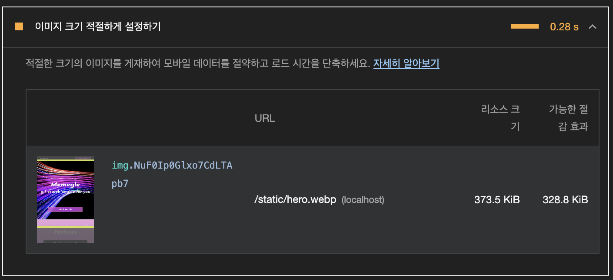
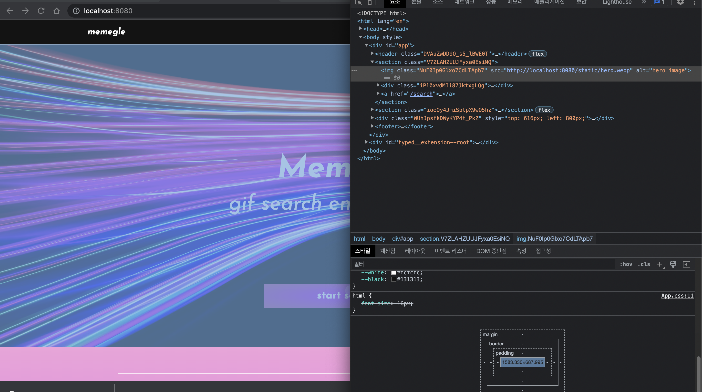

## 이미지 크기 줄이기

-   이미지 크기를 줄이는 방법으로는 웹팩을 통하는 방법과 컴퓨터에서 직접 변환하는 방법이 있다.

### 웹팩 image-webpack-loader 사용

-   `image-webpack-loader`는 이미지 자체를 압축해준다. JPG, PNG, GIF, SVG를 지원한다. 이 로더는 압축한 파일을 임베딩 해주지는 않으므로, `enforce: 'pre'` 옵션을 통해 다른 로더보다 먼저 실행하여 압축하고 다른 로더(file-loader)를 통해 임베딩되도록 한다.

```jsx
// webpack.config.js
module.exports = {
	module: {
		rules: [
			{
				test: /\.(jpe?g|png|gif|svg)$/,
				loader: "image-webpack-loader",
				// enforce: 'pre'는 이 로더를 다른 로더들보다 먼저 실행
				enforce: "pre",
			},
			// file-loader
			{
				test: /\.(jpe?g|png|gif|svg)$/i,
				loader: "file-loader",
				options: {
					name: "static/[name].[ext]",
				},
			},
		],
	},
}
```

### 애니메이션 GIF를 비디오로 대체하여 페이지를 더 빠르게 로드

> [https://web.dev/replace-gifs-with-videos/](https://web.dev/replace-gifs-with-videos/)

> [https://web.dev/codelab-replace-gifs-with-video/](https://web.dev/codelab-replace-gifs-with-video/)

-   MPEG 비디오 만들기

```bash
ffmpeg -i find.gif -vf "crop=trunc(iw/2)*2:trunc(ih/2)*2" -b:v 0 -crf 25 -f mp4 -vcodec libx264 -pix_fmt yuv420p find.mp4
```

-   before & after


-   비디오 넣기(자동재생, 무음, 무한반복)

```javascript
import freeMp4 from "../../assets/images/free.mp4"
;<video autoPlay loop muted playsInline>
	<source src={freeMp4} type="video/mp4" />
</video>
```

### 이미지를 WebP 확장자로 변환

> [https://web.dev/serve-images-webp/](https://web.dev/serve-images-webp/)

> [https://web.dev/choose-the-right-image-format/](https://web.dev/choose-the-right-image-format/)

-   WebP 형식은 일반적으로 이전 형식보다 더 나은 압축을 제공하며 가능한 경우 사용해야 한다. 모든 최신 브라우저에서 지원되고 있으나, 몇몇 구형 브라우저에서 지원이 필요한 경우 WebP를 다른 이미지 형식과 함께 폴백으로 사용하는 방법도 있다.



-   `cwebp` 을 사용하여 다른 형식의 이미지를 WebP 형식으로 변환

-   cwebp의 기본 압축 설정을 사용하여 단일 파일을 변환하는 명령어

    ```bash
    cwebp images/flower.jpg -o images/flower.webp
    ```

-   품질 수준 `50`을 사용하여 단일 파일을 변환하는 명령어

    ```bash
    cwebp -q 50 images/flower.jpg -o images/flower.webp
    ```

-   디렉터리의 모든 파일을 변환하는 명령어

    ```bash
    for file in images/*; do cwebp "$file" -o "${file%.*}.webp"; done
    ```

-   images.d.ts 에 declare module 추가

```typescript
declare module "*.webp"
```

-   png에서 webp로 변환에 따른 파일 용량 변화

-   이미지 크기(4100x2735)는 동일하나, 파일 용량이 10.7MB에서 382KB로 축소되었다.

    

### picture 태그를 사용하여 webp 미지원 브라우저에 fallback 제공

-   picture 태그는 여러 이미지 리소스를 상황에 맞게 유연하게 지정할 수 있는 방법이다.
-   `<picture>` 태그 내부에 `<source>`와 `` 태그를 넣는다.
-   `<source>` 태그는 기본 제공될 이미지를 지정하고, 브라우저가 해당 이미지를 지원하지 않으면, fallback으로서 `` 태그에 지정한 이미지가 제공된다.
-   예시: webp 기본 제공 후 미지원 브라우저에서는 jpeg 제공

```jsx
<picture>
	<source type="image/webp" srcSet={heroImageWebp} />
	
</picture>
```

### 이미지 크기 적절하게 설정하기

> [https://web.dev/serve-images-with-correct-dimensions/](https://web.dev/serve-images-with-correct-dimensions/)

-   라이트하우스 감사 결과, WebP 형식으로 압축하여 변환한 이미지가 여전히 이미지 크기(4100x2735)가 크다며, 적절하게 설정하여 절감할 것을 권장하고 있다



-   크롬 개발자 도구에서 해당 이미지 요소를 확인한 결과, 맥북 기준으로 최대 1534x690 정도의 이미지 크기만 차지하고 있었다. 따라서 기존의 이미지 크기에서 50% 가량 축소하는 것이 데이터 절감 및 이미지 퀄리티 유지 차원에서 적절할 것 같다.



-   이미지 크기 조절

-   homebrew를 통해 `imagemagick` 설치

    ```bash
    brew install imagemagick
    ```

-   `imagemagick` 을 통해 이미지 크기 조절하는 명령어

    ```bash
    // 파일 하나 변환
    // macOS
    convert hero.webp -resize 50% hero_small.webp

    // windows
    magick convert hero.webp -resize 50% hero_small.webp
    ```

    ```bash
    // 디렉터리 내에서 png 확장자인 파일들의 변환
    for file in *.png; do convert $file -resize 50% resized-$file; done

    // 디렉터리 내의 모든 파일 크기 변환
    for file in image/*; do convert $file -resize 50% $file; done
    ```

-   이미지 크기 조절 결과

    -   이미지 크기가 절반인 1640x1094로 줄어들며 용량도 절반 가량인 107kb로 축소되었다.

### 이미지 압축(jpg, png)

-   jpg

```bash
brew install jpegoptim
find . -name "*.jpg" -exec jpegoptim -m80 -o -p --strip-all {} \;
```

-   png

```bash
brew install optipng
find . -name "*.png" -exec optipng -o7 {} \;
```
