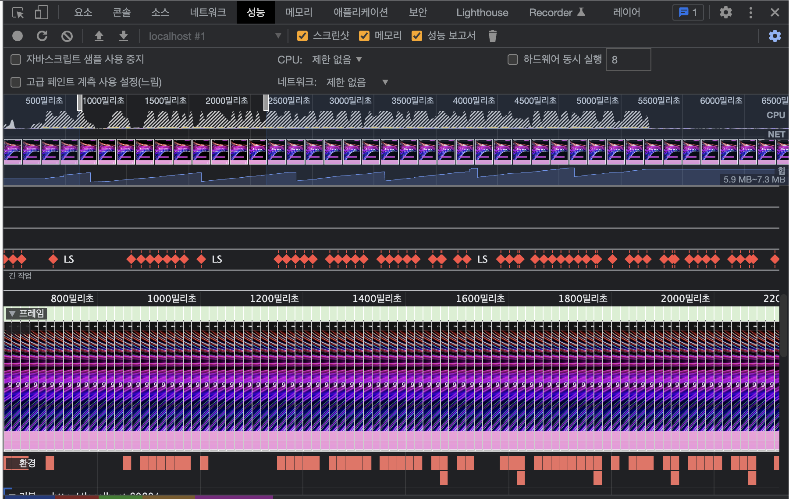
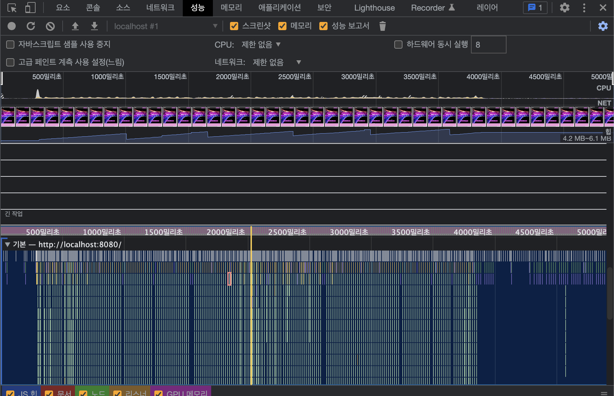

## 추가 로드시 추가된 목록만 새로 렌더되어야 한다

### **과도한 DOM 크기 피하기 - React.memo**

> [https://web.dev/dom-size/?utm_source=lighthouse&utm_medium=devtools](https://web.dev/dom-size/?utm_source=lighthouse&utm_medium=devtools)

- 추가되는 아이템인 GifItem 컴포넌트에 React.memo() 적용

## Layout Shift 없이 애니메이션이 일어나야 한다

### absolute position의 이동을 transform으로 대체

- 홈에서 커스텀 마우스 커서를 움직이면 레이아웃 시프트가 발생한다.

- before

  ```jsx
  cursorRef.current.style.top = `${mousePosition.pageY}px`
  cursorRef.current.style.left = `${mousePosition.pageX}px`
  ```

  

- after

  ```jsx
  cursorRef.current.style.transform = `translate3d(${mousePosition.pageX}px, ${mousePosition.pageY}px, 0)`
  ```

  
