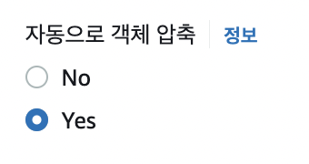
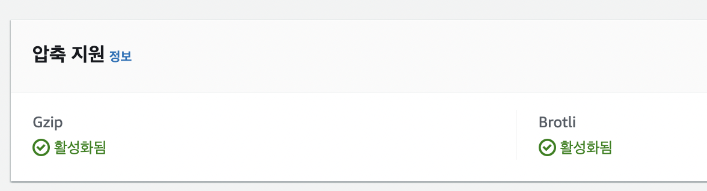
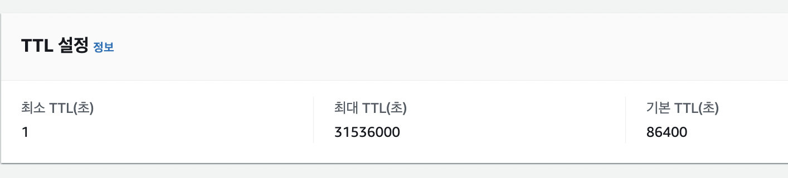
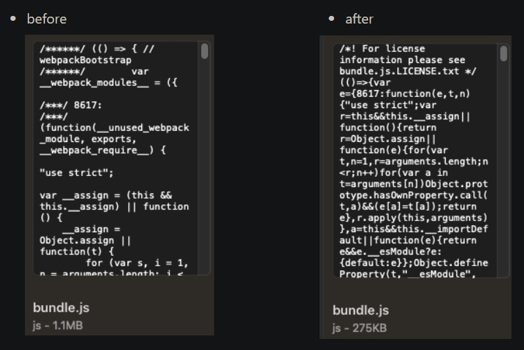
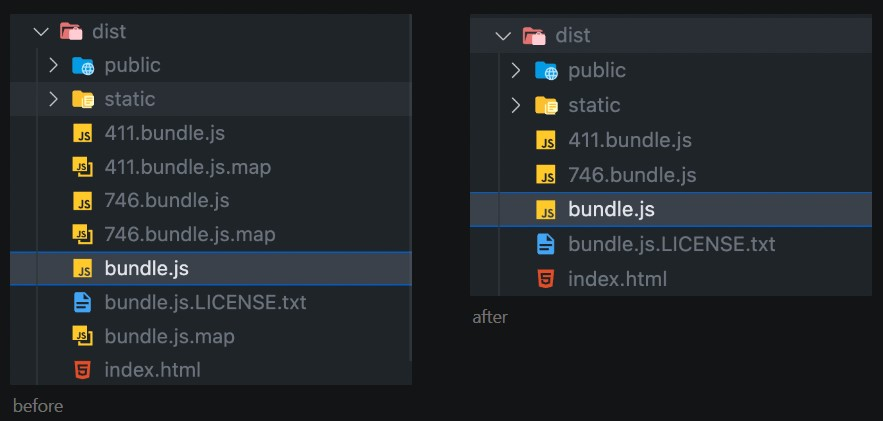

## 1. 스크립트 파일 압축

### 텍스트 압축 활성화 - 객체를 압축하도록 AWS `CloudFront` 구성

- `웹 서버`는 스크립트 형태 콘텐츠를 압축해 `클라이언트` 에게 더 작은 크기로 내려준다. `클라이언트` 는 이를 다운로드 받고 압축을 해제하여 원래 콘텐츠를 사용한다. 이렇게 한다면 스크립트 파일 다운로드 속도가 더 빨라진다.
- `클라이언트`는 웹 서버에 콘텐츠를 요청하면서 자신이 지원하는 압축 알고리즘을 HTTP 요청 헤더에 나열하며 알려준다.

  ```jsx
  // 클라이언트의 요청 헤더 - 브라우저는 gzip, deflate, sdch 압축 방식을 지원
  Accept-Encoding: gzip, deflate, sdch
  ```

- `웹 서버`는 HTTP 요청 헤더에 적힌 방식 중 자신이 지원하는 압축 알고리즘 하나를 선택해 HTTP 응답 헤더로 클라이언트에게 알려줌으로써 클라이언트가 해당 방식으로 압축 콘텐츠를 해제할 수 있게 된다.

  ```jsx
  // 클라이언트가 지원하는 압축 방식 중 gzip을 사용할 것을 명시
  Content-Encoding: gzip
  ```

> [https://web.dev/uses-text-compression/?utm_source=lighthouse&utm_medium=devtools](https://web.dev/uses-text-compression/?utm_source=lighthouse&utm_medium=devtools)

> [https://docs.aws.amazon.com/ko_kr/AmazonCloudFront/latest/DeveloperGuide/ServingCompressedFiles.html](https://docs.aws.amazon.com/ko_kr/AmazonCloudFront/latest/DeveloperGuide/ServingCompressedFiles.html)

- CloudFront에서 자동으로 객체 압축하기

  - **자동으로 객체 압축** 설정이 **예**로 설정되어 있는지 확인한다.

    

  - [자동객체압축 조건] 압축 지원

    - [캐시 정책](https://docs.aws.amazon.com/ko_kr/AmazonCloudFront/latest/DeveloperGuide/controlling-the-cache-key.html)을 사용하여 캐싱 설정을 지정하고 **Gzip**과 **Brotli** 설정이 모두 활성화되어 있는지 확인한다.

      

  - [자동객체압축 조건] TTL 값을 0보다 크게

    - 캐시 정책의 TTL 값이 0보다 큰 값으로 설정되어 있는지 확인한다. TTL 값을 0으로 설정하면 캐싱이 비활성화되고 CloudFront가 객체를 압축되지 않는다.
      

## 2. 스크립트 파일 줄이기

### Webpack 배포 빌드 시 JS 코드 압축 - `terser-webpack-plugin`

- js파일을 압축해주는 플러그인 : `terser-webpack-plugin`
- 설치

  ```jsx
  npm install --save-dev terser-webpack-plugin
  ```

- 사용(webpack.config.js)

  ```jsx
  const TerserPlugin = require('terser-webpack-plugin');

  optimization: {
      minimize: true,
      minimizer: [
        new TerserPlugin({
          terserOptions: {
            compress: {
              drop_console: true
            }
          }
        })
      ]
    }
  ```

  - 압축 시 console.log 자동 제거하는 옵션을 추가하였다.

    - console.log를 제거하지 않으면 응답값 노출 및 성능 저하가 발생할 수 있다.

      ```jsx
      {
        terserOptions: {
          compress: {
            drop_console: true
          }
        }
      }
      ```

- before & after
  

### css 분리 및 압축

- css 분리 (`mini-css-extract-plugin`) 및 압축(`optimize-css-assets-webpack-plugin`)

- 설치

```jsx
npm install --save-dev mini-css-extract-plugin optimize-css-assets-webpack-plugin
```

- 코드 추가

```jsx
const MiniCSSExtractionPlugin = require('mini-css-extract-plugin');
const OptimizeCSSAssetsPlugin = require('optimize-css-assets-webpack-plugin');

module.exports = {
 plugins: [
  new MiniCSSExtractionPlugin({ filename: '[name].css' })
  ]

 module: {
  rules: [
    {
         test: /\.css$/i,
         use: [MiniCSSExtractionPlugin.loader, 'css-loader'],
      // MiniCSSExtractionPlugin.loader가 style-loader를 대체
       },
  ]
 },

 optimization: {
     minimize: true,
     minimizer: [new CssMinimizerWebpackPlugin()]
     // 웹팩 5 버전 이후부터는 OptimizeCSSAssetsPlugin 대신 CssMinimizerWebpackPlugin 사용이 권장됨
 }
}
```

### html 압축

- 웹팩 플러그인 `HtmlWebpackPlugin` 의 minfiy 옵션을 true로 설정한다

  ```jsx
  new HtmlWebpackPlugin({
    template: './index.html',
    minify: true
  }),
  ```

### ReactDevTools 해제

- Production에서 ReactDevTools 비활성화
- <https://github.com/facebook/react-devtools/issues/191>

```html
<script>
  if (typeof window.__REACT_DEVTOOLS_GLOBAL_HOOK__ === 'object') {
    __REACT_DEVTOOLS_GLOBAL_HOOK__.inject = function() {}
  }
</script>
```

### SourceMap 해제

- `SourceMap`은 배포용으로 빌드한 파일과 원본 파일을 서로 연결시키는 기능이다. 성능 최적화를 위해 HTML, CSS, JS를 압축하여 배포했는데, 배포된 파일에서 에러가 발생하면 무슨 코드에 문제가 있는지 확인하기 어렵다. 따라서 배포된 파일에서 디버깅할 때 `SourceMap`의 도움을 받으면 배포용 파일의 특정 부분이 원본 소스의 어떤 부분에 해당하는지 확인할 수 있다.

  - 하지만 `SourceMap`이 일반 사용자에게 전달되면 사용자들도 source code에 접근하게 되는 문제가 있다. 또한, 용량을 더 차지하는 문제도 있다.
  - 만약 개발서버를 별도로 운영하여 임시로 production mode로 디버깅할 필요가 있다면 `SourceMap`이 필요할 수 있다.

- source-map 적용

  ```jsx
  // webpack
  module.exports = {
    devtool: 'source-map',
  }
  ```

- source-map 해제

  - 웹 성능 최적화를 위해 웹팩의 `SourceMap` 기능을 해제하였다.

  ```jsx
  // webpack
  module.exports = {
    devtool: false,
  }
  ```


