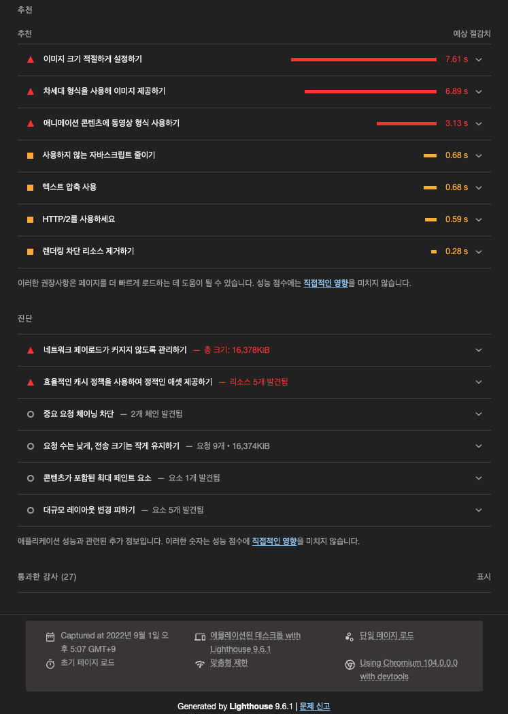
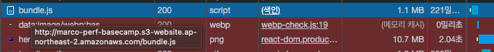
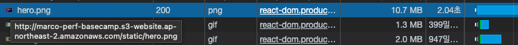
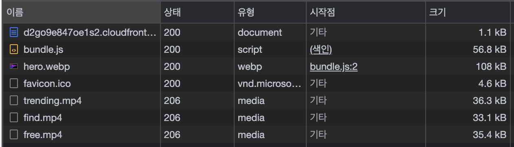
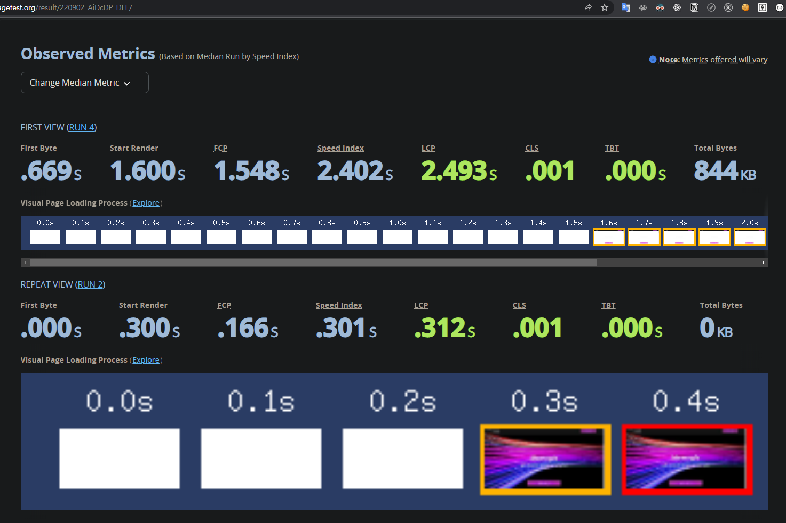
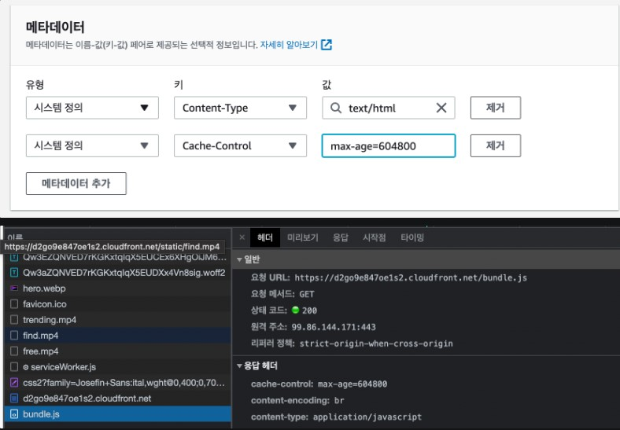
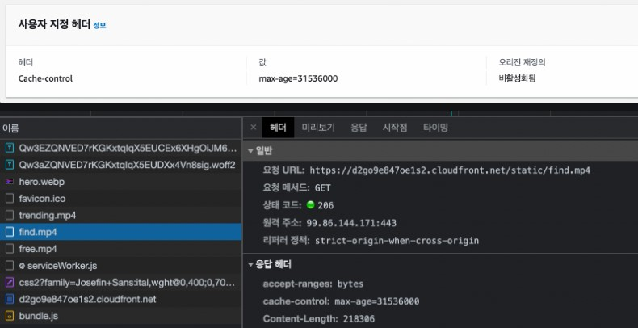

웹 성능 최적화 미션을 진행하며 정리한 내용이다.

# 0. 개선 전후 성능 측정 결과

## 개선 전 (S3)

- Lighthouse 페이지 로드시 performance 점수 : `75점`
  
  

- Home 페이지에서 불러오는 스크립트 리소스 크기 : `1.1 MB`
  

- 히어로 이미지 크기 : `10.7 MB`
  

## 개선 후 (CloudFront)

- [x] Lighthouse 페이지 로드시 performance 점수 **`95점`** 이상 : `100점`
      

- [x] Home 페이지에서 불러오는 스크립트 리소스 크기 **`< 60kb`** : `56.8kb`
      

- [x] 히어로 이미지 크기 **`< 120kb`** : `108kb`

- [x] 프랑스 파리에서 Fast 3G 환경으로 접속했을 때 Home 두 번째 이후 로드시 LCP **`< 1.2s`** : `0.312s`

  - WebPageTest에서 **`Paris - EC2`** **`Chrome`** **`CPU 6x slowdown`** **`Network Fast 3G`** 환경 기준으로 확인
    

- [x] **`Chrome`** **`CPU 6x slowdown`** **`Network Fast 3G`** 환경에서 화면 버벅임 최소화

# 1. 요청 크기 줄이기

## 1-1. 스크립트 파일 압축

- `웹 서버`는 스크립트 형태 콘텐츠를 압축해 `클라이언트` 에게 더 작은 크기로 내려준다. `클라이언트` 는 이를 다운로드 받고 압축을 해제하여 원래 콘텐츠를 사용한다. 이렇게 한다면 스크립트 파일 다운로드 속도가 더 빨라진다.
- `클라이언트`는 웹 서버에 콘텐츠를 요청하면서 자신이 지원하는 압축 알고리즘을 HTTP 요청 헤더에 나열하며 알려준다.

  ```jsx
  // 클라이언트의 요청 헤더 - 브라우저는 gzip, deflate, sdch 압축 방식을 지원
  Accept-Encoding: gzip, deflate, sdch
  ```

- `웹 서버`는 HTTP 요청 헤더에 적힌 방식 중 자신이 지원하는 압축 알고리즘 하나를 선택해 HTTP 응답 헤더로 클라이언트에게 알려줌으로써 클라이언트가 해당 방식으로 압축 콘텐츠를 해제할 수 있게 된다.

  ```jsx
  // 클라이언트가 지원하는 압축 방식 중 gzip을 사용할 것을 명시
  Content-Encoding: gzip
  ```

### 텍스트 압축 활성화 - 객체를 압축하도록 AWS `CloudFront` 구성

> [https://web.dev/uses-text-compression/?utm_source=lighthouse&utm_medium=devtools](https://web.dev/uses-text-compression/?utm_source=lighthouse&utm_medium=devtools)

> [https://docs.aws.amazon.com/ko_kr/AmazonCloudFront/latest/DeveloperGuide/ServingCompressedFiles.html](https://docs.aws.amazon.com/ko_kr/AmazonCloudFront/latest/DeveloperGuide/ServingCompressedFiles.html)

- 자동으로 객체 압축

  - **자동으로 객체 압축** 설정이 **예**로 설정되어 있는지 확인한다.

    

- 압축 지원

  - [캐시 정책](https://docs.aws.amazon.com/ko_kr/AmazonCloudFront/latest/DeveloperGuide/controlling-the-cache-key.html)을 사용하여 캐싱 설정을 지정하고 **Gzip**과 **Brotli** 설정이 모두 활성화되어 있는지 확인한다.

    

- TTL 값을 0보다 크게

  - 캐시 정책의 TTL 값이 0보다 큰 값으로 설정되어 있는지 확인한다. TTL 값을 0으로 설정하면 캐싱이 비활성화되고 CloudFront가 객체를 압축되지 않는다.
    

## 1-2. 스크립트 파일 줄이기

### Webpack 배포 빌드 시 JS 코드 압축 - `terser-webpack-plugin`

- js파일을 압축해주는 플러그인 : `terser-webpack-plugin`
- 설치

  ```jsx
  npm install --save-dev terser-webpack-plugin
  ```

- 사용(webpack.config.js)

  ```jsx
  const TerserPlugin = require('terser-webpack-plugin');

  optimization: {
      minimize: true,
      minimizer: [
        new TerserPlugin({
          terserOptions: {
            compress: {
              drop_console: true
            }
          }
        })
      ]
    }
  ```

  - 압축 시 console.log 자동 제거하는 옵션을 추가하였다.

    - console.log를 제거하지 않으면 응답값 노출 및 성능 저하가 발생할 수 있다.

      ```jsx
      {
        terserOptions: {
          compress: {
            drop_console: true
          }
        }
      }
      ```

- before & after
  

### css 분리 및 압축

- css 분리 (`mini-css-extract-plugin`) 및 압축(`optimize-css-assets-webpack-plugin`)

- 설치

```jsx
npm install --save-dev mini-css-extract-plugin optimize-css-assets-webpack-plugin
```

- 코드 추가

```jsx
const MiniCSSExtractionPlugin = require('mini-css-extract-plugin');
const OptimizeCSSAssetsPlugin = require('optimize-css-assets-webpack-plugin');

module.exports = {
 plugins: [
  new MiniCSSExtractionPlugin({ filename: '[name].css' })
  ]

 module: {
  rules: [
    {
         test: /\.css$/i,
         use: [MiniCSSExtractionPlugin.loader, 'css-loader'],
      // MiniCSSExtractionPlugin.loader가 style-loader를 대체
       },
  ]
 },

 optimization: {
     minimize: true,
     minimizer: [new OptimizeCSSAssetsPlugin()]
 }
}
```

### html 압축

- 웹팩 플러그인 `HtmlWebpackPlugin` 의 minfiy 옵션을 true로 설정한다

  ```jsx
  new HtmlWebpackPlugin({
    template: './index.html',
    minify: true
  }),
  ```

## 1-2. 이미지 크기 줄이기

### ImageMinimizerWebpackPlugin

- 설치

  > [https://webpack.js.org/plugins/image-minimizer-webpack-plugin/](https://webpack.js.org/plugins/image-minimizer-webpack-plugin/)

  ```jsx
  npm install --save-dev image-minimizer-webpack-plugin
  ```

- @squoosh/lib --save-dev

  ```jsx
  npm install --save-dev image-minimizer-webpack-plugin @squoosh/lib
  ```

- webpack 설정

  ```jsx
  const ImageMinimizerPlugin = require('image-minimizer-webpack-plugin')

  module.exports = {
    // 플러그인 설정
    plugins: [
      new ImageMinimizerPlugin({
        minimizer: {
          implementation: ImageMinimizerPlugin.squooshMinify,
        },
      }),
    ],
  }
  ```

### image-webpack-loader

- `image-webpack-loader`는 이미지 자체를 압축해준다. JPG, PNG, GIF, SVG를 지원한다. 이 로더는 압축한 파일을 임베딩 해주지는 않으므로, `enforce: 'pre'` 옵션을 통해 다른 로더보다 먼저 실행하여 압축하고 다른 로더(file-loader)를 통해 임베딩되도록 한다.

  ```jsx
  // webpack.config.js
  module.exports = {
    module: {
      rules: [
        {
          test: /\.(jpe?g|png|gif|svg)$/,
          loader: 'image-webpack-loader',
          // enforce: 'pre'는 이 로더를 다른 로더들보다 먼저 실행
          enforce: 'pre',
        },
        // file-loader
        {
          test: /\.(jpe?g|png|gif|svg)$/i,
          loader: 'file-loader',
          options: {
            name: 'static/[name].[ext]',
          },
        },
      ],
    },
  }
  ```

### 애니메이션 GIF를 비디오로 대체하여 페이지를 더 빠르게 로드

> [https://web.dev/replace-gifs-with-videos/](https://web.dev/replace-gifs-with-videos/)

> [https://web.dev/codelab-replace-gifs-with-video/](https://web.dev/codelab-replace-gifs-with-video/)

- MPEG 비디오 만들기

  ```bash
  ffmpeg -i find.gif -vf "crop=trunc(iw/2)*2:trunc(ih/2)*2" -b:v 0 -crf 25 -f mp4 -vcodec libx264 -pix_fmt yuv420p find.mp4
  ```

  - before & after

    

- 비디오 넣기(자동재생, 무음, 무한반복)

  ```javascript
  import freeMp4 from '../../assets/images/free.mp4'
  ;<video autoPlay loop muted playsInline>
    <source src={freeMp4} type="video/mp4" />
  </video>
  ```

### 이미지 압축(WebP 사용하여 직접 변환)

> [https://web.dev/serve-images-webp/](https://web.dev/serve-images-webp/)

> [https://web.dev/choose-the-right-image-format/](https://web.dev/choose-the-right-image-format/)

- WebP 형식은 일반적으로 이전 형식보다 더 나은 압축을 제공하며 가능한 경우 사용해야 한다. 모든 최신 브라우저에서 지원되고 있으나, 몇몇 구형 브라우저에서 지원이 필요한 경우 WebP를 다른 이미지 형식과 함께 폴백으로 사용하는 방법도 있다.

  

- `cwebp` 을 사용하여 다른 형식의 이미지를 WebP 형식으로 변환

  - cwebp의 기본 압축 설정을 사용하여 단일 파일을 변환하는 명령어

    ```bash
    cwebp images/flower.jpg -o images/flower.webp
    ```

  - 품질 수준 `50`을 사용하여 단일 파일을 변환하는 명령어

    ```bash
    cwebp -q 50 images/flower.jpg -o images/flower.webp
    ```

  - 디렉터리의 모든 파일을 변환하는 명령어

    ```bash
    for file in images/*; do cwebp "$file" -o "${file%.*}.webp"; done
    ```

- images.d.ts 에 declare module 추가

  ```typescript
  declare module '*.webp'
  ```

- png에서 webp로 변환에 따른 파일 용량 변화

  - 이미지 크기(4100x2735)는 동일하나, 파일 용량이 10.7MB에서 382KB로 축소되었다.

    

### 이미지 크기 적절하게 설정하기

> [https://web.dev/serve-images-with-correct-dimensions/](https://web.dev/serve-images-with-correct-dimensions/)

- 라이트하우스 감사 결과, WebP 형식으로 압축하여 변환한 이미지가 여전히 이미지 크기(4100x2735)가 크다며, 적절하게 설정하여 절감할 것을 권장하고 있다

  

- 크롬 개발자 도구에서 해당 이미지 요소를 확인한 결과, 맥북 기준으로 최대 1534x690 정도의 이미지 크기만 차지하고 있었다. 따라서 기존의 이미지 크기에서 50% 가량 축소하는 것이 데이터 절감 및 이미지 퀄리티 유지 차원에서 적절할 것 같다.

  

- 이미지 크기 조절

  - homebrew를 통해 `imagemagick` 설치

    ```bash
    brew install imagemagick
    ```

  - `imagemagick` 을 통해 이미지 크기 조절하는 명령어

    ```bash
    // macOS
    convert hero.webp -resize 50% hero_small.webp

    // windows
    magick convert hero.webp -resize 50% hero_small.webp
    ```

  - 이미지 크기 조절 결과

    - 이미지 크기가 절반인 1640x1094로 줄어들며 용량도 절반 가량인 107kb로 축소되었다.

### [참고] file-loader가 webpack5에서 대체됨(`Asset Modules`)

> [https://webpack.js.org/guides/asset-modules/#resource-assets](https://webpack.js.org/guides/asset-modules/#resource-assets)

- `Asset Modules`
  - `Asset Modules` 은 asset files(fonts, icons, etc)을 부가적인 로더 설정없이 사용할 수 있도록 하는 모듈이다.
  - webpack 5 이전에는 보통 이렇게 쓰인곤 했다.
    - `raw-loader` : 파일을 string으로서 import
    - `url-loader` : 파일을 data URI로서 번들에 inline
    - `file-ioader` : output 디렉터리에 파일을 emit할 때
  - webpack 5 이후 도입된 `Asset Modules` 타입은 4개의 새 모듈 타입들을 추가함으로써 이러한 로더들을 모두 대체했다.
    - `asset/source` : asset의 소스코드를 export한다. `raw-loader` 를 대체한다.
    - `asset/inline` : asset의 data URI를 export한다. `url-loader` 를 대체한다.
    - `asset/resource` : 각각의 파일을 emit하고 URL을 export한다. `file-loader` 를 대체한다.
    - `asset` : data URI를 export할 지 각각의 파일을 emit할 지 자동적으로 선택한다. asset size limit이 있는 `url-loader` 를 대체한다.
- before webpack5

  ```jsx
  {
    test: /\.(eot|svg|ttf|woff|woff2|png|jpg|gif|mp4|webp)$/i,
    loader: 'file-loader',
    options: {
      name: 'static/[name].[ext]'
    }
  }
  ```

- after webpack5

  ```jsx
  {
    test: /\.(eot|svg|ttf|woff|woff2|png|jpg|gif|mp4|webp)$/i,
    type: 'asset/resource',
    generator: {
      filename: 'static/[name][ext]'
    }
  }
  ```

# 2. 필요한 것만 요청하기

## 2-1. 페이지별 리소스 분리

### Code Splitting

```jsx
import { lazy, Suspense } from 'react'

const Search = lazy(() => import('./pages/Search/Search'))

const App = () => {
  return (
    <Router>
      <Suspense fallback={<div>Loading...</div>}>
        <NavBar />
        <Routes>
          <Route path="/" element={<Home />} />
          <Route path="/search" element={<Search />} />
        </Routes>
        <Footer />
      </Suspense>
    </Router>
  )
}

export default App
```

# 3. 같은 건 매번 새로 요청하지 않기

### CloudFront 캐시 설정 (설정값, 해당 값을 설정한 이유 포함)

> [https://docs.aws.amazon.com/ko_kr/AmazonCloudFront/latest/DeveloperGuide/Expiration.html](https://docs.aws.amazon.com/ko_kr/AmazonCloudFront/latest/DeveloperGuide/Expiration.html)

- 특정 콘텐츠가 브라우저 캐시를 사용할지 아닐지는 일반적으로 `웹 서버` 에서 먼저 결정해야 한다.

  - `웹 서버` 는 다음과 같이 캐시 생존 기간(TTL, Time To Live) 설정 내용을 `Cache-Control` 응답 헤더를 통해 `클라이언트` 에게 전달한다.

    ```json
    Cache-Control: max-age=3600 // 브라우저가 다운로드한 후 1시간 동안 캐시 사용 가능
    ```

  - 캐시 비허용

    ```json
    Cache-Control: no-store
    ```

  - 원본 서버의 콘텐츠 변경 확인

    - 브라우저 캐시를 사용하지만, 원본 서버의 콘텐츠 갱신 여부를 확인하여 변경이 없을 때만 캐시된 콘텐츠를 사용하도록 설정

      ```json
      Cache-Control: no-cache
      ```

  - 캐시 불가 명시

    ```json
    Cache-Control: no-cache, no-store, must-revalidate
    ```

  - 캐시 가능 명시

    ```json
    Cache-Control: public, max-age=31536000
    ```

- 캐시 정책

  - S3에서 특정 파일 각각 메타테이터로 캐시 설정
    - ex) bundle.js, index.html 일주일(`604800`)
      
  - CloudFront 에서 나머지 파일(이미지 등 정적 파일) 캐시 설정
    - ex) 1년(31536000)
      

### GIPHY의 trending API를 Search 페이지에 들어올 때마다 새로 요청하지 않아야 한다

### cache 유틸 함수 생성

- 선 캐시, 후 네트워크

```jsx
// cache.ts
const cacheStorage: Record<string, unknown> = {}

export const cache = (cacheKey: string, fetcher: Function) => {
  if (cacheStorage[cacheKey]) {
    console.log('캐시', cacheStorage[cacheKey])
    return cacheStorage[cacheKey]
  }

  const response = fetcher()
  console.log('네트워크', response)
  cacheStorage[cacheKey] = response

  return response
}
```

```jsx
// gifApiService.ts
import { cache } from '../cache'

const gifs: GifsResult = await cache(`search-${keyword}`, () =>
  gf.search(keyword, searchOptions)
)
```

# 4. 최소한의 변경만 일으키기

## 4-1. 검색 결과 > 추가 로드시 추가된 목록만 새로 렌더되어야 한다

### **과도한 DOM 크기 피하기 - React.memo**

> [https://web.dev/dom-size/?utm_source=lighthouse&utm_medium=devtools](https://web.dev/dom-size/?utm_source=lighthouse&utm_medium=devtools)

- 추가되는 아이템인 GifItem 컴포넌트에 React.memo() 적용

## 4-2. Layout Shift 없이 애니메이션이 일어나야 한다

### absolute position의 이동을 transform으로 대체

- 홈에서 커스텀 마우스 커서를 움직이면 레이아웃 시프트가 발생한다.

  - before

    ```jsx
    cursorRef.current.style.top = `${mousePosition.pageY}px`
    cursorRef.current.style.left = `${mousePosition.pageX}px`
    ```

    

  - after

    ```jsx
    cursorRef.current.style.transform = `translate3d(${mousePosition.pageX}px, ${mousePosition.pageY}px, 0)`
    ```

    

## 4-3. Frame Drop이 일어나지 않아야 한다

- 확인

# 기타

### ReactDevTools 해제

- Production에서 ReactDevTools 비활성화
- <https://github.com/facebook/react-devtools/issues/191>

```html
<script>
  if (typeof window.__REACT_DEVTOOLS_GLOBAL_HOOK__ === 'object') {
    __REACT_DEVTOOLS_GLOBAL_HOOK__.inject = function() {}
  }
</script>
```

### SourceMap 해제

- `SourceMap`은 배포용으로 빌드한 파일과 원본 파일을 서로 연결시키는 기능이다. 성능 최적화를 위해 HTML, CSS, JS를 압축하여 배포했는데, 배포된 파일에서 에러가 발생하면 무슨 코드에 문제가 있는지 확인하기 어렵다. 따라서 배포된 파일에서 디버깅할 때 `SourceMap`의 도움을 받으면 배포용 파일의 특정 부분이 원본 소스의 어떤 부분에 해당하는지 확인할 수 있다.

  - 하지만 `SourceMap`이 일반 사용자에게 전달되면 사용자들도 source code에 접근하게 되는 문제가 있다. 또한, 용량을 더 차지하는 문제도 있다.
  - 만약 개발서버를 별도로 운영하여 임시로 production mode로 디버깅할 필요가 있다면 `SourceMap`이 필요할 수 있다.

- source-map 적용

  ```jsx
  // webpack
  module.exports = {
    devtool: 'source-map',
  }
  ```

- source-map 해제

  - 웹 성능 최적화를 위해 웹팩의 `SourceMap` 기능을 해제하였다.

  ```jsx
  // webpack
  module.exports = {
    devtool: false,
  }
  ```


